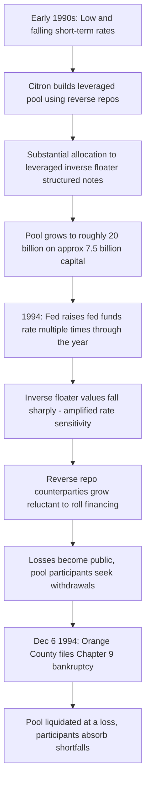

## Orange County and Leveraged Inverse Floaters

### Overview

Orange County, California, filed for Chapter 9 municipal bankruptcy in December 1994 — at the time the largest municipal bankruptcy in U.S. history — after its county investment pool, managed by elected Treasurer-Tax Collector Robert Citron, suffered approximately $1.6-1.7 billion in losses. [Unverified: cited loss figures vary slightly, roughly $1.5-1.7 billion, depending on source and measurement date] The pool had used substantial leverage via reverse repurchase agreements and had concentrated holdings in structured notes, including leveraged inverse floaters, whose value was highly sensitive to rising interest rates. When the Federal Reserve raised rates through 1994, the pool's value collapsed, precipitating the county's insolvency.

**Key Points**

- Citron managed a commingled investment pool for the county and roughly 200 participating local government entities (schools, cities, special districts)
- The pool used reverse repurchase agreements (reverse repos) to leverage its capital base roughly 2:1, investing borrowed funds alongside pool capital in additional securities
- A significant share of holdings were structured notes, including leveraged inverse floaters, whose coupon and/or principal value moves inversely and often more than proportionally with rising short-term rates
- The strategy was predicated on a persistent bet that interest rates would remain low or fall further — a bet that failed when the Fed raised the federal funds rate multiple times in 1994
- The case is a landmark in illustrating leverage risk, structured note complexity, interest rate risk, and public-sector governance/oversight failures in municipal finance

### Structure of the Investment Pool

**Reverse repurchase agreements (leverage mechanism):**

The pool posted securities it owned as collateral to raise short-term cash from counterparties (a reverse repo, from the pool's perspective as the party temporarily selling securities and agreeing to repurchase them), then used that cash to purchase additional securities — increasing the pool's total invested assets well beyond its actual equity/deposited capital.

$$\text{Total Invested Assets} = \text{Pool Capital} + \text{Reverse Repo Borrowings}$$

At peak, the pool's roughly $7.5 billion in deposited capital supported total investments of approximately $20-21 billion, implying leverage on the order of 2.5:1 to 3:1. [Unverified: precise leverage ratios cited vary somewhat by source and measurement date]

**Leveraged inverse floaters (structured notes):**

An inverse floater is a structured note whose coupon rate moves inversely to a reference short-term rate (e.g., LIBOR):

$$\text{Coupon}_{inverse floater} = \text{Fixed Rate} - (\text{Multiplier} \times \text{Reference Rate})$$

A **leveraged** inverse floater applies a multiplier greater than 1 to the reference rate, amplifying both the upside (when rates fall) and downside (when rates rise) sensitivity relative to a standard (unleveraged) inverse floater.

**Example**

A simplified leveraged inverse floater might be structured as:

$$\text{Coupon} = 12\% - (2 \times \text{3-month LIBOR})$$

If LIBOR is at 3%, the coupon is $12\% - 6\% = 6\%$. If LIBOR rises to 5%, the coupon falls to $12\% - 10\% = 2\%$. If LIBOR rises further to 6%, the coupon would go to zero (or the note may have an embedded floor), and — critically — the note's **market value** (not just its coupon) falls sharply because rising rates simultaneously reduce the expected future coupon stream and increase the discount rate applied to it, a doubly negative effect on price versus a plain fixed-rate bond of similar maturity.

### Why the Strategy Was Attractive in a Falling/Low-Rate Environment

**Key Points**

- Through the early 1990s, short-term interest rates had been falling or stable at relatively low levels, and leveraged inverse floaters offered materially higher current yield than plain money-market or short-duration instruments in that environment — attractive for a public treasurer under pressure to generate investment income to supplement county revenues
- The leverage from reverse repos amplified this yield pickup, since borrowed funds could be reinvested in additional high-coupon structured notes, effectively arbitraging the spread between short-term repo borrowing costs and the higher yields on the structured notes — profitable as long as rates stayed low and the yield curve remained favorably shaped
- This is structurally similar to a **carry trade**: borrowing short-term (via repo) to fund longer-duration or rate-sensitive assets, profitable when short rates stay low relative to the yield on the assets held, but exposed to substantial losses if short rates rise

### The 1994 Rate Shock and Collapse

**Key Points**

- The Federal Reserve raised the federal funds rate multiple times through 1994 (from approximately 3% in early 1994 to around 5.5% by year-end), a faster and larger tightening cycle than markets had broadly anticipated
- Rising rates hit the pool's holdings through two compounding channels: (1) direct duration/price risk — as with any fixed income portfolio, rising rates reduced the market value of the pool's fixed-rate and structured holdings, and (2) the leveraged inverse floaters' amplified negative convexity to rising rates, since their coupons and values fell faster than a comparable plain-vanilla bond
- The leverage from reverse repos magnified these losses proportionally on the pool's actual (unleveraged) capital base
- As losses mounted and became public in late 1994, counterparties reportedly grew reluctant to roll over reverse repo financing, and the pool faced mounting margin/collateral pressure, forcing recognition of losses that had been building through the year
- Orange County filed for Chapter 9 bankruptcy protection on December 6, 1994

### Timeline of the Collapse

### Leverage and Rate Sensitivity Diagram

**Orange County Pool Leverage Structure (svg_diagram)**

<svg xmlns="http://www.w3.org/2000/svg" viewBox="0 0 850 440" font-family="Arial, sans-serif" font-size="13">
<text x="425" y="28" text-anchor="middle" font-size="17" font-weight="bold">Orange County Pool: Leverage and Rate Sensitivity (svg_diagram)</text>
<rect x="60" y="70" width="220" height="80" rx="8" fill="#dbe9ff" stroke="#2b5faa" stroke-width="1.5" />
<text x="170" y="100" text-anchor="middle" font-weight="bold" font-size="12">Pool Capital</text>
<text x="170" y="120" text-anchor="middle" font-size="11">(~$7.5B county and</text>
<text x="170" y="135" text-anchor="middle" font-size="11">participant deposits)</text>
<rect x="330" y="70" width="220" height="80" rx="8" fill="#fff2cc" stroke="#b38b00" stroke-width="1.5" />
<text x="440" y="100" text-anchor="middle" font-weight="bold" font-size="12">Reverse Repo</text>
<text x="440" y="120" text-anchor="middle" font-size="11">Borrowed cash secured</text>
<text x="440" y="135" text-anchor="middle" font-size="11">by posted securities</text>
<rect x="600" y="70" width="220" height="80" rx="8" fill="#f2dede" stroke="#a94442" stroke-width="1.5" />
<text x="710" y="100" text-anchor="middle" font-weight="bold" font-size="12">Total Invested Assets</text>
<text x="710" y="120" text-anchor="middle" font-size="11">(~$20B, incl. leveraged</text>
<text x="710" y="135" text-anchor="middle" font-size="11">inverse floaters)</text>
<line x1="280" y1="110" x2="328" y2="110" stroke="#444" stroke-width="2" marker-end="url(#arrow5)" />
<line x1="550" y1="110" x2="598" y2="110" stroke="#444" stroke-width="2" marker-end="url(#arrow5)" />
<rect x="150" y="220" width="550" height="150" rx="8" fill="#f5f5f5" stroke="#888" stroke-width="1" />
<text x="425" y="245" text-anchor="middle" font-weight="bold" font-size="13">Rate Rise Transmission (1994)</text>

<text x="425" y="275" text-anchor="middle" font-size="12">Fed Funds Rate Rises (~3% to ~5.5%)</text>

<line x1="425" y1="282" x2="425" y2="300" stroke="`#a94442`" stroke-width="2" marker-end="url(#arrow5)" />

<text x="425" y="315" text-anchor="middle" font-size="12">Inverse Floater Coupons and Prices Fall (Amplified)</text>

<line x1="425" y1="322" x2="425" y2="340" stroke="`#a94442`" stroke-width="2" marker-end="url(#arrow5)" />

<text x="425" y="355" text-anchor="middle" font-size="12">Losses Magnified on Leveraged (Unleveraged Capital) Base</text>

</svg>

### Governance and Oversight Failures

**Key Points**

- Citron, an elected official without formal advanced financial training, exercised largely unilateral control over investment strategy for the pool, with limited independent, sophisticated risk oversight from the county Board of Supervisors
- The pool's participants — school districts, cities, and other local entities required or induced to deposit funds in the county pool — had limited visibility into or influence over the increasingly leveraged and complex investment strategy being pursued on their behalf
- Some brokers and dealers (notably Merrill Lynch, which sold many of the structured notes to the pool) were later subject to litigation and regulatory scrutiny over suitability and disclosure practices in selling complex structured products to a public-sector investor; Merrill Lynch subsequently reached a substantial settlement with the county [Unverified: precise settlement figures and allocation across multiple defendant firms varied and are best confirmed via primary litigation records]
- The case highlighted a broader governance gap: public treasurers managing pooled municipal funds often operated with less sophisticated risk management infrastructure, independent oversight, and disclosure requirements than comparable private institutional investors, despite managing funds on behalf of numerous public entities with limited risk tolerance

### Key Lessons for Risk Management and Public Finance

**Key Points**

- **Leverage magnifies interest rate risk**: even moderate, gradual rate rises can produce outsized capital losses on a leveraged portfolio, especially one concentrated in instruments with amplified/negatively convex rate sensitivity like leveraged inverse floaters
- **Structured notes require rigorous, independent valuation and risk assessment**: their payoff complexity (embedded leverage, potential caps/floors) can obscure the true magnitude of interest rate exposure to investors and overseers who evaluate them primarily on stated current yield rather than full price sensitivity (duration/convexity) to rate moves
- **Suitability of complex instruments for public/municipal investors**: instruments appropriate for sophisticated institutional risk-takers may be poorly suited to public entities managing funds with low risk tolerance and public accountability, reinforcing the case for investment policy limits on leverage and structured product complexity in public fund management
- **Concentration of investment authority without independent checks**: as in other derivatives disaster case studies, a single decision-maker operating with limited independent risk oversight was able to build a large, concentrated, leveraged position before losses became visible to those responsible for governance
- **Duration and convexity matter as much as stated yield**: chasing incremental yield via leverage or structured payoffs without fully modeling downside price sensitivity to adverse rate scenarios is a recurring failure pattern across many derivatives-related losses in fixed income portfolios

### Regulatory and Policy Aftermath

**Key Points**

- The Orange County bankruptcy contributed to increased scrutiny of municipal investment practices nationally, prompting many state and local governments to adopt more conservative investment policies explicitly restricting leverage (reverse repos) and limiting or prohibiting use of complex structured/derivative instruments in public fund management
- It is frequently cited alongside contemporaneous derivatives-related losses at other institutions (e.g., Procter & Gamble and Gibson Greetings' interest rate swap losses, also in 1994) as part of a broader mid-1990s wave of derivatives-related disclosures that spurred both private-sector and public-sector risk management and disclosure reforms
- The case remains a standard reference in public finance and derivatives risk curricula for illustrating how leverage, structured note complexity, and inadequate independent oversight can combine to produce catastrophic losses even within a nominally conservative institutional context (a county government investment pool)

### Related Topics

- The Collapse of Long Term Capital Management
- Barings Bank and Unauthorized Trading Risk
- Interest Rate Swaps and the Procter & Gamble / Gibson Greetings Cases
- Structured Notes: Inverse Floaters, Range Accruals, and Embedded Optionality
- Duration and Convexity in Fixed Income Risk Management
- Repurchase Agreements (Repo) and Reverse Repo Mechanics
- Municipal Finance Governance and Investment Policy Design
- Interest Rate Risk Measurement: DV01, Duration, and Scenario Analysis