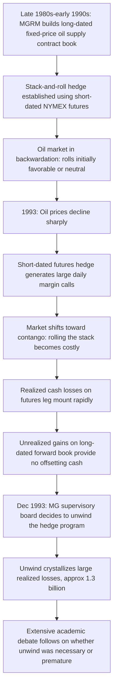

## Metallgesellschaft and Hedging Gone Wrong

### Overview

Metallgesellschaft AG (MG), a large, diversified German industrial conglomerate, suffered losses of approximately $1.3 billion in 1993 through its U.S. oil subsidiary, MG Refining and Marketing (MGRM), after a large hedging program built around long-dated forward oil delivery contracts and short-dated futures hedges encountered severe funding and mark-to-market pressure when oil prices fell and the futures curve shifted from backwardation into contango. Unlike LTCM, Barings, or Orange County, the Metallgesellschaft case is notable because the underlying hedging strategy is widely debated in the academic and risk management literature as potentially fundamentally sound in principle, but fatally undermined by liquidity/funding risk, maturity mismatch, and a loss of management/board confidence that forced an early, costly unwind.

**Key Points**

- MGRM had committed to supply customers with fixed-price petroleum products (gasoline, heating oil) for terms of up to ten years via long-dated forward contracts
- To hedge this forward price exposure, MGRM used a "stack-and-roll" hedge: buying large quantities of short-dated (near-month) NYMEX futures contracts and rolling them forward as they approached expiry, rather than using long-dated futures (which had limited market liquidity)
- When oil prices fell sharply in 1993, the short-dated futures hedge generated large **margin calls** (immediate cash outflows), while the offsetting gains on the long-dated forward supply contracts were unrealized and not immediately accessible as cash
- This created a severe **funding/liquidity mismatch**, compounded when the futures curve moved from backwardation to contango, making each roll of the stack progressively more costly
- Facing large realized cash losses on the futures leg, MG's supervisory board opted to liquidate/unwind the hedge program in December 1993, crystallizing large losses — a decision that remains contested as either a necessary response to liquidity risk or a premature abandonment of a fundamentally sound (if poorly funded) hedge

### The Business Model: Long-Dated Fixed-Price Supply Contracts

**Key Points**

- MGRM marketed long-term contracts (five to ten years) to U.S. customers (independent retailers, industrial users) guaranteeing a fixed price for gasoline, heating oil, and diesel — attractive to customers as insurance against future price spikes
- Some contracts also included a "cash-out" option, allowing customers to terminate early and receive a payment tied to the difference between the near-month NYMEX futures price and the contracted fixed price — the exercise of which contributed to funding pressure when it became valuable to customers [Inference: the extent to which cash-out exercises versus the futures hedge itself drove funding pressure is debated in the academic literature]
- By committing to deliver at a fixed price over a long horizon, MGRM was structurally **short** a long-dated forward position on oil prices (obligated to deliver at a fixed price regardless of where spot prices moved) — exposing the firm to losses if oil prices rose

### The Stack-and-Roll Hedge

**Mechanics:**

Because long-dated oil futures/forwards markets lacked sufficient liquidity to hedge MGRM's full forward exposure directly, MGRM instead purchased a large "stack" of short-dated (front-month) NYMEX futures contracts, sized to approximate the delta-equivalent exposure of its long-dated forward book, and rolled the position forward into the next near-month contract as each stack approached expiry.

$$\text{Hedge Notional (Stack)} \approx \text{Remaining Forward Delivery Obligation} \times \text{Hedge Ratio}$$

**Why this creates a funding mismatch:**

- Futures contracts are marked to market **daily**, with gains/losses settled in cash immediately (variation margin)
- The offsetting long-dated forward supply contracts are **not** marked to market in the same way — their value is embedded in future delivery obligations, not realized as cash until delivery occurs or a contract is closed out
- When oil prices fall, MGRM's short-dated futures hedge loses money and generates immediate margin calls (cash must be paid out), while the corresponding gain on the fixed-price forward supply book (now more valuable, since MGRM can deliver oil bought at a lower market price against a fixed higher contracted price) is unrealized and does not generate offsetting cash inflow

This is a textbook illustration of the distinction between **economic hedge effectiveness** (the hedge may fully offset price risk over the life of the position) and **funding/liquidity risk** (cash outflows and inflows are not synchronized, even when the economic offset is theoretically sound).

### Backwardation, Contango, and Roll Cost

**Key Points**

- A stack-and-roll hedge strategy's cost is sensitive to the shape of the futures curve at each roll date
- In **backwardation** (near-month futures priced above longer-dated futures — common in oil markets reflecting convenience yield), rolling a long futures position forward can generate a **positive roll yield**, as the expiring higher-priced contract is replaced with the next month's lower-priced contract, sold at a gain relative to the physical/spot reference
- In **contango** (near-month futures priced below longer-dated futures), rolling forward generates a **negative roll yield** — the position systematically loses value on each roll, independent of the outright direction of spot prices
- Oil markets shifted from backwardation toward contango in late 1993, coinciding with falling oil prices — compounding MGRM's losses: falling prices generated margin calls, and the contango curve made each roll of the stack incrementally more costly

$$\text{Roll Yield} \approx F_{near} - F_{far}$$

Positive when $F_{near} > F_{far}$ (backwardation, favorable roll); negative when $F_{near} < F_{far}$ (contango, unfavorable roll).

### Timeline of Events

### Cash Flow Mismatch Diagram

**Funding Mismatch: Futures Hedge vs. Forward Book (svg_diagram)**

<svg xmlns="http://www.w3.org/2000/svg" viewBox="0 0 850 440" font-family="Arial, sans-serif" font-size="13">
<text x="425" y="28" text-anchor="middle" font-size="17" font-weight="bold">Funding Mismatch: Futures Hedge vs. Forward Book (svg_diagram)</text>
<rect x="60" y="70" width="300" height="110" rx="8" fill="#f2dede" stroke="#a94442" stroke-width="1.5" />
<text x="210" y="100" text-anchor="middle" font-weight="bold" font-size="13">Short-Dated Futures Stack</text>
<text x="210" y="122" text-anchor="middle" font-size="11">Marked-to-market DAILY</text>
<text x="210" y="142" text-anchor="middle" font-size="11">Falling oil price = losses</text>
<text x="210" y="162" text-anchor="middle" font-size="11">Immediate CASH margin calls</text>
<rect x="470" y="70" width="320" height="110" rx="8" fill="#e2f0d9" stroke="#4a7a2b" stroke-width="1.5" />
<text x="630" y="100" text-anchor="middle" font-weight="bold" font-size="13">Long-Dated Forward Supply Book</text>
<text x="630" y="122" text-anchor="middle" font-size="11">NOT marked-to-market for cash</text>
<text x="630" y="142" text-anchor="middle" font-size="11">Falling oil price = economic gain</text>
<text x="630" y="162" text-anchor="middle" font-size="11">Gain UNREALIZED, no offsetting cash</text>
<line x1="210" y1="180" x2="210" y2="240" stroke="#a94442" stroke-width="2" marker-end="url(#arrow6)" />
<text x="210" y="260" text-anchor="middle" font-size="12" fill="#a94442">Cash OUT now</text>
<line x1="630" y1="180" x2="630" y2="240" stroke="#4a7a2b" stroke-width="2" stroke-dasharray="4,3" />
<text x="630" y="260" text-anchor="middle" font-size="12" fill="#4a7a2b">Value accrues,</text>
<text x="630" y="278" text-anchor="middle" font-size="12" fill="#4a7a2b">cash arrives later</text>
<rect x="200" y="300" width="450" height="90" rx="8" fill="#fff2cc" stroke="#b38b00" stroke-width="1.5" />
<text x="425" y="330" text-anchor="middle" font-weight="bold" font-size="13">Liquidity Gap</text>
<text x="425" y="352" text-anchor="middle" font-size="12">Economically hedged, but cash outflows precede cash inflows</text>
<text x="425" y="372" text-anchor="middle" font-size="12">Requires sufficient standby liquidity/credit to bridge the gap</text>
<line x1="210" y1="280" x2="350" y2="298" stroke="#b38b00" stroke-width="1.5" marker-end="url(#arrow6)" />
<line x1="630" y1="298" x2="500" y2="298" stroke="#b38b00" stroke-width="1.5" stroke-dasharray="3,3" />
</svg>

### The Central Debate: Was the Hedge "Wrong," or Was the Unwind?

**Key Points**

- A substantial academic literature (notably work by Culp and Miller in the mid-1990s) argues the stack-and-roll hedge was **economically appropriate** given the illiquidity of long-dated oil derivatives markets, and that MG's realized losses were primarily a consequence of the supervisory board's decision to prematurely liquidate the hedge under liquidity pressure and reporting-driven anxiety, rather than a flaw in the hedge design itself — under this view, had the hedge been maintained and adequately funded, subsequent price/curve moves may have allowed the position to recover
- An opposing view (including analysis by Mello and Parsons, among others) argues the hedge ratio and structure created a **maturity/duration mismatch** between the short-dated hedge instrument and the long-dated exposure being hedged, introducing basis risk and funding risk that made the strategy inherently fragile regardless of the board's subsequent decision — under this view, the liquidity crisis was a foreseeable structural flaw, not merely a governance overreaction
- The case is frequently used pedagogically precisely because it does not have a clean, universally agreed "the hedge was simply wrong" conclusion — it illustrates that a hedge can be directionally/economically sound while still failing catastrophically due to inadequately funded liquidity risk, and that this distinction has genuine strategic importance for how hedging programs are designed and capitalized [This debate remains genuinely unresolved in the literature; present both perspectives rather than treating either as settled]

### Key Risk Concepts Illustrated

**Key Points**

- **Funding liquidity risk versus market/economic risk**: a hedge can be effective in offsetting economic exposure over its full life while still causing a firm to fail or suffer severe distress if it cannot fund interim cash flow mismatches (margin calls) before the offsetting gains are realized
- **Basis risk from maturity mismatch**: hedging a long-dated exposure with short-dated instruments (stack-and-roll) introduces roll risk and curve-shape risk (backwardation/contango) not present in a theoretical, perfectly matched long-dated hedge
- **Mark-to-market asymmetry**: exchange-traded futures are marked to market and cash-settled daily; OTC forward commitments and long-term supply contracts typically are not — creating a structural asymmetry in when gains and losses become realized cash, independent of whether the position is economically well-hedged
- **Sizing the liquidity buffer for a hedge program**: a hedging program's viability depends not just on its expected economic effectiveness but on whether the hedging entity (and its parent/backers) has committed sufficient standby liquidity or credit lines to withstand adverse mark-to-market swings without being forced to unwind at an inopportune time
- **Governance and communication under liquidity stress**: MG's supervisory board's decision-making occurred under conditions of incomplete information and reportedly significant internal disagreement about the hedge's soundness — illustrating how governance bodies facing large, hard-to-interpret derivatives losses may act to stop the bleeding even when doing so crystallizes losses that a fuller understanding might have avoided

### Related Topics

- The Collapse of Long Term Capital Management
- Barings Bank and Unauthorized Trading Risk
- Orange County and Leveraged Inverse Floaters
- Futures Curve Structure: Backwardation, Contango, and Roll Yield
- Hedge Accounting and Mark-to-Market Asymmetry
- Liquidity Risk Management in Corporate Hedging Programs
- Basis Risk in Futures Hedging Strategies
- Commodity Derivatives and Long-Dated Forward Pricing