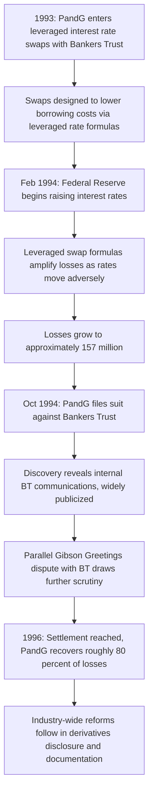

## Procter and Gamble Versus Bankers Trust

### Overview

In 1993-1994, Procter & Gamble (P&G) suffered approximately $157 million in losses on two leveraged interest rate swaps entered into with Bankers Trust (BT), leading P&G to sue Bankers Trust in 1994 alleging fraud, misrepresentation, and breach of fiduciary duty in the sale of the swaps. The case, settled in 1996 with P&G recovering roughly 80% of its losses, became a landmark in derivatives litigation and materially shaped subsequent industry practice around suitability, disclosure, and documentation of complex over-the-counter (OTC) derivatives sold to corporate end users.

**Key Points**

- P&G entered into two leveraged interest rate swaps with Bankers Trust intended to lower P&G's borrowing costs below what conventional fixed-rate debt would achieve
- Both swaps embedded leveraged formulas referencing interest rates and, in one case, bond prices, such that small adverse moves in reference rates produced disproportionately large losses
- P&G alleged BT provided misleading pricing information and failed to adequately disclose the swaps' risk characteristics, aided by BT's proprietary pricing models that P&G could not independently replicate
- Discovery in the litigation produced internal Bankers Trust communications that were widely publicized and damaging to BT's reputation, including remarks characterizing the firm's approach to complex derivatives sales
- The case, alongside contemporaneous losses at Gibson Greetings (also involving Bankers Trust) and other 1994 derivatives losses, catalyzed industry-wide reforms in derivatives documentation, disclosure, and suitability practices

### The Swap Structures

**The "5s/30s" swap (1993):**

P&G entered a five-year swap with Bankers Trust in which P&G would pay a rate determined by a formula referencing the spread between five-year and thirty-year U.S. Treasury yields, leveraged, in exchange for receiving a fixed rate — intended to reduce P&G's effective borrowing cost versus straight commercial paper issuance, based on an implicit bet that the yield curve would remain stable or steepen favorably.

**Simplified illustrative payoff logic:**

$$\text{P\&G Pay Rate} = \text{Commercial Paper Rate} - 0.75\% + \text{Leveraged Spread Adjustment}$$

The leveraged spread adjustment component amplified P&G's exposure to unfavorable movements in the reference rate spread — the precise embedded leverage multiplier and formula structure were complex and central to the parties' later dispute over adequacy of disclosure. [Unverified: exact formula terms are reported with some variation across secondary sources; primary swap confirmations were not fully public]

**Why leverage mattered:**

A modest, seemingly small adverse move in the underlying reference rate(s) — of a magnitude that would have been immaterial on an unleveraged notional exposure — translated into a much larger loss because the payoff formula multiplied the sensitivity to that reference rate. This is analogous in principle to the leveraged inverse floaters used by Orange County: a structured payoff amplifies rate sensitivity well beyond what the notional amount alone would suggest.

### What Went Wrong: Interest Rate Moves in 1994

**Key Points**

- The Federal Reserve began raising interest rates in February 1994, a faster and steeper tightening cycle than many market participants had anticipated (the same broad rate environment that also devastated Orange County's leveraged inverse floater holdings)
- Rising short-term rates, combined with the specific leveraged formulas in P&G's swaps, produced losses that grew rapidly and disproportionately relative to the moves in the underlying reference rates
- P&G had entered the swaps seeking to lower borrowing costs by a modest amount (reportedly targeting savings on the order of tens of basis points), making the eventual $157 million loss extraordinarily large relative to the intended benefit — a hallmark of the asymmetric risk/reward profile that leveraged derivatives payoffs can create when the bet embedded in the structure goes wrong

### The Litigation and Core Allegations

**Key Points**

- P&G filed suit against Bankers Trust in October 1994, alleging that BT: (1) misrepresented or failed to adequately explain the swaps' risk characteristics and embedded leverage, (2) used proprietary, opaque pricing models that prevented P&G from independently verifying quoted valuations or understanding its true mark-to-market exposure as the trade moved against it, and (3) breached duties owed given the complexity of the products relative to P&G's treasury function's sophistication in these specific instruments
- Bankers Trust countered that P&G was a large, sophisticated corporate counterparty (not a retail or unsophisticated investor), had the resources and expertise to understand and evaluate the swaps before entering them, and that P&G's losses stemmed from adverse market movements, not misrepresentation
- Discovery produced internal Bankers Trust audio recordings and communications that received extensive negative media coverage, including remarks by BT personnel that were widely interpreted as reflecting an aggressive, non-transparent approach to marketing complex derivatives to corporate clients — these disclosures significantly damaged Bankers Trust's reputation independent of the case's ultimate legal merits
- The parties settled in 1996, with P&G reported to have recovered approximately 80% of its losses (the practical result being P&G bore roughly $35 million of the original $157 million loss, with BT effectively absorbing the remainder), avoiding a full trial verdict on the underlying legal claims [Unverified: precise settlement allocation figures vary slightly by source]

### Related Concurrent Case: Gibson Greetings

**Key Points**

- Gibson Greetings, a greeting card company, suffered losses (reported in the tens of millions of dollars) on structured interest rate swaps also transacted with Bankers Trust in a similar 1993-1994 period, involving comparable leveraged rate-formula structures
- Gibson Greetings also litigated against Bankers Trust, and the case similarly settled, reinforcing the pattern of allegations around inadequate disclosure of leverage and complexity in BT's derivatives sales practices to corporate treasury clients during this period
- The near-simultaneous P&G and Gibson Greetings disputes, both against the same dealer, amplified regulatory and public attention on derivatives sales practices industry-wide, beyond what either case alone might have generated

### Timeline of Events

### Information Asymmetry and Model Opacity

**Information and Pricing Asymmetry Diagram (svg_diagram)**

<svg xmlns="http://www.w3.org/2000/svg" viewBox="0 0 850 400" font-family="Arial, sans-serif" font-size="13">
<text x="425" y="28" text-anchor="middle" font-size="17" font-weight="bold">Information Asymmetry in OTC Swap Pricing (svg_diagram)</text>
<rect x="60" y="80" width="280" height="140" rx="8" fill="#dbe9ff" stroke="#2b5faa" stroke-width="1.5" />
<text x="200" y="110" text-anchor="middle" font-weight="bold" font-size="13">Bankers Trust</text>
<text x="200" y="135" text-anchor="middle" font-size="11">Proprietary pricing model</text>
<text x="200" y="155" text-anchor="middle" font-size="11">Full visibility into embedded</text>
<text x="200" y="172" text-anchor="middle" font-size="11">leverage and mark-to-market</text>
<text x="200" y="195" text-anchor="middle" font-size="11">Structures and markets the swap</text>
<rect x="500" y="80" width="280" height="140" rx="8" fill="#fff2cc" stroke="#b38b00" stroke-width="1.5" />
<text x="640" y="110" text-anchor="middle" font-weight="bold" font-size="13">Procter and Gamble</text>
<text x="640" y="135" text-anchor="middle" font-size="11">Corporate treasury counterparty</text>
<text x="640" y="155" text-anchor="middle" font-size="11">Limited ability to independently</text>
<text x="640" y="172" text-anchor="middle" font-size="11">verify quoted valuations</text>
<text x="640" y="195" text-anchor="middle" font-size="11">Relies on dealer-provided marks</text>
<line x1="340" y1="150" x2="498" y2="150" stroke="#a94442" stroke-width="2" marker-end="url(#arrow7)" />
<text x="420" y="140" text-anchor="middle" font-size="11" fill="#a94442">Quoted valuations,</text>
<text x="420" y="240" text-anchor="middle" font-size="11" fill="#a94442">limited model transparency</text>
<rect x="220" y="290" width="410" height="80" rx="8" fill="#f2dede" stroke="#a94442" stroke-width="1.5" />
<text x="425" y="318" text-anchor="middle" font-weight="bold" font-size="13">Core Dispute</text>
<text x="425" y="340" text-anchor="middle" font-size="12">Was risk/leverage adequately disclosed given this</text>
<text x="425" y="358" text-anchor="middle" font-size="12">asymmetry, to a sophisticated but non-dealer counterparty?</text>
</svg>

### Industry and Regulatory Aftermath

**Key Points**

- The P&G and Gibson Greetings cases contributed significantly to the development of industry-standard practices around derivatives suitability assessment, plain-language risk disclosure, and documentation standards for OTC derivatives sold to corporate end users
- The cases are frequently cited as catalysts for enhanced use and refinement of ISDA (International Swaps and Derivatives Association) documentation practices and increased attention to representations regarding counterparty sophistication and independent evaluation of complex derivatives
- U.S. regulators (including the Commodity Futures Trading Commission and banking regulators) increased scrutiny of derivatives sales practices to corporate clients in the aftermath, though the primary resolution mechanism in these specific cases was private litigation/settlement rather than direct regulatory enforcement action against Bankers Trust for these specific transactions [Unverified: separate regulatory consent orders and enforcement actions involving Bankers Trust's derivatives business did occur in this period; the precise nexus to the P&G matter specifically is a nuance best verified against primary CFTC/Federal Reserve records if needed]
- Bankers Trust's reputation was materially damaged by the episode, frequently cited as a contributing factor (alongside other issues) in the bank's subsequent strategic difficulties and eventual acquisition by Deutsche Bank in 1999 [Inference: multiple factors contributed to BT's later acquisition; the derivatives litigation is one commonly cited contributing element rather than a sole cause]

### Key Lessons for Derivatives Practice and Risk Governance

**Key Points**

- **Model transparency and independent verification**: corporate end users of complex OTC derivatives benefit from independent means (internal quantitative capability, or independent third-party valuation) to verify dealer-provided pricing and mark-to-market valuations, rather than relying solely on the counterparty's proprietary models
- **Leverage embedded in payoff formulas, not just notional size**: as with Orange County's inverse floaters, a derivative's headline notional amount can understate its true risk if the payoff formula embeds leverage relative to the underlying reference rate — full sensitivity analysis (stress testing the payoff formula across plausible rate scenarios) is essential before execution
- **Sophistication of the counterparty does not eliminate disclosure obligations**: even large, financially sophisticated corporates may lack the specific specialized expertise to fully evaluate complex, dealer-structured derivatives, and courts/regulators have subsequently reinforced that dealer disclosure obligations do not evaporate simply because the counterparty is a large corporation
- **Documentation and internal communications matter**: the reputational and legal consequences of the case were significantly shaped by what internal communications revealed about sales practices and risk disclosure — a durable lesson for derivatives dealers on internal communication discipline and genuine (not merely formal) disclosure practices
- **Treasury hedging objectives versus embedded speculation**: P&G's stated goal was modest borrowing cost reduction, yet the swap structures embedded meaningfully speculative, leveraged directional bets on interest rate relationships — illustrating the importance of ensuring a hedging program's actual risk profile matches its stated objective, a theme echoed across several other derivatives disaster case studies in this chapter

### Related Topics

- Orange County and Leveraged Inverse Floaters
- Metallgesellschaft and Hedging Gone Wrong
- Interest Rate Swaps: Structuring, Pricing, and Documentation (ISDA Framework)
- Suitability and Disclosure Standards in OTC Derivatives Sales
- Counterparty Sophistication and Fiduciary Duty in Derivatives Transactions
- Structured Notes: Inverse Floaters, Range Accruals, and Embedded Optionality
- Model Risk and Independent Price Verification
- History of Derivatives Regulation: CFTC and the Commodity Exchange Act