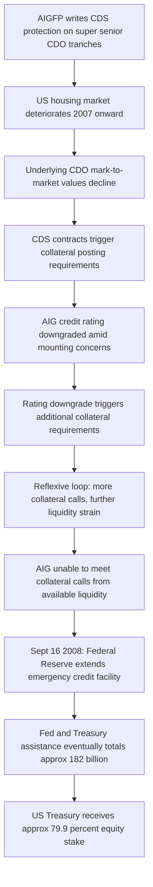

## AIG Credit Default Swaps and the Financial Crisis

### Overview

American International Group (AIG), at the time one of the world's largest insurers, came to the brink of collapse in September 2008 primarily due to massive collateral calls and mark-to-market losses on credit default swaps (CDS) written by its London-based unit, AIG Financial Products (AIGFP), largely referencing multi-sector collateralized debt obligations (CDOs) backed by U.S. subprime mortgages. The U.S. Federal Reserve extended an emergency credit facility of up to $85 billion on September 16, 2008 (with total federal assistance eventually reaching approximately $182 billion across multiple facilities and the Troubled Asset Relief Program), in exchange for an approximately 79.9% equity stake, to prevent AIG's disorderly failure from triggering broader systemic contagion given its vast web of counterparty relationships with major global banks. AIG's near-collapse is widely regarded as one of the most consequential single-firm events of the 2008 global financial crisis.

**Key Points**

- AIGFP wrote large volumes of CDS protection on "super senior" tranches of multi-sector CDOs, effectively insuring counterparties against credit losses on pools that included substantial subprime mortgage exposure
- These positions were originally modeled and priced as extremely low probability of loss ("super senior" tranches were the most protected, highest-rated layer of the CDO structure), leading AIGFP to charge relatively modest premiums for very large notional exposure
- As the U.S. housing market deteriorated from 2007 onward, the value of the underlying CDOs fell and credit rating agencies downgraded both the CDOs and, critically, AIG itself
- AIG's CDS contracts contained **collateral posting triggers** tied to mark-to-market losses and AIG's own credit rating — as both deteriorated, AIG faced escalating collateral calls from counterparties that it could not meet with available liquidity
- The scale of AIG's counterparty relationships with nearly every major global bank made its potential failure a systemic risk, prompting the unprecedented federal intervention

### AIG Financial Products and the CDS Business Model

**Key Points**

- AIGFP was a specialized unit within AIG, operating with a degree of autonomy and a business model built around exploiting AIG's then-AAA credit rating to write large volumes of derivatives, including interest rate swaps, and, from the early-to-mid 2000s, CDS protection on structured credit products
- The core CDS business referenced multi-sector CDOs — structured pools combining various asset-backed securities, with a meaningful and growing proportion of subprime residential mortgage-backed securities (RMBS) as the U.S. housing boom progressed through the mid-2000s
- AIGFP predominantly sold protection on the **super senior** tranche — the most senior, theoretically best-protected layer of the CDO capital structure, requiring very large losses in the underlying collateral pool before any principal loss would be expected to reach that tranche
- Because super senior risk was modeled (by AIGFP and by rating agencies) as having an extremely low probability of ever generating actual claims, AIGFP could write very large notional CDS exposure for comparatively modest premium income — a business viewed internally, for a period, as generating something close to "free" fee income given the perceived remoteness of loss [Inference: internal risk perception at AIGFP is documented through subsequent inquiries and testimony but exact internal risk assessments varied by period and individual]

### Why "Super Senior" Protection Still Generated Massive Losses

**Key Points**

- Actual realized default/loss rates on the underlying subprime collateral turned out to be far higher than the models (and rating agencies) had assumed, driven by deteriorating underwriting standards, housing price declines, and correlated defaults across geographically diverse mortgage pools that had previously been assumed to have diversification benefits similar to LTCM's pre-1998 assumptions
- Critically, AIG's CDS contracts did not only pay out on **actual realized defaults** — many contained provisions requiring AIG to post **collateral** based on the **mark-to-market value** of the underlying CDOs and/or downgrades to AIG's own credit rating, well before any actual default occurred
- As CDO market values fell sharply in 2007-2008 (reflecting both actual deteriorating fundamentals and a broader collapse in market liquidity/demand for structured credit products), AIG faced collateral calls from CDS counterparties (major banks including Goldman Sachs, Société Générale, Deutsche Bank, and others) that reflected mark-to-market losses far exceeding what AIG's models had contemplated as plausible
- This illustrates a crucial distinction: AIG's ultimate *economic* exposure (actual expected credit losses) may have been more limited than the *liquidity* demand created by collateral posting requirements tied to market value and ratings — a dynamic structurally similar to Metallgesellschaft's funding mismatch, but at a vastly larger systemic scale

### Collateral Trigger Mechanics

$$\text{Collateral Required} = f(\text{Mark-to-Market Loss on Reference CDOs}, \text{AIG Credit Rating Downgrade})$$

As both factors deteriorated simultaneously through 2007-2008:

1. Falling CDO valuations increased the mark-to-market collateral requirement under existing CDS contracts
2. Credit rating downgrades of AIG itself (as rating agencies grew concerned about AIG's mounting CDS-related exposure) triggered **additional** collateral posting requirements embedded in the same contracts — a reflexive feedback loop, since deteriorating perceived creditworthiness itself increased AIG's required collateral, further straining liquidity and increasing the risk of further downgrades

### The Collateral Spiral Diagram

**AIG Collateral Feedback Loop (svg_diagram)**

<svg xmlns="http://www.w3.org/2000/svg" viewBox="0 0 850 460" font-family="Arial, sans-serif" font-size="13">
<text x="425" y="28" text-anchor="middle" font-size="17" font-weight="bold">AIG Collateral Feedback Loop (svg_diagram)</text>
<ellipse cx="425" cy="230" rx="230" ry="180" fill="none" stroke="#ccc" stroke-width="1" stroke-dasharray="4,3" />
<rect x="330" y="60" width="190" height="70" rx="8" fill="#f2dede" stroke="#a94442" stroke-width="1.5" />
<text x="425" y="90" text-anchor="middle" font-weight="bold" font-size="12">CDO Values Fall</text>
<text x="425" y="110" text-anchor="middle" font-size="11">(Housing deterioration)</text>
<rect x="580" y="180" width="200" height="70" rx="8" fill="#fff2cc" stroke="#b38b00" stroke-width="1.5" />
<text x="680" y="210" text-anchor="middle" font-weight="bold" font-size="12">Collateral Calls</text>
<text x="680" y="230" text-anchor="middle" font-size="11">from CDS counterparties</text>
<rect x="330" y="330" width="190" height="70" rx="8" fill="#dbe9ff" stroke="#2b5faa" stroke-width="1.5" />
<text x="425" y="360" text-anchor="middle" font-weight="bold" font-size="12">AIG Rating Downgrade</text>
<text x="425" y="380" text-anchor="middle" font-size="11">(perceived risk rises)</text>
<rect x="70" y="180" width="200" height="70" rx="8" fill="#e2f0d9" stroke="#4a7a2b" stroke-width="1.5" />
<text x="170" y="210" text-anchor="middle" font-weight="bold" font-size="12">Liquidity Strain</text>
<text x="170" y="230" text-anchor="middle" font-size="11">Cash needed to post collateral</text>
<line x1="480" y1="128" x2="620" y2="182" stroke="#444" stroke-width="2" marker-end="url(#arrow8)" />
<line x1="650" y1="250" x2="470" y2="330" stroke="#444" stroke-width="2" marker-end="url(#arrow8)" />
<line x1="330" y1="365" x2="200" y2="252" stroke="#444" stroke-width="2" marker-end="url(#arrow8)" />
<line x1="200" y1="180" x2="340" y2="120" stroke="#444" stroke-width="2" marker-end="url(#arrow8)" />
</svg>

### The Federal Reserve Intervention

**Key Points**

- On September 16, 2008 — the day after Lehman Brothers filed for bankruptcy — the Federal Reserve Bank of New York authorized an $85 billion secured credit facility for AIG, later supplemented and restructured through additional facilities including the Troubled Asset Relief Program (TARP), bringing total federal government commitment to roughly $182 billion across the full intervention
- In exchange, the U.S. government (via a trust structure, later the U.S. Treasury directly) received warrants/equity representing approximately 79.9% of AIG's common stock, effectively nationalizing the company while keeping it operating rather than allowing a disorderly bankruptcy
- Regulators justified the intervention on **systemic risk** grounds: AIG's CDS counterparties included essentially every major global bank, and a disorderly AIG default would have triggered simultaneous, correlated losses and potential further collateral/liquidity crises across the global banking system at a moment (immediately post-Lehman) when the system had essentially no capacity to absorb another major shock — a dynamic echoing, at far larger scale, the systemic contagion concerns that motivated the LTCM rescue a decade earlier
- A subsequently controversial element of the intervention was the Fed/Treasury's facilitation of payments at full (100 cents on the dollar) value to AIG's CDS counterparties (including major banks such as Goldman Sachs, Société Générale, Deutsche Bank, and Merrill Lynch) for the CDS contracts being unwound — critics argued this amounted to a backdoor bailout of AIG's counterparties, since a private bankruptcy resolution would likely have resulted in counterparties recovering less than full value [This remains a genuinely disputed characterization; the New York Fed and defenders of the structure argued full payment was necessary given the contracts' legal terms and to avoid further destabilizing systemically important counterparty banks]
- The U.S. government's investment was ultimately repaid in full, with the Treasury and Federal Reserve together reported to have realized an overall positive return on the various AIG support facilities by the time the government's stake was fully exited in 2012 [Unverified: precise net gain/loss figures vary by which facilities and time period are included in the calculation; commonly cited figures suggest an overall positive return to taxpayers, but this remains a matter of some accounting and political debate]

### Systemic Risk and Interconnectedness

**Key Points**

- AIG's near-failure crystallized the concept of "too interconnected to fail" as a distinct systemic risk consideration from the more traditional "too big to fail" framing focused primarily on institution size
- Unlike a traditional bank, AIG was not directly regulated as a systemically important financial institution prior to the crisis; AIGFP's derivatives activities were subject to comparatively light-touch regulatory oversight (falling in a regulatory gap between insurance regulation, which governed AIG's traditional insurance subsidiaries, and the more developed bank regulatory frameworks applicable to bank derivatives dealers), a gap widely cited as a contributing structural cause of the crisis
- The episode substantially informed post-crisis derivatives market reforms under the Dodd-Frank Act (2010), including mandatory central clearing for standardized OTC derivatives, exchange/swap-execution-facility trading requirements, margin requirements for uncleared swaps, and the designation of "systemically important financial institutions" (SIFIs) subject to enhanced regulatory oversight regardless of whether they were traditionally regulated as banks

### Key Lessons for Derivatives Risk Management and Regulation

**Key Points**

- **Model risk in tail/rare-event assumptions**: as with LTCM, AIGFP's pricing and risk models assumed extremely low probabilities for the loss scenarios that ultimately materialized — a recurring pattern where models calibrated on historical data underweight genuinely systemic, correlated stress scenarios
- **Collateral/margin triggers create liquidity risk distinct from credit risk**: AIG's crisis was proximately a liquidity crisis (inability to meet collateral calls) rather than, at the point of the Fed intervention, necessarily an insolvency crisis reflecting fully realized credit losses — reinforcing the Metallgesellschaft-era lesson that mark-to-market/collateral mechanics can force a crisis before ultimate economic losses are confirmed
- **Regulatory gaps and interconnectedness**: activities conducted through entities that fall between regulatory frameworks (as AIGFP did, relative to bank-level derivatives oversight) can accumulate systemic risk that is not visible to, or actionable by, any single regulator until a crisis is underway
- **Counterparty concentration risk at a systemic scale**: AIG's failure risk was transmitted through its vast, concentrated web of CDS counterparty relationships with major global banks — reinforcing the post-crisis regulatory push toward central clearing, which interposes a central counterparty to reduce this specific bilateral interconnectedness channel
- **Rating agency reliance and rating-triggered contract terms**: embedding credit-rating downgrade triggers directly into derivatives collateral requirements created a destabilizing feedback loop (downgrade triggers cash calls, which increases downgrade risk) — a structural design lesson that has informed subsequent scrutiny of rating-linked contractual triggers across derivatives markets

### Related Topics

- The Collapse of Long Term Capital Management
- Metallgesellschaft and Hedging Gone Wrong
- Credit Default Swaps: Structuring, Pricing, and Documentation
- Collateralized Debt Obligations (CDOs) and Subprime Securitization
- Dodd-Frank Act: Central Clearing, SEFs, and Margin Requirements for OTC Derivatives
- Systemic Risk and "Too Interconnected to Fail"
- Counterparty Credit Risk and Collateral/Margin Mechanics (CSAs)
- Credit Rating Agencies and Rating-Triggered Contractual Provisions