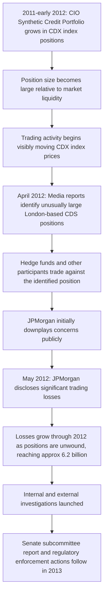

## The JPMorgan London Whale Incident

### Overview

The "London Whale" incident refers to approximately $6.2 billion in trading losses incurred by JPMorgan Chase's Chief Investment Office (CIO) in 2012, arising from a series of large credit derivatives positions built by trader Bruno Iksil (whose outsized positions in the credit index market earned him the "London Whale" nickname due to their market-moving size) under the supervision of CIO head Ina Drew. The episode became a prominent case study in model risk, risk limit governance, valuation/marking practices, and the challenges of overseeing a nominally hedging-focused trading unit that evolved into large, complex proprietary-like positions.

**Key Points**

- The CIO was originally mandated to manage JPMorgan's excess deposits and hedge the bank's structural balance sheet risks, not to run large proprietary trading strategies
- The Synthetic Credit Portfolio (SCP) within CIO grew from a hedging book into a large, directional set of positions in credit default swap indices (CDX), reportedly intended in part to generate profit rather than purely hedge existing exposures
- Positions became so large relative to the market that JPMorgan's own trading activity was reported to be moving index prices, drawing public and regulatory attention (including media coverage identifying unusually large positions before the losses were disclosed)
- Internal risk models, including a revised Value-at-Risk (VaR) model, were found by subsequent investigations to have understated the portfolio's risk, contributing to inadequate senior management and regulatory visibility into the accumulating exposure
- The losses prompted a U.S. Senate Permanent Subcommittee on Investigations report, regulatory enforcement actions and fines against JPMorgan, and became a significant reference point in debates over the Volcker Rule's restrictions on proprietary trading by banks

### The Synthetic Credit Portfolio and Its Evolution

**Key Points**

- CIO's original function: JPMorgan, like other large banks, holds substantial excess deposits beyond what is deployed in loans; CIO's core mandate was to invest this excess liquidity and hedge broad balance-sheet risks (interest rate risk, credit risk) arising from the bank's overall business
- The Synthetic Credit Portfolio used credit default swap **indices** (notably CDX.NA.IG, a basket-referencing index of North American investment-grade credit default swaps, and related tranche products) rather than single-name CDS, allowing large, liquid (in normal conditions) exposure to broad credit market direction and spread movements
- Over 2011-2012, the SCP's stated purpose evolved: initially framed as a hedge against tail credit risk (protecting the bank against a systemic credit deterioration scenario), the portfolio's activity increasingly involved selling protection (a bullish-on-credit, "long risk" position) apparently intended to offset the cost of the existing hedges and, per subsequent investigation findings, to generate standalone profit — a drift from pure hedging toward a directional, profit-seeking trading strategy operating under the CIO's risk framework rather than the bank's formal trading-desk risk governance

### How the Position Became "The Whale"

**Key Points**

- Iksil's positions in CDX.NA.IG and related index tranches grew to a size that was large relative to the overall market's liquidity in those specific instruments
- Because the position was so large, JPMorgan's own trading activity to adjust or maintain the position reportedly began to visibly influence index price levels — a dynamic where the position's own size undermined the market's ability to absorb it without moving prices against the position, similar in principle (though different in origin) to LTCM's difficulty exiting positions that were large relative to underlying market depth
- Hedge funds and other market participants, observing unusual price distortions in the CDX index, began taking opposing positions once the unusually large JPMorgan exposure became apparent through market chatter and subsequent media reporting (notably reporting in April 2012), effectively trading against the "whale" once its presence and directional bias were identified — amplifying losses as JPMorgan's own size made an orderly unwind more difficult

### Timeline of Events

### Risk Model and Valuation Failures

**Key Points**

- A revised VaR model was implemented for the CIO in early 2012; subsequent investigation (including the JPMorgan Task Force internal report and the Senate subcommittee report) found the new model contained implementation errors and produced materially lower risk estimates than the portfolio's actual risk, reportedly understating VaR by a substantial margin relative to what a corrected model would have shown [Unverified: precise quantification of the model's understatement varies slightly across the internal task force report and external investigative accounts]
- The lower VaR readings allowed the position to grow without triggering the escalated scrutiny or limit breaches that more accurate risk figures would have generated, illustrating how model risk (errors or flawed assumptions in a risk model itself, as distinct from market risk in the underlying position) can materially delay detection of an accumulating problem
- Separately, questions arose regarding the marking (valuation) practices used for the SCP's positions during the period losses were building, with subsequent investigation examining whether marks used in daily P&L reporting adequately reflected deteriorating market prices for the positions as the trade moved against JPMorgan — an issue distinct from but related to the VaR model concerns, both contributing to delayed and understated recognition of the portfolio's true risk and loss position

### Risk Governance and Escalation Failure

**Governance Gaps Diagram (svg_diagram)**

<svg xmlns="http://www.w3.org/2000/svg" viewBox="0 0 850 440" font-family="Arial, sans-serif" font-size="13">
<text x="425" y="28" text-anchor="middle" font-size="17" font-weight="bold">CIO Risk Governance Gaps (svg_diagram)</text>
<rect x="40" y="70" width="220" height="90" rx="8" fill="#dbe9ff" stroke="#2b5faa" stroke-width="1.5" />
<text x="150" y="100" text-anchor="middle" font-weight="bold" font-size="12">CIO Mandate</text>
<text x="150" y="120" text-anchor="middle" font-size="11">Hedge balance sheet risk,</text>
<text x="150" y="138" text-anchor="middle" font-size="11">invest excess deposits</text>
<rect x="320" y="70" width="220" height="90" rx="8" fill="#fff2cc" stroke="#b38b00" stroke-width="1.5" />
<text x="430" y="100" text-anchor="middle" font-weight="bold" font-size="12">SCP Activity Drift</text>
<text x="430" y="120" text-anchor="middle" font-size="11">Large directional CDX</text>
<text x="430" y="138" text-anchor="middle" font-size="11">index positions build</text>
<rect x="600" y="70" width="220" height="90" rx="8" fill="#f2dede" stroke="#a94442" stroke-width="1.5" />
<text x="710" y="100" text-anchor="middle" font-weight="bold" font-size="12">Revised VaR Model</text>
<text x="710" y="120" text-anchor="middle" font-size="11">Understates true</text>
<text x="710" y="138" text-anchor="middle" font-size="11">portfolio risk</text>
<line x1="260" y1="115" x2="318" y2="115" stroke="#444" stroke-width="2" marker-end="url(#arrow9)" />
<line x1="540" y1="115" x2="598" y2="115" stroke="#444" stroke-width="2" marker-end="url(#arrow9)" />
<rect x="220" y="250" width="420" height="110" rx="8" fill="#f5f5f5" stroke="#888" stroke-width="1" />
<text x="430" y="278" text-anchor="middle" font-weight="bold" font-size="13">Consequence</text>
<text x="430" y="302" text-anchor="middle" font-size="12">Senior management and risk committees do not receive</text>
<text x="430" y="322" text-anchor="middle" font-size="12">accurate risk signals; limit breaches not escalated in time</text>
<text x="430" y="342" text-anchor="middle" font-size="12">for corrective action before losses compound</text>
<line x1="710" y1="160" x2="430" y2="248" stroke="#444" stroke-width="2" marker-end="url(#arrow9)" />
</svg>

**Key Points**

- Subsequent investigation found that risk limit breaches on the SCP occurred repeatedly during the period the losses were building, but were reportedly not escalated with sufficient urgency to senior firm-wide risk management or the board, a governance failure distinct from (but compounding) the underlying model inaccuracies
- The CIO's risk oversight structure was found to have been less rigorous than that applied to JPMorgan's formal trading desks (e.g., the investment bank's trading businesses), despite the SCP positions having grown to a size and complexity comparable to a major proprietary trading book — illustrating a governance gap where a unit's official categorization (as a hedging/treasury function rather than a trading desk) did not keep pace with the actual risk character of its activities

### Regulatory and Legal Aftermath

**Key Points**

- JPMorgan paid a combined total of roughly $920 million in fines and settlements to U.S. and U.K. regulators (including the SEC, the Federal Reserve, the Office of the Comptroller of the Currency, and the U.K. Financial Conduct Authority) in connection with the incident, alongside separate legal costs and related settlements [Unverified: exact total figures across all jurisdictions and settlements are reported with some variation across sources depending on which components are included]
- The U.S. Senate Permanent Subcommittee on Investigations published a detailed report in 2013 examining the incident, including findings on risk model deficiencies, valuation practices, and communications with regulators during the period losses were building
- Criminal charges were filed against two former JPMorgan traders (Javier Martin-Artajo and Julien Grout) related to allegations they mismarked positions to understate losses during the period; case outcomes and subsequent developments in these specific prosecutions evolved over time [Unverified: specific case dispositions should be confirmed against current records if precise legal outcomes are needed]
- The episode became a frequently cited reference point in the ongoing regulatory and political debate over the Volcker Rule (part of the Dodd-Frank Act), which restricts proprietary trading by banks — critics of bank risk-taking cited the CIO's evolution from hedging to directional trading as an example of the difficulty in clearly distinguishing permitted hedging activity from restricted proprietary trading in practice

### Key Lessons for Derivatives Risk Management

**Key Points**

- **Mission drift from hedging to directional trading**: a unit mandated purely for hedging can gradually accumulate large, directional, profit-seeking positions without a clear governance trigger forcing reclassification and correspondingly heightened risk oversight — periodic, substantive review of whether a unit's actual activity still matches its stated mandate is essential
- **Model risk in risk measurement itself**: as with LTCM, flawed risk models (here, an implementation-flawed VaR model) can mask accumulating risk from senior management, regulators, and risk committees — model validation and independent challenge of risk model changes are critical control points, particularly around the time a model is revised or replaced
- **Position size relative to market liquidity**: as positions grow large relative to the liquidity of the instruments involved, a firm's own trading activity can move prices against itself, and become visible/exploitable by other market participants — position sizing limits calibrated to realistic market depth, not just notional risk appetite, are an important complementary control
- **Escalation discipline for limit breaches**: risk limits are only effective controls if breaches are escalated promptly and acted upon by senior management with authority to require position reduction — repeated, unescalated limit breaches represent a governance failure independent of whether the limits themselves were well-calibrated
- **Consistency of risk governance across business unit types**: risk oversight rigor should be calibrated to the actual risk and complexity of a unit's activities, not solely to its formal organizational classification (treasury/hedging function versus trading desk) — as CIO's activities evolved, its risk governance framework did not evolve commensurately

### Related Topics

- The Collapse of Long Term Capital Management
- AIG Credit Default Swaps and the Financial Crisis
- Value-at-Risk (VaR): Methodologies and Limitations
- Credit Default Swap Indices (CDX, iTraxx) and Index Tranche Products
- The Volcker Rule and Restrictions on Proprietary Trading
- Risk Limit Governance and Escalation Frameworks
- Model Validation and Independent Price/Risk Verification
- Barings Bank and Unauthorized Trading Risk