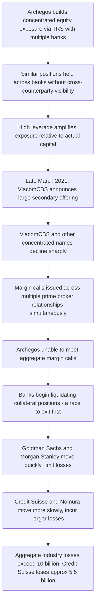

## Archegos Capital and Total Return Swap Leverage

### Overview

Archegos Capital Management, a family office run by former Tiger Asia manager Bill Hwang, collapsed in March 2021 after highly concentrated, leveraged equity positions built primarily through total return swaps (TRS) with multiple prime brokers could not meet margin calls following sharp price declines in several underlying stocks. The unwind triggered forced liquidations across counterparty banks, producing an estimated $10+ billion in aggregate losses across the banking counterparties involved, with Credit Suisse alone reporting losses of approximately $5.5 billion — losses that contributed materially to Credit Suisse's subsequent deep reputational and financial difficulties, which culminated in its 2023 forced acquisition by UBS. The episode is a landmark case in synthetic leverage, counterparty concentration risk, and the regulatory blind spots created by family offices' historical exemption from investment adviser disclosure requirements.

**Key Points**

- Archegos built massive, highly concentrated equity exposures — heavily weighted toward a small number of names including ViacomCBS, Discovery, and several Chinese ADRs — using total return swaps rather than direct stock ownership
- TRS structuring meant Archegos's positions were **not directly visible** to any single regulator or, in aggregate, to any single prime broker counterparty, since Archegos maintained similar/overlapping swap positions across multiple banks simultaneously without those banks having visibility into each other's exposure to the same underlying names
- Extreme leverage (reportedly on the order of 5:1 to 8:1 or higher across the overall portfolio, varying by estimate and by counterparty) meant that a relatively modest adverse price move in the concentrated holdings could — and did — wipe out Archegos's capital base entirely
- When ViacomCBS shares fell sharply in late March 2021 (following a large stock offering that pressured the price), margin calls across Archegos's multiple prime broker relationships could not be met, triggering a scramble among banks to liquidate collateral positions, with banks that moved fastest to sell (notably Goldman Sachs and Morgan Stanley) incurring comparatively smaller losses than banks that moved more slowly (notably Credit Suisse and Nomura)
- Archegos operated as a family office, which under then-prevailing U.S. regulation was exempt from registering as an investment adviser and from the associated disclosure requirements that would apply to a comparably sized hedge fund — a regulatory gap subsequently subject to reform proposals

### Total Return Swaps as a Leverage and Disclosure-Avoidance Mechanism

**TRS mechanics:**

A total return swap is a derivative contract in which one party (the "total return receiver," here Archegos) receives the economic return (price appreciation plus dividends) of a reference asset (a stock) from a counterparty (the "total return payer," here the prime broker bank), in exchange for paying the bank a financing rate (typically a spread over a reference rate) plus, if the stock falls, compensating the bank for the decline.

$$\text{Archegos Net Payoff} = (\text{Price Appreciation} + \text{Dividends}) - \text{Financing Cost} - \text{Price Depreciation (if any)}$$

**Why this structure was attractive for building leverage:**

- The bank, not Archegos, holds legal title to the underlying shares — the bank purchases the actual stock as its own hedge against the swap exposure it has written to Archegos
- Archegos only posts **margin** (a fraction of the notional exposure) to the bank, rather than paying the full purchase price of the shares — creating leverage, since a given amount of Archegos capital controlled a much larger notional equity exposure than outright stock purchase would have allowed
- Because Archegos never directly owned the shares, its positions did not appear on public beneficial-ownership disclosure filings (such as Schedule 13D/13F filings required of direct equity holders in the U.S.) that would otherwise have revealed the scale of its concentrated stakes to the market and regulators
- Critically, Archegos reportedly held **economically similar or identical swap positions with multiple different banks simultaneously** on the same underlying names, meaning no single bank could see the full picture of Archegos's aggregate concentrated exposure across all counterparties — each bank could only assess Archegos's risk based on its own bilateral relationship

### Position Concentration and the Price Decline

**Key Points**

- Archegos's swap exposure was heavily concentrated in a small number of names, including ViacomCBS (now Paramount), Discovery Inc., and several U.S.-listed Chinese technology/education ADRs (including Baidu, Tencent Music, and GSX Techedu, among others) — a lack of diversification that amplified vulnerability to idiosyncratic price moves in any single name
- In late March 2021, ViacomCBS announced a large secondary stock offering, which pressured the share price downward; the stock had also experienced a substantial prior run-up, in which Archegos's concentrated buying (via its swap counterparties' hedging purchases) may itself have contributed to the earlier price appreciation — raising questions in subsequent analysis about whether Archegos's own activity had helped inflate the very positions that then collapsed [Inference: the precise degree to which Archegos's trading activity itself drove the underlying stock price appreciation, versus other market factors, is difficult to fully disentangle and is treated with some caution in subsequent analyses]
- As ViacomCBS and other concentrated names declined sharply, Archegos faced margin calls across its multiple prime broker relationships simultaneously — a direct parallel to how LTCM's "diversified" trades became correlated in a systemic liquidity event, except here the concentration (rather than a hidden correlation) was the direct, singular cause of the simultaneous stress across all counterparty relationships

### Timeline of the Collapse

### The Multi-Bank Blind Spot

**Counterparty Visibility Gap Diagram (svg_diagram)**

<svg xmlns="http://www.w3.org/2000/svg" viewBox="0 0 850 460" font-family="Arial, sans-serif" font-size="13">
<text x="425" y="28" text-anchor="middle" font-size="17" font-weight="bold">Multi-Bank TRS Counterparty Blind Spot (svg_diagram)</text>
<rect x="360" y="60" width="180" height="70" rx="8" fill="#fff2cc" stroke="#b38b00" stroke-width="1.5" />
<text x="450" y="90" text-anchor="middle" font-weight="bold" font-size="13">Archegos Capital</text>
<text x="450" y="110" text-anchor="middle" font-size="11">Family office</text>
<rect x="60" y="220" width="170" height="70" rx="8" fill="#dbe9ff" stroke="#2b5faa" stroke-width="1.5" />
<text x="145" y="250" text-anchor="middle" font-weight="bold" font-size="12">Bank A</text>
<text x="145" y="270" text-anchor="middle" font-size="11">TRS on Stock X</text>
<rect x="270" y="220" width="170" height="70" rx="8" fill="#dbe9ff" stroke="#2b5faa" stroke-width="1.5" />
<text x="355" y="250" text-anchor="middle" font-weight="bold" font-size="12">Bank B</text>
<text x="355" y="270" text-anchor="middle" font-size="11">TRS on Stock X</text>
<rect x="480" y="220" width="170" height="70" rx="8" fill="#dbe9ff" stroke="#2b5faa" stroke-width="1.5" />
<text x="565" y="250" text-anchor="middle" font-weight="bold" font-size="12">Bank C</text>
<text x="565" y="270" text-anchor="middle" font-size="11">TRS on Stock X</text>
<rect x="690" y="220" width="150" height="70" rx="8" fill="#dbe9ff" stroke="#2b5faa" stroke-width="1.5" />
<text x="765" y="250" text-anchor="middle" font-weight="bold" font-size="12">Bank D</text>
<text x="765" y="270" text-anchor="middle" font-size="11">TRS on Stock X</text>
<line x1="400" y1="130" x2="180" y2="218" stroke="#444" stroke-width="1.5" marker-end="url(#arrow10)" />
<line x1="430" y1="130" x2="380" y2="218" stroke="#444" stroke-width="1.5" marker-end="url(#arrow10)" />
<line x1="470" y1="130" x2="560" y2="218" stroke="#444" stroke-width="1.5" marker-end="url(#arrow10)" />
<line x1="500" y1="130" x2="740" y2="218" stroke="#444" stroke-width="1.5" marker-end="url(#arrow10)" />
<rect x="140" y="330" width="580" height="100" rx="8" fill="#f2dede" stroke="#a94442" stroke-width="1.5" />
<text x="430" y="358" text-anchor="middle" font-weight="bold" font-size="13">No Single Bank Sees the Full Picture</text>
<text x="430" y="382" text-anchor="middle" font-size="12">Each bank assesses Archegos risk only against its own bilateral exposure</text>
<text x="430" y="402" text-anchor="middle" font-size="12">True aggregate concentration across all four banks is invisible to each individually</text>
<line x1="145" y1="290" x2="300" y2="328" stroke="#a94442" stroke-width="1.5" stroke-dasharray="3,3" />
<line x1="355" y1="290" x2="380" y2="328" stroke="#a94442" stroke-width="1.5" stroke-dasharray="3,3" />
<line x1="565" y1="290" x2="480" y2="328" stroke="#a94442" stroke-width="1.5" stroke-dasharray="3,3" />
<line x1="765" y1="290" x2="560" y2="328" stroke="#a94442" stroke-width="1.5" stroke-dasharray="3,3" />
</svg>

### The Liquidation Race: Why Some Banks Lost More Than Others

**Key Points**

- When it became clear Archegos could not meet margin calls, prime brokers holding the underlying hedge shares needed to sell those shares (the collateral backing their swap exposure) to recoup their positions
- Because multiple banks held similar underlying positions (hedging similar or identical swap exposure to Archegos), the race to sell created a self-reinforcing price decline: the first banks to sell obtained better execution prices, while banks that hesitated or coordinated more slowly sold into an already-declining, saturated market
- Reports and subsequent analysis indicate that Goldman Sachs and Morgan Stanley acted quickly (reportedly holding preliminary calls with Archegos and beginning to liquidate positions promptly once it was apparent margin calls would not be met), materially limiting their losses relative to peers
- Credit Suisse and Nomura are reported to have acted more slowly, resulting in substantially larger realized losses — Credit Suisse's approximately $5.5 billion loss became a significant contributor to a broader pattern of risk management and governance failures at the bank that were cited in subsequent regulatory and market scrutiny, compounding other issues (including the concurrent Greensill Capital-related losses) that contributed to Credit Suisse's weakened market position ahead of its 2023 crisis and acquisition by UBS [Inference: Archegos was one of several contributing factors to Credit Suisse's later difficulties, not a sole cause; the relative weighting of contributing factors is a matter of subsequent analysis rather than a single definitive attribution]

### The Family Office Regulatory Gap

**Key Points**

- Under the Investment Advisers Act framework prevailing at the time, family offices managing assets for a single family (rather than external clients) were broadly exempt from registering as investment advisers with the SEC, and correspondingly exempt from many of the position disclosure and reporting obligations that apply to comparably sized hedge funds
- This meant Archegos, despite reportedly running swap-based gross exposure estimated well into the tens of billions of dollars at its peak [Unverified: precise peak gross exposure figures vary across reporting, commonly cited in the range of $20-50 billion or higher, given the difficulty of independently verifying aggregate cross-bank exposure after the fact], operated with essentially none of the position transparency that a hedge fund of comparable economic scale would have been subject to under Form 13F and related disclosure regimes
- The episode substantially informed subsequent SEC rulemaking efforts (including expanded reporting requirements for large security-based swap positions) aimed at improving regulatory visibility into concentrated derivative-based equity exposures, and renewed debate over whether the family office exemption remains appropriately calibrated given the scale some such entities can reach

### Key Lessons for Derivatives Risk Management

**Key Points**

- **Synthetic leverage via derivatives can exceed direct-ownership leverage limits and disclosure thresholds**: using TRS rather than direct stock purchase allowed Archegos to build far larger, more leveraged, and less visible positions than direct equity ownership rules and disclosure requirements would have permitted — a structural lesson relevant well beyond this specific case for any leverage embedded in derivative rather than cash instrument form
- **Counterparty-level risk assessment cannot see aggregate client exposure across the market**: each prime broker's risk management was, by design, limited to its own bilateral relationship with Archegos — without an industry-wide or regulatory mechanism to aggregate a single counterparty's total exposure across all dealers, dangerous concentration can build invisibly
- **Concentration risk in underlying reference assets**: even with full collateralization/margining in principle, extreme concentration in a small number of illiquid-relative-to-position-size names means margin models calibrated on normal volatility/liquidity assumptions can be quickly overwhelmed by the price impact of an actual unwind — margin methodologies ideally should account for position size relative to the underlying instrument's typical trading liquidity, not just historical volatility of the reference price alone
- **First-mover advantage in a multi-counterparty unwind**: when multiple counterparties hold correlated exposure to the same distressed client and underlying collateral, the speed and coordination of a bank's own risk response materially affects its realized losses — creating an inherent, sometimes destabilizing incentive for competing banks to race each other to exit rather than coordinate an orderly unwind
- **Regulatory disclosure gaps for large, opaque market participants**: family offices, and other categories of market participant exempted from standard position-reporting regimes, can accumulate systemically relevant concentrated exposure without triggering the transparency mechanisms designed to allow regulators and counterparties to assess aggregate risk

### Related Topics

- Total Return Swaps: Structuring, Margining, and Use Cases
- The Collapse of Long Term Capital Management
- The JPMorgan London Whale Incident
- Prime Brokerage and Counterparty Margin Methodologies
- Credit Suisse's 2023 Crisis and Acquisition by UBS
- SEC Position Reporting Requirements for Security-Based Swaps
- Family Office Regulation and the Investment Advisers Act Exemption
- Concentration Risk and Liquidity-Adjusted Margin Modeling