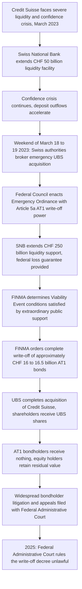

## Credit Suisse Contingent Convertible Writedown

### Overview

On March 19, 2023, the Swiss Financial Market Supervisory Authority (FINMA) ordered Credit Suisse to write down the entire nominal value of its Additional Tier 1 (AT1) contingent convertible ("CoCo") bonds — approximately CHF 16-16.5 billion (roughly $17.5 billion) — to zero, as part of the emergency, government-orchestrated acquisition of Credit Suisse by UBS. FINMA ordered the complete write-off of all Additional Tier 1 capital instruments, around CHF16.5 billion in bonds, wiping them out overnight, based on Article 5a of the Federal Council's Emergency Ordinance, which granted FINMA extraordinary authority to impose this write-off. The decision was highly controversial because it subordinated AT1 bondholders to below equity holders in practical loss-absorption terms — inverting the conventional capital structure hierarchy — since Credit Suisse's common shareholders retained some recovery value (UBS shares) while AT1 bondholders received nothing. The case is a landmark in the design and legal interpretation of contingent convertible capital instruments, "bail-in" resolution mechanics, and regulatory emergency powers, and — following a 2025 Swiss court ruling — in the limits of such powers. [DLA Piper](https://www.dlapiper.com/en-us/insights/publications/2025/11/swiss-court-strikes-down-at1-bond-write-off)

**Key Points**

- AT1 bonds are a form of hybrid regulatory capital (Additional Tier 1 under Basel III) designed to absorb losses automatically before a bank becomes insolvent, either by converting to equity or being written down, upon a specified "trigger event"
- The bonds' contractual terms stipulated a write-down to zero following either a "Contingency Event" (CET1 capital ratio falling below a specified threshold, commonly 7%) or a "Viability Event" (a regulatory determination that write-down is necessary to prevent insolvency, or that the bank has received an irrevocable commitment of extraordinary public sector support) [ECGI](https://www.ecgi.global/sites/default/files/working_papers/documents/bailoutblues.pdf)
- FINMA justified the write-down on the basis that Credit Suisse's receipt of extraordinary liquidity assistance loans secured by a federal default guarantee on March 19, 2023 satisfied the contractual "Viability Event" conditions [CNBC](https://www.cnbc.com/2023/03/23/swiss-regulator-says-central-bank-loan-to-credit-suisse-justified-at1-bond-writedown.html)
- The write-down triggered immediate, widespread controversy in global capital markets over the seniority and safety of AT1 instruments generally, and prompted an extended, multi-year legal battle in the Swiss courts
- In 2025, the Swiss Federal Administrative Court ruled that FINMA's write-off decree was unlawful, though this decision does not automatically compensate bondholders and remains subject to further appeal

### What AT1/Contingent Convertible Bonds Are and Why They Exist

**Key Points**

- AT1 bonds emerged as a regulatory capital instrument following the 2008 financial crisis, designed under Basel III to provide banks with a loss-absorbing capital buffer that converts to equity or is written down automatically in a crisis, without requiring a formal insolvency proceeding
- This debt is a hybrid, perpetual bond issued by banks to meet regulatory capital requirements after the 2008 financial crisis, acting as a "bail-in" tool that can be converted into equity or written down to absorb losses if a bank's capital levels fall below a certain threshold [Family Wealth Report](https://www.familywealthreport.com/article.php/Credit-Suisse-AT1-Bondholders:-Navigating-Legal-Routes-After-Swiss-Write_dash_Down)
- The instruments are perpetual (no fixed maturity), pay a relatively high coupon to compensate investors for this loss-absorption risk, and are typically callable by the issuer after an initial period
- Two structural variants exist across the market generally: **conversion-to-equity** AT1s (bondholders receive shares upon trigger) and **write-down** AT1s (bondholders lose their principal outright, potentially with no compensation) — Credit Suisse's AT1s were structured as the latter, write-down type

### The Trigger Mechanism and FINMA's Rationale

$$\text{Write-down Trigger} = \begin{cases} \text{CET1 Ratio} < 7\% & \text{(Contingency Event)} \\ \text{Regulatory determination of non-viability, or} \\ \text{irrevocable extraordinary public support committed} & \text{(Viability Event)} \end{cases}$$

**Key Points**

- Under the Viability Event trigger, "the Regulator" must determine that a write-down is essential to prevent Credit Suisse from becoming insolvent or from ceasing to carry on its business (one scenario), or alternatively Credit Suisse must have received an irrevocable commitment of extraordinary public sector support (a second scenario) [ECGI](https://www.ecgi.global/sites/default/files/working_papers/documents/bailoutblues.pdf)
- FINMA's position was that the write-down of the bonds was done on the basis of the extraordinary support received by Credit Suisse (the second scenario) — under this reading, the complete write-down of the bonds followed automatically from the irrevocable commitment of public support, without requiring a separate exercise of FINMA's specific statutory powers [Oxford Law Blogs](https://blogs.law.ox.ac.uk/oblb/blog-post/2023/04/bailout-blues-write-down-at1-bonds-credit-suisse-bailout)
- The Swiss Federal Council had, on the same day as the write-down decree, amended the recently adopted Emergency Ordinance with a provision, Article 5a, specifically authorizing FINMA to order a concerned bank to write off its core capital — meaning the specific legal authority FINMA ultimately relied on was enacted essentially contemporaneously with its exercise, a fact that later became central to legal challenges [Bvger](https://www.bvger.ch/en/newsroom/media-releases/unlawful-write-off-of-at1-capital-instruments-2385)

### The Sequence of the Rescue

### Why the Outcome Inverted Conventional Capital Structure Hierarchy

**Key Points**

- In a conventional insolvency/liquidation waterfall, equity holders are subordinate to (rank below, absorb losses before) bondholders of any seniority, including AT1 instruments — this is the standard capital structure hierarchy embedded in corporate finance and insolvency law generally
- In the Credit Suisse resolution, this hierarchy was effectively inverted in practical outcome: AT1 bondholders received zero recovery, while common equity shareholders received UBS shares (a recovery, albeit at a steeply discounted exchange ratio relative to Credit Suisse's pre-crisis share price) as part of the acquisition consideration
- While bond documentation suggested bondholders' claims would rank senior to the rights and claims of holders of Junior Capital (i.e., senior to equity) in a subordination clause, this was qualified by other contractual provisions that made all bondholders' claims subject to the specific write-down conditions described above — meaning the AT1 contractual terms, as drafted, permitted this specific inverted outcome under a Viability Event trigger, even though it departed from conventional insolvency-waterfall expectations [ECGI](https://www.ecgi.global/sites/default/files/working_papers/documents/bailoutblues.pdf)
- Commentary following the event suggested Swiss authorities placed weight on placating Credit Suisse shareholders relative to AT1 bondholders, reasoning that shareholders could have initiated blocking litigation that might have derailed the emergency transaction, and that anchor equity investors were viewed as necessary to meet the combined entity's future financing needs [Oxford Law Blogs](https://blogs.law.ox.ac.uk/oblb/blog-post/2023/04/bailout-blues-write-down-at1-bonds-credit-suisse-bailout)
- This inversion sent an immediate shockwave through global AT1/CoCo bond markets, as investors reassessed whether AT1 instruments issued by other banks, under other jurisdictions' resolution frameworks, might carry similar risk of subordination-in-practice relative to equity — prompting other regulators (including the European Central Bank, the Bank of England, and others) to issue statements affirming their own jurisdictions' resolution frameworks would preserve the conventional equity-before-AT1 loss absorption hierarchy

### Capital Structure Waterfall Comparison Diagram

**Conventional vs. Credit Suisse Outcome (svg_diagram)**

<svg xmlns="http://www.w3.org/2000/svg" viewBox="0 0 850 440" font-family="Arial, sans-serif" font-size="13">
<text x="425" y="28" text-anchor="middle" font-size="17" font-weight="bold">Capital Structure Waterfall: Conventional vs. CS Outcome (svg_diagram)</text>

<text x="210" y="60" text-anchor="middle" font-weight="bold" font-size="14">Conventional Hierarchy</text>

<rect x="90" y="80" width="240" height="55" fill="`#e2f0d9`" stroke="`#4a7a2b`" stroke-width="1.5" />

<text x="210" y="112" text-anchor="middle" font-size="12">Senior Debt (best protected)</text>

<rect x="90" y="135" width="240" height="55" fill="`#dbe9ff`" stroke="`#2b5faa`" stroke-width="1.5" />

<text x="210" y="167" text-anchor="middle" font-size="12">AT1 / CoCo Bonds</text>

<rect x="90" y="190" width="240" height="55" fill="`#f2dede`" stroke="`#a94442`" stroke-width="1.5" />

<text x="210" y="222" text-anchor="middle" font-size="12">Common Equity (absorbs losses first)</text>

<text x="640" y="60" text-anchor="middle" font-weight="bold" font-size="14">Credit Suisse Actual Outcome</text>

<rect x="520" y="80" width="240" height="55" fill="`#e2f0d9`" stroke="`#4a7a2b`" stroke-width="1.5" />

<text x="640" y="112" text-anchor="middle" font-size="12">Senior Debt (unaffected)</text>

<rect x="520" y="135" width="240" height="55" fill="`#f2dede`" stroke="`#a94442`" stroke-width="2" />

<text x="640" y="162" text-anchor="middle" font-size="12" font-weight="bold">AT1 Bonds</text>

<text x="640" y="180" text-anchor="middle" font-size="11">Written to ZERO</text>

<rect x="520" y="190" width="240" height="55" fill="`#fff2cc`" stroke="`#b38b00`" stroke-width="2" />

<text x="640" y="217" text-anchor="middle" font-size="12" font-weight="bold">Common Equity</text>

<text x="640" y="235" text-anchor="middle" font-size="11">Received UBS shares</text>

<line x1="330" y1="150" x2="518" y2="150" stroke="#a94442" stroke-width="2" stroke-dasharray="4,3" marker-end="url(#arrow11)" />
<text x="425" y="140" text-anchor="middle" font-size="11" fill="#a94442">Hierarchy inverted</text>
<rect x="150" y="290" width="550" height="100" rx="8" fill="#f5f5f5" stroke="#888" stroke-width="1" />
<text x="425" y="315" text-anchor="middle" font-weight="bold" font-size="13">Contractual Basis for Departure</text>
<text x="425" y="338" text-anchor="middle" font-size="12">Credit Suisse AT1 terms permitted full write-down upon a "Viability Event,"</text>
<text x="425" y="358" text-anchor="middle" font-size="12">a contractually distinct trigger from standard insolvency-waterfall subordination</text>
</svg>

### Legal Aftermath and the 2025 Court Ruling

**Key Points**

- A press release by the Federal Administrative Court dated May 15, 2023 revealed that approximately 230 appeals, involving roughly 2,500 complainants, had been lodged against FINMA's ruling, with subsequent reporting indicating the total grew to approximately 3,000 complainants across approximately 360 cases, consolidated into a single multiparty proceeding [Prager-dreifuss](https://www.prager-dreifuss.com/en/news/an-overview-of-the-appeals-against-finmas-decision-to-write-off-all-of-credit-suisse39s-at1-bonds-1130)[Bvger](https://www.bvger.ch/en/newsroom/media-releases/unlawful-write-off-of-at1-capital-instruments-2385)
- The Federal Administrative Court's review found that the prerequisites for the write-off were not fulfilled: it held that neither Article 26 of the Banking Act (which addresses protective measures for impending insolvency but a different subject matter), nor Article 31 of the Financial Market Supervision Act, nor Article 5a of the Emergency Ordinance itself, provided a sufficiently clear legal basis — under the principle of legality — for the write-off of bondholders' third-party rights [Bvger](https://www.bvger.ch/en/newsroom/media-releases/unlawful-write-off-of-at1-capital-instruments-2385)
- The Federal Administrative Court annulled FINMA's March 19, 2023 decree in the lead case, and while it did not order compensation, it confirmed that bondholders' property rights had been unlawfully infringed [DLA Piper](https://www.dlapiper.com/en-us/insights/publications/2025/11/swiss-court-strikes-down-at1-bond-write-off)
- Because the case serves as the lead precedent, the court ordered that all similar pending AT1 complaints be suspended until the decision becomes final — either when the 30-day appeal period expires, or, if appealed, when the Swiss Federal Supreme Court delivers its judgment; FINMA has already announced its intention to appeal [DLA Piper](https://www.dlapiper.com/en-us/insights/publications/2025/11/swiss-court-strikes-down-at1-bond-write-off)
- The practical implications of the ruling for actual investor compensation remain uncertain, since FINMA as a regulatory body is not designed to compensate investor losses directly, and separately, this Swiss domestic ruling does not suspend international arbitration claims under bilateral investment treaties that some affected investors have pursued before independent investment tribunals applying international law [Family Wealth Report](https://www.familywealthreport.com/article.php/Credit-Suisse-AT1-Bondholders:-Navigating-Legal-Routes-After-Swiss-Write_dash_Down)[DLA Piper](https://www.dlapiper.com/en-us/insights/publications/2025/11/swiss-court-strikes-down-at1-bond-write-off)
- As of this writing, the matter remains in active litigation with a pending FINMA appeal to the Federal Supreme Court, so the ultimate resolution — including whether any bondholder compensation will result — remains unsettled [Note: given the active and evolving nature of this litigation, verify current status before relying on this as a final outcome]

### Key Lessons for Derivatives and Structured Capital Practice

**Key Points**

- **Contractual precision in contingent capital triggers is critical**: the entire controversy turned on the specific wording of "Viability Event" and "Contingency Event" clauses, and on whether a regulator's emergency-derived legal authority provided a sufficiently clear basis to exercise a contractual write-down right — ambiguity or novelty in the legal basis for exercising such powers, even where the bond's own contractual terms appear to permit the outcome, can generate years of costly litigation
- **Contingent convertible instruments can behave very differently from their apparent seniority in stress**: investors who purchased AT1 bonds partly on the assumption that conventional capital structure subordination (equity absorbing losses before debt) would hold even in an emergency resolution scenario learned that jurisdiction-specific contractual and statutory mechanics can override that assumption — reinforcing the importance of reading specific trigger and write-down conditions rather than relying on general capital structure conventions
- **Regulatory emergency powers created contemporaneously with their exercise invite legal challenge**: the fact that Article 5a was enacted on the same day it was relied upon to justify the write-off became a central point of legal vulnerability, illustrating the risk that even well-intentioned emergency financial stability interventions can later be found to lack adequate legal foundation if enacted or applied without sufficient antecedent legal basis
- **Cross-market contagion from a single jurisdiction's resolution mechanics**: the Credit Suisse AT1 write-down prompted immediate, global reassessment of AT1/CoCo instrument risk and pricing well beyond Switzerland, illustrating how a single resolution event can have outsized effects on the pricing and perceived safety of an entire global asset class, even where other jurisdictions' underlying legal frameworks differ materially
- **Prolonged legal uncertainty following crisis-era emergency measures**: as this case demonstrates (with litigation still unresolved more than two years after the event), the finality that regulators seek when acting under emergency powers during a crisis can be significantly undermined by subsequent, multi-year judicial review — a consideration relevant to how emergency financial stability powers are designed and documented going forward

### Related Topics

- Basel III Capital Framework and Additional Tier 1 (AT1) Instruments
- AIG Credit Default Swaps and the Financial Crisis
- Archegos Capital and Total Return Swap Leverage
- Bank Resolution and "Bail-In" Mechanisms
- Contingent Convertible Bond Pricing and Trigger Design
- The UBS Acquisition of Credit Suisse: Deal Structure and Government Guarantees
- Capital Structure Subordination and Insolvency Waterfalls
- Regulatory Emergency Powers and Legal Basis Challenges in Banking Crises