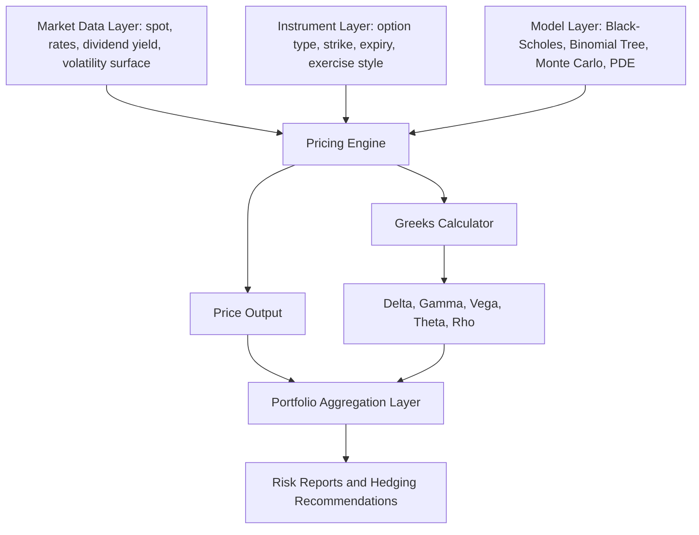

## Building an Option Pricing and Greeks Engine


### Overview and Objectives

A capstone option pricing and Greeks engine synthesizes derivatives pricing theory, numerical methods, and software architecture into a working system that can price vanilla and (optionally) exotic options, compute sensitivity measures (the Greeks), and support downstream applications like risk aggregation, hedging simulation, and portfolio-level exposure reporting. This capstone consolidates the theoretical building blocks covered elsewhere in the curriculum (Black-Scholes-Merton, binomial trees, Monte Carlo, PDE methods) into a single, extensible codebase.

**Key Points**

- The engine should separate **pricing models** (the mathematical/numerical methods), **instrument definitions** (contract specifications), and **market data** (spot, rates, volatility surfaces) into distinct, composable layers
- Greeks can be computed analytically (closed-form, where available), via finite-difference bumping, or via automatic differentiation — each with different accuracy/performance tradeoffs
- A production-quality engine handles edge cases (zero/negative time-to-expiry, deep in/out-of-the-money strikes, zero volatility) gracefully rather than raising numerical errors
- Validation against known closed-form benchmarks (Black-Scholes for European options) is essential before trusting numerical methods (binomial, Monte Carlo) on instruments without closed-form solutions

### Core Architecture



### Layer 1: Instrument Definition

A clean instrument abstraction should capture the contractual terms independent of any pricing model:

**Key Points**

- Option type (call/put), strike price, time to expiry (or explicit expiry date with a day-count convention), exercise style (European, American, Bermudan)
- For exotics: barrier levels and type (up/down, in/out), averaging conventions (Asian options), lookback conventions
- Underlying reference: single equity, index, FX pair, commodity future — each may imply different carry/dividend conventions relevant to pricing

**Example**

```python
from dataclasses import dataclass
from enum import Enum
from datetime import date

class OptionType(Enum):
    CALL = "call"
    PUT = "put"

class ExerciseStyle(Enum):
    EUROPEAN = "european"
    AMERICAN = "american"

@dataclass
class VanillaOption:
    option_type: OptionType
    strike: float
    expiry: date
    exercise_style: ExerciseStyle
    underlying_symbol: str
```

### Layer 2: Market Data

**Key Points**

- Spot price, risk-free rate (typically a term structure, not a flat rate, for accuracy across expiries), continuous dividend yield (or discrete dividend schedule for single-name equities), and implied or model volatility (flat, term-structure, or full smile/surface)
- For a capstone-level engine, a simple flat volatility input is a reasonable starting point; extending to a volatility surface (strike x expiry grid, with interpolation) is a natural enhancement
- Time-to-expiry should be computed using a consistent day-count convention (Actual/365, Actual/360, or business-day count) — inconsistent day-count handling is a common source of small but confusing pricing discrepancies

$$T = \frac{\text{Expiry Date} - \text{Valuation Date}}{365}$$

### Layer 3: The Black-Scholes-Merton Pricing Model

For European vanilla options, the closed-form Black-Scholes-Merton formula provides the baseline implementation and validation benchmark for all other numerical methods.

**Call option price:**

$$C = S_0 e^{-qT}N(d_1) - Ke^{-rT}N(d_2)$$

**Put option price:**

$$P = Ke^{-rT}N(-d_2) - S_0 e^{-qT}N(-d_1)$$

where:

$$d_1 = \frac{\ln(S_0/K) + (r - q + \sigma^2/2)T}{\sigma\sqrt{T}}, \quad d_2 = d_1 - \sigma\sqrt{T}$$

with $S_0$ the spot price, $K$ the strike, $r$ the risk-free rate, $q$ the continuous dividend yield, $\sigma$ the volatility, $T$ the time to expiry, and $N(\cdot)$ the standard normal CDF.

**Example**

```python
import numpy as np
from scipy.stats import norm

def black_scholes_price(S, K, T, r, q, sigma, option_type="call"):
    if T <= 0:
        # Handle expiry: return intrinsic value
        if option_type == "call":
            return max(S - K, 0.0)
        else:
            return max(K - S, 0.0)

    d1 = (np.log(S / K) + (r - q + 0.5 * sigma ** 2) * T) / (sigma * np.sqrt(T))
    d2 = d1 - sigma * np.sqrt(T)

    if option_type == "call":
        price = S * np.exp(-q * T) * norm.cdf(d1) - K * np.exp(-r * T) * norm.cdf(d2)
    else:
        price = K * np.exp(-r * T) * norm.cdf(-d2) - S * np.exp(-q * T) * norm.cdf(-d1)

    return price
```

### Layer 4: Computing the Greeks

**Analytical (closed-form) Greeks for European options:**

| Greek | Formula (Call) | Formula (Put) | Interpretation |
| --- | --- | --- | --- |
| Delta ($\Delta$) | $e^{-qT}N(d_1)$ | $e^{-qT}(N(d_1)-1)$ | Price sensitivity to $1 change in spot |
| Gamma ($\Gamma$) | $\frac{e^{-qT}N'(d_1)}{S_0\sigma\sqrt{T}}$ | Same as call | Rate of change of Delta w.r.t. spot |
| Vega ($\nu$) | $S_0 e^{-qT}N'(d_1)\sqrt{T}$ | Same as call | Sensitivity to 1% change in volatility |
| Theta ($\Theta$) | $-\frac{S_0 N'(d_1)\sigma e^{-qT}}{2\sqrt{T}} - rKe^{-rT}N(d_2) + qS_0e^{-qT}N(d_1)$ | Analogous put form | Time decay per day/year |
| Rho ($\rho$) | $KTe^{-rT}N(d_2)$ | $-KTe^{-rT}N(-d_2)$ | Sensitivity to 1% change in rates |

where $N'(\cdot)$ is the standard normal PDF.

**Example**

```python
def black_scholes_greeks(S, K, T, r, q, sigma, option_type="call"):
    d1 = (np.log(S / K) + (r - q + 0.5 * sigma ** 2) * T) / (sigma * np.sqrt(T))
    d2 = d1 - sigma * np.sqrt(T)

    pdf_d1 = norm.pdf(d1)
    disc_q = np.exp(-q * T)
    disc_r = np.exp(-r * T)

    gamma = disc_q * pdf_d1 / (S * sigma * np.sqrt(T))
    vega = S * disc_q * pdf_d1 * np.sqrt(T) / 100  # per 1% vol move

    if option_type == "call":
        delta = disc_q * norm.cdf(d1)
        theta = (-S * pdf_d1 * sigma * disc_q / (2 * np.sqrt(T))
                 - r * K * disc_r * norm.cdf(d2)
                 + q * S * disc_q * norm.cdf(d1)) / 365  # per day
        rho = K * T * disc_r * norm.cdf(d2) / 100  # per 1% rate move
    else:
        delta = disc_q * (norm.cdf(d1) - 1)
        theta = (-S * pdf_d1 * sigma * disc_q / (2 * np.sqrt(T))
                 + r * K * disc_r * norm.cdf(-d2)
                 - q * S * disc_q * norm.cdf(-d1)) / 365
        rho = -K * T * disc_r * norm.cdf(-d2) / 100

    return {"delta": delta, "gamma": gamma, "vega": vega, "theta": theta, "rho": rho}
```

**Numerical (finite-difference) Greeks — essential for American options and exotics without closed forms:**

$$\Delta \approx \frac{V(S+h) - V(S-h)}{2h}, \quad \Gamma \approx \frac{V(S+h) - 2V(S) + V(S-h)}{h^2}$$

**Key Points**

- Central differences (bumping both up and down) are generally more accurate than one-sided (forward-only) differences for a given step size $h$
- The bump size $h$ involves a tradeoff: too large introduces approximation error from curvature (especially for Gamma); too small introduces floating-point numerical noise — a common starting heuristic is $h \approx 0.01 \times S_0$ for spot-based Greeks, tuned empirically
- Finite-difference Greeks require re-running the full pricer 2-3 times per Greek (more for cross-Greeks), which can become a computational bottleneck for Monte Carlo-priced exotics with large numbers of paths — this motivates more advanced techniques (pathwise derivatives, likelihood ratio method, adjoint/automatic differentiation) in production systems

### Layer 5: Numerical Methods for American and Exotic Options

**Binomial tree (Cox-Ross-Rubinstein) for American options:**

$$u = e^{\sigma\sqrt{\Delta t}}, \quad d = 1/u, \quad p = \frac{e^{(r-q)\Delta t} - d}{u - d}$$

At each node, working backward from expiry, the American option value is the greater of the discounted continuation value or the immediate exercise (intrinsic) value:

$$V_i = \max\left(\text{Intrinsic Value}_i,\ e^{-r\Delta t}[pV_{i+1,u} + (1-p)V_{i+1,d}]\right)$$

**Key Points**

- The binomial method naturally handles early exercise by checking, at every node, whether immediate exercise dominates holding the option
- Convergence to the Black-Scholes price as the number of steps increases (for European options) is a standard validation check for a binomial implementation
- Monte Carlo simulation is preferred for path-dependent exotics (Asian, barrier, lookback options) but requires care for American-style early exercise, typically via the Longstaff-Schwartz least-squares regression method to estimate continuation values

### Validation and Testing Framework

**Key Points**

- **Put-call parity check**: for European options, $C - P = S_0e^{-qT} - Ke^{-rT}$ should hold exactly (to numerical precision) — a fast, essential sanity check on any new pricer implementation
- **Convergence testing**: binomial and Monte Carlo prices for European options should converge to the Black-Scholes closed-form price as steps/paths increase — plot price versus number of steps/paths to visually confirm convergence and estimate convergence rate
- **Boundary condition checks**: deep ITM call should approach $S_0e^{-qT} - Ke^{-rT}$ (behaves like the forward); deep OTM options should approach zero; at $T=0$, price should equal exact intrinsic value
- **Greek consistency checks**: Delta should be bounded in $[0,1]$ for calls and $[-1,0]$ for puts (European); Gamma should be positive for long vanilla options; numerically bumped Greeks should closely match analytical Greeks where both are available

**Example**

```python
def test_put_call_parity(S, K, T, r, q, sigma, tol=1e-6):
    call = black_scholes_price(S, K, T, r, q, sigma, "call")
    put = black_scholes_price(S, K, T, r, q, sigma, "put")
    lhs = call - put
    rhs = S * np.exp(-q * T) - K * np.exp(-r * T)
    assert abs(lhs - rhs) < tol, f"Put-call parity violated: {lhs} vs {rhs}"
```

### Portfolio-Level Aggregation

**Key Points**

- A capstone engine should extend from single-option pricing to portfolio-level Greek aggregation: summing Delta, Gamma, Vega, Theta, Rho across all positions (weighted by position size/quantity) to produce net portfolio risk exposures
- Aggregation should account for sign conventions correctly (short positions contribute negative Greeks relative to a long position of the same option) and should be bucketed where relevant (e.g., Vega by expiry tenor, Delta by underlying) for realistic risk reporting rather than a single blended number
- A natural capstone extension is a simple **hedging simulator**: given a portfolio's net Delta, compute the quantity of underlying (or a liquid hedging instrument like a futures contract) needed to Delta-hedge, and simulate the P&L of a periodically rebalanced Delta-hedge over a historical or simulated price path — illustrating the practical mechanics and residual risk (Gamma/Theta bleed) of dynamic hedging

$$\text{Hedge Quantity} = -\sum_i (\text{Position}_i \times \Delta_i)$$

### Suggested Engineering Practices

**Key Points**

- **Separate pure pricing math from I/O and orchestration**: pricing functions should be pure (same inputs always produce same outputs, no hidden state), making them easy to unit test and to later wrap in a web service, batch job, or notebook interface
- **Vectorize where possible**: using NumPy array operations rather than Python loops for pricing a book of options simultaneously (e.g., a full options chain) yields substantial performance improvement and is standard practice in production pricing libraries
- **Version and log market data inputs used for each valuation**: for auditability, a risk/pricing engine should record which volatility surface, rate curve, and spot snapshot were used to generate a given valuation — critical for reconciling P&L attribution and explaining valuation changes day-over-day
- **Consider implied volatility inversion as a companion feature**: given a market-observed option price, use a root-finding method (Newton-Raphson using Vega as the derivative, or Brent's method as a robust fallback) to back out implied volatility — a natural and highly practical extension that connects the pricing engine to real market quotes

**Example**

```python
from scipy.optimize import brentq

def implied_volatility(market_price, S, K, T, r, q, option_type="call"):
    def objective(sigma):
        return black_scholes_price(S, K, T, r, q, sigma, option_type) - market_price
    return brentq(objective, 1e-6, 5.0)
```

### Suggested Capstone Deliverable Scope

**Key Points**

- **Minimum viable scope**: Black-Scholes pricer and analytical Greeks for European calls/puts, with a validated test suite (put-call parity, boundary conditions)
- **Intermediate scope**: add binomial tree pricing for American options, finite-difference Greeks, and implied volatility inversion
- **Advanced scope**: add Monte Carlo pricing for path-dependent exotics (Asian, barrier options), Longstaff-Schwartz for American Monte Carlo, a simple volatility surface with interpolation, and portfolio-level Greek aggregation with a Delta-hedging P&L simulator
- Documenting known limitations (e.g., flat volatility assumption, no dividend discreteness, European-only exotic pricing) is itself good practice and demonstrates risk-aware engineering judgment appropriate for a capstone-level submission

### Related Topics

- Black-Scholes-Merton Model: Assumptions and Derivation
- The Greeks: Delta, Gamma, Vega, Theta, Rho in Depth
- Binomial and Trinomial Tree Methods for American Options
- Monte Carlo Methods for Exotic Option Pricing
- Longstaff-Schwartz Method for American Monte Carlo
- Volatility Surfaces: Construction and Interpolation
- Delta-Hedging Simulation and P&L Attribution
- Implied Volatility and the Volatility Smile