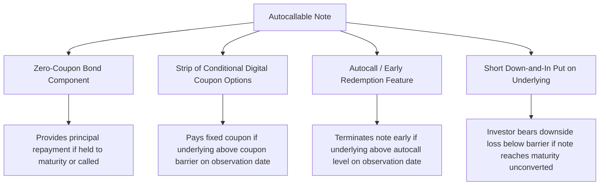

## Structuring and Pricing an Autocallable Note End to End


### Overview and Objectives

This capstone consolidates structured product design, exotic option pricing, and risk management into a complete workflow: designing an autocallable note's term sheet, decomposing it into its constituent derivative components, pricing it via Monte Carlo simulation, computing its Greeks, and analyzing its risk profile from both the issuer's and investor's perspectives. Autocallables are among the most widely issued retail and institutional structured products globally, making this an especially practical synthesis exercise.

**Key Points**

- An autocallable note combines a zero-coupon bond, a series of conditional coupon (digital/binary) options, an automatic early-redemption (autocall) feature, and a downside barrier — typically a knock-in put — into a single structured payoff
- Because the autocall feature makes the note's maturity itself path-dependent and random, autocallables cannot generally be priced with closed-form formulas and require Monte Carlo simulation (or PDE methods for simpler variants)
- The product is attractive to yield-seeking investors in range-bound or moderately bullish markets, offering enhanced coupons in exchange for downside equity risk and early-call reinvestment risk
- A full capstone treatment should cover term sheet design, payoff decomposition, simulation-based pricing, Greeks computation, and risk disclosure — mirroring the actual workflow of a structuring desk

### Term Sheet Design

**Example**

A representative autocallable note term sheet:

- **Underlying**: a single stock or index (e.g., a broad equity index)
- **Tenor**: 3 years, with quarterly observation dates
- **Autocall trigger**: if, on any observation date, the underlying closes at or above 100% of its initial level, the note is automatically redeemed early, paying principal plus all coupons accrued to date
- **Conditional coupon**: a fixed coupon (e.g., 8% per annum, paid quarterly) is paid on each observation date **only if** the underlying closes at or above a coupon barrier (e.g., 70% of initial level) on that date; otherwise, that period's coupon is skipped (in a "non-memory" structure) or accrued and paid later if a future observation clears the barrier (in a "memory" or "snowball" structure)
- **Downside barrier (knock-in)**: if the note has not autocalled and, at final maturity, the underlying closes below a downside barrier (e.g., 60% of initial level), the investor's principal is reduced 1-for-1 with the underlying's decline from its initial level, exposing the investor to the full downside below that barrier as if they held the stock directly

### Payoff Decomposition

**Key Points**

- An autocallable is not a single derivative but a bundle of components, each of which can (in principle) be priced somewhat independently before being combined, though the path-dependency of the autocall feature means true independence does not fully hold and full simulation is needed for accurate pricing
- **Component 1 — Zero-coupon bond**: provides the principal repayment at maturity (or at early call), discounted at the appropriate credit-adjusted rate (reflecting the issuer's own credit risk, since structured notes are unsecured obligations of the issuing bank)
- **Component 2 — Series of digital/binary call options**: the conditional coupons are economically equivalent to a strip of digital options paying a fixed amount if the underlying is above the coupon barrier on each observation date
- **Component 3 — Autocall feature**: economically similar to a series of up-and-out barrier provisions applied to the note's own existence — each observation date represents a chance the note "knocks out" (early redeems) if the underlying is at or above the autocall level
- **Component 4 — Short downside put (knock-in put)**: the investor is implicitly short a down-and-in put option on the underlying, struck at the initial level, activated only if the barrier is breached at maturity — this is the source of the investor's principal-at-risk exposure



### Why Monte Carlo Simulation Is Required

**Key Points**

- The note's payoff depends on the **entire path** of the underlying at each of several discrete observation dates, not merely its terminal value — path dependency of this kind generally precludes closed-form solutions except in simplified special cases
- The autocall feature means the note's effective maturity is itself a random variable (it could terminate at observation date 1, 2, 3, or run to full maturity), which must be simulated rather than assumed fixed
- Monte Carlo naturally accommodates this: simulate many paths of the underlying's price process, apply the autocall and coupon logic sequentially along each path, record the payoff and its timing for each path, discount each path's payoff back to present value, and average across all paths

### Monte Carlo Pricing Implementation

**Simulating the underlying under geometric Brownian motion (risk-neutral measure):**

$$S_{t+\Delta t} = S_t \exp\left[\left(r - q - \frac{\sigma^2}{2}\right)\Delta t + \sigma\sqrt{\Delta t}\, Z\right], \quad Z \sim N(0,1)$$

**Example**

```python
import numpy as np

def simulate_paths(S0, r, q, sigma, T, n_steps, n_paths, seed=42):
    rng = np.random.default_rng(seed)
    dt = T / n_steps
    Z = rng.standard_normal((n_paths, n_steps))
    log_returns = (r - q - 0.5 * sigma**2) * dt + sigma * np.sqrt(dt) * Z
    log_paths = np.cumsum(log_returns, axis=1)
    paths = S0 * np.exp(log_paths)
    paths = np.hstack([np.full((n_paths, 1), S0), paths])  # prepend S0
    return paths

def price_autocallable(S0, r, q, sigma, T, n_obs, n_paths,
                        autocall_level, coupon_barrier, downside_barrier,
                        coupon_rate, face_value=100.0, credit_spread=0.0):
    obs_per_year = n_obs / T
    dt_obs = T / n_obs
    paths = simulate_paths(S0, r, q, sigma, T, n_obs, n_paths)

    discount_rate = r + credit_spread  # issuer credit-adjusted discounting
    payoffs_pv = np.zeros(n_paths)

    for path_idx in range(n_paths):
        called = False
        accrued_coupon = 0.0
        for obs_idx in range(1, n_obs + 1):
            level = paths[path_idx, obs_idx] / S0
            t_obs = obs_idx * dt_obs

            # Conditional coupon check
            if level >= coupon_barrier:
                accrued_coupon += coupon_rate * face_value * dt_obs

            # Autocall check
            if level >= autocall_level:
                payoff = face_value + accrued_coupon
                payoffs_pv[path_idx] = payoff * np.exp(-discount_rate * t_obs)
                called = True
                break

        if not called:
            final_level = paths[path_idx, -1] / S0
            if final_level >= downside_barrier:
                principal = face_value
            else:
                principal = face_value * final_level  # capital at risk below barrier
            payoff = principal + accrued_coupon
            payoffs_pv[path_idx] = payoff * np.exp(-discount_rate * T)

    price = np.mean(payoffs_pv)
    std_error = np.std(payoffs_pv) / np.sqrt(n_paths)
    return price, std_error
```

**Key Points**

- Discounting should use a rate that reflects the issuing bank's own credit risk (since the note is an unsecured obligation of the issuer), not the risk-free rate alone — this is why the implementation above separates a `credit_spread` input
- The standard error of the Monte Carlo estimate should always be reported alongside the price; a sufficiently large number of paths (commonly 50,000-1,000,000+ depending on required precision and available compute) is needed to bring the standard error to an acceptable level for pricing/risk purposes
- Variance reduction techniques (antithetic variates, control variates) are standard practice to improve convergence speed without proportionally increasing path count, and are a natural capstone extension

### Computing the Greeks via Finite Differences

Because autocallables lack closed-form solutions, Greeks are computed by re-running the Monte Carlo pricer with bumped inputs and taking finite differences — critically, using the **same random seed** across bumped and base-case runs to isolate the effect of the bump from simulation noise.

**Example**

```python
def compute_delta(S0, bump_pct=0.01, **kwargs):
    h = S0 * bump_pct
    price_up, _ = price_autocallable(S0 + h, **kwargs)
    price_down, _ = price_autocallable(S0 - h, **kwargs)
    return (price_up - price_down) / (2 * h)

def compute_vega(sigma, bump=0.01, **kwargs):
    price_up, _ = price_autocallable(sigma=sigma + bump, **kwargs)
    price_down, _ = price_autocallable(sigma=sigma - bump, **kwargs)
    return (price_up - price_down) / (2 * bump) / 100  # per 1 vol point
```

**Key Points**

- **Using a fixed random seed** across bumped scenarios is essential — without it, the difference between "up" and "down" price estimates would be contaminated by independent Monte Carlo sampling noise rather than reflecting the true sensitivity, potentially producing a nonsensical or highly unstable Greek estimate
- Autocallable Greeks exhibit characteristic, non-intuitive behavior around barrier levels: **Delta and Gamma can be highly discontinuous or spike sharply near the autocall and coupon barrier levels**, especially close to observation dates, because a small move in the underlying can determine whether the note is called (and stops existing) or continues — this "pin risk" near barriers is a defining risk management challenge for autocallable trading desks
- **Vega is often negative for the issuer's hedge book perspective** in certain regimes, since higher volatility increases the probability of breaching the downside barrier (bad for the investor, meaning the issuer who is short this risk to the investor benefits) while also affecting autocall probability — the net Vega sign and magnitude depends on the specific barrier levels and current spot level relative to them, and should always be computed rather than assumed

### Issuer Hedging Perspective

**Key Points**

- The issuing bank is economically short the payoff structure sold to the investor (having received the note's issue proceeds) and must dynamically hedge its resulting risk exposure, typically using the underlying stock/index, listed options, and OTC variance/volatility instruments
- Near coupon and autocall observation dates, the issuer's hedge book can require rapid, large rebalancing as the underlying approaches a barrier level — since a small price move can flip the note from "likely called" to "likely continuing," producing a large jump in the note's Delta that the hedge desk must trade around
- This barrier-proximity hedging challenge is analogous in spirit to the gamma/pin risk options traders face near a strike close to expiry, but is generally more pronounced in autocallables because the discontinuity relates to the note's very existence (early termination), not merely its intrinsic value
- A realistic capstone extension is a **hedge simulation**: simulate the issuer's Delta-hedging P&L along many realized paths, comparing hedge slippage/transaction costs against the premium (structuring margin) built into the note's initial pricing, to assess whether the structuring margin adequately compensates for realistic hedging costs and residual risk

### Risk Profile Summary from the Investor's Perspective

**Key Points**

- **Upside is capped**: unlike direct equity ownership, the investor's maximum return is limited to the sum of coupons received — there is no participation in unlimited upside beyond the fixed coupon, even if the underlying rallies sharply
- **Reinvestment risk from early autocall**: if the note is called early (a likely outcome if the underlying performs well), the investor must reinvest the returned principal at then-prevailing market rates/conditions, which may be less favorable
- **Full downside participation below the barrier**: if the note reaches maturity without autocalling and the underlying has fallen below the downside barrier, the investor's losses can be substantial — economically similar to owning the stock outright from that point, despite having received some coupon income along the way
- **Issuer credit risk**: since the note is an unsecured obligation of the issuing bank, investors bear the issuer's credit risk in addition to the underlying's market risk — a risk that is sometimes underappreciated by retail investors relative to the equity market risk that is more prominently disclosed

### Suggested Capstone Deliverable Scope

**Key Points**

- **Minimum viable scope**: term sheet design, payoff decomposition narrative, Monte Carlo pricer for a single-underlying autocallable with quarterly observations, and validated convergence testing (price stabilizes as path count increases)
- **Intermediate scope**: add finite-difference Greeks with fixed-seed bumping, sensitivity analysis showing Delta/Gamma behavior near barrier levels, and a scenario/stress-test table (price under various spot, vol, and rate shocks)
- **Advanced scope**: add variance reduction techniques, a multi-asset (worst-of) autocallable variant, issuer credit spread sensitivity, and a Delta-hedging P&L simulation comparing structuring margin to realized hedging costs across many simulated market paths
- As with the option pricing engine capstone, explicitly documenting model assumptions and limitations (flat volatility, no smile/skew modeling, single risk-free discount curve, no jump risk) demonstrates the risk-aware judgment expected of a capstone-level submission, and mirrors genuine structuring-desk practice of clearly documenting model scope for internal risk sign-off

### Related Topics

- Building an Option Pricing and Greeks Engine
- Monte Carlo Methods for Exotic Option Pricing
- Barrier Options: Knock-In, Knock-Out, and Pricing Approaches
- Structured Notes: Inverse Floaters, Range Accruals, and Embedded Optionality
- Digital/Binary Options and Discontinuous Payoff Risk
- Issuer Credit Risk in Structured Products
- Variance Reduction Techniques in Monte Carlo Simulation
- Delta-Hedging Simulation and P&L Attribution