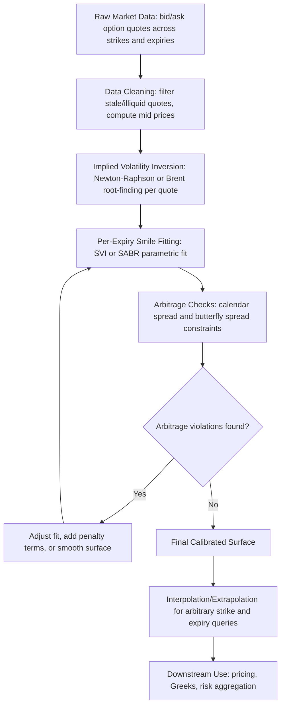

## Calibrating a Volatility Surface to Market Data


### Overview and Objectives

This capstone consolidates option pricing theory, numerical optimization, and market microstructure understanding into a complete volatility surface calibration workflow: collecting market option quotes, inverting them to implied volatilities, fitting a parametric or non-parametric model across strikes and expiries, and validating the resulting surface for use in downstream pricing and risk applications. Volatility surface calibration is a foundational capability underlying nearly all derivatives pricing and risk infrastructure at trading desks and risk management functions.

**Key Points**

- A volatility surface maps implied volatility as a function of both strike (or moneyness) and time to expiry, capturing the well-documented empirical deviation from the flat-volatility assumption of the basic Black-Scholes model
- Calibration proceeds in stages: data collection and cleaning, implied volatility inversion from observed option prices, per-expiry smile fitting (parametric or interpolation-based), and cross-expiry (term structure) consistency and arbitrage-free checks
- No-arbitrage conditions (calendar spread and butterfly spread constraints) must be enforced or checked, since a surface that violates them implies negative probability densities or exploitable arbitrage
- The choice of parametric model (SVI, SABR, or local volatility) involves tradeoffs between fitting flexibility, parameter stability across time, computational cost, and ease of enforcing no-arbitrage conditions

### Why Volatility Surfaces Exist (The Smile/Skew Phenomenon)

**Key Points**

- The Black-Scholes model assumes constant volatility across all strikes and expiries, but market-observed option prices imply materially different volatilities depending on strike (the "smile" or "skew") and expiry (the "term structure")
- **Equity index options** typically exhibit a pronounced downward **skew**: out-of-the-money puts trade at higher implied volatility than at-the-money options, which trade higher than out-of-the-money calls — commonly attributed to leverage effects (falling prices increase a firm's effective leverage, raising equity volatility) and persistent demand for downside protection (crash insurance) following the 1987 crash
- **FX options** more commonly exhibit a "smile" shape (elevated implied volatility at both far OTM puts and calls relative to ATM), reflecting fat-tailed exchange rate movements in both directions
- The term structure of implied volatility (how ATM volatility varies with expiry) reflects market expectations about near-term versus longer-term realized volatility, often showing elevated short-dated volatility around known event risk (earnings, central bank meetings) that decays into a smoother longer-dated structure

### The Calibration Pipeline



### Step 1: Data Collection and Cleaning

**Key Points**

- Raw option chain data typically includes bid, ask, last trade price, volume, and open interest across a grid of strikes and expiries; using the **mid price** (average of bid and ask) is standard practice for calibration, since last-trade prices can be stale
- Illiquid quotes (very wide bid-ask spreads, zero volume/open interest, deep in-the-money or far out-of-the-money strikes with minimal trading interest) should generally be filtered out or down-weighted, since their prices are less informative and more prone to stale-quote noise
- Basic sanity filters: option prices must be non-negative, calls must be worth at least their intrinsic value, and bid must not exceed ask — violations typically indicate data quality issues rather than genuine arbitrage and should be excluded rather than fit

### Step 2: Implied Volatility Inversion

Given an observed market price for an option, implied volatility is the value of $\sigma$ that, when input into the Black-Scholes formula, reproduces that observed price:

$$\sigma_{implied} : C_{BS}(S, K, T, r, q, \sigma_{implied}) = C_{market}$$

**Example**

```python
import numpy as np
from scipy.stats import norm
from scipy.optimize import brentq

def bs_price(S, K, T, r, q, sigma, option_type="call"):
    if sigma <= 0 or T <= 0:
        return max(S - K, 0.0) if option_type == "call" else max(K - S, 0.0)
    d1 = (np.log(S / K) + (r - q + 0.5 * sigma**2) * T) / (sigma * np.sqrt(T))
    d2 = d1 - sigma * np.sqrt(T)
    if option_type == "call":
        return S * np.exp(-q * T) * norm.cdf(d1) - K * np.exp(-r * T) * norm.cdf(d2)
    else:
        return K * np.exp(-r * T) * norm.cdf(-d2) - S * np.exp(-q * T) * norm.cdf(-d1)

def implied_vol(market_price, S, K, T, r, q, option_type="call"):
    def objective(sigma):
        return bs_price(S, K, T, r, q, sigma, option_type) - market_price
    try:
        return brentq(objective, 1e-6, 5.0, xtol=1e-8)
    except ValueError:
        return np.nan  # no solution in bracket — likely a data/arbitrage issue
```

**Key Points**

- Brent's method (bisection-based, guaranteed convergence within a bracket) is generally more robust than Newton-Raphson for this task, since Newton-Raphson can diverge for poor initial guesses or when Vega is very small (deep ITM/OTM options), whereas Brent's method only requires that a root exists within the specified bracket
- Options priced below intrinsic value or above their theoretical maximum have no valid implied volatility solution — these cases should be flagged and excluded rather than silently producing nonsensical results
- For American-style options, implied volatility inversion requires a pricer that itself accounts for early exercise (e.g., a binomial tree), not the European Black-Scholes formula — using the European formula on American option prices introduces a systematic bias, particularly for puts and dividend-paying underlyings

### Step 3: Per-Expiry Smile Fitting — SVI Parameterization

The Stochastic Volatility Inspired (SVI) parameterization, introduced by Jim Gatheral, is a widely used industry-standard functional form for fitting the volatility smile at a single expiry, expressed in terms of total implied variance as a function of log-moneyness:

$$w(k) = a + b\left(\rho(k-m) + \sqrt{(k-m)^2 + \sigma^2}\right)$$

where $w(k) = \sigma_{BS}^2(k) \cdot T$ is total implied variance, $k = \ln(K/F)$ is log-moneyness (strike relative to the forward), and $a, b, \rho, m, \sigma$ are the five SVI parameters controlling overall variance level, the angle between the put and call wings, rotation/skew, the smile's horizontal translation, and the smile's curvature/width, respectively.

**Key Points**

- SVI is popular because it is simple (five parameters per expiry slice), fits observed equity index smiles well in practice, and admits relatively straightforward conditions for avoiding butterfly arbitrage (non-negative implied density) within a single slice
- Calibration proceeds by minimizing the sum of squared errors (or a weighted version, weighting more liquid strikes more heavily) between the SVI-implied total variance and market-observed total variance across strikes for a given expiry, typically via a numerical optimizer (e.g., Levenberg-Marquardt or a general-purpose nonlinear least squares solver)
- Good initial parameter guesses and reasonable bounds materially affect optimizer convergence and stability — poorly initialized SVI fits can converge to parameter sets that fit the data reasonably well in-sample but produce poor extrapolation behavior or near-arbitrage in the wings

**Example**

```python
from scipy.optimize import least_squares

def svi_total_variance(k, a, b, rho, m, sigma):
    return a + b * (rho * (k - m) + np.sqrt((k - m)**2 + sigma**2))

def svi_calibration_residuals(params, k_values, market_total_var, weights):
    a, b, rho, m, sigma = params
    model_var = svi_total_variance(k_values, a, b, rho, m, sigma)
    return weights * (model_var - market_total_var)

def calibrate_svi_slice(k_values, market_total_var, weights, initial_guess):
    bounds_lower = [-np.inf, 0, -1, -np.inf, 1e-6]
    bounds_upper = [np.inf, np.inf, 1, np.inf, np.inf]
    result = least_squares(
        svi_calibration_residuals, initial_guess,
        args=(k_values, market_total_var, weights),
        bounds=(bounds_lower, bounds_upper)
    )
    return result.x  # calibrated a, b, rho, m, sigma
```

### Alternative: SABR Model

**Key Points**

- The SABR (Stochastic Alpha Beta Rho) model is another widely used industry-standard smile parameterization, particularly common in interest rate derivatives markets, defined by a stochastic volatility process with parameters $\alpha$ (initial volatility level), $\beta$ (backbone/elasticity, often fixed at 0, 0.5, or 1 by convention), $\rho$ (correlation between the underlying and its volatility), and $\nu$ (volatility of volatility)
- SABR provides a well-known closed-form (Hagan et al.) approximation for implied volatility as a function of strike, avoiding the need for full stochastic volatility Monte Carlo simulation for calibration purposes, though the approximation degrades in extreme strike or volatility-of-volatility regimes
- SABR's parameters have more direct, intuitive interpretation tied to an underlying stochastic process (unlike SVI, which is a purely descriptive curve-fitting parameterization), which some practitioners prefer for parameter stability and interpretability across recalibrations, though this comes at some cost in flexibility for fitting unusual smile shapes

### Step 4: Enforcing No-Arbitrage Conditions

**Key Points**

- **Calendar spread arbitrage**: total implied variance $w(k,T) = \sigma^2(k,T) \cdot T$ must be non-decreasing in $T$ at each fixed log-moneyness $k$ — if a longer-dated option's total variance is lower than a shorter-dated option's at the same strike, an arbitrage exists (a calendar spread could be constructed to lock in riskless profit)
- **Butterfly spread arbitrage (static arbitrage in strike)**: the implied risk-neutral probability density, derivable from the second derivative of the call price with respect to strike (Breeden-Litzenberger), must be non-negative everywhere — a violation implies the fitted smile produces negative probabilities, an internal inconsistency that also implies an arbitrage opportunity in a butterfly spread
- Both conditions should be checked numerically across a fine grid of strikes and expiries after fitting, not merely assumed to hold from the choice of parametric form — even well-chosen parametric forms like SVI can produce a slice-by-slice fit that violates calendar spread consistency across expiries unless jointly, rather than independently, calibrated

$$\frac{\partial w}{\partial T} \geq 0 \quad \text{(calendar spread condition)}$$


$$g(k) = \left(1 - \frac{k w'(k)}{2w(k)}\right)^2 - \frac{w'(k)^2}{4}\left(\frac{1}{w(k)} + \frac{1}{4}\right) + \frac{w''(k)}{2} \geq 0 \quad \text{(butterfly condition, Gatheral's } g\text{-function)}$$

### No-Arbitrage Conditions Diagram

**Volatility Surface Arbitrage Constraints (svg_diagram)**

<svg xmlns="http://www.w3.org/2000/svg" viewBox="0 0 850 420" font-family="Arial, sans-serif" font-size="13">
<text x="425" y="28" text-anchor="middle" font-size="17" font-weight="bold">Volatility Surface Arbitrage Constraints (svg_diagram)</text>

<text x="220" y="60" text-anchor="middle" font-weight="bold" font-size="14">Calendar Spread Condition</text>

<line x1="80" y1="350" x2="380" y2="350" stroke="#333" stroke-width="1.5" />

<line x1="80" y1="350" x2="80" y2="90" stroke="#333" stroke-width="1.5" />

<text x="230" y="380" text-anchor="middle" font-size="12">Expiry T</text>

<text x="40" y="220" text-anchor="middle" font-size="12" transform="rotate(-90 40 220)">Total Variance w(k,T)</text>

<path d="M 100 320 Q 180 260 260 190 Q 320 150 360 120" fill="none" stroke="#4a7a2b" stroke-width="3" />
<text x="300" y="140" text-anchor="middle" font-size="11" fill="#4a7a2b">Valid: monotone increasing</text>

<text x="640" y="60" text-anchor="middle" font-weight="bold" font-size="14">Butterfly Condition</text>

<line x1="500" y1="350" x2="800" y2="350" stroke="#333" stroke-width="1.5" />

<line x1="500" y1="350" x2="500" y2="90" stroke="#333" stroke-width="1.5" />

<text x="650" y="380" text-anchor="middle" font-size="12">Strike / Log-Moneyness k</text>

<text x="460" y="220" text-anchor="middle" font-size="12" transform="rotate(-90 460 220)">Implied Density</text>

<path d="M 520 340 Q 600 150 680 150 Q 760 150 780 340" fill="none" stroke="#4a7a2b" stroke-width="3" />
<text x="650" y="130" text-anchor="middle" font-size="11" fill="#4a7a2b">Valid: non-negative density</text>
<path d="M 520 340 Q 600 340 640 250 Q 660 200 680 250 Q 700 340 780 340" fill="none" stroke="#a94442" stroke-width="2" stroke-dasharray="4,3" />
<text x="650" y="395" text-anchor="middle" font-size="11" fill="#a94442">Invalid: density dips negative (illustrative)</text>
</svg>

### Step 5: Interpolation and Surface Construction

**Key Points**

- Once individual expiry slices are calibrated (via SVI, SABR, or another method), the full surface requires interpolation across expiries for any query point falling between calibrated tenors — linear interpolation in total variance (not directly in volatility) is standard practice, since it more naturally preserves the calendar spread no-arbitrage condition
- Extrapolation beyond the shortest and longest calibrated expiries, and beyond the most extreme calibrated strikes, requires care — naive extrapolation of parametric fits can produce unrealistic or arbitrage-violating behavior far from the fitted data region, so extrapolation rules (flat extrapolation, or bounded extension of the fitted curve) should be explicitly defined and tested
- For applications requiring especially smooth, arbitrage-consistent surfaces across the full strike-expiry grid (e.g., exotic option pricing sensitive to the full local volatility surface), a **local volatility** model (Dupire's formula, derived from the calibrated implied volatility surface) is often constructed as a downstream step, translating the (calibrated, arbitrage-checked) implied volatility surface into a local volatility function suitable for Monte Carlo or PDE-based exotic pricing

$$\sigma_{local}^2(K,T) = \frac{\frac{\partial C}{\partial T} + (r-q)K\frac{\partial C}{\partial K} + qC}{\frac{1}{2}K^2\frac{\partial^2 C}{\partial K^2}}$$

### Validation and Testing

**Key Points**

- **In-sample fit quality**: report root-mean-square error between fitted and market-observed implied volatilities (or prices) per expiry slice, flagging any expiry with unusually poor fit for manual review
- **Out-of-sample/holdout testing**: withhold a subset of liquid quotes from calibration and check the fitted surface's accuracy in reproducing them, as a check against overfitting, particularly relevant when comparing parametric (SVI/SABR) versus flexible non-parametric (spline) fitting approaches
- **Stability across recalibration**: compare calibrated parameters day-over-day; large, unexplained jumps in fitted parameters (absent a genuine market regime change) can indicate optimizer instability, poor initial guesses, or data quality issues in a given day's input rather than genuine market movement
- **Arbitrage-free confirmation**: run the calendar spread and butterfly spread checks described above across a fine grid spanning the full calibrated surface as a final validation gate before the surface is used for pricing or risk purposes

### Suggested Capstone Deliverable Scope

**Key Points**

- **Minimum viable scope**: implied volatility inversion from a snapshot of market option quotes, single-expiry SVI or cubic-spline smile fitting, and visualization of the fitted smile against market points
- **Intermediate scope**: extend to multiple expiries, add calendar spread and butterfly arbitrage checks across the full surface, and implement total-variance interpolation for arbitrary query points
- **Advanced scope**: implement both SVI and SABR fitting for comparison, add a Dupire local volatility construction from the calibrated surface, and build a day-over-day parameter stability tracking dashboard
- As with the other capstones in this chapter, explicitly documenting data quality filtering choices, interpolation/extrapolation rules, and known model limitations (e.g., single-underlying only, no smile dynamics/regime modeling) demonstrates the practical judgment expected in real quantitative structuring and risk roles

### Related Topics

- Building an Option Pricing and Greeks Engine
- Structuring and Pricing an Autocallable Note End to End
- The SVI and SABR Volatility Models
- Local Volatility and Dupire's Formula
- Implied Volatility and the Volatility Smile
- Breeden-Litzenberger and Risk-Neutral Density Extraction
- Stochastic Volatility Models (Heston and Beyond)
- Arbitrage-Free Interpolation Techniques for Derivatives Pricing