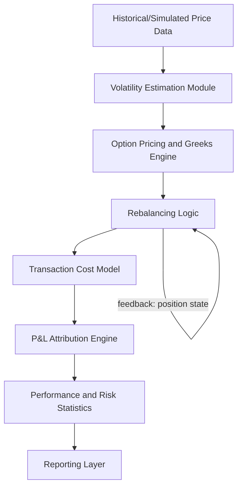

## Backtesting a Delta Hedging Strategy

### Overview

Backtesting a delta hedging strategy means simulating, on historical (or simulated) price paths, how a hedger who continuously or discretely rebalances a delta-neutral position would have performed. The goal is to quantify the P&L distribution, hedging error, and cost drag that arise from discrete rehedging, transaction costs, and model misspecification, relative to the theoretical frictionless Black-Scholes benchmark.

This is the canonical capstone exercise in derivatives coursework because it forces integration of option pricing theory, numerical methods, statistics, and software engineering into one coherent pipeline.

### Theoretical Foundation

**The Replication Argument**

Under Black-Scholes assumptions, an option can be replicated by continuously trading the underlying and a risk-free bond. The replicating portfolio holds $\Delta = \frac{\partial V}{\partial S}$ units of stock, financed by borrowing/lending. In continuous time with no frictions, this replication is exact and the hedging error is zero.

**Discrete-Time Hedging Error**

In practice, hedging occurs at discrete intervals $\Delta t$. The tracking error between the hedged portfolio and the option payoff arises primarily from the curvature (gamma) of the option's value with respect to the underlying:

$$\text{P\&L}_{\text{hedge}} \approx -\frac{1}{2}\Gamma S^2 \left(\frac{\Delta S}{S}\right)^2 - \sigma^2 \, dt$$

per rebalancing interval, summed over the life of the option. This is the discretized form of the classic result that hedging P&L is driven by the difference between realized variance and implied variance, weighted by dollar gamma.

**Key Points**

- If realized volatility < implied volatility used to compute delta, a covered (long option, delta-hedged) position tends to lose money; if realized > implied, it tends to gain.
- The variance of the hedging error scales roughly with $1/n$ for $n$ equally spaced rebalances (for a call/put under GBM), so hedging error shrinks like $O(1/\sqrt{n})$ in standard deviation.
- Discrete hedging error is *not* eliminated by hedging more frequently in the presence of transaction costs — there is an optimal rebalancing frequency trade-off.

### Backtest Architecture

A robust backtest decomposes into distinct modules:



### Step 1: Data Preparation

- **Underlying price series**: daily or intraday close (or synthetic GBM/jump-diffusion paths for controlled experiments).
- **Option contract specification**: strike $K$, maturity $T$, option type, and multiplier.
- **Volatility input**: choice between (a) realized/historical volatility (backward-looking), (b) a fixed implied volatility (as if quoted at inception), or (c) a rolling implied volatility surface if available.
- **Risk-free rate and dividend yield**: needed for both pricing and financing calculations.

**[Inference]** In many academic backtests, a constant implied volatility is used to isolate the pure hedging-error effect from volatility-surface dynamics; production-grade backtests typically use a time-varying implied vol series to better reflect real desk experience.

### Step 2: Greeks Computation

At each rebalancing date $t_i$, recompute:

$$\Delta_i = N(d_1), \quad d_1 = \frac{\ln(S_i/K) + (r - q + \sigma^2/2)(T - t_i)}{\sigma\sqrt{T - t_i}}$$

for a European call (analogous formulas for puts and other Greeks). For American or path-dependent options, use a numerical method (binomial tree, finite-difference PDE solver, or Longstaff-Schwartz for American features) to compute delta via finite differences:

$$\Delta_i \approx \frac{V(S_i + h) - V(S_i - h)}{2h}$$

**Key Points**

- Use a consistent, small bump $h$ (e.g., 0.1% of spot) to avoid numerical noise in finite-difference Greeks.
- Recompute delta with the *same* volatility assumption used for hedging (not the "true" simulation volatility if backtesting on synthetic data), otherwise the backtest silently assumes perfect volatility forecasting.

### Step 3: Rebalancing Logic

**Rebalancing triggers** — three common schemes:

1. **Time-based**: rebalance every fixed interval (daily, hourly).
2. **Move-based (band/threshold)**: rebalance only when $|\Delta_{\text{current}} - \Delta_{\text{held}}| > \delta_{\text{band}}$, or when spot moves beyond a percentage band.
3. **Gamma-scaled bands**: widen/narrow the no-trade band based on local gamma and transaction cost level (Whalley-Wilmott style asymptotic bands).

At each rebalance, the hedge position is adjusted:

$$\text{Shares traded}_i = \Delta_i - \Delta_{i-1}$$

Cash account is updated to reflect the cost of the trade plus accrued interest:

$$B_i = B_{i-1} e^{r \Delta t} - (\Delta_i - \Delta_{i-1}) S_i - \text{TransactionCost}_i$$

### Step 4: Transaction Cost Modeling

**Common cost specifications:**

- **Proportional (bid-ask spread)**: cost $= \kappa \cdot |\Delta_i - \Delta_{i-1}| \cdot S_i$
- **Fixed cost per trade**: flat commission regardless of size.
- **Market impact (square-root model)**: cost $\propto \sigma \sqrt{\text{trade size}/\text{ADV}}$ for large notional hedgers.

**[Inference]** The choice of cost model materially affects the optimal rebalancing frequency identified by the backtest; proportional cost models favor threshold-based rebalancing over fixed-interval rebalancing in most published studies.

### Step 5: P&L Attribution

Total hedged P&L at maturity:

$$\text{P\&L}_T = -\text{Payoff}(S_T) + V_0 + \sum_i \left[ \Delta_i (S_{i+1} - S_i) \right] + \text{Interest on cash} - \text{Cumulative Transaction Costs}$$

Decompose into standard Greeks-based attribution per interval:

$$\text{P\&L}_i \approx \Theta \, dt + \frac{1}{2}\Gamma \, dS^2 + \text{Vega} \, d\sigma + \text{Rho} \, dr + \text{residual}$$

The **residual** (unexplained P&L) is a critical diagnostic — a well-specified model and fine rebalancing should shrink the residual toward zero.

**Example**

For a 3-month at-the-money call, delta-hedged daily on a simulated GBM path with realized vol = implied vol = 20%:

- Theoretical Black-Scholes value at inception: computed via closed form.
- Simulated hedging P&L across 10,000 Monte Carlo paths should have a mean close to zero (unbiased) and a standard deviation that shrinks as rebalancing frequency increases from daily to hourly.

### Step 6: Performance and Risk Statistics

Once the P&L series (across time and/or across Monte Carlo paths) is generated, compute:

- **Mean and standard deviation of hedging P&L** (per trade and cumulative)
- **Sharpe ratio of the hedging error** (should be near zero if realized = implied vol)
- **Maximum drawdown** of the running P&L
- **Value-at-Risk (VaR) / Expected Shortfall (CVaR)** of the hedge slippage
- **Turnover** (total shares traded / average position size) — captures cost drag
- **Tracking error** = RMS of (hedged portfolio value − option value) over time

$$\text{Tracking Error} = \sqrt{\frac{1}{N}\sum_{i=1}^{N} \left(\Pi_i - V_i\right)^2}$$

### Step 7: Sensitivity and Robustness Analysis

**Key Points**

- **Rebalancing frequency sweep**: run the backtest at multiple frequencies (daily, every 2 days, weekly) to show the P&L variance decay and cost trade-off curve.
- **Volatility misspecification**: vary realized vs. hedging volatility to reproduce the "volatility P&L" relationship.
- **Transaction cost sensitivity**: sweep $\kappa$ to find the frequency that minimizes total risk-adjusted cost.
- **Regime robustness**: test across historical periods with different volatility regimes (e.g., calm vs. crisis periods) rather than a single Monte Carlo distribution.
- **Model risk**: repeat using a different pricing model for computing hedge ratios (e.g., local volatility vs. Black-Scholes) to assess sensitivity to model choice.

### Illustrative Diagram: Hedging P&L Variance vs. Rebalancing Frequency (svg_diagram)

<svg xmlns="http://www.w3.org/2000/svg" viewBox="0 0 640 400">
<text x="320" y="24" text-anchor="middle" font-size="16" font-family="sans-serif" font-weight="bold">Hedging P&amp;L Std. Dev. vs. Rebalancing Frequency (svg_diagram)</text>
<line x1="70" y1="340" x2="600" y2="340" stroke="black" stroke-width="1.5" />
<line x1="70" y1="340" x2="70" y2="50" stroke="black" stroke-width="1.5" />
<text x="335" y="375" text-anchor="middle" font-size="13" font-family="sans-serif">Rebalances per Option Life (n)</text>
<text x="25" y="195" text-anchor="middle" font-size="13" font-family="sans-serif" transform="rotate(-90 25,195)">Std. Dev. of Hedge P&amp;L</text>
<polyline points="90,70 150,140 220,190 300,230 400,260 500,285 580,300" fill="none" stroke="#2166ac" stroke-width="2.5" />
<polyline points="90,300 150,270 220,255 300,250 400,255 500,270 580,295" fill="none" stroke="#b2182b" stroke-width="2.5" stroke-dasharray="6,4" />
<circle cx="300" cy="240" r="5" fill="#333" />
<text x="310" y="235" font-size="12" font-family="sans-serif">Optimal n (min total risk)</text>
<text x="470" y="65" font-size="12" font-family="sans-serif" fill="#2166ac">Discretization error (falls with n)</text>
<text x="420" y="315" font-size="12" font-family="sans-serif" fill="#b2182b">Cumulative cost drag (rises with n)</text>
</svg>

### Pseudocode Skeleton

```plaintext
initialize S0, K, T, sigma_hedge, r, q, cost_model, rebalance_dates
V0 = black_scholes_price(S0, K, T, sigma_hedge, r, q)
delta_prev = black_scholes_delta(S0, K, T, sigma_hedge, r, q)
cash = V0 - delta_prev * S0

for t_i in rebalance_dates[1:]:
    S_i = get_price(t_i)
    tau = T - t_i
    delta_i = black_scholes_delta(S_i, K, tau, sigma_hedge, r, q) if tau > 0 else terminal_delta(S_i, K)
    trade_size = delta_i - delta_prev
    cost_i = transaction_cost(trade_size, S_i, cost_model)
    cash = cash * exp(r * dt) - trade_size * S_i - cost_i
    delta_prev = delta_i

portfolio_value_T = cash + delta_prev * S_T
payoff_T = max(S_T - K, 0)
hedging_pnl = portfolio_value_T - payoff_T
```

**[Unverified]** Exact numerical results (mean/variance of hedging P&L) depend on the random seed, path generator, and discretization scheme used; figures should always be regenerated rather than assumed from a textbook table.

### Extensions for a Capstone-Level Project

- **Multi-Greek hedging**: extend from delta-only to delta-gamma or delta-gamma-vega hedging using a second instrument (another option).
- **Stochastic volatility hedging**: backtest under Heston-simulated paths to study hedging error when the hedging model (Black-Scholes) is misspecified relative to the true data-generating process.
- **Jump risk**: introduce a jump-diffusion (Merton) data-generating process to show that delta hedging alone cannot manage jump risk, motivating the need for out-of-the-money option overlays.
- **Real market data**: replace simulated paths with actual historical underlying and option quotes, using realized implied vol at each date, to produce a genuine historical hedging P&L report for a chosen name and expiry.
- **Optimal hedging bands**: implement the Whalley-Wilmott asymptotic no-transaction region and compare its cost-risk trade-off against naive fixed-interval rebalancing.

**Next Steps / Related Topics**

- Greeks-Based Risk Management (Delta, Gamma, Vega, Theta)
- Discrete Hedging Error and the Gamma-Theta Trade-off
- Transaction Cost Models in Options Trading
- Local Volatility and Stochastic Volatility Models (Heston, SABR)
- Monte Carlo Simulation for Derivatives Pricing
- Whalley-Wilmott Optimal Hedging Bands
- Volatility Surface Construction and Implied vs. Realized Volatility
- American Option Pricing via Binomial Trees and Longstaff-Schwartz