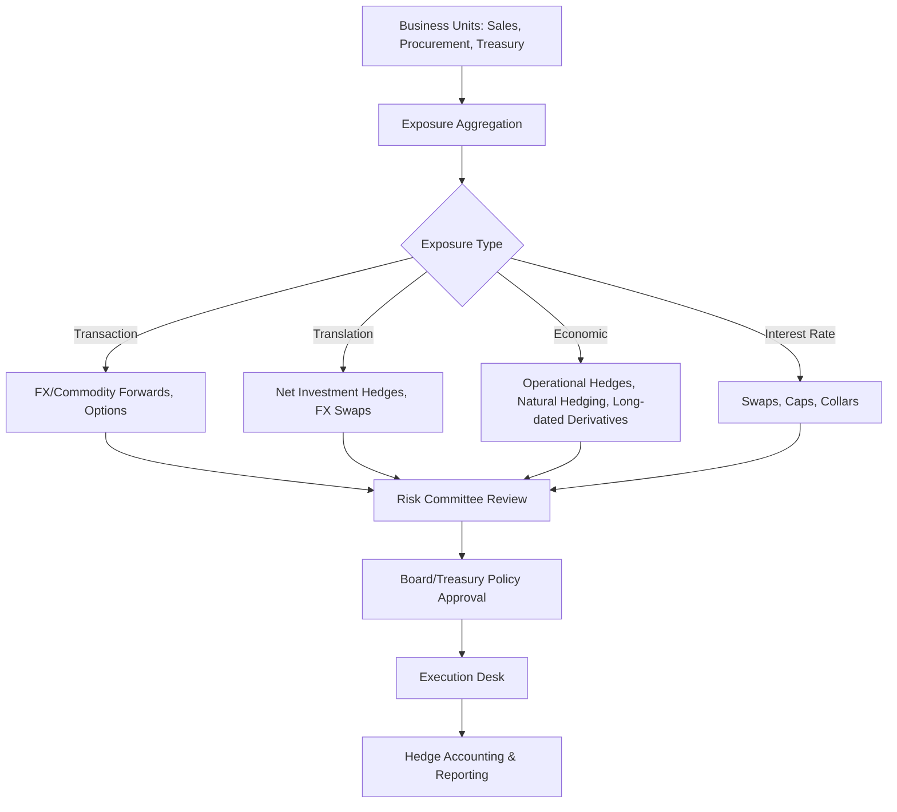

## Designing a Corporate Hedging Program

### Overview

A corporate hedging program is the institutional framework a non-financial company uses to identify, measure, and manage its exposure to financial risks — commodity prices, foreign exchange, interest rates, and sometimes equity or credit — using derivatives and other instruments. Designing one is a synthesis exercise spanning corporate finance theory, derivatives pricing, accounting treatment, governance, and operational risk controls.

### Why Hedge? Theoretical Rationale

**Key Points**

- In a perfect-markets (Modigliani-Miller) world, hedging is irrelevant to firm value because shareholders can diversify risk themselves.
- Real-world market imperfections create rationales for corporate hedging:
  - **Costly financial distress**: reducing cash flow volatility lowers the probability of distress and associated costs (legal, reputational, lost customers/suppliers).
  - **Underinvestment problem (Froot, Scharfstein, Stein 1993)**: hedging stabilizes internal cash flow, reducing reliance on costly external financing for positive-NPV projects.
  - **Progressive tax schedules**: hedging reduces earnings volatility, which can lower expected taxes under convex tax functions.
  - **Managerial risk aversion / compensation-driven incentives**: undiversified managers may hedge to protect personal wealth or bonus targets, an agency-cost rationale distinct from shareholder-value rationale.
  - **Comparative advantage in risk-bearing**: the firm may have better information or lower transaction costs in managing certain exposures than its shareholders.
- **[Inference]** Empirical corporate finance research generally finds that hedging is associated with modestly higher firm value on average, but the effect is heterogeneous and sensitive to industry, leverage, and measurement methodology.

### Step 1: Exposure Identification

**Types of exposure:**

- **Transaction exposure**: contractual cash flows in foreign currency or fixed to a commodity price (e.g., a confirmed purchase order in EUR, a fixed-price jet fuel forward need).
- **Translation exposure**: accounting-driven revaluation of foreign subsidiary balance sheets into the reporting currency at each period end (non-cash, but affects reported equity).
- **Economic (operating) exposure**: exposure of long-run competitive position and cash flows to exchange rate or commodity price movements, even absent explicit contracts (e.g., a domestic firm competing against importers).
- **Interest rate exposure**: mismatch between the repricing/duration profile of assets and liabilities (e.g., floating-rate debt funding a fixed-return project).

### Step 2: Risk Measurement

**Common metrics:**

- **Cash Flow at Risk (CFaR)**: analogous to VaR but applied to a future period's operating cash flow, capturing the distribution of shortfall relative to budget.
- **Earnings at Risk (EaR)**: similar concept applied to accounting earnings.
- **Sensitivity/Greeks-style analysis**: e.g., dollar impact per 1% move in a currency pair or $1/barrel move in oil.
- **Scenario and stress testing**: historical scenarios (e.g., 2008 crisis, 2020 oil price collapse) and hypothetical shocks applied to the exposure book.

$$\text{CFaR}_{\alpha} = \text{Budgeted CF} - \text{VaR}_{\alpha}(\text{CF distribution})$$

**Key Points**

- Exposure measurement requires netting across business units — gross exposures can overstate risk if natural offsets exist (e.g., USD revenues in one division offsetting USD costs in another).
- A common early design mistake is hedging at the business-unit level without central netting, leading to redundant/costly hedges.

### Step 3: Setting Hedging Policy Objectives

**Policy design choices:**

- **Hedge ratio**: fraction of identified exposure to hedge (e.g., "hedge 50-80% of forecasted 12-month FX transaction exposure on a layered/rolling basis").
- **Time horizon**: how far forward exposures are hedged (rolling 12-24 months is common for transaction exposure; economic exposure horizons can be much longer).
- **Instrument selection**: forwards (no premium, linear payoff, full participation) vs. options (premium cost, asymmetric protection, retains upside) vs. collars (zero/low-cost combination) vs. swaps (interest rate/commodity).
- **Benchmark vs. discretionary hedging**: a benchmark program follows a fixed, rules-based ratio and rolling schedule; a discretionary program allows treasury to deviate based on market view (introduces speculative risk if not tightly governed).

**Example**

A U.S. manufacturer with EUR 100M of forecasted 12-month EUR-denominated sales might adopt:

- 75% hedge ratio on months 1-6, 50% on months 7-12 (layered/declining ratio further out, reflecting forecast uncertainty)
- Instrument: FX forwards for the first 6 months, zero-cost collars for months 7-12 to preserve some upside given lower forecast confidence
- Hedge ratio and instrument choice reviewed quarterly by the Risk/Treasury Committee

### Step 4: Governance Structure

**Key Points**

- **Board of Directors**: approves overall risk appetite and hedging policy at the highest level; typically reviews annually.
- **Risk/Finance Committee**: sets specific policy parameters (hedge ratios, approved instruments, counterparty limits, tenor limits).
- **Treasury/Execution function**: implements trades within policy, segregated from the risk-measurement/reporting function (separation of duties is critical — this is the primary control against rogue trading incidents).
- **Independent risk oversight**: monitors compliance with policy, produces mark-to-market and stress reports, escalates breaches.
- **Internal audit**: periodically reviews the program's adherence to policy and the adequacy of controls.

A well-known cautionary case for governance failure is Metallgesellschaft's 1993 oil hedging losses, where a stack-and-roll hedging strategy against long-dated fixed-price contracts created severe short-term cash margin calls despite being arguably economically sound over the full horizon — illustrating the importance of liquidity/margin planning, not just directional correctness, in program design.

### Step 5: Instrument and Counterparty Selection

**Instrument trade-offs:**

| Instrument | Upfront Cost | Payoff Profile | Typical Use |
| --- | --- | --- | --- |
| Forward | None (embedded in rate) | Linear, symmetric | Known, certain cash flows |
| Option | Premium paid | Asymmetric, retains upside | Uncertain/forecasted exposure |
| Zero-cost collar | None (net) | Capped upside, floored downside | Cost-sensitive hedging with some protection |
| Swap | None (embedded in rate) | Linear, symmetric, multi-period | Interest rate or long-dated commodity exposure |

**Counterparty risk management:**

- ISDA Master Agreement and CSA (Credit Support Annex) with each bank counterparty.
- Counterparty credit limits, typically tiered by credit rating.
- Diversification across multiple bank counterparties to avoid concentration risk.
- Consideration of CVA (Credit Valuation Adjustment) in internal pricing of long-dated derivative exposures.

### Step 6: Hedge Accounting Considerations

**Key Points**

- Under **IFRS 9** / **ASC 815 (US GAAP)**, hedge accounting allows matching the timing of gains/losses on the hedge with the hedged item, avoiding P&L volatility from marking derivatives to market while the hedged exposure is not yet recognized.
- Requires formal **hedge documentation** at inception: risk management objective, hedged item, hedging instrument, and method of assessing effectiveness.
- **Hedge effectiveness testing**: ongoing (and, under IFRS 9, more principles-based/prospective) assessment that an economic relationship exists between hedged item and hedging instrument.
- Three primary hedge accounting types:
  - **Fair value hedge**: hedges exposure to changes in fair value of a recognized asset/liability or firm commitment.
  - **Cash flow hedge**: hedges exposure to variability in cash flows of a forecasted transaction; effective portion of gain/loss deferred in Other Comprehensive Income (OCI) until the hedged transaction affects earnings.
  - **Net investment hedge**: hedges FX exposure of a net investment in a foreign operation.
- **[Inference]** Failing to qualify for hedge accounting does not prevent a company from executing the economic hedge, but it introduces P&L volatility that can be a significant consideration in program design, particularly for public companies sensitive to earnings variability.

### Step 7: Program Monitoring and Reporting

**Ongoing processes:**

- Daily/weekly mark-to-market valuation of the derivative book.
- Periodic effectiveness testing (dollar-offset method, regression analysis, or critical-terms-match for hedge accounting purposes).
- Exception/breach reporting when hedge ratios or instrument usage deviate from policy.
- Management and board reporting on hedge program P&L, realized vs. unrealized gains/losses, and exposure coverage ratios.

$$\text{Hedge Effectiveness Ratio} = \frac{\Delta \text{Value of Hedging Instrument}}{\Delta \text{Value of Hedged Item}}$$

A ratio within a band around 1.0 (commonly, though not universally, 80%-125% under legacy US GAAP bright-line guidance) has historically been used as a rule-of-thumb effectiveness indicator, though IFRS 9 moved toward a more qualitative, economic-relationship-based test.

### Illustrative Diagram: Hedge Program Governance Layers (svg_diagram)

<svg xmlns="http://www.w3.org/2000/svg" viewBox="0 0 640 380">
<text x="320" y="24" text-anchor="middle" font-size="16" font-family="sans-serif" font-weight="bold">Corporate Hedging Program Governance (svg_diagram)</text>
<rect x="170" y="45" width="300" height="50" rx="6" fill="#dbe9f6" stroke="#2166ac" stroke-width="1.5" />
<text x="320" y="75" text-anchor="middle" font-size="13" font-family="sans-serif">Board of Directors — Risk Appetite</text>
<line x1="320" y1="95" x2="320" y2="115" stroke="#333" stroke-width="1.5" />
<rect x="150" y="115" width="340" height="50" rx="6" fill="#dbe9f6" stroke="#2166ac" stroke-width="1.5" />
<text x="320" y="145" text-anchor="middle" font-size="13" font-family="sans-serif">Risk/Finance Committee — Policy Parameters</text>
<line x1="320" y1="165" x2="320" y2="185" stroke="#333" stroke-width="1.5" />
<rect x="60" y="185" width="220" height="50" rx="6" fill="#e6f2df" stroke="#4a7c2f" stroke-width="1.5" />
<text x="170" y="215" text-anchor="middle" font-size="13" font-family="sans-serif">Treasury (Execution)</text>
<rect x="360" y="185" width="220" height="50" rx="6" fill="#f6e3db" stroke="#b2182b" stroke-width="1.5" />
<text x="470" y="215" text-anchor="middle" font-size="13" font-family="sans-serif">Independent Risk Oversight</text>
<line x1="170" y1="235" x2="170" y2="255" stroke="#333" stroke-width="1.5" />
<line x1="470" y1="235" x2="470" y2="255" stroke="#333" stroke-width="1.5" />
<line x1="170" y1="255" x2="470" y2="255" stroke="#333" stroke-width="1.5" stroke-dasharray="5,3" />
<text x="320" y="270" text-anchor="middle" font-size="11" font-family="sans-serif" fill="#555">segregation of duties</text>
<rect x="170" y="290" width="300" height="50" rx="6" fill="#f0e9d8" stroke="#8a6d1f" stroke-width="1.5" />
<text x="320" y="320" text-anchor="middle" font-size="13" font-family="sans-serif">Internal Audit — Periodic Review</text>
</svg>

### Common Pitfalls in Program Design

**Key Points**

- Hedging gross notional instead of net economic exposure, leading to over-hedging.
- Treating the hedging desk as a profit center rather than a risk-reduction function — the primary driver of governance failures historically.
- Inadequate liquidity planning for margin calls on hedges when the underlying exposure is unrealized (mark-to-market timing mismatch, as in the Metallgesellschaft case).
- Static hedge ratios that do not adapt to changing forecast confidence or business volume changes.
- Insufficient documentation, undermining hedge accounting eligibility and creating unwanted earnings volatility.

### Capstone Deliverable Structure

A complete capstone write-up for this topic typically includes:

1. Company/industry context and identification of material exposures
2. Quantification of exposure (CFaR/EaR analysis with assumptions stated)
3. Proposed hedge ratio policy and instrument selection with justification
4. Governance and control framework
5. Hedge accounting treatment and expected earnings impact
6. Stress test of the proposed program against at least one historical crisis scenario
7. Recommendations and identified limitations

**Next Steps / Related Topics**

- Cash Flow at Risk (CFaR) and Earnings at Risk (EaR) Modeling
- Hedge Accounting under IFRS 9 vs. ASC 815
- Interest Rate Swap Structuring for Corporate Debt
- FX Forward and Collar Structuring for Transaction Exposure
- Commodity Hedging Case Studies (Metallgesellschaft, Southwest Airlines fuel hedging)
- Counterparty Credit Risk and CVA in Corporate Derivatives Use
- Natural Hedging and Operational Risk Mitigation Strategies