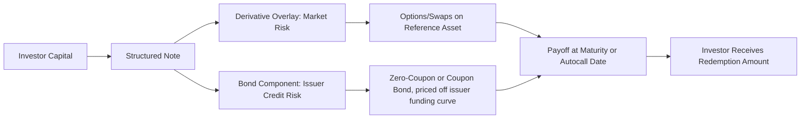

## Writing an Investment Case for a Structured Note

### Overview

An investment case for a structured note is the analytical document that justifies (or critiques) the purchase of a specific structured product to an investor, investment committee, or client. It synthesizes payoff mechanics, embedded derivative valuation, issuer credit risk, scenario analysis, and suitability into a coherent recommendation. This capstone exercise tests the ability to decompose a packaged product into its constituent parts and evaluate whether the economics favor the buyer.

### Anatomy of a Structured Note

A structured note is legally a debt obligation of the issuer (a bank or its funding vehicle) whose return is linked to the performance of an underlying reference asset (equity index, basket, rate, commodity, or FX). Economically, it decomposes into:

$$\text{Structured Note} = \text{Zero-Coupon Bond (or coupon bond)} + \text{Derivative Overlay (options/swaps)}$$

**Key Points**

- The bond component provides principal protection (full, partial, or none, depending on structure) and is priced off the issuer's own credit/funding curve, not the risk-free curve.
- The derivative overlay generates the linked payoff (e.g., long call spread, short put, digital option) and is priced off market-implied volatility, correlation, and dividend assumptions.
- The investor is effectively long the issuer's unsecured credit risk for the life of the note — a structured note is not a deposit and is generally not insured.

### Step 1: Deconstruct the Payoff

**Common structured note archetypes:**

| Structure | Payoff Mechanics | Embedded Derivative |
| --- | --- | --- |
| Principal-Protected Note (PPN) | 100% principal back + participation in upside above a barrier | Zero-coupon bond + long call (or call spread) |
| Autocallable / Reverse Convertible | High coupon; early redemption if underlying above trigger on observation dates; principal at risk below a knock-in barrier | Bond + short put (often with a barrier/digital feature) + issuer call option |
| Reverse Convertible | Fixed high coupon; principal converted to underlying shares if price falls below strike at maturity | Bond + short put |
| Range Accrual Note | Coupon accrues only on days the reference rate/asset stays within a range | Bond + strip of digital options |
| Worst-of Basket Note | Payoff depends on the worst-performing asset in a basket | Bond + rainbow/worst-of option (embeds correlation risk) |

**Example**

For a 2-year autocallable note on a single stock: 90% barrier (knock-in), 105% autocall trigger observed quarterly, 8% p.a. contingent coupon. The investor case should identify this as: long a coupon-bearing bond + short a series of down-and-in puts + short an up-and-out call structure that creates the issuer's autocall right. The 8% coupon compensates the investor for underwriting the tail risk of the underlying falling below the barrier at maturity.

### Step 2: Price and Value the Components

**Bond component:**

$$PV_{\text{bond}} = \sum_{t} \frac{C_t}{(1+y_{\text{issuer}})^t} + \frac{\text{Principal Repayment}}{(1+y_{\text{issuer}})^T}$$

where $y_{\text{issuer}}$ reflects the issuer's own credit spread over the risk-free curve, not the investor's own discount rate.

**Derivative overlay:**

Value each embedded option using standard pricing methods (Black-Scholes for European vanilla components, barrier option formulas or Monte Carlo for knock-in/knock-out and autocall features, given their path dependency).

$$V_{\text{note}}^{\text{fair}} = PV_{\text{bond}} + V_{\text{derivative overlay}}$$

**Key Points**

- Compare $V_{\text{note}}^{\text{fair}}$ to the note's issue price (typically par, e.g., $1,000 or $100) to estimate the **embedded issuer margin** — the difference represents distribution costs, hedging costs, and issuer profit.
- **[Inference]** Published academic and regulatory studies of retail structured products have generally found embedded costs in the range of a few percentage points of notional, though this varies significantly by structure complexity, issuer, and distribution channel, and should be estimated directly for the specific note under review rather than assumed.
- Autocallable and worst-of structures are particularly sensitive to **implied correlation** and the **volatility skew**, since the short-put component is priced off downside (out-of-the-money put) implied volatility, which is typically elevated relative to at-the-money vol (the "skew premium") — this skew often inflates the apparent coupon offered.

### Step 3: Scenario and Payoff Analysis

Construct a payoff table/diagram across a range of terminal (or path) outcomes for the underlying:

**Example scenario grid for the autocallable above:**

| Underlying Path | Outcome | Investor Return |
| --- | --- | --- |
| Above 105% at any quarterly observation | Autocalled early | Principal + accrued coupon(s), annualized ~8% |
| Never above 105%, never below 90% (stays in range) | Note survives to maturity | Principal + coupons at 8% p.a. |
| Below 90% barrier breached at any point, and below strike at maturity | Knock-in triggered | Investor receives principal reduced 1:1 with underlying decline (bond + short put loss) |

### Illustration: Autocallable Payoff Diagram (svg_diagram)

<svg xmlns="http://www.w3.org/2000/svg" viewBox="0 0 640 380">
<text x="320" y="24" text-anchor="middle" font-size="16" font-family="sans-serif" font-weight="bold">Autocallable Note Payoff Profile (svg_diagram)</text>
<line x1="70" y1="330" x2="600" y2="330" stroke="black" stroke-width="1.5" />
<line x1="70" y1="330" x2="70" y2="50" stroke="black" stroke-width="1.5" />
<text x="335" y="365" text-anchor="middle" font-size="13" font-family="sans-serif">Underlying Level at Maturity (% of Initial)</text>
<text x="25" y="195" text-anchor="middle" font-size="13" font-family="sans-serif" transform="rotate(-90 25,195)">Investor Payoff (% of Principal)</text>
<line x1="70" y1="120" x2="330" y2="120" stroke="#2166ac" stroke-width="3" />
<line x1="330" y1="120" x2="330" y2="230" stroke="#999" stroke-width="1" stroke-dasharray="3,3" />
<line x1="330" y1="230" x2="600" y2="80" stroke="#2166ac" stroke-width="3" />
<line x1="70" y1="230" x2="330" y2="230" stroke="#b2182b" stroke-width="1.5" stroke-dasharray="5,3" />
<text x="90" y="245" font-size="11" font-family="sans-serif" fill="#b2182b">90% barrier</text>
<text x="90" y="105" font-size="12" font-family="sans-serif">Flat coupon region (principal + 8% p.a.)</text>
<text x="400" y="100" font-size="12" font-family="sans-serif">1:1 loss below barrier at maturity</text>
</svg>

### Step 4: Assess Issuer Credit and Structural Risk

**Key Points**

- Investigate the issuing entity's credit rating, CDS spread, and whether the note is issued directly by a bank or via a special-purpose funding vehicle with a guarantee.
- Check for **bail-in risk** in jurisdictions with bank resolution regimes (e.g., EU BRRD) — senior unsecured notes may be subject to bail-in in a resolution scenario.
- Confirm the note's ranking (senior unsecured vs. subordinated) in the issuer's capital structure.
- Note liquidity risk: most structured notes are not exchange-listed; secondary market liquidity (if any) is typically provided only by the issuing dealer, often at a bid reflecting an unwind cost.

### Step 5: Suitability and Investor Objective Fit

**Key Points**

- Match the payoff profile to the investor's market view: autocallables suit a moderately bullish-to-neutral, low-volatility view; principal-protected notes suit a risk-averse investor seeking optional upside; reverse convertibles suit an investor willing to underwrite downside risk for enhanced income.
- Check whether the investor could replicate the exposure more cheaply using listed/exchange-traded options or ETFs, avoiding issuer credit risk and illiquidity — often a central point of critique in an investment case.
- Assess whether coupon/yield enhancement is proportionate to the tail risk assumed — a common critique is that headline coupons appear attractive but compensate for a mispriced (from the investor's perspective) or underappreciated left-tail risk.
- Consider tax and accounting treatment, which can vary substantially by jurisdiction and note structure (e.g., original issue discount treatment for zero-coupon-linked notes in the US).

### Step 6: Structure of the Written Investment Case

A complete investment case document typically follows:

1. **Executive Summary** — recommendation (buy/hold/avoid) and key rationale in a few sentences
2. **Product Description** — issuer, underlying, tenor, key terms (coupon, barriers, autocall triggers)
3. **Payoff Decomposition** — bond + derivative overlay breakdown
4. **Valuation** — fair value estimate vs. issue price, embedded cost estimate, key pricing assumptions (vol, correlation, credit spread)
5. **Scenario Analysis** — payoff table/diagram across a reasonable range of outcomes, including stress scenarios
6. **Risk Factors** — market risk, issuer credit risk, liquidity risk, complexity/model risk
7. **Suitability Assessment** — fit with stated investment objective and risk tolerance
8. **Comparison to Alternatives** — cheaper or simpler ways to achieve similar exposure
9. **Conclusion and Recommendation**

**Conclusion**

A rigorous investment case treats a structured note as a portfolio of a bond and derivatives rather than as a single opaque instrument, prices each component independently against market benchmarks, and explicitly surfaces the issuer's embedded margin and the investor's assumed tail risk — enabling an informed buy/avoid decision rather than a judgment based solely on the headline coupon.

**Next Steps / Related Topics**

- Autocallable Note Pricing via Monte Carlo Simulation
- Volatility Skew and Its Impact on Exotic Option Pricing
- Issuer Credit Risk and Bail-In Regimes for Structured Products
- Barrier Option Valuation (Knock-In/Knock-Out)
- Correlation Risk in Worst-Of and Basket Structures
- Regulatory Treatment of Retail Structured Products (e.g., PRIIPs KID in the EU)
- Replicating Structured Payoffs with Listed Options