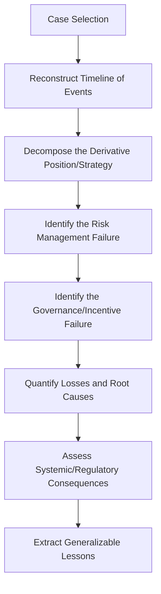

## Conducting a Post Mortem on a Historical Derivatives Failure

### Overview

A post mortem on a historical derivatives failure is a structured forensic analysis of a real episode in which derivatives use led to significant losses, institutional collapse, or systemic disruption. The capstone objective is to move beyond narrative retelling to a disciplined decomposition of the failure into product mechanics, risk management breakdown, governance failure, and market/systemic context — extracting generalizable lessons for risk management practice.

### Analytical Framework

A rigorous post mortem should systematically address the following dimensions for any case:

### Step 1: Case Selection and Scope

Choose a case with sufficient public documentation (regulatory reports, court filings, academic case studies) to support rigorous analysis. Canonical cases commonly used in derivatives coursework include:

| Case | Year | Core Instrument | Failure Type |
| --- | --- | --- | --- |
| Metallgesellschaft | 1993 | Oil futures (stack-and-roll hedge) | Liquidity/margin mismatch on an economically defensible hedge |
| Barings Bank (Nick Leeson) | 1995 | Nikkei futures and options | Unauthorized trading, segregation-of-duties failure |
| Long-Term Capital Management (LTCM) | 1998 | Convergence trades, swaps, leverage | Model risk, liquidity risk, excessive leverage |
| Enron | 2001 | Energy derivatives, mark-to-market accounting, SPEs | Accounting manipulation, disclosure failure |
| Amaranth Advisors | 2006 | Natural gas futures spreads | Concentrated speculative position, liquidity risk |
| Société Générale (Jérôme Kerviel) | 2008 | Equity index futures | Unauthorized trading, internal control failure |
| AIG Financial Products | 2008 | Credit default swaps on CDOs | Mispriced tail risk, collateral call liquidity crisis |
| JPMorgan "London Whale" | 2012 | Credit index derivatives (CDX) | Model risk, risk limit breaches, inadequate escalation |
| Archegos Capital Management | 2021 | Total return swaps (equity) | Hidden leverage via synthetic prime brokerage, concentration risk |

**[Inference]** Case selection should be matched to the specific pedagogical focus of the capstone — e.g., LTCM for model and liquidity risk, Barings/Kerviel for operational/governance failure, AIG for tail-risk mispricing, Archegos for counterparty and disclosure gaps in synthetic leverage.

### Step 2: Reconstruct the Timeline

Build a chronological account distinguishing:

- **Origination**: how and why the position/strategy was initiated (stated rationale at the time).
- **Escalation**: how the position grew, and what internal or external signals (margin calls, VaR breaches, credit downgrades) emerged along the way.
- **Discovery/Trigger event**: the specific market move or internal discovery that crystallized the loss.
- **Resolution**: unwind, bailout, bankruptcy, or regulatory intervention.

**Key Points**

- Distinguish between the *proximate trigger* (the market event that revealed the loss) and the *underlying vulnerability* (the structural flaw that made the position vulnerable) — conflating the two is a common analytical error. For example, in LTCM, the 1998 Russian default was the proximate trigger, but the underlying vulnerability was leverage and correlated illiquid positions across multiple convergence trades.

### Step 3: Decompose the Derivative Position

Apply standard pricing and risk-decomposition tools to the actual instruments involved:

- Identify the payoff structure (linear futures/forwards, short options/volatility, credit protection sold, basis trades).
- Where possible, reconstruct approximate Greeks/sensitivities (delta, gamma, vega, or CS01 for credit) to characterize what risk factor(s) the position was exposed to.
- Identify whether the position was a **hedge** that became mismatched (Metallgesellschaft), a **directional bet dressed as arbitrage** (LTCM's "convergence trades"), or **outright unauthorized speculation** (Barings, Société Générale).

$$\text{Loss} \approx \sum_i \text{Sensitivity}_i \times \Delta(\text{Risk Factor}_i) + \text{Liquidity/Funding Cost}$$

**Example**

For AIG Financial Products: the core position was writing CDS protection on the "super-senior" tranches of CDOs, which were priced (via correlation-based copula models) as extremely low-probability-of-loss. The post mortem should show how (a) the CDS contracts embedded collateral posting triggers tied to AIG's own credit rating, and (b) a rating downgrade combined with underlying mortgage deterioration created simultaneous mark-to-market losses and collateral calls — a liquidity spiral distinct from, though related to, the "true" economic loss on the underlying credit risk.

### Step 4: Identify the Risk Management Failure

**Common failure modes to test for:**

- **Model risk**: was the pricing/risk model missing a key risk factor (e.g., correlation breakdown, tail dependence, liquidity cost)?
- **Liquidity risk**: was risk measured only in mark-to-market/VaR terms without regard to funding/margin liquidity needs under stress (Metallgesellschaft, LTCM, Archegos)?
- **Limit and escalation failure**: were risk limits breached, and if so, were breaches escalated and acted upon, or overridden/ignored (JPMorgan Whale)?
- **Concentration risk**: was the position size disproportionate to market depth/liquidity (Amaranth's natural gas spreads)?
- **Model validation gaps**: was the pricing model independently validated, and were known model limitations disclosed to management?

### Step 5: Identify the Governance and Incentive Failure

**Key Points**

- **Segregation of duties**: in Barings and Société Générale, the same individual (or a poorly separated function) controlled both trade execution and settlement/confirmation, enabling concealment.
- **Incentive misalignment**: compensation structures rewarding short-term P&L or volume can incentivize excessive risk-taking or position concealment.
- **Reporting and transparency**: Enron's use of mark-to-market accounting combined with off-balance-sheet special purpose entities obscured the true risk and leverage of its derivatives-related positions from investors and, arguably, from parts of its own board.
- **Board/senior management risk literacy**: assess whether oversight bodies had sufficient technical understanding of the derivatives involved to challenge risk reports meaningfully — a recurring theme across nearly all major cases.

### Step 6: Quantify Losses and Attribute Root Causes

Where data permits, build a simplified loss attribution:

$$\text{Total Loss} = \underbrace{\text{Market Risk Loss}}_{\text{price/rate moves}} + \underbrace{\text{Liquidity/Funding Loss}}_{\text{margin, fire-sale discounts}} + \underbrace{\text{Concealment/Fraud Loss}}_{\text{if applicable}}$$

**[Inference]** Precise decomposition of realized losses into these categories is often not fully possible from public data alone; a rigorous post mortem should state explicitly which figures are drawn from primary sources (regulatory findings, court judgments) versus reconstructed/estimated by the analyst.

### Step 7: Assess Systemic and Regulatory Consequences

**Key Points**

- Did the failure trigger contagion to other institutions (LTCM's near-failure prompted a Fed-organized private-sector bailout due to counterparty interconnectedness; AIG's collapse triggered a direct U.S. government bailout given its centrality to the CDS market)?
- What regulatory reforms followed? (e.g., Enron → Sarbanes-Oxley; AIG/2008 crisis → Dodd-Frank, mandatory central clearing and margining for standardized OTC derivatives, Basel III capital reforms; Archegos → renewed scrutiny of total return swap disclosure and prime broker risk aggregation practices).
- Assess whether the reforms directly addressed the identified root cause, or primarily addressed the proximate trigger.

### Illustrative Diagram: Failure Causal Chain (svg_diagram)

<svg xmlns="http://www.w3.org/2000/svg" viewBox="0 0 640 340">
<text x="320" y="24" text-anchor="middle" font-size="16" font-family="sans-serif" font-weight="bold">Generic Derivatives Failure Causal Chain (svg_diagram)</text>
<rect x="20" y="60" width="140" height="55" rx="6" fill="#dbe9f6" stroke="#2166ac" stroke-width="1.5" />
<text x="90" y="92" text-anchor="middle" font-size="12" font-family="sans-serif">Structural Vulnerability</text>
<rect x="200" y="60" width="140" height="55" rx="6" fill="#f0e9d8" stroke="#8a6d1f" stroke-width="1.5" />
<text x="270" y="85" text-anchor="middle" font-size="12" font-family="sans-serif">Governance/Model</text>
<text x="270" y="100" text-anchor="middle" font-size="12" font-family="sans-serif">Gap Undetected</text>
<rect x="380" y="60" width="140" height="55" rx="6" fill="#f6e3db" stroke="#b2182b" stroke-width="1.5" />
<text x="450" y="85" text-anchor="middle" font-size="12" font-family="sans-serif">Proximate Market</text>
<text x="450" y="100" text-anchor="middle" font-size="12" font-family="sans-serif">Trigger Event</text>
<line x1="160" y1="87" x2="200" y2="87" stroke="black" stroke-width="1.5" marker-end="url(#arrow1)" />
<line x1="340" y1="87" x2="380" y2="87" stroke="black" stroke-width="1.5" marker-end="url(#arrow1)" />
<line x1="450" y1="115" x2="450" y2="150" stroke="black" stroke-width="1.5" marker-end="url(#arrow1)" />
<rect x="300" y="150" width="300" height="55" rx="6" fill="#e6f2df" stroke="#4a7c2f" stroke-width="1.5" />
<text x="450" y="182" text-anchor="middle" font-size="12" font-family="sans-serif">Realized Loss / Crisis Event</text>
<line x1="450" y1="205" x2="450" y2="240" stroke="black" stroke-width="1.5" marker-end="url(#arrow1)" />
<rect x="300" y="240" width="300" height="55" rx="6" fill="#e9dbf6" stroke="#6a2fb2" stroke-width="1.5" />
<text x="450" y="272" text-anchor="middle" font-size="12" font-family="sans-serif">Regulatory/Institutional Response</text>
</svg>

### Step 8: Extract Generalizable Lessons

**Key Points**

- Frame lessons as transferable principles, not case-specific trivia — e.g., "liquidity risk must be assessed alongside mark-to-market risk, since even an economically correct hedge can fail if it cannot survive interim cash demands" (Metallgesellschaft/LTCM), rather than simply "oil hedging is dangerous."
- Explicitly connect each lesson to a specific risk management practice used today (e.g., central clearing and initial margin requirements as a direct institutional response to bilateral counterparty risk highlighted by AIG and the 2008 crisis).
- Note where lessons appear to have gone *unlearned* across cases — e.g., concentration and hidden leverage recurring from LTCM (1998) through Archegos (2021) despite intervening regulatory reform, which is itself an important, more sobering finding for a capstone analysis.

### Capstone Deliverable Structure

1. **Executive Summary** — case, headline loss figure, one-paragraph root cause
2. **Background and Timeline**
3. **Position/Strategy Decomposition** (with payoff/Greeks characterization)
4. **Risk Management Failure Analysis**
5. **Governance and Incentive Failure Analysis**
6. **Loss Attribution** (with sourcing clearly noted)
7. **Systemic/Regulatory Aftermath**
8. **Generalizable Lessons and Contemporary Relevance**
9. **Sources and Citations** (primary sources: regulatory reports, court documents, central bank post mortems, preferred over secondary journalistic accounts)

**Conclusion**

The value of a derivatives failure post mortem lies not in retelling a dramatic story but in disciplined causal decomposition — separating structural vulnerability from proximate trigger, and risk-model failure from governance failure — so that the resulting lessons generalize to risk management practice beyond the specific case studied.

**Next Steps / Related Topics**

- Value-at-Risk (VaR) Limitations and Model Risk
- Liquidity Risk vs. Market Risk in Derivatives Positions
- Counterparty Credit Risk and Central Clearing (CCPs) Post-2008
- Governance and Segregation of Duties in Trading Operations
- Credit Default Swap Mechanics and the 2008 Financial Crisis
- Total Return Swaps and Synthetic Leverage (Archegos Case)
- Basel III and Dodd-Frank Derivatives Reforms