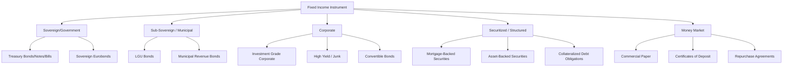

## What Defines a Fixed Income Instrument

### Core Definition

A fixed income instrument is a financial obligation in which an issuer (borrower) contracts with an investor (lender) to repay borrowed principal along with a predetermined or predeterminable stream of income, according to a fixed schedule, until a stated maturity date. The defining characteristic is not that the income is literally "fixed" in the sense of being an unchanging number forever, but that the *structure* governing the payments is contractually specified in advance, distinguishing it from equity, where returns are residual and discretionary.

### The Three Defining Contractual Elements

**1. Issuer (Obligor)**

The entity borrowing the funds and legally obligated to repay. Categories include:

- Sovereign governments (e.g., U.S. Treasury, Philippine government via BTr)
- Supranational institutions (World Bank, ADB)
- Sub-sovereign/municipal issuers (local government units, agencies)
- Corporations (financial and non-financial)
- Securitization vehicles (special purpose entities issuing asset-backed securities)

**2. Principal (Par Value / Face Value)**

The amount the issuer contractually promises to repay at maturity (or according to an amortization schedule). This is the base upon which coupon payments are typically calculated.

**3. Coupon (Income Stream)**

The periodic payment made to the investor, which can be structured as:

- **Fixed-rate**: constant coupon rate for the life of the instrument
- **Floating-rate**: coupon reset periodically against a reference rate (e.g., SOFR, T-bill rate) plus a spread
- **Zero-coupon**: no periodic payment; return is entirely the discount between purchase price and par value at maturity
- **Step-up/step-down**: coupon changes at predetermined dates according to a preset schedule
- **Inflation-linked**: principal or coupon adjusted by a reference index (e.g., TIPS adjusted by CPI)

### Why "Fixed" Does Not Mean "Guaranteed" or "Constant"

[Unverified as a universal rule, but standard in practice] Common misconception: fixed income implies riskless or unchanging cash flows. This is inaccurate on two counts:

- **Not necessarily constant**: Floating-rate notes, step-up bonds, and inflation-linked bonds all fall under "fixed income" despite variable payments, because the *rule* determining the payment is fixed and known in advance — the formula, not the output, is fixed.
- **Not necessarily guaranteed**: Fixed income instruments carry credit risk (issuer default), and even sovereign issuers are not risk-free in all currencies/contexts. "Fixed income" is a structural/legal classification, not a risk-free guarantee.

### The Defining Feature: Contractual Priority and Seniority

A fixed income instrument confers a legal claim that is senior to equity in the capital structure. In liquidation or default:

1. Secured debt holders are paid first (from pledged collateral)
2. Unsecured/senior debt holders next
3. Subordinated debt holders next
4. Preferred equity
5. Common equity absorbs losses last

This priority of claims is a structural defining feature — bondholders have a legal right to specified payments, while equity holders have only a residual claim on what remains.

### Maturity Structure

Every fixed income instrument has a defined term structure:

| Category | Typical Range | Example |
| --- | --- | --- |
| Money market instruments | ≤ 1 year | T-bills, commercial paper |
| Short-term notes | 1–5 years | 2-year Treasury notes |
| Medium-term notes | 5–12 years | 10-year Treasury notes |
| Long-term bonds | 12–30+ years | 30-year Treasury bonds |
| Perpetual | No maturity | Perpetual bonds/preferreds |

[Inference] The maturity boundary categories above (e.g., "short-term = 1–5 years") are conventional industry groupings rather than a single codified universal standard; exact cutoffs vary by market and institution.

### Formal Cash Flow Representation

For a plain-vanilla fixed-rate bond, the price $P$ is the present value of all promised cash flows discounted at the required yield $y$:

$$P = \sum_{t=1}^{n} \frac{C}{(1+y)^t} + \frac{F}{(1+y)^n}$$

Where:

- $C$ = periodic coupon payment $= c \times F$ ($c$ = coupon rate)
- $F$ = face/par value
- $n$ = number of periods to maturity
- $y$ = required yield per period (market discount rate)

This equation itself is the structural core of "fixed income": cash flows are **known in advance** (as amounts or as a formula), and valuation reduces to discounting a defined schedule — contrasted with equity valuation, which relies on uncertain, undefined future cash flows (dividends, earnings growth).

### Diagram: Cash Flow Structure of a Fixed Income Instrument (svg_diagram)

<svg xmlns="http://www.w3.org/2000/svg" viewBox="0 0 760 260" font-family="Arial, sans-serif">
<text x="380" y="24" text-anchor="middle" font-size="15" font-weight="bold">Fixed Income Cash Flow Timeline (svg_diagram)</text>
<line x1="60" y1="150" x2="700" y2="150" stroke="black" stroke-width="2" />
<polygon points="700,150 690,145 690,155" fill="black" />
<line x1="100" y1="145" x2="100" y2="155" stroke="black" stroke-width="2" />
<text x="100" y="175" text-anchor="middle" font-size="12">t=0</text>
<text x="100" y="192" text-anchor="middle" font-size="11">Issuance</text>
<line x1="100" y1="150" x2="100" y2="110" stroke="green" stroke-width="2" marker-end="url(#arrowUp)" />
<text x="100" y="100" text-anchor="middle" font-size="11" fill="green">+P (proceeds to issuer)</text>
<line x1="220" y1="145" x2="220" y2="155" stroke="black" stroke-width="2" />
<text x="220" y="175" text-anchor="middle" font-size="12">t=1</text>
<line x1="220" y1="150" x2="220" y2="190" stroke="#1a5fb4" stroke-width="2" marker-end="url(#arrowDown)" />
<text x="220" y="205" text-anchor="middle" font-size="11" fill="#1a5fb4">Coupon C</text>
<line x1="340" y1="145" x2="340" y2="155" stroke="black" stroke-width="2" />
<text x="340" y="175" text-anchor="middle" font-size="12">t=2</text>
<line x1="340" y1="150" x2="340" y2="190" stroke="#1a5fb4" stroke-width="2" marker-end="url(#arrowDown)" />
<text x="340" y="205" text-anchor="middle" font-size="11" fill="#1a5fb4">Coupon C</text>
<line x1="460" y1="145" x2="460" y2="155" stroke="black" stroke-width="2" />
<text x="460" y="175" text-anchor="middle" font-size="12">t=3</text>
<line x1="460" y1="150" x2="460" y2="190" stroke="#1a5fb4" stroke-width="2" marker-end="url(#arrowDown)" />
<text x="460" y="205" text-anchor="middle" font-size="11" fill="#1a5fb4">Coupon C</text>

<text x="560" y="150" text-anchor="middle" font-size="16">...</text>

<line x1="640" y1="145" x2="640" y2="155" stroke="black" stroke-width="2" />
<text x="640" y="175" text-anchor="middle" font-size="12">t=n</text>
<text x="640" y="192" text-anchor="middle" font-size="11">Maturity</text>
<line x1="640" y1="150" x2="640" y2="190" stroke="#1a5fb4" stroke-width="2" marker-end="url(#arrowDown)" />
<text x="640" y="205" text-anchor="middle" font-size="11" fill="#1a5fb4">Coupon C</text>
<line x1="655" y1="150" x2="655" y2="200" stroke="#c0392b" stroke-width="2" marker-end="url(#arrowDown)" />
<text x="670" y="220" text-anchor="middle" font-size="11" fill="#c0392b">+ Face Value F</text>
</svg>

### Fixed Income vs. Equity: Structural Comparison

| Attribute | Fixed Income | Equity |
| --- | --- | --- |
| Cash flow certainty | Contractually specified (amount or formula) | Discretionary, residual |
| Claim priority | Senior | Junior/residual |
| Maturity | Defined (or perpetual by design) | None |
| Upside potential | Capped at contractual terms | Unlimited |
| Voting/control rights | Generally none (absent covenant triggers) | Typically yes |
| Legal recourse on missed payment | Default, potential legal action | None (no obligation to pay dividends) |

### Instrument Taxonomy Governed by This Definition

### Key Points

- A fixed income instrument is defined by a contractual, predetermined schedule of cash flows and repayment of principal — not by the payments being numerically constant.
- The core elements are: issuer, principal, coupon structure, and maturity.
- Seniority in the capital structure (claim priority over equity) is a defining structural feature, not incidental.
- "Fixed" refers to the fixed *rule* governing cash flows (fixed-rate, floating-rate formula, indexed formula), which is why floating-rate notes and inflation-linked bonds still qualify as fixed income.
- Valuation is fundamentally a present-value exercise over a known/defined cash flow schedule, which is the mathematical signature separating fixed income from equity valuation.

**Related Topics**

- Time Value of Money and Bond Pricing Mechanics
- Yield Measures (Current Yield, YTM, YTC, YTW)
- The Relationship Between Bond Prices and Interest Rates
- Coupon Structures (Fixed, Floating, Zero-Coupon, Step-Up)
- Credit Risk and Seniority in the Capital Structure
- Introduction to the Term Structure of Interest Rates (Yield Curve)