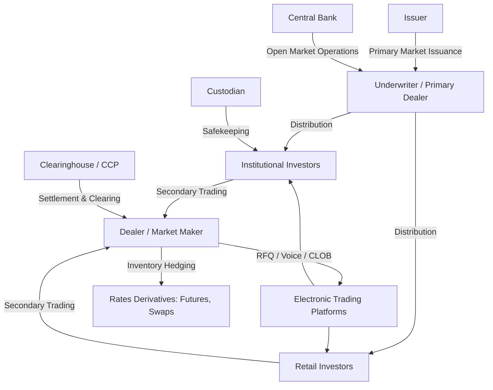

## Fixed Income Market Structure and Participants

### Overview

The fixed income market is the global system through which debt securities are issued, priced, traded, and settled. Unlike equity markets, which are dominated by centralized exchanges, fixed income markets are predominantly over-the-counter (OTC), fragmented across instrument types, and organized around dealer intermediation rather than continuous double-auction order books. Understanding market structure is a prerequisite to understanding pricing, liquidity, and duration-based risk management, since the mechanics of how bonds trade directly affect bid-ask spreads, price transparency, and the feasibility of hedging strategies.

### Primary Market vs. Secondary Market

**Primary Market**

The primary market is where new debt securities are issued and sold to investors for the first time, with proceeds flowing to the issuer.

- **Government securities**: Issued via auction (e.g., U.S. Treasury auctions using a single-price/uniform-price format for most maturities)
- **Corporate bonds**: Issued via underwritten offerings, typically led by investment banks acting as underwriters
- **Municipal bonds**: Issued via competitive bid or negotiated sale, often with a municipal advisor structuring the deal
- **Securitized products**: Issued via structuring and tranching of underlying asset pools (mortgages, auto loans, credit card receivables)

**Secondary Market**

The secondary market is where previously issued securities trade among investors. Fixed income secondary markets are characterized by:

- Low trading frequency per individual CUSIP relative to equities (most bonds trade infrequently after initial issuance)
- Dealer-intermediated, quote-driven trading rather than continuous order-driven trading
- Fragmented liquidity across thousands of individual issues (a single corporate issuer may have dozens of outstanding bond series with different maturities and coupons)

### Market Segments

**Key Points**

| Segment | Primary Issuers | Typical Participants | Liquidity Profile |
| --- | --- | --- | --- |
| Sovereign/Government | National treasuries | Central banks, primary dealers, asset managers | High (benchmark issues) |
| Agency/Supranational | GSEs, development banks | Institutional investors, central banks | Moderate to high |
| Municipal | State/local governments | Retail, SMAs, mutual funds | Low to moderate |
| Investment-Grade Corporate | Corporations (BBB-/Baa3 and above) | Insurers, pension funds, asset managers | Moderate |
| High-Yield Corporate | Corporations (below investment grade) | Hedge funds, HY mutual funds, CLOs | Lower, wider spreads |
| Securitized (MBS/ABS/CLO) | Special purpose vehicles | Banks, asset managers, REITs | Varies by tranche |
| Money Market | Governments, banks, corporations | Money market funds, corporate treasuries | Very high, short duration |

### Market Participants

#### Issuers

Entities that raise capital by selling debt obligations. Issuer categories drive credit risk classification and regulatory treatment:

- Sovereign governments (default-free in local currency, subject to sovereign risk in foreign currency)
- Sub-sovereign/municipal entities
- Financial institutions (banks, insurers)
- Non-financial corporations
- Securitization vehicles (SPVs/SPEs)

#### Primary Dealers

Financial institutions designated (in markets like the U.S.) to participate directly in government securities auctions and maintain obligations to make markets in government debt. Primary dealers serve as the direct counterparty to the central bank/treasury in open market operations and auction distribution.

#### Dealers and Market Makers

Dealers commit capital to hold inventory and quote bid-ask prices, facilitating liquidity in an OTC market where natural buyers and sellers rarely arrive simultaneously. Dealer behavior is central to fixed income market structure because:

- Dealers absorb inventory risk, which they hedge using interest rate derivatives (futures, swaps) — a direct link to duration management
- Post-2008 regulatory changes (Basel III, Volcker Rule) increased the capital cost of dealer balance sheets, reducing dealer inventory capacity and shifting some liquidity provision toward electronic and all-to-all platforms [Inference: the magnitude of this shift is debated among market structure researchers and varies by asset class]
- Dealer bid-ask spreads widen with duration, credit risk, and issue size scarcity

#### Institutional Investors

- **Asset managers/mutual funds**: Manage pooled fixed income portfolios against benchmarks, often duration-targeted
- **Pension funds**: Liability-driven investors, frequently long-duration buyers to match long-dated liabilities
- **Insurance companies**: Hold fixed income to match policy liabilities; life insurers skew toward long duration, P&C insurers toward shorter duration
- **Central banks**: Conduct monetary policy via purchases/sales of government securities (open market operations, quantitative easing/tightening); also manage FX reserves in sovereign debt of other countries
- **Sovereign wealth funds**
- **Hedge funds**: Often relative-value or macro strategies exploiting curve, basis, or credit spread dislocations
- **Banks**: Hold fixed income for liquidity portfolios (HQLA under Basel III), trading, and asset-liability management

#### Retail Investors

Participate directly (odd-lot bond purchases, often less liquid pricing) or indirectly through mutual funds and ETFs.

#### Infrastructure Participants

- **Clearinghouses/CCPs**: Central counterparties for cleared repo and derivatives (e.g., FICC in the U.S. Treasury market)
- **Custodians**: Safekeeping and settlement of securities
- **Credit rating agencies**: Assign creditworthiness assessments (Moody's, S&P, Fitch) that influence eligible-investor universes and regulatory capital treatment
- **Inter-dealer brokers (IDBs)**: Facilitate anonymous trading between dealers

### Trading Mechanisms

**Key Points**

- **Voice/OTC bilateral trading**: Traditional dealer-to-client negotiation, still significant for large or illiquid trades
- **Request-for-Quote (RFQ) electronic platforms**: Client sends a quote request to multiple dealers simultaneously (e.g., MarketAxess, Tradeweb); dominant model for corporate bond electronic trading
- **All-to-all trading**: Newer platforms allow any participant (not just dealers) to provide liquidity, blurring the traditional dealer/client distinction
- **Central limit order book (CLOB)**: More common in highly liquid, standardized instruments like on-the-run U.S. Treasuries and futures
- **Portfolio trading**: Execution of a basket of bonds as a single transaction, growing in corporate bond markets for efficient risk transfer

### Market Structure Diagram

### Why Market Structure Matters for Duration Analysis

- **Liquidity affects hedge effectiveness**: Illiquid bonds have wider bid-ask spreads, making duration-based hedges (e.g., matching portfolio duration with futures) imperfect due to execution costs and basis risk
- **Dealer capacity constraints**: Reduced dealer balance sheet capacity during stress periods (e.g., March 2020) can cause duration-neutral positions to behave unexpectedly as liquidity premia spike
- **Benchmark issues carry a liquidity premium**: On-the-run Treasuries typically trade at tighter spreads/higher prices than off-the-run issues of similar duration, a distinction relevant when constructing yield curves for duration/convexity calculations
- **Segmented investor demand affects the curve shape**: Pension and insurance demand for long-duration assets can compress long-end yields independent of pure expectations-hypothesis dynamics (a form of preferred-habitat effect), which duration and key rate duration models must account for

### Example

A pension fund seeking to extend portfolio duration to match long-dated liabilities may:

1. Request quotes via RFQ from multiple dealers for a 30-year corporate bond
2. Compare dealer offers, noting wider spreads than for a 10-year bond of the same issuer due to lower long-end liquidity
3. Alternatively, use Treasury futures or interest rate swaps to extend duration synthetically without transacting in the less liquid cash bond market

**Next Steps**

- **Related Topics**: Bond Pricing and Yield Measures, Yield Curve Construction and Term Structure Theories, Repo Markets and Securities Financing, Primary Dealer Systems and Treasury Auctions, Credit Rating Agencies and Their Role in Fixed Income, Regulatory Capital Impact on Dealer Market-Making (Basel III/Volcker Rule), Electronic Trading Platforms in Fixed Income (RFQ, CLOB, All-to-All), Preferred Habitat Theory and Segmented Markets Hypothesis