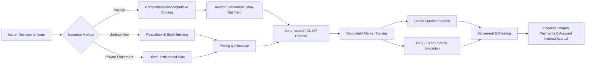

## Primary Issuance and Secondary Trading

### Overview

Primary issuance and secondary trading represent the two sequential lifecycle stages of a fixed income security: the process by which a bond is created and initially sold to raise capital for the issuer, and the subsequent process by which that bond changes hands among investors without further cash flow to the issuer. The mechanics, pricing conventions, and participant incentives differ substantially between the two stages, and both directly affect the yield and price data used in duration and risk analysis.

### Primary Issuance

#### Issuance Methods

**Key Points**

- **Competitive auction**: Investors submit bids specifying price/yield and quantity; used extensively for sovereign debt (e.g., U.S. Treasury auctions)
- **Underwritten (negotiated) offering**: An investment bank or syndicate purchases the issue from the issuer (or commits on a best-efforts basis) and resells to investors; standard for corporate bonds
- **Private placement**: Securities sold directly to a limited number of institutional investors without public registration, common for smaller or bespoke corporate issuances (e.g., under Rule 144A in the U.S.)
- **Continuous/shelf issuance programs**: Issuers with an effective shelf registration (e.g., medium-term note programs) can issue debt incrementally as market conditions and funding needs dictate

#### Treasury Auction Mechanics (Illustrative of Competitive Auctions)

U.S. Treasury auctions use a **single-price (uniform-price) auction** format:

1. Primary dealers and other eligible bidders submit competitive bids (price/yield and amount)
2. Noncompetitive bids (guaranteed allocation up to a limit, no price specified) are also accepted
3. Bids are ranked from lowest yield (highest price) to highest yield
4. The auction clears at the **stop-out yield** — the highest yield accepted to fill the offering amount
5. All successful bidders receive the same stop-out yield/price, regardless of what they bid (hence "single-price")

Key auction statistics used to assess demand:

- **Bid-to-cover ratio**: Total bids submitted divided by amount awarded; higher ratios indicate stronger demand
- **Tail**: The difference between the stop-out yield and the pre-auction "when-issued" market yield; a wider tail suggests weaker-than-expected demand
- **Primary dealer vs. indirect vs. direct bidder allocation**: Indirect bidders (often foreign official institutions via primary dealers) and direct bidders (end investors bidding directly) allocation percentages are watched as demand indicators

#### Underwriting Process (Corporate Bonds)

1. **Mandate**: Issuer selects lead underwriter(s)/bookrunner(s)
2. **Roadshow**: Issuer and underwriters market the deal to institutional investors, often with initial price talk
3. **Book-building**: Underwriters collect indications of interest (orders) from investors, refining price/spread guidance as the order book develops
4. **Pricing**: Final coupon/spread is set based on book demand, typically referenced to a benchmark (e.g., spread to Treasury or swap rate)
5. **Allocation**: Underwriters allocate bonds to investors, often favoring larger, relationship-oriented accounts
6. **Settlement**: Typically T+2 to T+5 for new corporate issues, proceeds delivered to issuer net of underwriting fees

**Underwriting risk types**:

- **Firm commitment**: Underwriter purchases the entire issue and bears placement risk
- **Best efforts**: Underwriter acts as an agent, with the issuer bearing the risk of undersubscription

#### New Issue Concession and New Issue Premium

New bonds typically price with a **new issue concession** — a modest yield premium relative to where the issuer's existing (secondary market) curve trades — to compensate investors for taking on primary allocation risk and to ensure sufficient distribution. This concession commonly compresses in secondary trading shortly after issuance, a pattern relevant to relative value analysis. [Inference: the magnitude of new issue concessions is time-varying and depends on market conditions, issuer familiarity, and deal size]

### Secondary Trading

#### Market Structure for Secondary Trading

Secondary trading occurs predominantly over-the-counter, with dealers acting as intermediaries between buyers and sellers rather than a centralized exchange matching orders directly (see *Fixed Income Market Structure and Participants* for a full participant map).

**Execution channels**:

| Channel | Description | Typical Use Case |
| --- | --- | --- |
| Voice/bilateral | Direct dealer negotiation | Large, illiquid, or complex trades |
| RFQ (Request-for-Quote) | Client solicits quotes from multiple dealers electronically | Standard institutional corporate/muni trades |
| CLOB (Central Limit Order Book) | Anonymous, continuous matching | Highly liquid instruments (on-the-run Treasuries, futures) |
| All-to-all | Any participant can post/take liquidity | Growing segment across corporates and Treasuries |
| Portfolio trading | Basket execution as a single trade | Efficient multi-bond risk transfer |

#### Price Discovery and Quotation Conventions

- **Bid-ask spread**: Compensation to the dealer for providing immediacy and bearing inventory risk; widens with lower liquidity, longer duration, and higher credit risk
- **On-the-run vs. off-the-run**: The most recently issued benchmark security in a given maturity (on-the-run) trades at a liquidity premium (higher price/lower yield) relative to older issues of similar maturity (off-the-run)
- **Clean price vs. dirty price**: Secondary trades settle at the dirty (full) price, which includes accrued interest since the last coupon date; quoted prices are typically clean prices

$$P_{dirty} = P_{clean} + AI$$

where $AI$ is accrued interest, calculated as:

$$AI = \text{Coupon} \times \frac{\text{Days since last coupon}}{\text{Days in coupon period}}$$

#### Settlement

- **Regular-way settlement**: Standardized settlement cycles vary by instrument (e.g., T+1 for most U.S. Treasuries, T+2 historically common for U.S. corporate bonds, though conventions evolve with regulatory changes)
- **Clearing**: Increasingly centralized through CCPs for repo and, following recent U.S. regulatory mandates, expanding central clearing requirements for certain Treasury cash and repo transactions [Unverified: specific implementation timelines for expanded Treasury clearing mandates should be confirmed against current SEC/FINRA rules, as compliance dates have been subject to revision]

### Primary-to-Secondary Lifecycle Diagram

### Example

A corporation issues a new 10-year bond priced at a spread of 150 basis points over the 10-year Treasury, reflecting a new issue concession of roughly 10-15 basis points versus its existing secondary curve. Within days of issuance, secondary market trading typically compresses the spread toward 135-140 basis points as the concession is absorbed — a pattern analysts monitor when assessing relative value of newly issued versus seasoned bonds of the same issuer. [Inference: this specific example figure is illustrative; actual concession and compression magnitude vary by deal]

### Relevance to Duration Analysis

- Newly issued, on-the-run bonds are frequently used as **duration-matching instruments** and hedging benchmarks due to superior liquidity
- Off-the-run bonds may exhibit **liquidity-driven yield premia** that are not purely a function of duration or credit risk, complicating pure duration-based relative value comparisons
- Auction cycles influence the **supply of specific maturity buckets**, affecting curve shape and, by extension, key rate duration exposures across a portfolio

**Next Steps**

- **Related Topics**: Fixed Income Market Structure and Participants, Bond Pricing and Yield Measures, Accrued Interest and Day Count Conventions, Yield Curve Construction and Term Structure Theories, Repo Markets and Securities Financing, On-the-Run vs. Off-the-Run Liquidity Premiums, Credit Spread Analysis and New Issue Concessions, Treasury Auction Cycles and Supply Dynamics