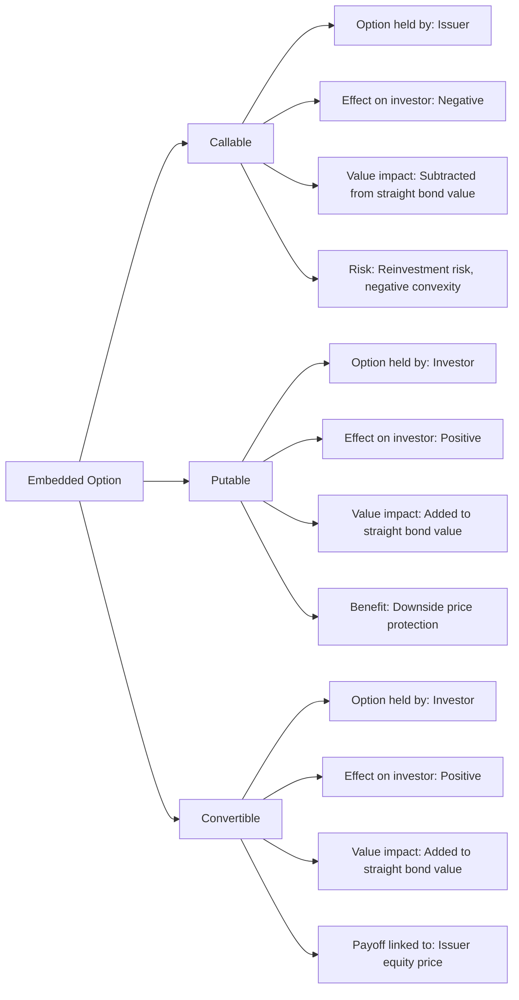

## Callable, Putable, and Convertible Features

### Overview: Embedded Options in Bonds

Many bonds contain embedded options — contractual provisions granting either the issuer or the bondholder the right (not obligation) to take an action that alters the bond's cash flows or life span. These features fundamentally change a bond's valuation, since a "straight" (option-free) bond's price is simply the present value of fixed cash flows, whereas a bond with an embedded option must be valued as:

$$V_{\text{callable}} = V_{\text{straight}} - V_{\text{call option}}$$

$$V_{\text{putable}} = V_{\text{straight}} + V_{\text{put option}}$$

$$V_{\text{convertible}} = V_{\text{straight}} + V_{\text{conversion option}}$$

The sign convention follows from *who* holds the option: an issuer-held option (call) is subtracted from the value to the bondholder because it works against the investor's interest; an investor-held option (put, conversion) is added because it works in the investor's favor.

### Callable Bonds

**Definition:** Grants the issuer the right to redeem the bond before maturity at a predetermined price (the call price), typically at or above par.

**Why issuers use call features:**

- To refinance debt at lower rates if interest rates fall
- To remove restrictive covenants
- To manage balance sheet duration/leverage flexibility

**Common call structures:**

| Structure | Description |
| --- | --- |
| American call | Callable any time after a specified call-protection period |
| European call | Callable only on a single specified date |
| Bermudan call | Callable on specified dates (e.g., each coupon date) after a lockout period |
| Call schedule | Predetermined declining call prices over time (e.g., 105 in year 3, 103 in year 5, 100 thereafter) |

**Key risk to investor — Negative convexity:**

As interest rates fall, a straight bond's price rises without bound (subject to the discounting math), but a callable bond's price appreciation is capped near the call price, because the issuer becomes increasingly likely to call the bond away. This produces the signature "negative convexity" price-yield relationship for callable bonds at low yields.

**Price-Yield Relationship for Callable Bonds (svg_diagram)**

<svg xmlns="http://www.w3.org/2000/svg" viewBox="0 0 700 340" font-family="Arial, sans-serif">
<text x="350" y="24" text-anchor="middle" font-size="15" font-weight="bold">Callable Bond Price-Yield Curve (svg_diagram)</text>
<line x1="70" y1="290" x2="650" y2="290" stroke="black" stroke-width="1.5" />
<line x1="70" y1="30" x2="70" y2="290" stroke="black" stroke-width="1.5" />
<text x="360" y="315" text-anchor="middle" font-size="12">Yield →</text>
<text x="30" y="160" text-anchor="middle" font-size="12" transform="rotate(-90 30 160)">Price</text>
<path d="M 90 270 C 200 200, 300 90, 420 55 C 500 40, 580 35, 630 32" fill="none" stroke="#1a5fb4" stroke-width="2" stroke-dasharray="6,3" />
<text x="480" y="55" font-size="11" fill="#1a5fb4">Option-free (straight) bond</text>
<path d="M 90 270 C 200 200, 300 130, 380 100 C 450 90, 550 88, 630 87" fill="none" stroke="#c0392b" stroke-width="2.5" />
<text x="420" y="115" font-size="11" fill="#c0392b">Callable bond (negative convexity)</text>
<line x1="70" y1="87" x2="650" y2="87" stroke="gray" stroke-dasharray="4,4" />
<text x="655" y="90" font-size="10" fill="gray">Call price</text>
</svg>

**Yield measures specific to callable bonds:**

- **Yield to Call (YTC):** assumes the bond is called at the earliest call date
- **Yield to Worst (YTW):** the minimum of YTM and all possible YTCs across the call schedule — the conservative yield measure used in practice for callable bond analysis

### Putable Bonds

**Definition:** Grants the bondholder the right to sell the bond back to the issuer at a predetermined price (the put price) before maturity, typically at par.

**Why investors value put features:**

- Protection against rising interest rates (can put the bond back and reinvest at higher prevailing yields)
- Protection against credit deterioration of the issuer (can exit before further downgrade risk materializes)

**Effect on price-yield relationship:**

A putable bond exhibits a price floor as yields rise — since the investor can always exercise the put at the put price, the bond's price will not fall below the present value of the put price, creating a "cushion" that becomes more effective at higher yields.

**Yield measures:**

- **Yield to Put (YTP):** assumes the bond is put back at the earliest put date
- Comparable "yield to worst" style analysis is used, though for putable bonds the worst case is typically the *longer* of the horizons (unlike callable bonds where worst case is often the *shorter* horizon), since the put right benefits the investor.

### Convertible Bonds

**Definition:** Grants the bondholder the right to convert the bond into a predetermined number of shares of the issuer's common stock (or, less commonly, another issuer's stock), instead of receiving cash repayment.

**Key terms:**

| Term | Definition |
| --- | --- |
| Conversion ratio | Number of shares received per bond upon conversion |
| Conversion price | $= \dfrac{\text{Par value}}{\text{Conversion ratio}}$ — the effective price paid per share via conversion |
| Conversion value | $= \text{Conversion ratio} \times \text{Current stock price}$ — value if converted today |
| Conversion premium | $= \dfrac{\text{Bond price} - \text{Conversion value}}{\text{Conversion value}}$ — how much more the convertible costs vs. converting today |

**Example:**

A convertible bond with $1,000 par, conversion ratio of 20 shares:

$$\text{Conversion price} = \frac{1000}{20} = \$50 \text{ per share}$$

If the stock currently trades at $40:

$$\text{Conversion value} = 20 \times 40 = \$800$$

The bond would trade above $800 (reflecting its bond floor plus option value), and the conversion premium reflects how far out-of-the-money the equity option component currently is.

**Valuation regimes:**

- **Deep out-of-the-money (bond floor dominates):** Convertible trades close to its straight-bond value; behaves like a fixed income instrument with modest equity optionality.
- **Deep in-the-money (equity dominates):** Convertible trades close to its conversion value; behaves nearly like the underlying equity, with the bond floor as a minor consideration.
- **At-the-money / near conversion price:** Hybrid behavior — most sensitive region, where both bond and option Greeks materially affect price.

**Bond floor:**

The minimum value of a convertible bond is its straight-bond value (present value of coupons and principal, ignoring the conversion option), which acts as a downside floor regardless of how far the stock price falls — subject to issuer credit risk (the floor is a *credit-sensitive* floor, not a risk-free one).

### Comparative Summary

### Sensitivity Comparison Table

| Feature | Option Holder | Value Effect (vs. Straight Bond) | Investor Exposure |
| --- | --- | --- | --- |
| Call | Issuer | Decreases bond value | Reinvestment risk, capped upside |
| Put | Investor | Increases bond value | Downside protection |
| Convertible | Investor | Increases bond value | Equity upside participation |

### Impact on Duration

- **Callable bonds** exhibit reduced *effective duration* as yields fall (since expected life shortens toward the call date), a phenomenon captured by option-adjusted spread (OAS) models rather than simple Macaulay duration.
- **Putable bonds** exhibit reduced effective duration as yields rise (since expected life shortens toward the put date).
- **Convertible bonds** exhibit duration that shrinks as the equity option moves further in-the-money, since the bond increasingly behaves like equity (which has no duration in the fixed-income sense).

[Inference] Precise duration figures for embedded-option bonds require option-adjusted models (e.g., binomial trees, Black-Derman-Toy, or similar term-structure models) rather than closed-form Macaulay/modified duration formulas, because the latter assume fixed, option-free cash flows.

### Key Points

- Callable = issuer's option, reduces value to investor, causes negative convexity at low yields.
- Putable = investor's option, increases value to investor, creates a price floor at high yields.
- Convertible = investor's option to exchange debt for equity, increases value via equity upside participation.
- All embedded-option bonds require option-adjusted valuation techniques rather than simple discounted cash flow at a fixed yield.
- Yield to Worst (for callables) and analogous worst-case yield concepts (for putables) are the practical yield metrics used when options are present.

**Related Topics**

- Option-Adjusted Spread (OAS) and Binomial Interest Rate Trees
- Effective Duration and Effective Convexity for Bonds with Embedded Options
- Yield to Worst, Yield to Call, and Yield to Put Calculations
- Valuing Convertible Bonds: Black-Scholes vs. Binomial Approaches
- Negative Convexity and Mortgage-Backed Securities
- Credit Spread Analysis for Convertible Bond Floors