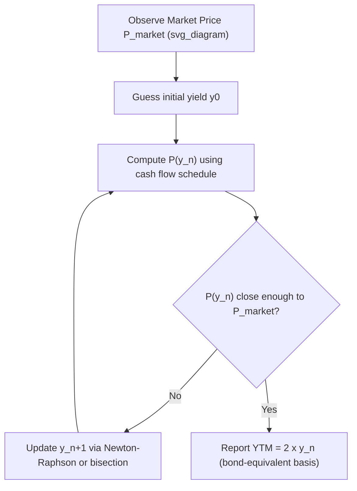

## Yield to Maturity Calculation and Interpretation

### Definition

Yield to maturity (YTM) is the single discount rate that equates the present value of a bond's remaining cash flows (coupons plus principal redemption) to its current market price. It is an internal rate of return (IRR) on the bond, assuming the bond is held to maturity and all coupons are reinvested at that same rate.

### Core Pricing Equation

For a bond with $N$ semiannual periods, coupon $C$ per period, face value $F$, and price $P$:

$$P = \sum_{t=1}^{N} \frac{C}{(1+y)^t} + \frac{F}{(1+y)^N}$$

Here $y$ is the periodic yield; the quoted, annualized YTM (on a bond-equivalent basis) is $2y$ for semiannual-pay bonds.

**Key Points**

- YTM is solved iteratively (no closed-form algebraic solution exists for $N > 2$); practitioners use numerical root-finding (Newton-Raphson, bisection) or financial calculators/spreadsheet functions.
- YTM assumes: (1) the bond is held to maturity, (2) all coupons are reinvested at the YTM itself, and (3) no default occurs. Violation of assumption (2) is the source of **reinvestment risk**.
- YTM is quoted differently across markets: bond-equivalent yield (BEY, semiannual compounding × 2) in the U.S. Treasury/corporate market, annual yield in most European markets, and money-market yield conventions (discount basis, add-on basis) for short-term instruments.

### Iterative Solution Method (Newton-Raphson)

Given price function $P(y)$, the update rule is:

$$y_{n+1} = y_n - \frac{P(y_n) - P_{market}}{P'(y_n)}$$

where $P'(y)$ is the derivative of price with respect to yield (related to Macaulay duration).

**Example**

A 5-year, 6% annual-pay coupon bond ($F = 1000$, $C = 60$) trades at $P = 957.35$. Solve for YTM.

Try $y = 7\%$:

$$P(0.07) = \sum_{t=1}^{5}\frac{60}{(1.07)^t} + \frac{1000}{(1.07)^5} = 245.97 + 712.99 = 958.96$$

Close, but slightly above 957.35. Try $y = 7.02\%$:

$$P(0.0702) \approx 957.30$$

**Output**: YTM ≈ 7.02% (annual compounding). This confirms the inverse price-yield relationship: since the bond trades at a discount (957.35 < 1000), YTM (7.02%) exceeds the coupon rate (6%).

### Excel/Financial Calculator Implementation

```plaintext
=RATE(nper, pmt, pv, fv, type, guess)
=RATE(5, 60, -957.35, 1000)   → returns 0.0702 (7.02%)
```

For bonds with odd first periods or between coupon dates, use `YIELD()`:

```plaintext
=YIELD(settlement, maturity, rate, pr, redemption, frequency, basis)
```

### Relationship to Price, Coupon Rate, and Current Yield

| Condition | Price vs. Par | Relationship |
| --- | --- | --- |
| Coupon rate = YTM | Par | Price = Face Value |
| Coupon rate < YTM | Discount | Price < Face Value |
| Coupon rate > YTM | Premium | Price > Face Value |

Current yield (annual coupon / market price) sits between coupon rate and YTM for premium/discount bonds:

- Discount bond: Coupon rate < Current Yield < YTM
- Premium bond: Coupon rate > Current Yield > YTM

### YTM Decomposition

YTM can be conceptually decomposed into:

1. **Yield if held to maturity assuming reinvestment at YTM** (the theoretical construct)
2. **Realized (horizon) yield** — the actual return earned, which will differ from YTM if reinvestment rates differ from $y$ or the bond is sold before maturity

$$\text{Total Future Value} = \text{Coupon Reinvestment Income} + \text{Sum of Coupons} + \text{Sale/Redemption Price}$$

The proportion of total return attributable to reinvestment income grows with maturity and coupon size — long-maturity, high-coupon bonds have YTM realization highly sensitive to future rate paths. [Inference: the exact sensitivity depends on the specific reinvestment rate path assumed, which is unknowable ex ante.]

### Limitations of YTM as a Return Measure

**Key Points**

- **Reinvestment rate assumption**: If future coupons are reinvested at rates below YTM, realized return falls short of YTM (and vice versa). This effect is larger for higher-coupon, longer-maturity bonds.
- **Ignores yield curve shape**: YTM applies a single flat discount rate to all cash flows regardless of their timing, effectively assuming a flat term structure. This differs from the theoretically more accurate approach of discounting each cash flow at its own maturity-matched spot rate.
- **Not comparable across bonds with different cash flow structures** (e.g., a zero-coupon bond vs. a high-coupon bond) even if they have identical YTM, because their reinvestment risk and interest rate sensitivity differ.
- **Ignores credit/default risk** realization — YTM is a promised yield, not an expected yield, for bonds with non-trivial default probability.

### YTM vs. Spot Rate (Zero-Coupon) Yield

For a zero-coupon bond, YTM equals the spot rate for that maturity exactly, since there are no interim cash flows to reinvest. For coupon bonds, YTM is a complex weighted average of the spot rates applicable to each cash flow date, with weights determined by the relative size and timing of each payment.

$$P = \sum_{t=1}^{N} \frac{C}{(1+z_t)^t} + \frac{F}{(1+z_N)^N} \neq \sum_{t=1}^{N} \frac{C}{(1+y)^t} + \frac{F}{(1+y)^N} \text{ in general, unless the curve is flat}$$

where $z_t$ are spot rates. Two bonds with identical maturity and YTM but different coupons will have different effective durations and different sensitivities to non-parallel yield curve shifts.

### Diagram: YTM Solving Process (svg_diagram)



### Yield Conventions by Market

**Key Points**

- **Bond-Equivalent Yield (BEY)**: semiannual yield × 2 (U.S. Treasuries, U.S. corporates)
- **Street convention**: assumes payments occur on scheduled dates even if a date falls on a non-business day; used for standard YTM quotes
- **True yield**: adjusts for actual business-day payment shifts, producing a marginally different (typically slightly lower) yield than street convention
- **Japanese/simple yield**: uses simple interest for coupon accrual over the final period rather than compound discounting in some markets [Inference: conventions vary by jurisdiction and should be confirmed against current local market practice]
- **Moosmüller and ICMA (International Capital Market Association) yield**: alternative compounding conventions used in certain European markets, differing in the treatment of the first (short/long) coupon period

### Worked Example: Premium Bond

A 10-year, 8% semiannual coupon bond ($F=1000$) trades at $P = 1064.18$.

- Semiannual coupon: $C = 40$, $N = 20$ periods
- Solve: $1064.18 = \sum_{t=1}^{20}\frac{40}{(1+y)^t} + \frac{1000}{(1+y)^{20}}$
- Iterating gives $y \approx 3.5\%$ per period

**Output**: Annualized YTM (BEY) = $2 \times 3.5\% = 7.0\%$, which is below the 8% coupon rate — consistent with the bond trading at a premium.

### Sensitivity Note

**Key Points**

- YTM and price move inversely: this is the foundational price-yield relationship underlying duration and convexity measures.
- The price-yield relationship is convex, not linear — equal increases and decreases in yield produce asymmetric price changes (larger price gains for yield decreases than price losses for equal yield increases), a property fully explored under convexity.
- YTM alone does not measure interest rate sensitivity; that role belongs to duration and convexity metrics, which are typically calculated using the YTM as the discount rate input.

**Related Topics**

- Current Yield vs. Yield to Maturity vs. Yield to Call/Put
- Spot Rates, Forward Rates, and the Term Structure
- Macaulay, Modified, and Effective Duration
- Convexity and Price-Yield Curve Nonlinearity
- Reinvestment Risk and Horizon Return Analysis
- Yield to Worst and Callable Bond Yield Measures
- Bond-Equivalent Yield vs. Money Market Yield Conversions
- Realized (Horizon) Yield under Alternative Reinvestment Scenarios