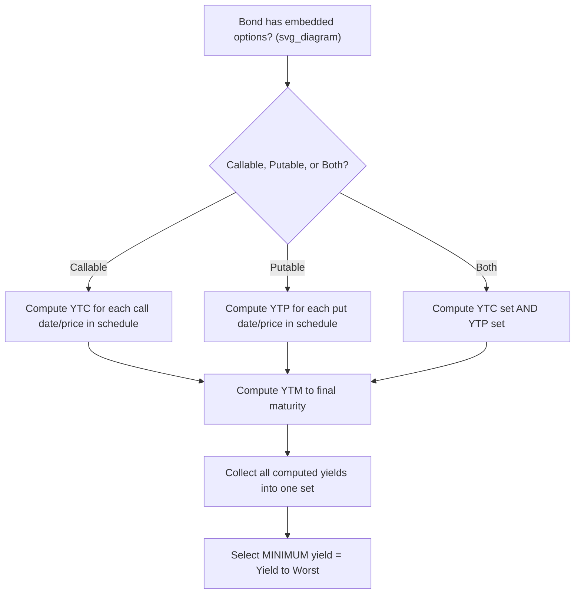

## Yield to Call, Yield to Put, and Yield to Worst

### Definitions

**Key Points**

- **Yield to Call (YTC)**: the IRR calculated assuming the bond is called (redeemed) by the issuer at the earliest (or a specified) call date and call price, rather than held to maturity.
- **Yield to Put (YTP)**: the IRR calculated assuming the bondholder exercises a put option, putting the bond back to the issuer at the earliest put date and put price.
- **Yield to Worst (YTW)**: the lowest yield among all possible yield measures for a bond — YTM, YTC (at each call date/price), and YTP (at each put date/price) — representing the most conservative assumption an investor should use for valuation.

### Yield to Call Calculation

The YTC equation mirrors the YTM equation, but substitutes the call date for maturity and the call price for face value:

$$P = \sum_{t=1}^{N_c} \frac{C}{(1+y_c)^t} + \frac{CP}{(1+y_c)^{N_c}}$$

where:

- $N_c$ = number of periods to the call date
- $CP$ = call price (often at a premium to par, e.g., 102 or 105, especially in early call windows)
- $y_c$ = periodic yield to call; annualized as $2y_c$ on a bond-equivalent basis for semiannual-pay bonds

**Example**

A 10-year, 7% semiannual coupon bond ($F = 1000$) is callable in 4 years at $CP = 1035$. The bond currently trades at $P = 1050$.

- Semiannual coupon: $C = 35$, $N_c = 8$ periods to call
- Solve: $1050 = \sum_{t=1}^{8}\frac{35}{(1+y_c)^t} + \frac{1035}{(1+y_c)^8}$
- Iterating: $y_c \approx 3.05\%$ per period

**Output**: YTC (BEY) ≈ $2 \times 3.05\% = 6.10\%$

Compare this to YTM (computed to the 10-year maturity at par redemption), which might be, say, 6.55%. Because the bond trades at a premium and the call price (1035) is below the current price trajectory implied by holding to maturity, YTC < YTM — a common pattern for premium callable bonds.

### Yield to Put Calculation

Structurally identical to YTC, but the cash flow at the put date uses the put price, and put prices are typically at or below par (though not always):

$$P = \sum_{t=1}^{N_p} \frac{C}{(1+y_p)^t} + \frac{PP}{(1+y_p)^{N_p}}$$

**Key Points**

- Putable bonds give the investor downside protection; if rates rise and the bond's price would otherwise fall below the put price, the investor puts the bond back.
- YTP is generally most relevant (i.e., becomes the "worst" or governing yield) when the bond trades at a **discount**, since a discount signals the market may be anticipating exercise of the put as advantageous to the holder relative to holding to maturity.

### Yield to Worst: Methodology

**Key Points**

- YTW is computed by calculating the yield to every embedded call date (at the corresponding call price), the yield to every put date (at the corresponding put price), and the yield to maturity, then selecting the **minimum** of this full set.
- For a bond with a call schedule (multiple call dates at declining premiums over time — a common structure), YTW requires computing YTC at *each* call date, not just the first.
- YTW is the standard conservative yield quoted for callable corporate and municipal bonds in practice, since it represents the worst-case return an investor could realize under any single deterministic redemption scenario.

**Example: Full Yield-to-Worst Table**

A 7% semiannual coupon, 10-year bond, currently priced at $1080$, with the following call schedule:

| Redemption Scenario | Date (yrs) | Redemption Price | Computed Yield (BEY) |
| --- | --- | --- | --- |
| Call 1 | 3 | 103 | 5.42% |
| Call 2 | 5 | 101.5 | 5.61% |
| Call 3 | 7 | 100.5 | 5.78% |
| Maturity (YTM) | 10 | 100 | 5.85% |

**Output**: Yield to Worst = **5.42%** (Call 1 scenario), since it is the minimum across all rows. An investor pricing or comparing this bond should use 5.42%, not the higher YTM, as the basis for relative value analysis.

### Diagram: Yield-to-Worst Selection Logic (svg_diagram)

### Why Premium vs. Discount Matters

| Bond Trades At | Governing Yield Typically | Rationale |
| --- | --- | --- |
| Premium (P > Call Price) | YTC likely lowest → governs YTW | Issuer has incentive to call away high-coupon debt when rates have fallen |
| Discount (P < Put Price) | YTP likely lowest/most relevant | Investor has incentive to put the bond back to issuer at above-market price |
| Near Par | YTM often governs | Neither option is deeply in-the-money |

**Key Points**

- This is a heuristic, not a guarantee: [Inference] actual optimal exercise depends on the issuer's or investor's economic incentives at each decision date, which are driven by prevailing rates relative to the bond's coupon and the option's moneyness at that specific time, not solely by the bond's current price relative to par.
- Issuers act rationally (approximately) to minimize their cost of borrowing, calling bonds when they can refinance more cheaply; investors act to maximize return, putting bonds when reinvestment opportunities exceed the bond's remaining yield.

### Relationship to Option-Adjusted Spread (OAS) Analysis

**Key Points**

- YTC, YTP, and YTW are all **static** yield measures — they assume one deterministic exercise scenario and ignore the probabilistic nature of interest rate paths.
- A more rigorous framework values the embedded option explicitly and computes an **option-adjusted spread (OAS)**, which accounts for the full distribution of possible rate paths and corresponding optimal exercise decisions via a binomial or Monte Carlo interest rate model.
- YTW remains widely used in practice as a quick, model-free conservative benchmark, particularly in municipal and corporate bond markets, despite its methodological limitations relative to OAS-based valuation.

### Practical Considerations

- **Make-whole call provisions**: some callable bonds use a make-whole premium formula (redemption price tied to a spread over a benchmark Treasury yield at the time of call) rather than a fixed schedule; YTC calculations for these require the make-whole formula rather than a static call price, and the "worst case" is less mechanically obvious.
- **Sinking fund provisions**: partial, scheduled mandatory redemptions can create additional yield-to-worst scenarios distinct from optional call features.
- **Yield to Par Call**: some data providers separately report a "yield to par call" — the yield assuming the bond is called at the first date where the call price equals par — as an additional benchmark distinct from yield to next call and to worst call.

**Related Topics**

- Yield to Maturity Calculation and Interpretation
- Option-Adjusted Spread (OAS) and Effective Duration for Callable Bonds
- Binomial Interest Rate Trees for Embedded Option Valuation
- Make-Whole Call Provisions and Redemption Mechanics
- Effective Convexity and Negative Convexity in Callable Bonds
- Municipal Bond Call Features and Par Call Conventions
- Sinking Fund Bonds and Mandatory Redemption Schedules