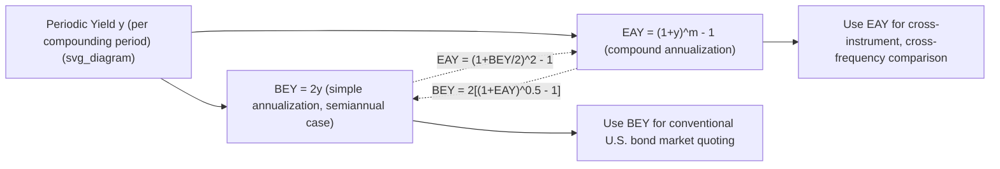

## Bond Equivalent Yield and Effective Annual Yield

### Definitions

**Key Points**

- **Bond-Equivalent Yield (BEY)**: an annualized yield convention that doubles the semiannual periodic yield, without compounding the second period's effect. It is a simple (not compound) annualization: $BEY = 2 \times y_{semiannual}$.
- **Effective Annual Yield (EAY)**, also called Effective Annual Rate (EAR): the true annualized yield that accounts for the compounding effect of reinvesting periodic cash flows within the year, computed by compounding the periodic rate over all periods in a year.
- Because BEY ignores intra-year compounding while EAY captures it, EAY is always greater than or equal to BEY for the same underlying periodic rate (equal only when the periodic rate is zero).

### Conversion Formulas

**From semiannual periodic yield to BEY:**

$$BEY = 2y$$

**From semiannual periodic yield to EAY:**

$$EAY = (1+y)^2 - 1$$

**From BEY to EAY directly:**

$$EAY = \left(1 + \frac{BEY}{2}\right)^2 - 1$$

**From EAY back to BEY:**

$$BEY = 2\left[(1+EAY)^{1/2} - 1\right]$$

**General case for $m$ compounding periods per year:**

$$EAY = \left(1 + \frac{r}{m}\right)^m - 1$$

where $r$ is the nominal annual rate (annual percentage rate, APR) and $m$ is the number of compounding periods per year.

### Worked Example

A bond has a semiannual periodic yield of $y = 3.5\%$.

**Step 1 — BEY:**

$$BEY = 2 \times 3.5\% = 7.00\%$$

**Step 2 — EAY:**

$$EAY = (1.035)^2 - 1 = 1.071225 - 1 = 7.1225\%$$

**Output**: BEY = 7.00%, EAY = 7.12%. The EAY is higher because it credits the investor with compound growth on the first semiannual coupon's reinvestment for the second half of the year, whereas BEY simply doubles the periodic rate with no such credit.

### Why the Distinction Matters

**Key Points**

- U.S. Treasury and corporate bond markets conventionally quote yields as BEY specifically so that semiannual-pay bonds can be compared to each other on a consistent (if compounding-understated) basis.
- Comparing a semiannual-pay bond's BEY directly against an annual-pay bond's stated yield, or against a money market instrument quoted on a different basis (discount yield, add-on yield), without conversion produces a misleading comparison, since the compounding frequencies differ.
- EAY is the theoretically correct basis for comparing instruments with different compounding frequencies (e.g., a semiannual-pay bond vs. a monthly-compounding certificate of deposit vs. an annual-pay Eurobond), because it normalizes all cash flow streams to a true annual compound growth rate.

### Comparing Instruments with Different Compounding Frequencies

| Instrument | Nominal Rate | Compounding | EAY |
| --- | --- | --- | --- |
| U.S. Treasury note | 6.00% (BEY) | Semiannual | $(1.03)^2 - 1 = 6.09\%$ |
| Monthly-compounding CD | 6.00% (nominal APR) | Monthly | $(1.005)^{12} - 1 = 6.17\%$ |
| Annual-pay Eurobond | 6.00% | Annual | $6.00\%$ (EAY = nominal rate) |

**Output**: Despite identical nominal (headline) rates of 6.00%, the true annualized returns differ: 6.00% (annual) < 6.09% (semiannual) < 6.17% (monthly). Higher compounding frequency at the same nominal rate always produces a higher EAY.

### Diagram: Yield Conversion Pathway (svg_diagram)

### Extension to Non-Semiannual Compounding

The general effective annual yield formula extends to any compounding frequency:

$$EAY = \left(1 + \frac{APR}{m}\right)^m - 1$$

| Compounding Frequency | $m$ |
| --- | --- |
| Annual | 1 |
| Semiannual | 2 |
| Quarterly | 4 |
| Monthly | 12 |
| Daily | 365 |
| Continuous | $m \to \infty$ |

**Continuous compounding limiting case:**

$$EAY_{continuous} = e^{APR} - 1$$

**Example**

An APR of 8% compounded continuously:

$$EAY = e^{0.08} - 1 = 1.08329 - 1 = 8.329\%$$

### Money Market Yield Conventions (Related Annualization Bases)

**Key Points**

- **Bank discount yield**: quotes the discount from face value as a percentage of face value, annualized on a 360-day basis — used for T-bills. This understates the true return because it uses face value (not purchase price) as the base and a 360-day year.
- **Money market yield (CD-equivalent yield)**: annualizes the holding period return using purchase price as the base and a 360-day year, correcting the base-value problem of bank discount yield but retaining the 360-day convention.
- **Bond-equivalent yield from money market yield**: adjusts the 360-day money market yield to a 365-day basis for comparability with bond yields.

$$BDY = \frac{D}{F} \times \frac{360}{t}$$

$$MMY = \frac{D}{P} \times \frac{360}{t} = \frac{365 \times BDY}{360 - (t \times BDY)}$$

where $D$ = dollar discount, $F$ = face value, $P$ = purchase price, $t$ = days to maturity.

**Key Points**

- These money-market conventions are conceptually distinct from BEY/EAY (which apply to coupon-bearing bond yields) but are frequently tested and applied together since analysts must move fluidly between discount-basis, add-on-basis (360-day), and bond-equivalent (365-day, compound) yield quotes when comparing short-term instruments to bonds.

### Practical Pitfalls

- **Mixing conventions**: adding, averaging, or directly comparing a BEY-quoted bond's yield to an EAY-quoted deposit rate without conversion is a common analytical error that understates or overstates relative attractiveness.
- **Portfolio-level yield calculations**: when aggregating yields across a portfolio containing both semiannual-pay bonds and instruments compounding differently (or annual-pay Eurobonds), converting all yields to a common basis (typically EAY) is required for a valid weighted-average portfolio yield.
- **Small differences compound over long horizons**: [Inference] the gap between BEY and EAY is modest at low rates and short horizons but becomes more consequential for total-return comparisons over long holding periods or in higher-rate environments, since compounding effects accumulate multiplicatively over time.

**Related Topics**

- Yield to Maturity Calculation and Interpretation
- Money Market Yield Conventions (Discount Yield, Add-On Yield, CD-Equivalent Yield)
- Day Count Conventions (30/360, Actual/Actual, Actual/360)
- Compounding Frequency and the Time Value of Money
- Total Return Analysis and Horizon Yield
- Yield Curve Construction Across Different Compounding Bases