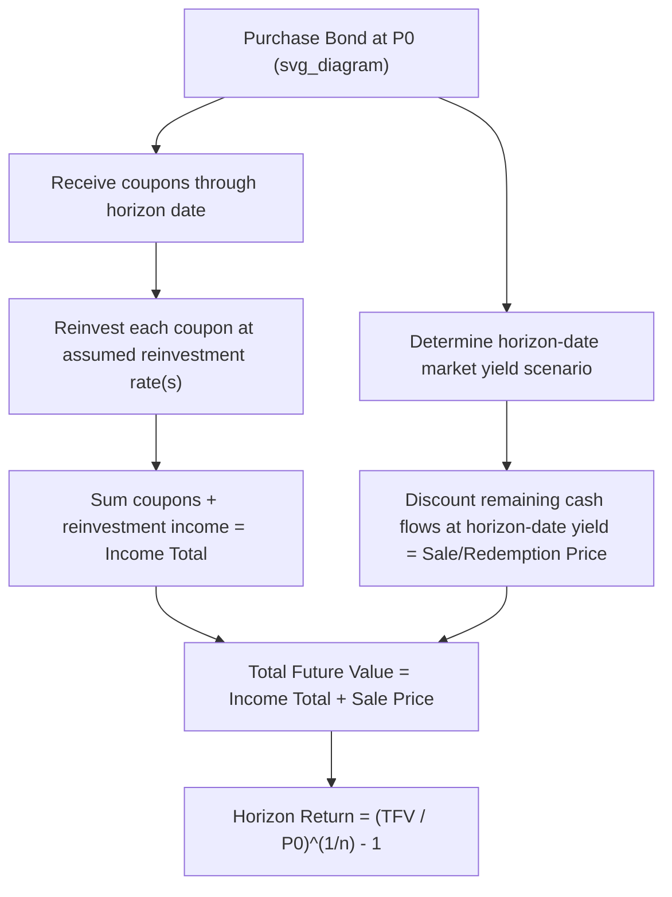

## Total Return and Horizon Return Analysis

### Definitions

**Key Points**

- **Total Return**: the complete return earned on a bond investment over a holding period, incorporating three components — coupon income, reinvestment income on coupons, and capital gain/loss from price appreciation or depreciation at the horizon date (whether sold or matured).
- **Horizon Return (Realized Return)**: the annualized total return actually earned over a specific, defined investment horizon, which may be shorter than, equal to, or (in principle) span beyond the bond's maturity. Horizon analysis relaxes the restrictive YTM assumptions by allowing explicit, independently specified reinvestment rates and horizon-date yield/price scenarios.
- Horizon return analysis directly addresses the primary limitation of YTM: YTM assumes reinvestment of all coupons at the YTM rate itself, which is unlikely to hold in practice given that interest rates fluctuate over the holding period.

### Total Return Framework: Three Components

$$\text{Total Future Value} = \underbrace{\sum \text{Coupons}}_{\text{Income}} + \underbrace{\text{Reinvestment Income on Coupons}}_{\text{Compounding effect}} + \underbrace{\text{Sale or Redemption Price}}_{\text{Capital gain/loss}}$$

$$\text{Total Return} = \left(\frac{\text{Total Future Value}}{\text{Purchase Price}}\right)^{1/n} - 1$$

where $n$ is the number of periods (or years, depending on annualization convention) in the holding period.

**Key Points**

- The **reinvestment income** component itself has two pieces: (1) interest earned by reinvesting each coupon payment from its receipt date to the horizon date, and (2) "interest-on-interest" — the compound interest earned on previously reinvested coupon interest.
- The relative importance of reinvestment income versus capital gain/loss grows with the length of the holding period and the level of the coupon rate: long-horizon, high-coupon bonds derive a large fraction of total return from reinvestment, making them more sensitive to the reinvestment rate assumption.

### Step-by-Step Calculation Procedure

**Step 1**: Project all coupon cash flows to be received during the holding period.

**Step 2**: Compute the future value of each coupon reinvested from its payment date to the horizon date, at the assumed reinvestment rate.

**Step 3**: Sum reinvested coupon values to get total coupon + reinvestment income at the horizon.

**Step 4**: Determine the bond's price at the horizon date — either its known redemption value (if held to maturity) or its projected sale price, computed by discounting the bond's remaining cash flows (as of the horizon date) at the assumed horizon-date market yield.

**Step 5**: Sum Step 3 and Step 4 to get total future value.

**Step 6**: Solve for the periodic and annualized horizon return using the total future value against the original purchase price.

### Worked Example

A 6-year, 8% annual-pay coupon bond ($F = 1000$) is purchased today at par ($P_0 = 1000$). The investor's holding period (horizon) is 3 years. Assume:

- Coupons are reinvested at 7% annually
- At the end of year 3, market yields for the remaining 3-year bond have risen to 9%

**Step 1–3: Coupon reinvestment**

| Coupon Received (End of Year) | Years to Reinvest to Horizon | FV at 7% |
| --- | --- | --- |
| Year 1 ($80) | 2 | $80 \times (1.07)^2 = 91.59$ |
| Year 2 ($80) | 1 | $80 \times (1.07)^1 = 85.60$ |
| Year 3 ($80) | 0 | $80.00$ |
| **Total** |  | **257.19** |

**Step 4: Horizon sale price**

Remaining cash flows at horizon (3 years left, 8% coupon, discounted at new market yield of 9%):

$$P_3 = \sum_{t=1}^{3}\frac{80}{(1.09)^t} + \frac{1000}{(1.09)^3} = 202.68 + 772.18 = 974.87$$

**Step 5: Total future value**

$$TFV = 257.19 + 974.87 = 1232.06$$

**Step 6: Horizon return**

$$\left(\frac{1232.06}{1000}\right)^{1/3} - 1 = (1.23206)^{0.3333} - 1 = 7.20\%$$

**Output**: The 3-year annualized horizon return is **7.20%**, notably below the bond's original YTM of 8.00% at purchase — because the rise in market yields (from 8% to 9%) produced a capital loss at the horizon (974.87 < 1000) that outweighed the modest reinvestment income earned, even though reinvestment occurred below the original coupon rate as well.

### Diagram: Horizon Return Building Blocks (svg_diagram)

### Sensitivity to Reinvestment Rate and Horizon Yield Scenarios

**Key Points**

- Horizon analysis is typically performed under multiple scenarios (a scenario grid or matrix) varying both the reinvestment rate and the horizon-date yield, to assess the range of possible realized returns.
- A rise in interest rates has two offsetting effects: it **increases** reinvestment income (coupons reinvested at higher rates) but **decreases** the horizon sale price (higher discount rate lowers present value of remaining cash flows) — this is the basis of the "immunization" concept, where a specific horizon can be chosen at which these two effects approximately offset.
- A fall in interest rates has the opposite offsetting pattern: lower reinvestment income but higher horizon sale price.

**Example: Scenario Matrix**

| Reinvestment Rate ↓ / Horizon Yield → | 7% | 8% | 9% |
| --- | --- | --- | --- |
| 6% | 7.85% | 7.42% | 7.01% |
| 7% | 8.02% | 7.60% | 7.20% |
| 8% | 8.20% | 7.78% | 7.38% |

*(Illustrative figures for the 3-year horizon example above, varying both assumptions.)*

**Output**: The matrix shows horizon return is more sensitive to the horizon-date yield assumption (capital gain/loss channel) than to the reinvestment rate assumption in this particular short-horizon, moderate-coupon example — though the relative sensitivity shifts toward reinvestment rate dominance for longer horizons and higher coupons.

### Relationship to Duration and Immunization

**Key Points**

- The horizon length at which price risk (sensitivity to horizon-date yield) and reinvestment risk (sensitivity to reinvestment rate) exactly offset is approximately equal to the bond's (or portfolio's) **Macaulay duration** — this is the theoretical foundation of classical single-period immunization strategies.
- For horizons shorter than Macaulay duration, reinvestment risk dominates less and price risk dominates more (the position behaves more like a direct price bet).
- For horizons longer than Macaulay duration, reinvestment risk dominates: the investor benefits from rising rates on net, since reinvestment income effects outweigh the capital loss.

### Applications of Horizon Analysis

- **Bond swap evaluation**: comparing the horizon return of holding a current bond versus selling and purchasing a different bond, under a common horizon and consistent reinvestment/yield assumptions.
- **Performance attribution**: decomposing realized portfolio returns into income, price change, and currency/reinvestment components for reporting purposes.
- **Liability-driven investing / immunization**: structuring a bond or portfolio duration to match a known liability horizon, insulating realized return from interest rate risk at that horizon (subject to assumptions of parallel yield curve shifts and no reinvestment of cash flows at other than the immunizing rate).
- **Active total return management**: evaluating whether an active bet on interest rate direction, sector rotation, or credit views is expected to outperform a passive buy-and-hold horizon return.

### Distinguishing Horizon Return from YTM

| Aspect | Yield to Maturity | Horizon Return |
| --- | --- | --- |
| Holding period | Assumed = full maturity | Explicitly specified, can be shorter/longer |
| Reinvestment rate | Assumed = YTM itself | Independently specified, can vary by scenario |
| Terminal value | Face value at maturity | Projected sale price or redemption, scenario-dependent |
| Realism | Theoretical construct | Reflects realistic, scenario-based expected/actual outcomes |

[Inference: the appropriate reinvestment rate and horizon yield assumptions in practice depend on the analyst's interest rate forecast or the scenario being stress-tested, and different reasonable analysts may select materially different inputs, producing different horizon return estimates for the same bond.]

**Related Topics**

- Yield to Maturity Calculation and Interpretation
- Macaulay Duration and Classical Immunization Theory
- Reinvestment Risk vs. Price (Market) Risk
- Bond Swap Analysis and Relative Value Trading
- Scenario Analysis and Interest Rate Stress Testing
- Effective Duration and Convexity for Bonds with Embedded Options
- Liability-Driven Investing and Cash Flow Matching