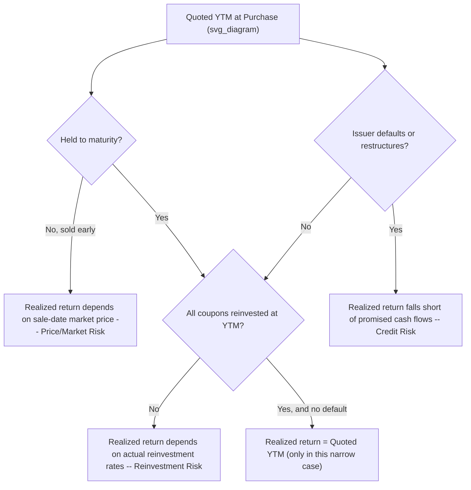

## Limitations of Yield to Maturity as a Risk Measure

### Overview

**Key Points**

- Yield to maturity (YTM) is a **return** measure derived under restrictive assumptions, not a direct measure of risk. Using it as a proxy for risk, or assuming a stated YTM will be realized, conflates promised yield with expected or actual outcomes.
- The primary embedded assumptions in YTM — full holding to maturity, reinvestment of all coupons at the YTM rate, and no default — each represent a distinct channel through which realized outcomes can diverge from the quoted YTM.
- YTM says nothing about the **path** or **variability** of returns over the holding period, nor about the probability distribution of possible outcomes — it is a single deterministic number, not a risk-adjusted or probability-weighted measure.

### Assumption 1: Reinvestment at the YTM Rate (Reinvestment Risk)

**Key Points**

- YTM implicitly assumes every coupon payment is reinvested at exactly the YTM rate until maturity. In practice, market rates fluctuate, so coupons will be reinvested at whatever rates prevail when each payment is received.
- This creates **reinvestment risk**: if rates fall after purchase, coupons are reinvested at lower rates than YTM, and realized return falls short of quoted YTM. If rates rise, realized return can exceed YTM.
- Reinvestment risk is **larger** for bonds with: higher coupon rates (more cash flow to reinvest), longer maturities (more reinvestment periods and more compounding of the deviation), and no reinvestment risk at all for zero-coupon bonds held to maturity (since there are no interim cash flows to reinvest — the zero-coupon bond's realized return equals its YTM exactly if held to maturity).

$$\text{Realized Return} \neq YTM \text{ whenever reinvestment rates} \neq YTM \text{ over the holding period}$$

### Assumption 2: Holding to Maturity (Price/Market Risk)

**Key Points**

- YTM is calculated as of the purchase date and assumes the bond is never sold before maturity. If the bond is sold early, the investor realizes the prevailing market price at the sale date, which reflects then-current yields — not the original YTM.
- If market yields have **risen** since purchase, the bond's price will have fallen, and selling before maturity locks in a capital loss relative to the return path implied by the original YTM.
- If market yields have **fallen**, early sale can produce a realized return **above** the original YTM (capital gain), which is the mirror-image effect of the same price risk.
- This price risk (also called market risk or interest rate risk) is captured more directly by **duration** and **convexity**, not by YTM itself, since YTM is silent on the magnitude of price change for a given yield change.

### Assumption 3: No Default (Credit Risk)

**Key Points**

- YTM is a **promised** yield calculated from contractual cash flows (scheduled coupons and full principal at maturity), assuming every payment is made in full and on time.
- If the issuer defaults, is downgraded, or restructures, actual cash flows received are less than (or later than) the contractual schedule, and realized return can fall dramatically below — even turn negative relative to — the quoted YTM.
- For bonds with meaningful credit risk, YTM should be understood as an **upper bound** on likely realized return, not an expected value; the wider the credit spread embedded in the YTM, the larger the market's implied compensation for default risk, but YTM itself does not decompose or quantify that risk.
- This is why analysts distinguish **expected yield** (probability-weighted across default and non-default scenarios) from the **promised/stated YTM**, particularly for high-yield or distressed credits.

### Diagram: Sources of Divergence Between YTM and Realized Return (svg_diagram)

### Additional Structural Limitations

**Key Points**

- **Flat discount rate assumption**: YTM discounts every cash flow of a bond at the same single rate, regardless of when that cash flow occurs. This implicitly assumes a flat yield curve, which is rarely observed in practice; the true present value of a coupon bond's cash flows should, in principle, use the spot rate applicable to each specific maturity.
- **Not comparable across bonds with different cash flow patterns**: two bonds can share an identical YTM but have very different coupon structures (e.g., a high-coupon short-duration bond vs. a low-coupon long-duration bond), and therefore very different reinvestment risk, price risk, and effective duration — YTM alone obscures this.
- **Ignores optionality**: for callable or putable bonds, plain YTM (to final maturity) does not reflect the value or the exercise risk of the embedded option; the practitioner must instead reference yield-to-call, yield-to-put, or yield-to-worst (and ultimately option-adjusted spread) to capture the effect of optionality on return.
- **Ignores liquidity and taxation**: YTM as conventionally quoted excludes transaction costs, bid-ask spread effects on realized entry/exit price, and the effect of differing tax treatment of coupon income versus capital gains — all of which affect the investor's actual after-cost, after-tax realized return.

### Comparison Table: What YTM Captures vs. Omits

| Factor | Captured by YTM? | Better Captured By |
| --- | --- | --- |
| Contractual promised cash flows | Yes | — |
| Reinvestment rate variability | No | Horizon return / scenario analysis |
| Early-sale price risk | No | Duration, convexity |
| Default/credit risk | No (assumes none) | Credit spread analysis, expected loss models |
| Non-flat yield curve effects | No (assumes flat) | Spot-rate (zero-coupon) valuation |
| Embedded option effects | No (plain YTM to maturity) | YTC, YTP, YTW, OAS |
| Interest rate sensitivity magnitude | No | Modified/effective duration, convexity |
| Transaction costs, taxes | No | After-cost/after-tax return analysis |

### Why YTM Remains Widely Used Despite These Limitations

**Key Points**

- YTM is a **convenient, standardized summary statistic** that condenses a full cash flow schedule and market price into a single comparable number, enabling quick relative-value comparison across bonds.
- It provides a reasonable approximation of expected return for high-quality, non-callable bonds held in a relatively stable rate environment, where reinvestment risk and price risk are of secondary concern relative to headline comparability.
- Practitioners address YTM's limitations by pairing it with complementary measures: duration/convexity for price risk, horizon/total return analysis for reinvestment risk, and OAS for optionality — rather than discarding YTM altogether. [Inference: the specific combination of supplementary measures used varies by market convention, asset class, and the analyst's purpose, so no single "correct" supplementary framework applies universally.]

### Illustrative Case: Same YTM, Different Risk Profiles

Two bonds, both with YTM = 6.00%:

| Bond | Coupon | Maturity | Reinvestment Risk | Price Risk (Duration) |
| --- | --- | --- | --- | --- |
| A | 2% | 3 years | Low (little cash flow to reinvest) | Low (short duration) |
| B | 9% | 20 years | High (large, frequent reinvestment) | High (long duration, though partially offset by high coupon) |

**Output**: Despite identical YTM, Bond B's realized return is far more sensitive to future interest rate paths than Bond A's — a distinction entirely invisible if YTM is used in isolation as a summary risk-return metric.

**Related Topics**

- Yield to Maturity Calculation and Interpretation
- Total Return and Horizon Return Analysis
- Reinvestment Risk vs. Price (Market) Risk
- Macaulay, Modified, and Effective Duration
- Convexity and Price-Yield Curve Nonlinearity
- Credit Spread Analysis and Expected vs. Promised Yield
- Option-Adjusted Spread (OAS) for Callable and Putable Bonds
- Spot Rate Valuation and the Term Structure of Interest Rates