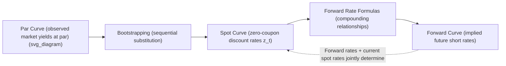

## Par Curve, Spot Curve, and Forward Curve Relationships

### Definitions

**Key Points**

- **Par Curve**: the set of yields-to-maturity for hypothetical coupon-paying bonds priced at exactly par (100), across a range of maturities. Each point represents the coupon rate a bond of that maturity would need to trade at par given current market conditions.
- **Spot Curve (Zero-Coupon Curve)**: the set of yields on zero-coupon bonds (or theoretical zeros) across maturities. Each spot rate $z_t$ is the appropriate discount rate for a single cash flow to be received at time $t$, with no interim reinvestment assumption embedded.
- **Forward Curve**: the set of implied future short-term (or period-specific) interest rates, derived from the spot curve, representing the market's implied rate for borrowing/lending over a specific future period, as embedded in today's term structure.

### Why Three Curves Exist

**Key Points**

- The par curve is the most directly **observable** curve, since it is built from actual (or interpolated) market yields of coupon bonds trading near par.
- The spot curve is not directly observable for most maturities (true zero-coupon bonds are scarce beyond short maturities in most markets) and must be **derived** from the par curve via bootstrapping.
- The forward curve is entirely a **derived/implied** construct, calculated from the spot curve, and represents breakeven future rates rather than a directly quoted market rate (though forward rate agreements and futures provide market-based estimates that can be compared to it).

### Bootstrapping: From Par Curve to Spot Curve

The bootstrapping algorithm sequentially solves for each spot rate using the previously-solved shorter spot rates, given that a par bond's price (100) must equal the present value of its cash flows discounted at the appropriate spot rate for each cash flow date.

**General bootstrapping equation for period $n$:**

$$100 = \sum_{t=1}^{n-1} \frac{C_n}{(1+z_t)^t} + \frac{100 + C_n}{(1+z_n)^n}$$

Solve for $z_n$ using the already-known $z_1, z_2, \ldots, z_{n-1}$ from prior steps.

**Example: 3-Period Bootstrap**

Given par yields: 1-year = 3.00%, 2-year = 3.50%, 3-year = 4.00% (annual-pay, par = 100).

**Step 1 (1-year spot)**: A 1-year par bond has only one cash flow, so the spot rate equals the par yield directly:

$$z_1 = 3.00\%$$

**Step 2 (2-year spot)**: The 2-year par bond pays a 3.50 coupon in year 1 and 103.50 in year 2:

$$100 = \frac{3.50}{(1.03)^1} + \frac{103.50}{(1+z_2)^2}$$

$$100 = 3.398 + \frac{103.50}{(1+z_2)^2}$$

$$(1+z_2)^2 = \frac{103.50}{96.602} = 1.07141$$

$$z_2 = 3.508\%$$

**Step 3 (3-year spot)**: The 3-year par bond pays 4.00 in years 1 and 2, and 104.00 in year 3:

$$100 = \frac{4.00}{(1.03)^1} + \frac{4.00}{(1.03508)^2} + \frac{104.00}{(1+z_3)^3}$$

$$100 = 3.883 + 3.734 + \frac{104.00}{(1+z_3)^3}$$

$$(1+z_3)^3 = \frac{104.00}{92.383} = 1.12578$$

$$z_3 = 4.028\%$$

**Output**: Spot curve = {$z_1$ = 3.00%, $z_2$ = 3.508%, $z_3$ = 4.028%}. Note each spot rate is slightly above the corresponding par rate once maturities extend beyond 1 year — a pattern that holds whenever the curve is upward-sloping, since the par yield is a blended average of a bond's own cash flows' spot rates, weighted toward earlier (lower) spot rates by the coupon payments.

### Diagram: Par-to-Spot-to-Forward Derivation Chain (svg_diagram)

### Deriving Forward Rates from the Spot Curve

The forward rate $f(t_1, t_2)$ — the implied rate for the period between $t_1$ and $t_2$ — satisfies the no-arbitrage compounding identity:

$$(1+z_{t_2})^{t_2} = (1+z_{t_1})^{t_1} \times (1+f(t_1,t_2))^{(t_2-t_1)}$$

Solving for the forward rate:

$$f(t_1,t_2) = \left[\frac{(1+z_{t_2})^{t_2}}{(1+z_{t_1})^{t_1}}\right]^{1/(t_2-t_1)} - 1$$

**Example: 1-Year Forward Rate, One Year From Now ("1y1y")**

Using the spot curve derived above ($z_1 = 3.00\%$, $z_2 = 3.508\%$):

$$f(1,2) = \frac{(1.03508)^2}{(1.03)^1} - 1 = \frac{1.07141}{1.03} - 1 = 4.020\%$$

**Output**: The market's implied 1-year rate, one year forward, is 4.02%. This is the rate that would make an investor indifferent between (a) investing for 2 years at the 2-year spot rate, or (b) investing for 1 year at the 1-year spot rate and then reinvesting for a second year at the forward rate — the **no-arbitrage** condition underlying all forward rate derivation.

### Forward Rate Notation Conventions

- $_{1}f_{1}$ or "1y1y": the 1-year rate, 1 year from now
- $_{2}f_{1}$ or "2y1y": the 1-year rate, 2 years from now
- $_{1}f_{2}$ or "1y2y": the 2-year rate, 1 year from now

**Key Points**

- Notation varies across textbooks and market practice; always confirm which convention (subscript order, "starting period + tenor" vs. "tenor + starting period") a given source uses before interpreting a forward rate figure.

### Relationships and Interpretation

| Curve Shape | Par vs. Spot | Spot vs. Forward |
| --- | --- | --- |
| Upward-sloping (normal) | Spot > Par (beyond 1yr) | Forward > Spot |
| Downward-sloping (inverted) | Spot < Par (beyond 1yr) | Forward < Spot |
| Flat | Spot ≈ Par ≈ Forward | Forward ≈ Spot |

**Key Points**

- When the spot curve is upward-sloping, each successive forward rate must be higher than the current spot rate for that starting maturity, because the forward rate is effectively the marginal rate needed to "pull up" the longer spot rate given the shorter one — this follows directly and necessarily from the compounding identity, not from a market expectations forecast.
- The **par curve always lies between** the shortest spot rate and the longest spot rate for a given maturity range, since a par yield is a weighted average of the spot rates applicable to each of the bond's cash flows.

### Using the Spot Curve for Bond Valuation (Arbitrage-Free Valuation)

**Key Points**

- Valuing a coupon bond by discounting each cash flow at its own maturity-matched spot rate (rather than a single YTM) produces the theoretically correct, arbitrage-free price — this is the basis for identifying bonds that are "cheap" or "rich" relative to the curve.
- If a bond's market price differs from its spot-curve-implied (arbitrage-free) value, in principle it could be stripped into its component cash flows and reconstituted (or replicated with other bonds) to exploit the discrepancy, though real-world transaction costs, liquidity, and market frictions limit the practical scale of such arbitrage. [Inference: the persistence and exploitability of any specific mispricing depends on prevailing market frictions, which vary by market and over time.]

$$P_{arbitrage-free} = \sum_{t=1}^{N} \frac{C}{(1+z_t)^t} + \frac{F}{(1+z_N)^N}$$

### Interpreting the Forward Curve: Two Competing Views

**Key Points**

- **Pure/unbiased expectations hypothesis**: forward rates are unbiased predictors of future realized spot rates — the market's forward curve directly reflects the average expectation of where short rates will be in the future.
- **Liquidity preference / term premium view**: forward rates embed both a rate expectation **and** a term (liquidity/risk) premium demanded by investors for holding longer-maturity instruments, meaning forward rates are systematically biased predictors (typically upward-biased) of future realized spot rates.
- Empirically, forward rates have historically been imperfect predictors of subsequent realized spot rates; [Inference: the extent and direction of any forecasting bias is debated in the academic literature and can vary by market regime, so this should not be treated as a settled, universally quantified relationship].

### Practical Applications

- **Relative value analysis**: comparing a bond's actual market yield to its spot-curve-implied fair yield to identify rich/cheap securities.
- **Break-even analysis for rate views**: an investor who believes future rates will be lower than what is implied by the forward curve has an incentive to extend duration (buy longer bonds); an investor who believes rates will rise faster than implied has an incentive to shorten duration or position for higher forwards.
- **Pricing interest rate derivatives**: forward rate agreements (FRAs), interest rate swaps, and other derivatives are priced directly off the forward curve derived from the underlying spot/swap curve.
- **Curve construction for OAS and option-pricing models**: binomial interest rate trees used for valuing embedded options are calibrated to be consistent with the observed spot/par curve, ensuring the tree correctly reprices the underlying benchmark bonds.

**Related Topics**

- Yield to Maturity Calculation and Interpretation
- Bootstrapping Methodology and Curve Construction Techniques
- Expectations Theories of the Term Structure (Pure, Liquidity Preference, Preferred Habitat, Market Segmentation)
- Forward Rate Agreements and Swap Curve Construction
- Key Rate Duration and Non-Parallel Yield Curve Shifts
- Arbitrage-Free Bond Valuation Using Spot Rates
- Binomial Interest Rate Trees for Option-Embedded Securities