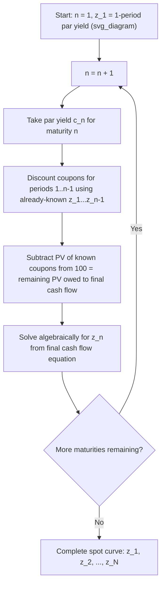

## Bootstrapping the Spot Rate Curve

### Definition and Purpose

**Key Points**

- **Bootstrapping** is the iterative, sequential process of deriving zero-coupon (spot) interest rates from the observed prices or yields of coupon-bearing bonds (typically par bonds), one maturity at a time, using previously-derived shorter spot rates as inputs.
- The method rests on the no-arbitrage principle that a coupon bond's price must equal the sum of its cash flows, each discounted at the spot rate matching its own specific maturity — not a single blended yield.
- Bootstrapping is necessary because true zero-coupon bonds are scarce or nonexistent at most maturities in most markets (with some exceptions, e.g., U.S. Treasury STRIPS), so spot rates must be inferred rather than observed directly.

### The Core Recursive Equation

For a par bond of maturity $n$ with annual coupon rate $c_n$ (in percent of par, per period) and par value 100:

$$100 = \sum_{t=1}^{n-1} \frac{c_n \times 100}{(1+z_t)^t} + \frac{100(1+c_n)}{(1+z_n)^n}$$

All spot rates $z_1, \ldots, z_{n-1}$ are already known from prior bootstrap steps; the equation is solved algebraically for the single unknown $z_n$:

$$z_n = \left[\frac{100(1+c_n)}{100 - \sum_{t=1}^{n-1}\frac{c_n \times 100}{(1+z_t)^t}}\right]^{1/n} - 1$$

### Step-by-Step Procedure

**Step 1**: Obtain the par curve (par yields at each maturity of interest), either from directly observed on-the-run bond yields or from an interpolated/smoothed par curve.

**Step 2**: Set $z_1$ equal to the 1-period par yield (since a 1-period bond has only a single cash flow, its yield is already a pure spot rate — no bootstrapping needed for the first point).

**Step 3**: For each subsequent maturity $n = 2, 3, \ldots$, use the par yield $c_n$ and all previously solved spot rates $z_1, \ldots, z_{n-1}$ to solve for $z_n$ using the recursive equation above.

**Step 4**: Repeat until spot rates have been derived for every maturity point on the curve.

### Worked Example: 4-Year Bootstrap

Given the following par curve (annual-pay, par = 100):

| Maturity | Par Yield |
| --- | --- |
| 1 year | 2.50% |
| 2 year | 3.00% |
| 3 year | 3.40% |
| 4 year | 3.70% |

**Year 1:**

$$z_1 = 2.50\%$$

**Year 2:**

$$100 = \frac{3.00}{(1.025)^1} + \frac{103.00}{(1+z_2)^2}$$

$$100 = 2.927 + \frac{103.00}{(1+z_2)^2}$$

$$(1+z_2)^2 = \frac{103.00}{97.073} = 1.06105$$

$$z_2 = 3.007\%$$

**Year 3:**

$$100 = \frac{3.40}{(1.025)^1} + \frac{3.40}{(1.03007)^2} + \frac{103.40}{(1+z_3)^3}$$

$$100 = 3.317 + 3.205 + \frac{103.40}{(1+z_3)^3}$$

$$(1+z_3)^3 = \frac{103.40}{93.478} = 1.10613$$

$$z_3 = 3.415\%$$

**Year 4:**

$$100 = \frac{3.70}{(1.025)^1} + \frac{3.70}{(1.03007)^2} + \frac{3.70}{(1.03415)^3} + \frac{103.70}{(1+z_4)^4}$$

$$100 = 3.610 + 3.488 + 3.342 + \frac{103.70}{(1+z_4)^4}$$

$$(1+z_4)^4 = \frac{103.70}{89.560} = 1.15789$$

$$z_4 = 3.727\%$$

**Output**: Bootstrapped spot curve = {2.50%, 3.007%, 3.415%, 3.727%}. Note each spot rate exceeds the corresponding par rate by a small, growing margin — the expected pattern for an upward-sloping curve, since each par yield is a coupon-weighted blend that is pulled down by the lower earlier-year spot rates.

### Diagram: Bootstrap Recursion Flow (svg_diagram)

### Handling Non-Annual and Irregular Curves

**Key Points**

- For **semiannual-pay** bonds (the U.S. Treasury convention), the same recursive logic applies but with periods measured in half-years and coupon rates halved; each $z_t$ is then a semiannual periodic spot rate, subsequently annualized (often on a bond-equivalent basis, $2z_t$) for reporting.
- When the observed par curve does not have data at every required maturity point (e.g., par yields exist at 2, 5, 10, 30 years but not every year in between), **interpolation** (linear, cubic spline, or other smoothing methods) is used to fill in intermediate par yields before bootstrapping, or alternatively bootstrapping proceeds using only the available liquid maturities with coupon cash flows in between mapped to interpolated discount factors.
- **Interpolation choice materially affects the resulting spot curve** in the interpolated regions; different smoothing methodologies (linear on yields, linear on log discount factors, cubic splines, Nelson-Siegel/Svensson parametric models) can produce different implied spot and forward rates even from the identical set of input par yields. [Inference: the "correct" interpolation method is a modeling choice rather than a uniquely determined mathematical fact, and practitioners differ on which method best balances smoothness against fidelity to observed market data.]

### Common Data Sources for Bootstrapping

| Market Segment | Typical Input Curve |
| --- | --- |
| U.S. Treasuries | On-the-run Treasury yields (par-like, since new issues price near par) |
| Interest rate swaps | Par swap rates (fixed leg rates that make swap NPV = 0 at initiation) |
| Corporate bonds | Often bootstrapped from a benchmark government/swap curve, then a credit spread is added |
| LIBOR/SOFR-based curves | Combination of deposit rates (short end), futures/FRAs (belly), and swap rates (long end), each requiring specific conversion conventions before bootstrapping |

**Key Points**

- Swap curve bootstrapping follows the same mathematical logic as bond curve bootstrapping but uses par swap rates (since a newly initiated swap has zero value, analogous to a bond priced at par) as the coupon-equivalent input.
- Combining different instrument types (deposits, futures, swaps) within a single bootstrap requires careful handling of day-count convention differences, compounding frequency differences, and the convexity adjustment needed when converting futures-implied rates to forward rates (since futures rates and forward rates diverge due to daily margining effects). [Unverified: the precise magnitude of the futures-forward convexity adjustment is model-dependent and varies with volatility assumptions and time to expiry.]

### Common Errors and Pitfalls

**Key Points**

- **Using YTM instead of par yield as the bootstrap input**: bootstrapping requires par yields (or equivalently, actual market prices) specifically because the algorithm relies on the bond trading at a known price (100, for a par bond) — using an arbitrary premium/discount bond's YTM without its actual price does not fit directly into the standard recursive formula without modification.
- **Compounding/day-count mismatches**: mixing annual-pay coupon conventions with semiannual spot rate outputs (or vice versa) without proper conversion produces internally inconsistent spot curves.
- **Extrapolation beyond the longest available maturity**: spot rates beyond the longest observed par yield require extrapolation assumptions (e.g., holding the last forward rate constant) that introduce additional model risk not present in the bootstrapped (interpolated) region.
- **Negative or declining forward rates from a bootstrap**: while mathematically possible outputs of the bootstrap algorithm, unusual results (e.g., a bootstrapped spot rate lower than an adjacent shorter spot rate in a way inconsistent with the input par curve's shape) often signal a data quality issue, stale quotes, or a computational error rather than a genuine market feature, and should prompt a check of the input data.

### Applications of the Bootstrapped Spot Curve

- **Arbitrage-free bond valuation**: discounting any bond's cash flows at maturity-matched spot rates to determine fair value and identify rich/cheap securities relative to the curve.
- **Forward rate derivation**: the bootstrapped spot curve is the direct input for computing implied forward rates via the compounding no-arbitrage identity.
- **Derivative pricing**: swap, cap/floor, and swaption pricing models require a bootstrapped discount curve (increasingly a SOFR-based curve post-LIBOR transition) as a foundational input.
- **OAS and binomial tree calibration**: interest rate trees used to value callable/putable bonds are calibrated so that they exactly reproduce the bootstrapped spot curve for benchmark (option-free) bonds, ensuring internal consistency between the model and observed market prices.

**Related Topics**

- Par Curve, Spot Curve, and Forward Curve Relationships
- Yield to Maturity Calculation and Interpretation
- Interpolation Methods for Yield Curve Construction (Linear, Spline, Nelson-Siegel)
- Swap Curve Construction and SOFR Discounting
- Arbitrage-Free Valuation Using Spot Rates
- Binomial Interest Rate Tree Calibration
- Futures-Forward Convexity Adjustment