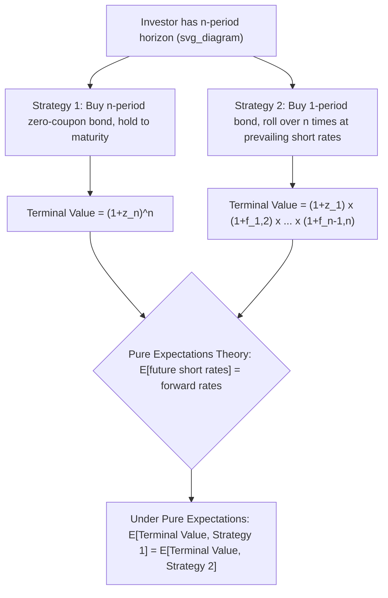

## Expectations Theory of the Term Structure

### Overview

**Key Points**

- The **expectations theory** (also called the expectations hypothesis) posits that the shape of the yield curve is determined primarily by market participants' expectations of future short-term interest rates.
- Under this framework, long-term rates are essentially an average (in some compounded form) of current and expected future short-term rates, meaning the curve's slope directly encodes the market's collective forecast of the future path of rates.
- The theory exists in several variants — pure/unbiased expectations, local expectations, return-to-maturity expectations, and yield-to-maturity expectations — which differ in exactly *which* form of return equivalence they assume holds across maturities.

### Pure (Unbiased) Expectations Theory

**Key Points**

- States that today's forward rates are **unbiased predictors** of future realized spot rates — no risk premium is embedded in forward rates, and any differences between short- and long-term bonds' expected returns are entirely explained by rate expectations.
- Implies that an investor is indifferent, in expected-return terms, between (a) investing in a long-maturity bond for the full period and (b) investing in a series of shorter-maturity bonds and rolling over the investment, because expected returns over any common holding period are equalized across strategies.
- Mathematically, this means the $n$-period spot rate is a geometric average of the current and expected future short-term rates:

$$(1+z_n)^n = (1+z_1)(1+E[f_{1,2}])(1+E[f_{2,3}])\cdots(1+E[f_{n-1,n}])$$

where $E[f_{t,t+1}]$ denotes the market's *expected* future one-period rate, which under pure expectations theory equals the *actual* forward rate implied by today's curve.

### Local Expectations Theory

**Key Points**

- A weaker, narrower version of the expectations hypothesis: it holds only that the **expected short-term (holding period) return** on bonds of *all* maturities is equal over a short investment horizon (e.g., over the next period), not that yields themselves are unbiased predictors of future rates over the bond's full life.
- This is the variant most consistent with the absence of arbitrage over short horizons and is considered the most theoretically defensible/robust form of the expectations hypothesis, since it does not require risk premia to be zero over longer holding periods — only over the short local horizon being examined.
- Local expectations theory can hold even when a term premium exists for longer holding periods, distinguishing it from the pure expectations theory's stronger, more global claim.

### Return-to-Maturity Expectations Theory

**Key Points**

- States that the **total return from rolling over a series of short-term bonds** equals the total return from holding a single long-term, zero-coupon bond to that same maturity.
- This variant is a specific mathematical restatement closely related to pure expectations theory, but framed in terms of terminal wealth/return equivalence across a rollover strategy versus a buy-and-hold zero-coupon strategy.

### Yield-to-Maturity Expectations Theory

**Key Points**

- The weakest and least commonly emphasized variant: states that the expected holding-period return from a series of short-term investments equals the **known yield to maturity** on a bond with a maturity equal to that same holding period.
- This form has been shown in the finance literature to hold only under restrictive and generally unrealistic conditions (e.g., certainty or specific yield curve shapes), and is included primarily as a theoretical variant for completeness rather than as an empirically favored explanation of the term structure.

### Diagram: Rollover vs. Buy-and-Hold Under Expectations Theory (svg_diagram)

### Implications for Yield Curve Shape

| Curve Shape | Expectations Theory Interpretation |
| --- | --- |
| Upward-sloping | Market expects future short-term rates to rise |
| Downward-sloping (inverted) | Market expects future short-term rates to fall |
| Flat | Market expects future short-term rates to remain roughly constant |
| Humped | Market expects rates to rise then fall (or vice versa) over different horizons |

**Key Points**

- Under pure expectations theory, an inverted yield curve is interpreted as a signal of anticipated economic slowdown or rate cuts, since investors are willing to accept lower yields on long-term bonds only if they expect future short rates (and hence future reinvestment opportunities) to be even lower.
- This interpretation is a major reason inverted yield curves are closely watched as a potential recession indicator; however, this link is an empirical/historical association, and expectations theory alone (in its pure form, absent risk premia) does not by itself prove causation between curve inversion and subsequent recessions. [Inference: the reliability of yield curve inversion as a recession predictor is a subject of ongoing empirical debate and has varied across historical episodes and monetary policy regimes.]

### Empirical Critique: Why Pure Expectations Theory Is Considered Incomplete

**Key Points**

- Historically, forward rates have **not** been unbiased predictors of subsequent realized spot rates; forward rates have tended to overpredict future rate increases on average, suggesting a systematic premium is embedded in the curve rather than pure rate expectations alone.
- Long-term bonds have historically earned, on average, higher realized returns than would be predicted by pure expectations theory alone, a pattern generally attributed to investors demanding compensation for bearing greater price/interest-rate risk on longer-duration instruments — this observation underlies the competing **liquidity preference theory**.
- These empirical patterns motivated the development of alternative/complementary term structure theories (liquidity preference, preferred habitat, market segmentation) that layer a risk or term premium on top of, or instead of, pure rate expectations.

### Relationship to Competing Term Structure Theories

| Theory | Core Claim | Relation to Expectations Theory |
| --- | --- | --- |
| Pure Expectations | Forward rates = unbiased expected future spot rates | Baseline; assumes zero term premium |
| Liquidity Preference | Forward rates = expected future spot rates + a positive, maturity-increasing term premium | Expectations theory + risk premium overlay |
| Preferred Habitat | Investors have preferred maturity segments; premiums exist but are not strictly increasing with maturity, and depend on supply/demand imbalances across segments | Relaxes expectations theory further; premium sign/magnitude is not systematic |
| Market Segmentation | Different investor clienteles operate in essentially separate maturity segments with limited substitution; yields set by segment-specific supply and demand | Rejects the core expectations-theory linkage between segments entirely |

**Key Points**

- These theories are not mutually exclusive in practice; most practitioners view the observed term structure as reflecting **some blend** of rate expectations and term/risk premia, with the relative weight of each varying by market conditions and investor base. [Inference: the precise decomposition of any given day's yield curve into an "expectations component" and a "premium component" is a modeling exercise subject to significant estimation uncertainty, not a directly observable split.]

### Practical Applications

- **Monetary policy signaling**: central bank communications and forward guidance are partly aimed at shaping the expectations component of the curve, since market-implied forward rates are widely used as a real-time gauge of policy rate expectations.
- **Term premium estimation models**: quantitative term structure models (e.g., affine term structure models) attempt to statistically decompose observed forward rates into an expected-rate-path component and a term premium component for research and policy analysis.
- **Recession forecasting**: the slope of the yield curve (e.g., 10-year minus 2-year, or 10-year minus 3-month spread) is monitored as a practical, if imperfect, real-time indicator partly grounded in expectations-theory logic.
- **Relative value and curve trades**: traders position for changes in curve shape (steepeners, flatteners) based on views about whether current forward rates over- or under-state their own expectations of future rate paths.

**Related Topics**

- Par Curve, Spot Curve, and Forward Curve Relationships
- Bootstrapping the Spot Rate Curve
- Liquidity Preference Theory and the Term Premium
- Preferred Habitat and Market Segmentation Theories
- Yield Curve Inversion as a Recession Indicator
- Forward Rate Agreements and Implied Policy Rate Expectations
- Affine Term Structure Models