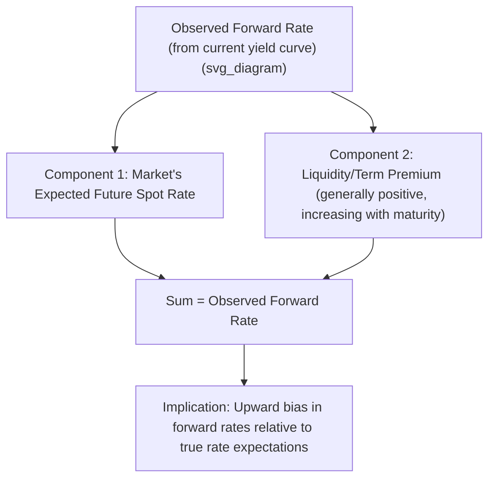

## Liquidity Preference and Segmented Markets Theories

### Overview

**Key Points**

- Both theories were developed to address empirical shortcomings of pure expectations theory: the observation that long-term bonds have historically earned higher average realized returns than short-term rollover strategies, and that forward rates have not been unbiased predictors of future spot rates.
- **Liquidity preference theory** modifies expectations theory by adding a positive, maturity-increasing risk premium to forward rates, while still retaining rate expectations as a core driver of the curve.
- **Market segmentation theory** takes a more radical departure, asserting that different maturity segments of the yield curve are driven by distinct investor clienteles with limited cross-segment substitution, such that yields in each segment are set largely independently by segment-specific supply and demand.
- A related, intermediate theory — **preferred habitat theory** — sits between these two, and is often discussed alongside them (covered here as a bridging concept).

### Liquidity Preference Theory

**Key Points**

- Also called the **liquidity premium theory**, it argues that investors generally prefer holding shorter-maturity, more liquid instruments, and require compensation (a term/liquidity premium) to be induced to hold longer-maturity bonds, which carry greater price (interest rate) risk.
- Issuers/borrowers, conversely, often prefer to lock in long-term funding to reduce refinancing (rollover) risk, and are willing to pay a premium to do so — creating a market-clearing equilibrium where lenders are compensated for the risk they bear by holding longer maturities.
- Under this theory, observed forward rates equal expected future spot rates **plus** a positive liquidity premium that generally increases with maturity:

$$f(t, t+1) = E[z_{t,t+1}] + L_t$$

where $L_t \geq 0$ is the liquidity premium for period $t$, typically assumed to increase (or at least not decrease) with $t$.

- This implies that **even if the market expects flat future short rates**, the observed yield curve would still be upward-sloping, purely as a result of the embedded liquidity premium — a key distinguishing prediction versus pure expectations theory (which would predict a flat curve under flat rate expectations).

### Decomposing an Observed Forward Rate Under Liquidity Preference Theory

**Example**

Suppose the market's true expectation for the 1-year rate one year from now is 4.00%, but the current term structure implies a forward rate of 4.50%.

$$f(1,2) = E[z_{1,2}] + L_1$$

$$4.50\% = 4.00\% + L_1$$

$$L_1 = 0.50\%$$

**Output**: Under liquidity preference theory, the observed forward-implied rate (4.50%) overstates the market's genuine rate expectation (4.00%) by the liquidity premium (0.50 percentage points). This means using raw forward rates as unbiased rate forecasts, without adjusting for an embedded premium, will tend to **systematically overpredict** future rate increases — consistent with the historical empirical pattern noted as a critique of pure expectations theory.

### Diagram: Liquidity Preference Decomposition (svg_diagram)

### Market Segmentation Theory

**Key Points**

- Asserts that different investor groups (clienteles) have strong, largely fixed preferences for specific maturity segments — driven by regulatory requirements, liability-matching needs, or institutional mandates — and do **not** meaningfully shift capital across segments in response to relative yield differences.
- Under this theory, each maturity segment's yield is determined largely by the independent supply of and demand for funds **within that segment**, rather than by an economy-wide rate expectation that links all maturities together.
- Classic examples of segment-specific clienteles: banks and money market funds concentrated in short-maturity instruments (matching short-term liabilities/deposits); insurance companies and pension funds concentrated in long-maturity instruments (matching long-dated liabilities).
- A strong prediction of pure market segmentation theory is that the yield curve's shape reflects **supply/demand imbalances by segment**, and could in principle exhibit shapes (e.g., pronounced humps or kinks at specific maturities) that would be difficult to reconcile with a smooth, expectations-driven curve.

### Preferred Habitat Theory (Bridging Concept)

**Key Points**

- A moderated version of market segmentation: investors have a preferred maturity "habitat" but are **willing to move outside it** if sufficiently compensated by a yield premium — unlike strict market segmentation, which assumes essentially no cross-segment substitution.
- This means premiums can exist at any point on the curve, and their sign and magnitude are **not required to increase monotonically with maturity** (unlike liquidity preference theory's assumption of a generally increasing premium) — the premium instead reflects the specific supply/demand imbalance at each maturity relative to investors' preferred habitats.
- Preferred habitat theory can therefore accommodate humped or non-monotonic curve shapes that pure liquidity preference theory would have more difficulty explaining, since a premium in this framework can spike at a specific maturity (e.g., due to heavy issuance or heavy demand at that particular point) without necessarily being higher at all longer maturities.

### Comparison Table: Three Theories

| Theory | Cross-Segment Substitution | Premium Behavior | Curve Shape Implication |
| --- | --- | --- | --- |
| Liquidity Preference | Full/high (single integrated market) | Positive, generally increasing with maturity | Tends to predict upward-sloping curve absent flat/falling rate expectations |
| Preferred Habitat | Partial (investors will move, if paid) | Premium sign/magnitude varies by maturity segment's specific supply/demand | Can accommodate humps, kinks, non-monotonic shapes |
| Market Segmentation | Minimal/none (essentially separate markets) | Determined independently within each segment | Yields at each maturity driven by segment-specific factors, with limited linkage across the curve |

### Implications for Yield Curve Analysis

**Key Points**

- If liquidity preference or preferred habitat effects are significant, then using the raw forward curve as a direct forecast of future short rates (as pure expectations theory would suggest) systematically misestimates true rate expectations — analysts must attempt to strip out the embedded premium to recover a cleaner expectations signal, a task that is inherently uncertain since the premium itself is not directly observable.
- Under market segmentation theory, policy actions that affect the supply of bonds in a specific maturity segment (e.g., central bank purchases concentrated in long-dated bonds, or heavy government issuance concentrated at a specific tenor) can have **outsized effects on that segment's yields specifically**, with limited spillover to other maturities — a dynamic relevant to understanding the effects of targeted central bank interventions such as quantitative easing programs concentrated at particular points on the curve. [Inference: the actual degree of segment-specific versus curve-wide impact of such interventions is an empirical question studied via event analysis, and results have varied across specific policy episodes.]
- These theories are generally viewed as complementary rather than strictly competing explanations: the real-world yield curve likely reflects a combination of rate expectations, a maturity-related risk/liquidity premium, and some degree of segment-specific supply/demand effects, with the relative importance of each varying over time and across market conditions.

### Practical Applications

- **Explaining historically observed term premiums**: liquidity preference theory provides the standard textbook explanation for why average historical long-term bond returns have exceeded what pure rate-expectations rollover strategies would have produced.
- **Understanding central bank balance sheet operations**: market segmentation/preferred habitat logic underlies the theoretical rationale for why targeted asset purchases (e.g., purchasing specifically long-dated bonds) can influence long-term yields somewhat independently of short-term policy rate expectations.
- **Curve trades and relative value analysis**: traders assessing whether a specific maturity point appears "rich" or "cheap" relative to a smooth theoretical curve may attribute persistent deviations to segment-specific supply/demand imbalances consistent with preferred habitat effects (e.g., heavy pension fund demand for very long-dated bonds compressing yields at that specific tenor).
- **Term premium estimation in monetary policy research**: central banks and researchers use term structure models informed by these theories to decompose observed yields into an expectations component and a premium component, informing policy rate-path communication.

**Related Topics**

- Expectations Theory of the Term Structure
- Par Curve, Spot Curve, and Forward Curve Relationships
- Quantitative Easing and Central Bank Balance Sheet Effects on the Yield Curve
- Term Premium Estimation and Affine Term Structure Models
- Yield Curve Shape Analysis (Humps, Kinks, Inversions)
- Investor Clienteles and Liability-Driven Investment Mandates