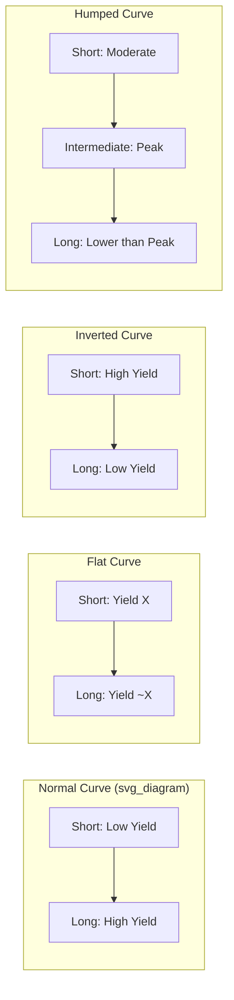
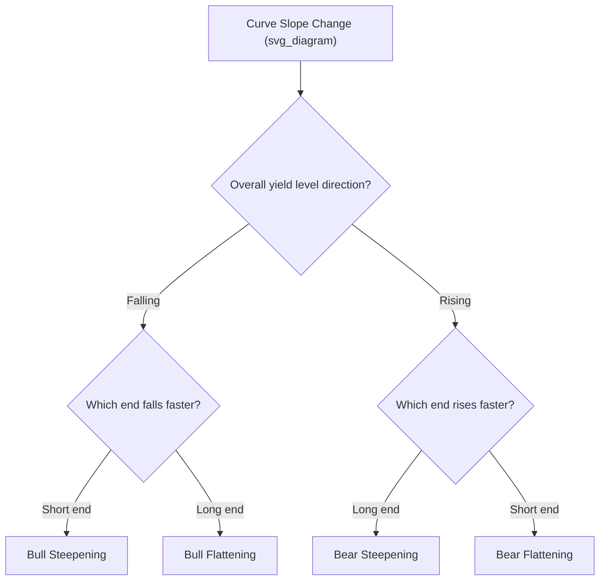

## Yield Curve Shapes and Macroeconomic Signals

### Overview

**Key Points**

- The yield curve's shape at any point in time reflects a combination of rate expectations, term/liquidity premia, and segment-specific supply/demand factors, and different shapes have historically been associated with different macroeconomic conditions and phases of the business cycle.
- The four canonical shapes are **normal (upward-sloping)**, **flat**, **inverted (downward-sloping)**, and **humped**, each carrying distinct interpretive implications under the term structure theories.
- Yield curve shape analysis is widely used as a practical, if imperfect, macroeconomic signal by central banks, fixed income investors, and economists, but the relationship between curve shape and subsequent economic outcomes is an empirical association, not a deterministic law.

### The Four Canonical Curve Shapes

| Shape | Description | Typical Macro Association |
| --- | --- | --- |
| Normal (upward-sloping) | Long-term yields > short-term yields | Expansion phase; growth and mild inflation expected; typical/most common historical shape |
| Flat | Yields roughly equal across maturities | Transition point; often occurs as an economy shifts between expansion and slowdown |
| Inverted (downward-sloping) | Short-term yields > long-term yields | Market expects future rate cuts, often associated with anticipated economic slowdown or recession |
| Humped | Yields rise then fall (peak at intermediate maturity) | Mixed signal; near-term growth/inflation expected, with longer-term deceleration anticipated |

### Diagram: Canonical Yield Curve Shapes (svg_diagram)

### Normal (Upward-Sloping) Curve

**Key Points**

- The most commonly observed historical shape, consistent with both a positive liquidity/term premium (liquidity preference theory) and/or market expectations of rising future short rates (expectations theory) — the two effects are not mutually exclusive and typically reinforce each other during expansions.
- Associated macroeconomically with an economy in a **growth phase**, where investors expect continued economic expansion, moderate-to-rising inflation, and potentially future central bank tightening, all of which support higher compensation demanded for longer-maturity commitments.
- Provides a favorable environment for financial intermediaries whose business model depends on **maturity transformation** (borrowing short-term/paying short rates, lending long-term/earning long rates), such as traditional commercial banks — a steep curve generally supports bank net interest margins.

### Inverted Curve

**Key Points**

- Occurs when short-term yields exceed long-term yields, typically interpreted as the market pricing in **expected future policy rate cuts**, which in turn usually reflects anticipation of an economic slowdown, recession, or disinflation.
- Frequently arises when a central bank has raised short-term policy rates aggressively to combat inflation, while long-term yields fail to rise proportionally (or fall) because the market expects the tightening cycle to be followed by cuts once inflation is brought under control or growth weakens.
- Widely monitored via specific spread metrics as a practical recession-forecasting heuristic (see below), though the theory does not claim inversion **causes** recessions — the association is empirical/historical, and the transmission mechanism (if any) is debated. [Inference: whether inversion is a leading indicator, a coincident symptom of tight monetary policy that itself contributes to slowdown, or both, remains a subject of ongoing economic research and is not settled by term structure theory alone.]
- An inverted curve can also compress or reverse the maturity-transformation profitability that benefits from a normal curve, potentially tightening credit conditions as lenders' incentive to extend long-term credit at relatively unattractive spreads diminishes.

### Commonly Watched Curve Spread Metrics

| Spread | Common Use |
| --- | --- |
| 10-year minus 2-year Treasury yield | Most widely cited recession-signal spread in U.S. markets and financial media |
| 10-year minus 3-month Treasury yield | Preferred by some researchers (including certain Federal Reserve studies) as having historically shown a stronger statistical relationship to subsequent recessions |
| 2-year minus Fed Funds rate | Used to gauge near-term market expectations for imminent policy rate changes |

**Key Points**

- Different spread metrics have exhibited different historical lead times and reliability; [Unverified: the specific historical accuracy statistics (hit rates, false positive rates, average lead time) for any given spread depend on the sample period and methodology used, and figures cited in different sources may not be directly comparable — verify current figures via search if specific historical statistics are needed for time-sensitive analysis].
- No single spread metric has a perfect historical track record, and false signals (inversions not followed by recession, or recessions not preceded by inversion) have occurred, meaning curve inversion functions as a **probabilistic risk indicator**, not a certainty.

### Flat Curve

**Key Points**

- Often represents a **transitional state** between a normal and an inverted curve (or vice versa), occurring as market expectations shift, for example, as a monetary tightening cycle approaches its presumed end and the market begins pricing a plateau or eventual reversal in short rates.
- Can also reflect genuine uncertainty or balanced expectations, where the market sees roughly equal probability of future rate increases and decreases, netting to an expectation of roughly stable future short rates.
- Historically associated with periods of macroeconomic uncertainty or late-cycle dynamics, though (as with inversion) this is an empirical pattern rather than a strict causal rule.

### Humped Curve

**Key Points**

- Reflects a market view where intermediate-term rates are expected to be higher than both near-term and long-term rates — for example, the market may expect near-term policy tightening to continue for a period, followed by an eventual longer-run deceleration or return to a lower equilibrium rate.
- Can also arise from segment-specific supply/demand imbalances (per preferred habitat/market segmentation theory) at particular maturity points, rather than purely from a smooth rate-expectations path — e.g., unusually heavy issuance or demand concentrated at a specific intermediate maturity.
- Less common than normal or inverted shapes, and often observed during periods of significant monetary policy transition or unusual market technical factors.

### Steepening and Flattening Dynamics

**Key Points**

- **Bull steepening**: short rates fall faster than long rates (curve steepens as yields fall overall) — often associated with aggressive central bank easing expectations.
- **Bear steepening**: long rates rise faster than short rates (curve steepens as yields rise overall) — often associated with rising inflation or growth expectations pushing up long-term compensation demands while short rates remain anchored.
- **Bull flattening**: long rates fall faster than short rates (curve flattens as yields fall overall) — often associated with a "flight to quality" into long-duration safe assets.
- **Bear flattening**: short rates rise faster than long rates (curve flattens as yields rise overall) — often associated with central bank tightening cycles where policy rate hikes outpace any rise in longer-term inflation/growth expectations.

### Diagram: Steepening/Flattening Classification (svg_diagram)

### Using Curve Shape in Investment and Policy Analysis

**Key Points**

- **Duration positioning**: investors expecting a steepening curve may favor barbell strategies or shorten duration on the long end; investors expecting flattening or inversion may extend duration to capture anticipated price gains as long yields fall relative to short yields.
- **Bank and financial sector analysis**: curve shape is a key input to assessing net interest margin trends for banks and other maturity-transforming institutions, given the direct link between curve steepness and typical lending profitability.
- **Central bank policy communication**: policymakers monitor curve shape (and market-implied forward rates) as one gauge of how their communicated policy path is being interpreted and priced by markets, feeding into forward guidance decisions.
- **Cross-checking against other indicators**: because curve-shape signals are probabilistic and have produced false signals historically, practitioners typically corroborate curve-based recession or growth signals with other macroeconomic indicators (labor market data, credit spreads, leading economic indices) rather than relying on curve shape in isolation. [Inference: the appropriate weight to place on curve-shape signals relative to other indicators is a matter of analyst judgment and evolving empirical research, not a fixed rule.]

**Related Topics**

- Expectations Theory of the Term Structure
- Liquidity Preference and Segmented Markets Theories
- Par Curve, Spot Curve, and Forward Curve Relationships
- Central Bank Policy Rate Decisions and Forward Guidance
- Credit Spread Analysis as a Complementary Macro Indicator
- Duration Positioning and Curve Trade Strategies (Steepeners, Flatteners, Barbells)
- Bank Net Interest Margin and Maturity Transformation