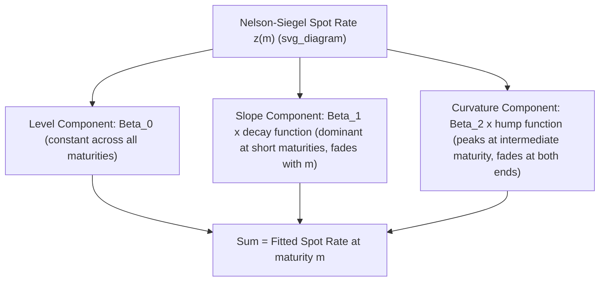

## Curve Fitting Nelson-Siegel and Spline Methods

### Overview

**Key Points**

- Curve fitting methods produce a smooth, continuous yield curve function from a finite, discrete set of observed market yields (or prices), enabling yield/discount factor estimation at any maturity, including points where no directly observed instrument exists.
- Two broad methodological families dominate practice: **parametric models** (a small number of parameters define a functional form for the entire curve, e.g., Nelson-Siegel and its extensions) and **spline-based methods** (piecewise polynomial segments joined smoothly at "knot" points, e.g., cubic splines).
- The choice of method involves a trade-off between **smoothness/parsimony** (fewer parameters, more stable, less prone to overfitting noise) and **fit precision** (ability to closely match every individual observed data point, at the risk of capturing noise as if it were signal).

### The Nelson-Siegel Model

**Key Points**

- A parsimonious parametric model using just **four parameters** to describe the entire yield curve, originally proposed by Charles Nelson and Andrew Siegel (1987).
- Each parameter has an intuitive economic interpretation: a long-run level, a short-term slope component, and a medium-term curvature (hump) component, plus a decay parameter governing how quickly the slope and curvature effects fade with maturity.

**Nelson-Siegel functional form for the instantaneous forward rate:**

$$f(m) = \beta_0 + \beta_1 e^{-m/\tau} + \beta_2 \left(\frac{m}{\tau}\right)e^{-m/\tau}$$

**Corresponding spot (zero) rate as a function of maturity $m$:**

$$z(m) = \beta_0 + \beta_1 \left(\frac{1-e^{-m/\tau}}{m/\tau}\right) + \beta_2 \left(\frac{1-e^{-m/\tau}}{m/\tau} - e^{-m/\tau}\right)$$

**Parameter Interpretation**

| Parameter | Interpretation |
| --- | --- |
| $\beta_0$ | Long-term level (the asymptotic yield as $m \to \infty$) |
| $\beta_1$ | Short-term component; governs the curve's slope, with $\beta_0 + \beta_1$ = the instantaneous short rate ($m \to 0$) |
| $\beta_2$ | Medium-term curvature; governs the size and direction of a hump or trough at intermediate maturities |
| $\tau$ | Decay factor; controls the maturity at which the curvature term reaches its maximum effect, and the speed at which $\beta_1$ and $\beta_2$ effects decay toward zero |

### Diagram: Nelson-Siegel Component Decomposition (svg_diagram)

### Worked Numerical Example

Given fitted Nelson-Siegel parameters: $\beta_0 = 4.5\%$, $\beta_1 = -2.0\%$, $\beta_2 = 1.0\%$, $\tau = 2.0$

**Compute the spot rate at $m = 5$ years:**

$$\frac{m}{\tau} = 2.5, \quad e^{-2.5} = 0.0821$$

$$\frac{1-e^{-m/\tau}}{m/\tau} = \frac{1-0.0821}{2.5} = 0.3672$$

$$z(5) = 4.5\% + (-2.0\%)(0.3672) + 1.0\%(0.3672 - 0.0821)$$

$$z(5) = 4.5\% - 0.734\% + 0.285\% = 4.051\%$$

**Output**: The fitted 5-year spot rate is approximately **4.05%**. Repeating this calculation across a grid of maturities (e.g., 0.25, 0.5, 1, 2, 5, 10, 20, 30 years) traces out the complete smooth fitted curve implied by just these four parameters.

### The Nelson-Siegel-Svensson (NSS) Extension

**Key Points**

- Adds a **second curvature term** (with its own decay parameter $\tau_2$) to the original four-parameter model, allowing the fitted curve to accommodate **two humps** rather than just one — improving fit flexibility for curves with more complex shapes, at the cost of two additional parameters (six total: $\beta_0, \beta_1, \beta_2, \beta_3, \tau_1, \tau_2$).
- Widely used by central banks and debt management offices (including several G10 central banks) as their standard published yield curve estimation methodology, given its balance of parsimony and improved fit flexibility relative to the original four-parameter version. [Inference: specific institutional adoption choices can change over time; consult the relevant central bank's current published methodology for authoritative confirmation if precision on this point is required.]

### Spline-Based Methods

**Key Points**

- **Cubic splines**: fit piecewise third-degree polynomial segments between consecutive "knot points" (chosen maturities, often corresponding to observed instrument maturities or standard tenor points), with continuity constraints imposed on the function's value, first derivative, and second derivative at each knot, ensuring a smooth, visually continuous curve with no kinks.
- **McCulloch cubic spline method**: a specific, widely cited application of cubic splines to discount function estimation for yield curve construction, fitting the discount function (rather than the yield directly) as a piecewise cubic polynomial.
- **Smoothing splines**: introduce a penalty term for curvature (a "roughness penalty") into the fitting objective, allowing the analyst to explicitly trade off fit precision against curve smoothness via a single tunable smoothing parameter, rather than being forced to exactly interpolate every knot point.
- **B-splines**: a numerically stable basis-function representation of piecewise polynomial splines, commonly used in practice for computational implementation because of favorable numerical properties compared to naive piecewise polynomial parameterizations.

### Spline Fitting Objective (General Form)

For a smoothing spline fit to $n$ observed yields $y_i$ at maturities $m_i$:

$$\min_{g} \sum_{i=1}^{n} \left[y_i - g(m_i)\right]^2 + \lambda \int \left[g''(m)\right]^2 dm$$

where $g(m)$ is the fitted curve function, and $\lambda$ is the smoothing parameter: higher $\lambda$ penalizes curvature more heavily, producing a smoother (less wiggly) fitted curve at the cost of larger deviations from individual observed data points; $\lambda \to 0$ approaches exact interpolation of every observed point.

### Comparison: Parametric (Nelson-Siegel) vs. Spline Methods

| Aspect | Nelson-Siegel / NSS | Spline Methods |
| --- | --- | --- |
| Number of parameters | Small, fixed (4 or 6) | Variable, depends on number of knots |
| Smoothness | Guaranteed by functional form | Guaranteed by continuity constraints (or smoothing penalty) |
| Fit precision to individual points | Generally lower (parsimony trades off exactness) | Can be made arbitrarily precise (more knots = closer fit) |
| Overfitting risk | Low (few parameters constrain flexibility) | Higher with many knots; requires careful knot selection or smoothing penalty tuning |
| Extrapolation behavior beyond observed maturities | Well-behaved, governed by asymptotic level parameter $\beta_0$ | Can behave poorly/erratically beyond the last knot without careful constraint |
| Common use case | Central bank/policy yield curve publication, cross-country comparison | Trading desk curve construction, discount factor bootstrapping refinement |

### Fitting Procedure (General Workflow for Either Method)

**Step 1**: Collect observed market yields or prices for a set of liquid benchmark instruments across available maturities.

**Step 2**: Choose the functional form (Nelson-Siegel, NSS, cubic spline, smoothing spline) and, for splines, select knot locations.

**Step 3**: Define an objective function — typically minimizing the sum of squared pricing errors (difference between model-implied price and observed market price for each instrument), rather than yield errors directly, since price errors better reflect the economically relevant discrepancy for trading purposes.

**Step 4**: Numerically optimize the objective (nonlinear least squares for Nelson-Siegel/NSS, since the model is nonlinear in $\tau$; linear least squares for spline coefficients, since splines are linear in their basis coefficients once knots are fixed).

**Step 5**: Validate the fitted curve — check for economically implausible features (unrealistic humps, oscillations, negative discount factors implying negative implied rates in an implausible way) and assess out-of-sample or residual fit quality.

### Common Practical Issues

**Key Points**

- **Overfitting with too many spline knots**: excessive knots relative to available data points can produce a curve that oscillates unrealistically between observed points, an artifact known as fitting to "noise" rather than genuine yield curve signal.
- **Nelson-Siegel's limited flexibility**: the single-hump constraint of the basic four-parameter model can produce poor fits when the true curve genuinely has multiple humps or unusual kinks, motivating the extension to NSS or a spline-based alternative in such cases.
- **Sensitivity of $\tau$ to optimization starting values**: because Nelson-Siegel is nonlinear in $\tau$, the numerical optimization can converge to different local optima depending on starting parameter guesses; practitioners typically run the optimization from multiple starting points to increase confidence in a well-fitted result. [Unverified: specific convergence behavior is implementation- and dataset-dependent.]
- **Illiquid/stale input data**: fitting any curve method to illiquid or stale-quoted instruments can introduce artificial curvature or noise into the fitted curve unrelated to genuine market conditions.

### Applications

- **Central bank and government debt management yield curve publication**: NSS-based (or similar parametric) curves are standard for official daily published yield curve series in numerous major sovereign bond markets.
- **Relative value analysis ("rich/cheap" screening)**: comparing individual bonds' actual market yields against the fitted curve to systematically identify bonds trading away from the fitted "fair value" curve.
- **Risk management and yield curve scenario analysis**: parametric models with interpretable level/slope/curvature parameters allow risk managers to construct economically meaningful stress scenarios (e.g., "steepening shock," "level shock") by perturbing individual model parameters.
- **Interpolation for pricing and valuation**: spline-fitted discount curves provide the interpolated discount factors needed to price any bond or derivative cash flow occurring between directly observed benchmark maturities.

**Related Topics**

- Bootstrapping the Spot Rate Curve
- Par Curve, Spot Curve, and Forward Curve Relationships
- Principal Component Analysis of Yield Curve Movements (Level, Slope, Curvature)
- Swap Curve Construction and Multi-Curve Discounting
- Relative Value Analysis and Rich/Cheap Bond Screening
- Yield Curve Risk Scenario Design for Portfolio Stress Testing