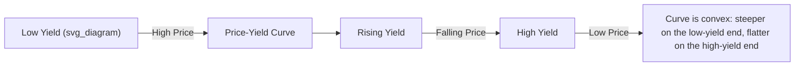
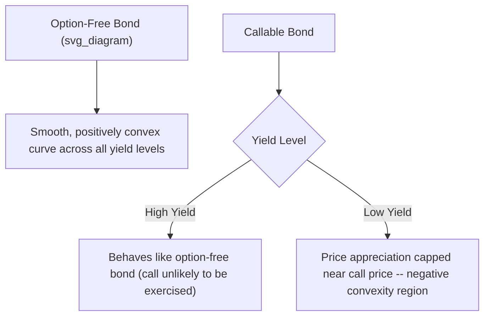

## The Price-Yield Relationship

### Overview

**Key Points**

- The price-yield relationship describes how a bond's price changes in response to changes in its yield (discount rate), holding all other bond characteristics (coupon, maturity, face value) constant.
- The relationship is fundamentally **inverse**: as yield increases, price decreases, and vice versa — a direct consequence of price being the present value of fixed future cash flows discounted at the yield.
- The relationship is also **convex**, not linear: the price-yield curve is curved such that price increases from a given yield decline are larger in magnitude than price decreases from an equal-sized yield increase — this asymmetry is the foundation of the concept of convexity, covered as its own dedicated topic.

### Mathematical Basis

The bond pricing equation directly shows the inverse relationship: price is a sum of terms each divided by $(1+y)^t$, so as $y$ rises, every term in the sum falls.

$$P(y) = \sum_{t=1}^{N} \frac{C}{(1+y)^t} + \frac{F}{(1+y)^N}$$

$$\frac{\partial P}{\partial y} < 0 \quad \text{for all } y > -1$$

The first derivative of price with respect to yield is always negative (for any economically meaningful yield), confirming the strictly inverse relationship holds across the entire yield curve, not just locally.

### Diagram: The Price-Yield Curve Shape (svg_diagram)

### Worked Example: Price Sensitivity at Different Yield Levels

A 10-year, 6% annual-pay coupon bond ($F = 1000$) priced at successive yield levels:

| Yield | Price | Price Change from Prior Row |
| --- | --- | --- |
| 4% | $1,162.22 | — |
| 5% | $1,077.22 | -$85.00 |
| 6% | $1,000.00 | -$77.22 |
| 7% | $929.76 | -$70.24 |
| 8% | $865.80 | -$63.96 |

**Output**: Each successive 1% increase in yield produces a **smaller** dollar price decline than the prior increment ($85.00 → $77.22 → $70.24 → $63.96), even though the yield increment is constant. This declining sensitivity as yield rises is the direct numerical signature of convexity: the price-yield curve is not a straight line but a curve that flattens as yield increases.

### Key Properties of the Price-Yield Relationship

**Key Points**

- **At the coupon rate**: when yield equals the coupon rate, price equals par (100/face value) — confirmed at 6% in the table above.
- **Asymptotic behavior**: as yield approaches infinity, price approaches zero (since all discount factors approach zero); as yield approaches -100%, price approaches infinity (a purely theoretical limit with no real-world economic meaning).
- **Symmetry of dollar price changes is never exact**: for any bond with a maturity beyond a single period, equal basis-point increases and decreases in yield never produce exactly equal (in magnitude) dollar price changes — the gain from a yield decrease always exceeds the loss from an equal yield increase, a property known as **positive convexity**, which holds for all option-free bonds.

### Percentage Price Change vs. Dollar Price Change

The percentage price change for a given yield change is not constant across the curve — it is larger (in absolute value) at lower yield levels and smaller at higher yield levels, for the same absolute yield change:

$$\%\Delta P = \frac{P(y_1) - P(y_0)}{P(y_0)}$$

**Example (using the table above):**

From 4% to 5%: $\%\Delta P = \frac{1077.22 - 1162.22}{1162.22} = -7.31\%$

From 7% to 8%: $\%\Delta P = \frac{865.80 - 929.76}{929.76} = -6.88\%$

**Output**: The same 100 basis point yield increase produces a larger percentage price decline (-7.31%) when starting from a lower yield level (4%) than when starting from a higher yield level (7%, producing -6.88%) — a direct consequence of the curve's convex shape and a key reason duration-based price approximations are less accurate for large yield changes and for bonds already at low absolute yield levels.

### Factors Affecting the Steepness/Curvature of the Price-Yield Relationship

| Bond Characteristic | Effect on Price-Yield Sensitivity |
| --- | --- |
| Longer maturity | Greater sensitivity (steeper curve, more convexity) |
| Lower coupon rate | Greater sensitivity (steeper curve, more convexity), holding maturity constant |
| Lower starting yield level | Greater sensitivity at that point on the curve (curve is steeper at lower yields) |

**Key Points**

- These relationships explain why zero-coupon bonds (the limiting case of a "low coupon") exhibit the greatest price sensitivity to yield changes for a given maturity, and why long-maturity, low-coupon bonds are the most interest-rate-sensitive category of option-free fixed income instruments.
- These same characteristics (maturity, coupon, starting yield level) are the primary determinants of a bond's **duration**, which is the formal, quantified measure of price-yield sensitivity derived directly from this relationship (specifically, related to the first derivative/slope of the price-yield curve at a given point).

### Linear Approximation and Its Limitation

For small yield changes, the price-yield curve can be locally approximated by a straight line (its tangent at the current yield) — this is the basis of **duration-based price approximation**:

$$\%\Delta P \approx -D_{mod} \times \Delta y$$

where $D_{mod}$ is modified duration (the negative of the tangent line's slope, normalized by price).

**Key Points**

- This linear approximation is reasonably accurate for **small** yield changes but systematically **understates** the true price increase for a yield decrease and **overstates** the true price decrease for a yield increase, because it ignores the curve's convexity (curvature).
- The **convexity adjustment** is added to the duration-based approximation specifically to correct for this systematic error, especially important for larger yield changes or for bonds with high convexity (e.g., long-maturity, low-coupon, or option-embedded bonds with unusual convexity profiles).

$$\%\Delta P \approx -D_{mod} \times \Delta y + \frac{1}{2} \times C \times (\Delta y)^2$$

where $C$ is the bond's convexity measure.

### Price-Yield Relationship for Bonds with Embedded Options

**Key Points**

- **Callable bonds** exhibit **negative convexity** (price compression) at low yield levels: as yields fall, the call option becomes more likely to be exercised by the issuer, capping the bond's price appreciation near the call price rather than allowing it to rise as freely as an equivalent option-free bond would.
- **Putable bonds** exhibit enhanced positive convexity at high yield levels: as yields rise, the put option protects the investor's downside, limiting price depreciation relative to an equivalent option-free bond.
- These option-driven distortions mean the simple, smooth convex price-yield curve described for option-free bonds does not fully apply to callable/putable instruments; a more nuanced curve — sometimes S-shaped for callables — better characterizes their actual price-yield behavior, requiring **effective duration** and **effective convexity** (computed via an option pricing model) rather than the simpler analytical measures used for option-free bonds.

### Diagram: Option-Free vs. Callable Bond Price-Yield Curve Comparison (svg_diagram)

### Practical Implications

- **Risk management**: understanding the price-yield relationship's inverse and convex nature underlies all fixed income interest rate risk management, from simple duration-based hedging to more sophisticated convexity-adjusted immunization strategies.
- **Bond selection for rate views**: an investor expecting falling rates benefits disproportionately (due to positive convexity) from holding longer-duration, lower-coupon, option-free bonds relative to shorter-duration alternatives, all else equal.
- **Portfolio convexity management**: portfolio managers often actively manage aggregate portfolio convexity (in addition to duration) as a distinct risk/return lever, particularly valuable during periods of expected high yield volatility, since positive convexity is beneficial regardless of the direction of the eventual yield move (a bond with higher convexity outperforms a lower-convexity bond with identical duration for both large yield increases and decreases).
- **Structuring and valuing option-embedded securities**: recognizing where negative convexity arises (e.g., callable bonds, mortgage-backed securities subject to prepayment) is central to appropriately pricing and risk-managing these instruments relative to simpler option-free benchmarks.

**Related Topics**

- Yield to Maturity Calculation and Interpretation
- Macaulay Duration and Modified Duration Calculation
- Convexity and the Convexity Adjustment to Duration-Based Estimates
- Effective Duration and Effective Convexity for Option-Embedded Bonds
- Key Rate Duration and Non-Parallel Yield Curve Risk
- Negative Convexity in Callable Bonds and Mortgage-Backed Securities