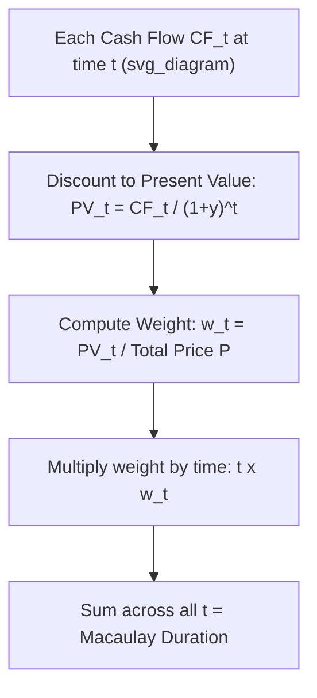
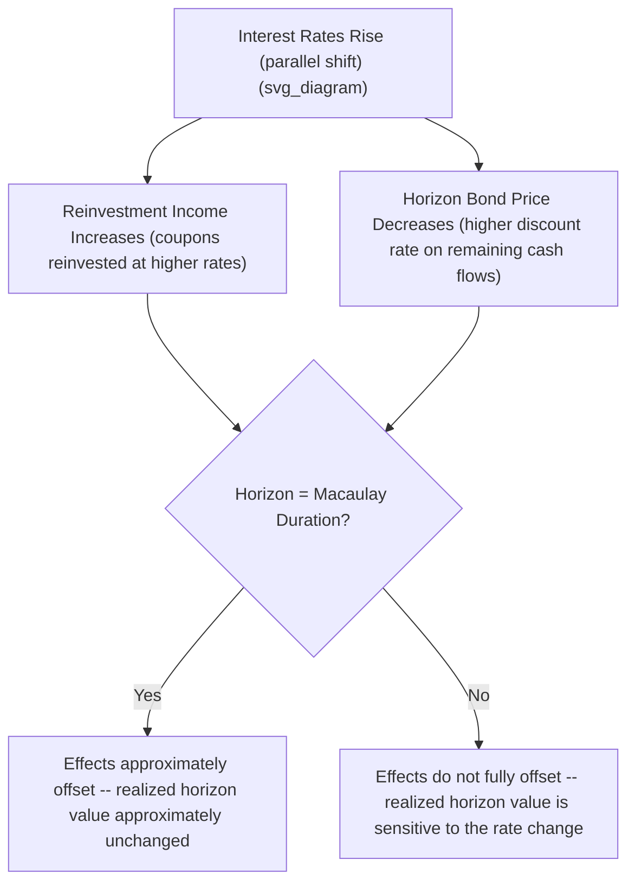

## Macaulay Duration Derivation and Interpretation

### Definition

**Key Points**

- **Macaulay Duration** is the weighted-average time (in years, or periods) until a bond's cash flows are received, where each cash flow's weight is its present value as a proportion of the bond's total price.
- Developed by Frederick Macaulay (1938), it was originally conceived as a better measure of a bond's effective maturity than stated maturity, since it accounts for the timing and magnitude of *all* cash flows, not just the final principal repayment.
- Macaulay duration also has a second, equally important interpretation: it is the specific time horizon at which a bond's (or bond portfolio's) exposure to **price risk** and **reinvestment risk** are approximately balanced/offsetting — the theoretical foundation for classical immunization strategies.

### Derivation

Start from the bond pricing equation:

$$P = \sum_{t=1}^{N} \frac{CF_t}{(1+y)^t}$$

where $CF_t$ is the cash flow at time $t$ (coupon, or coupon plus principal at maturity).

Define the **present value weight** of each cash flow as its discounted value divided by total price:

$$w_t = \frac{CF_t / (1+y)^t}{P}$$

Note that by construction, $\sum_{t=1}^{N} w_t = 1$ (the weights sum to 1, since they partition the total price).

**Macaulay Duration is then the weighted average of the time periods, using these weights:**

$$MacDur = \sum_{t=1}^{N} t \times w_t = \sum_{t=1}^{N} t \times \frac{CF_t/(1+y)^t}{P}$$

If cash flows occur semiannually, this formula produces Macaulay duration in **semiannual periods**; dividing by 2 converts it to **years** (the conventional reporting unit).

### Diagram: Macaulay Duration as a Weighted Average (svg_diagram)

```plaintext
===svg_diagram===
```



### Worked Example: 4-Year, 8% Annual-Pay Bond

$F = 1000$, $C = 80$, $y = 8\%$ (so the bond trades at par, $P = 1000$).

| $t$ | $CF_t$ | $PV_t = CF_t/(1.08)^t$ | $w_t = PV_t / 1000$ | $t \times w_t$ |
| --- | --- | --- | --- | --- |
| 1 | 80 | 74.07 | 0.07407 | 0.07407 |
| 2 | 80 | 68.59 | 0.06859 | 0.13717 |
| 3 | 80 | 63.51 | 0.06351 | 0.19054 |
| 4 | 1080 | 793.83 | 0.79383 | 3.17532 |
| **Sum** |  | **1000.00** | **1.00000** | **3.57710** |

**Output**: Macaulay Duration = **3.577 years**. Note that this is close to, but less than, the bond's 4-year stated maturity — reflecting the fact that some value (and effectively, some "return of capital") is received earlier via coupon payments rather than being concentrated entirely in the final maturity payment.

### Key Interpretive Points

**Key Points**

- Macaulay duration is **always less than or equal to the bond's maturity** for a coupon-paying bond, with equality holding only for a zero-coupon bond (where 100% of the cash flow weight is concentrated at the single maturity date, so $MacDur = N$ exactly).
- **Higher coupon rate → lower Macaulay duration** (holding maturity and yield constant): larger coupon payments shift more present-value weight to earlier periods, pulling the weighted-average time closer to the present.
- **Longer maturity → higher Macaulay duration** (holding coupon and yield constant), though the relationship is not strictly linear — duration increases at a decreasing rate as maturity extends, particularly for higher-coupon bonds, and can even (in unusual cases) decline slightly for very long-maturity, low-yield, low-coupon bonds trading at a premium. [Inference: this non-monotonic edge case is a known theoretical result for certain deep-discount, very-long-maturity bond parameter combinations and is not the typical pattern encountered in most standard bonds.]
- **Higher yield → lower Macaulay duration** (holding coupon and maturity constant): higher discount rates disproportionately reduce the present value of more distant cash flows, shifting relative weight toward earlier cash flows and shortening the weighted-average time.

### Special Case: Zero-Coupon Bond

For a zero-coupon bond, there is only one cash flow, at maturity $N$, so its weight is $w_N = 1$ (trivially, since it's the only cash flow):

$$MacDur_{zero} = N \times 1 = N$$

**Key Points**

- Macaulay duration exactly equals maturity for a zero-coupon bond, confirming intuitively that a zero-coupon instrument's "effective maturity" is identical to its stated maturity, since there are no interim cash flows to pull the weighted average earlier.

### Macaulay Duration and Immunization: The Balance Point Interpretation

**Key Points**

- When a bond (or bond portfolio) is held for a period exactly equal to its Macaulay duration, a **parallel shift** in interest rates produces two offsetting effects that approximately cancel: (1) a change in reinvestment income from coupons (higher rates increase reinvestment income; lower rates decrease it), and (2) a change in the bond's price/value at the horizon (higher rates decrease horizon price; lower rates increase it).
- This offsetting property is the foundation of **classical (Redington/Macaulay-style) immunization**: by matching portfolio Macaulay duration to a known future liability's time horizon, an investor can approximately insulate the value available at that horizon from small parallel interest rate shifts.
- This immunization property is only exact for **infinitesimally small, instantaneous, parallel** yield curve shifts; larger shifts, non-parallel shifts, and shifts occurring gradually over time (rather than instantaneously) each introduce approximation error, requiring periodic rebalancing of portfolio duration to maintain the immunization property as time passes and yields change.

### Diagram: Reinvestment Risk vs. Price Risk Offset at the Duration Horizon (svg_diagram)



### Portfolio Macaulay Duration

For a portfolio of bonds, Macaulay duration can be approximated as the market-value-weighted average of the individual bonds' durations:

$$MacDur_{portfolio} \approx \sum_{i=1}^{n} \frac{MV_i}{MV_{total}} \times MacDur_i$$

**Key Points**

- This weighted-average approximation is commonly used in practice but is technically exact only under the assumption of a flat yield curve and parallel shifts; the more rigorous, theoretically precise approach recomputes portfolio duration directly from the portfolio's aggregate cash flows using the same weighted-average-time formula applied to the combined cash flow schedule.

### Relationship to Modified Duration

**Key Points**

- Macaulay duration and **modified duration** are closely related but distinct: modified duration is derived directly from Macaulay duration by dividing by $(1+y/k)$, where $k$ is the number of compounding periods per year, converting the time-based measure into a direct measure of price sensitivity to yield.

$$D_{mod} = \frac{MacDur}{1 + y/k}$$

- Macaulay duration answers "what is the effective weighted-average time horizon of this bond's cash flows?" while modified duration answers "by what approximate percentage will this bond's price change for a small change in yield?" — the two measures serve related but conceptually distinct analytical purposes, with modified duration being the more directly applicable Risk metric for hedging and price-sensitivity purposes.

### Applications

- **Duration matching for immunization**: pension funds, insurance companies, and other liability-driven investors match portfolio Macaulay duration to the duration of their liabilities to reduce interest rate risk exposure to funding shortfalls.
- **Benchmark/effective maturity comparison**: Macaulay duration provides a more economically meaningful comparison of "how long-dated" two bonds truly are than stated maturity alone, particularly useful when comparing bonds with very different coupon structures.
- **Foundation for modified duration and convexity**: Macaulay duration is the necessary first analytical step in deriving the price-sensitivity measures (modified duration, dollar duration, convexity) used throughout fixed income risk management.
- **Bond portfolio construction and rebalancing**: portfolio managers monitor and rebalance aggregate portfolio Macaulay duration over time as bonds age (duration mechanically declines as time passes, all else equal) and as yields change, to maintain a target duration exposure.

**Related Topics**

- The Price-Yield Relationship
- Modified Duration and Approximate Percentage Price Change
- Effective Duration for Bonds with Embedded Options
- Convexity and the Convexity Adjustment
- Classical (Redington) Immunization Theory and Rebalancing
- Key Rate Duration and Non-Parallel Yield Curve Risk
- Portfolio Duration Matching for Liability-Driven Investing