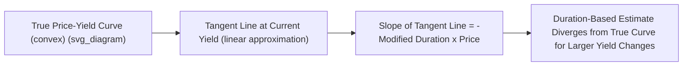

## Modified Duration and Price Sensitivity

### Definition

**Key Points**

- **Modified Duration** is a direct measure of a bond's approximate percentage price sensitivity to a small change in yield, expressed as the approximate percentage price change for a 1% (100 basis point) change in yield.
- It is derived directly from Macaulay duration by adjusting for the compounding frequency, converting a time-based measure into a price-sensitivity measure.
- Modified duration is the most commonly used single-number summary of a bond's interest rate risk in practice, forming the basis for duration-based hedging, risk budgeting, and portfolio-level interest rate exposure measurement.

### Derivation from Macaulay Duration

Starting from the price equation and differentiating with respect to yield:

$$P = \sum_{t=1}^{N} \frac{CF_t}{(1+y/k)^{t}}$$

$$\frac{dP}{dy} = -\frac{1}{1+y/k}\sum_{t=1}^{N} t \times \frac{CF_t}{(1+y/k)^t} = -\frac{1}{1+y/k} \times MacDur \times P$$

Rearranging to isolate percentage price change per unit yield change:

$$\frac{1}{P}\frac{dP}{dy} = -\frac{MacDur}{1+y/k}$$

Defining **Modified Duration** as the negative of this sensitivity:

$$D_{mod} = \frac{MacDur}{1+y/k}$$

where $k$ = number of compounding periods per year (2 for semiannual-pay bonds, 1 for annual-pay).

### Approximate Percentage Price Change Formula

$$\%\Delta P \approx -D_{mod} \times \Delta y$$

This is the core practical application: modified duration converts directly into an estimate of percentage price change for any given (small) yield change, in either direction.

### Worked Example

Using the 4-year, 8% annual-pay bond from the Macaulay duration derivation ($MacDur = 3.577$ years, $y = 8\%$, annual compounding so $k=1$):

$$D_{mod} = \frac{3.577}{1+0.08} = \frac{3.577}{1.08} = 3.312$$

**Output**: Modified duration ≈ **3.312**. This means a 100 basis point (1%) increase in yield is expected to produce an approximate **3.312% decrease** in the bond's price, and a 100 basis point decrease in yield is expected to produce an approximate 3.312% increase.

**Applying to a Yield Change**

If yield rises from 8% to 9% ($\Delta y = +0.01$):

$$\%\Delta P \approx -3.312 \times 0.01 = -3.312\%$$

Since the bond's current price is $1000 (par, at $y=8\%$):

$$\Delta P \approx -3.312\% \times 1000 = -\$33.12$$

$$\text{Estimated new price} \approx 1000 - 33.12 = \$966.88$$

**Comparison to Actual Price**: Computing the bond's exact price at $y = 9\%$ using full discounting gives $P = \$967.60$. The duration-based estimate ($966.88) is close but slightly understates the actual price ($967.60) — this small gap is precisely the effect that **convexity** corrects for, since the linear duration approximation ignores the curve's curvature.

### Diagram: Modified Duration as the Tangent Line Slope (svg_diagram)

### Dollar Duration (Money Duration)

A related measure expresses price sensitivity in absolute currency terms rather than percentage terms:

$$\text{Dollar Duration (Money Duration)} = D_{mod} \times P$$

**Example**: Using the bond above, Dollar Duration $= 3.312 \times 1000 = \$33.12$ (per 100 face value, per 1% yield change) — matching the dollar price change estimate computed above.

**Key Points**

- Dollar duration is directly useful for portfolio-level risk aggregation: summing individual bond dollar durations (weighted by position size/par amount held) gives total portfolio dollar exposure to a parallel yield change, without needing to first convert every position to a common percentage basis.
- **Basis Point Value (BPV)**, also called **PVBP (Price Value of a Basis Point)** or **DV01 (Dollar Value of 01)**, is dollar duration scaled to a single basis point (0.01%) move rather than a full 1% move — the most commonly quoted practical risk metric on trading desks:

$$BPV = D_{mod} \times P \times 0.0001$$

Using the example bond: $BPV = 3.312 \times 1000 \times 0.0001 = \$0.3312$ per 100 face value, per basis point.

### Determinants of Modified Duration

| Bond Characteristic | Effect on Modified Duration |
| --- | --- |
| Longer maturity | Higher modified duration (greater price sensitivity) |
| Lower coupon rate | Higher modified duration, holding maturity/yield constant |
| Lower yield level | Higher modified duration at that point (curve steeper at low yields) |
| Higher compounding frequency ($k$) | Slightly lower modified duration for the same Macaulay duration, due to the $(1+y/k)$ divisor |

**Key Points**

- These determinants mirror those of Macaulay duration directly, since modified duration is a fixed, monotonic transformation of Macaulay duration (dividing by $1+y/k$) — any factor that raises or lowers Macaulay duration moves modified duration in the same direction.

### Limitations of Modified Duration

**Key Points**

- **Accuracy degrades for large yield changes**: because modified duration is a linear (first-derivative/tangent-line) approximation of an inherently convex (curved) relationship, it becomes progressively less accurate as the size of the assumed yield change grows — this is corrected via the convexity adjustment.
- **Assumes a parallel yield curve shift**: standard modified duration is calculated based on a single yield-to-maturity for the whole bond, implicitly assuming that a "change in yield" means the entire curve moves by the same amount. For portfolios or exposures to non-parallel curve movements (twists, steepenings, flattenings concentrated at specific maturities), **key rate duration** provides a more granular, maturity-specific risk decomposition.
- **Not well-defined (in its standard analytical form) for bonds with embedded options**: because standard modified duration is calculated holding a bond's cash flows fixed and only varying the discount rate, it does not capture the fact that a callable or putable bond's *actual expected cash flows* change as yields change (since option exercise likelihood shifts). **Effective duration**, computed via an option-pricing model that allows cash flows to vary with yield scenarios, is the appropriate measure for such bonds.

### Modified Duration vs. Effective Duration

| Aspect | Modified Duration | Effective Duration |
| --- | --- | --- |
| Cash flow assumption | Fixed, unchanged as yield varies | Allowed to vary with yield (via an option-pricing model) |
| Appropriate for | Option-free bonds with certain cash flows | Bonds with embedded options (callable, putable), mortgage-backed securities |
| Calculation method | Closed-form analytical formula from Macaulay duration | Numerical: reprice the bond under small up/down yield shifts using a pricing model, then compute the resulting percentage price change |

**General effective duration formula:**

$$D_{eff} = \frac{P_{-} - P_{+}}{2 \times P_0 \times \Delta y}$$

where $P_{-}$ and $P_{+}$ are the bond's model-based prices after a small downward and upward parallel yield shift, respectively, and $P_0$ is the initial price.

### Applications of Modified Duration

- **Interest rate risk hedging**: matching or offsetting dollar duration (or BPV) across a portfolio and a hedging instrument (e.g., futures, swaps) to neutralize net exposure to parallel yield changes.
- **Risk budgeting and limit setting**: portfolio managers and risk teams often set explicit limits on aggregate portfolio modified duration or dollar duration as a primary interest rate risk control.
- **Relative value comparison**: comparing modified durations across bonds provides a quick, standardized gauge of relative interest rate sensitivity, useful for structuring barbell, bullet, or laddered portfolio strategies.
- **Regulatory and accounting risk disclosure**: modified duration (or related sensitivity measures) is a standard component of fixed income risk reporting required in many regulatory and financial reporting frameworks. [Inference: specific disclosure requirements vary by jurisdiction and regulatory regime and should be confirmed against current applicable rules if precision is required for compliance purposes.]

**Related Topics**

- Macaulay Duration Derivation and Interpretation
- The Price-Yield Relationship
- Convexity and the Convexity Adjustment to Price Change Estimates
- Effective Duration for Bonds with Embedded Options
- Key Rate Duration and Non-Parallel Yield Curve Risk
- Dollar Duration, BPV, and DV01-Based Hedging Strategies
- Portfolio Duration Matching for Liability-Driven Investing