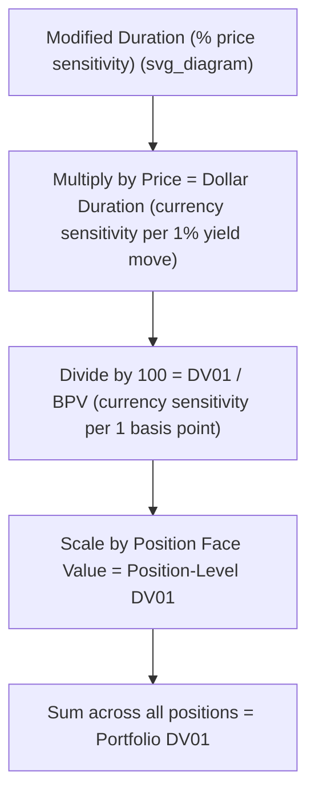

## Dollar Duration and DV01

### Definitions

**Key Points**

- **Dollar Duration (Money Duration)**: the absolute (currency-denominated) change in a bond's price for a 100 basis point (1%) change in yield, computed by scaling modified duration by the bond's price.
- **DV01 (Dollar Value of an 01)**, also called **BPV (Basis Point Value)** or **PVBP (Price Value of a Basis Point)**: the absolute dollar price change for a single basis point (0.01%, or 0.0001) change in yield — the most granular and widely quoted practical unit of interest rate risk on trading desks.
- Both measures translate the percentage-based modified duration into **currency terms**, which is essential for portfolio-level risk aggregation, position sizing, and hedging, since percentages alone cannot be directly summed across bonds with different prices and face amounts.

### Core Formulas

$$\text{Dollar Duration} = D_{mod} \times P$$

$$DV01 = D_{mod} \times P \times 0.0001$$

Equivalently, DV01 is simply Dollar Duration divided by 100 (since a basis point is 1/100th of a full percentage point):

$$DV01 = \frac{\text{Dollar Duration}}{100}$$

**Key Points**

- Both formulas assume $D_{mod}$ has already been computed (see Modified Duration and Price Sensitivity for its derivation from Macaulay duration).
- $P$ is typically quoted per 100 (or per some standard face value convention, e.g., per $1,000,000 face for institutional trading desks), so the resulting DV01 figure must be interpreted relative to whatever notional/face value basis was used.

### Worked Example

A bond has modified duration $D_{mod} = 7.25$ and a current price of $P = \$1{,}042.50$ per $1,000 face value.

**Dollar Duration:**

$$\text{Dollar Duration} = 7.25 \times 1042.50 = \$7{,}558.13$$

This means a 100 basis point (1%) change in yield is expected to change the bond's price by approximately $7,558.13 per $1,000 face value held — or, scaled proportionally, per $100,000 face value, roughly $75,581.30.

**DV01:**

$$DV01 = 7{,}558.13 \times 0.0001 = \$0.7558$$

**Output**: For every 1 basis point (0.01%) move in yield, this bond's price changes by approximately **$0.7558 per $1,000 face value** (equivalently, $75.58 per $100,000 face value, or $755.80 per $1,000,000 face value).

### Scaling DV01 to Position Size

$$\text{Position DV01} = DV01_{per\ unit\ face} \times \frac{\text{Position Face Value}}{\text{Face Value Basis Used}}$$

**Example**: For a position of $5,000,000 face value in the bond above (DV01 = $0.7558 per $1,000 face):

$$\text{Position DV01} = 0.7558 \times \frac{5{,}000{,}000}{1{,}000} = \$3{,}779.00$$

**Output**: The full $5 million face position has a DV01 of approximately **$3,779** — meaning a 1 basis point parallel yield increase reduces the position's value by roughly $3,779, and a 1 basis point decrease increases it by roughly the same amount.

### Diagram: From Modified Duration to Portfolio-Level Dollar Risk (svg_diagram)

### Portfolio-Level Aggregation

**Key Points**

- Unlike modified duration (a percentage measure that cannot be summed directly across bonds of different prices/sizes without weighting), **dollar duration and DV01 are directly additive** across positions, because they are already expressed in a common currency unit.
- Portfolio DV01 is simply the sum of each individual position's DV01, making it the preferred metric for aggregating and managing interest-rate risk across a diversified bond portfolio.

$$DV01_{portfolio} = \sum_{i=1}^{n} DV01_i$$

**Example: Simple Two-Bond Portfolio**

| Bond | Face Value | DV01 per $1,000 Face | Position DV01 |
| --- | --- | --- | --- |
| Bond A | $10,000,000 | $0.55 | $5,500 |
| Bond B | $5,000,000 | $0.90 | $4,500 |
| **Portfolio Total** |  |  | **$10,000** |

**Output**: The portfolio's total DV01 is **$10,000**, meaning a 1 basis point parallel rise in yields across both bonds would be expected to reduce total portfolio value by approximately $10,000, and a 1 basis point decline would increase it by roughly the same amount.

### DV01-Based Hedging

**Key Points**

- To hedge a position's (or portfolio's) interest rate exposure, a hedging instrument (futures, swaps, or other bonds) is sized so that its DV01 offsets the DV01 of the position being hedged, aiming for a net portfolio DV01 close to zero (or a specific target level).
- **Hedge ratio calculation**: the number of hedging instrument units needed equals the position's DV01 divided by the hedging instrument's DV01 (per unit, e.g., per futures contract or per $1 notional of a swap).

$$\text{Hedge Ratio (units)} = \frac{DV01_{position}}{DV01_{hedge\ instrument,\ per\ unit}}$$

**Example**

A bond position has a DV01 of $10,000. An available bond futures contract has a DV01 of $85 per contract.

$$\text{Number of Contracts} = \frac{10{,}000}{85} \approx 118 \text{ contracts (short position, to hedge a long bond exposure)}$$

**Output**: Selling approximately **118 futures contracts** would offset the bond position's DV01, creating an approximately duration-neutral (DV01-neutral) combined position with respect to small parallel yield moves.

### Key Properties and Considerations

**Key Points**

- **DV01 changes as yields change** (it is not a fixed constant for a given bond) because both modified duration and price change as yield changes — this means a DV01-based hedge calculated at one yield level requires periodic rebalancing as yields move ("dynamic hedging"), particularly for longer holding periods or larger yield moves.
- **DV01 assumes a parallel yield shift** and, like modified duration, is a local (small-move) linear approximation; for very large yield changes, or for portfolios exposed to non-parallel curve movements, DV01-based hedges become less precise, motivating supplementary use of convexity-adjusted or key-rate-duration-based hedging for more refined risk management.
- **DV01 for bonds with embedded options** should be computed using **effective duration** (option-model-based) rather than standard modified duration, for the same reasons effective duration is preferred over modified duration for such instruments generally.

### DV01 vs. Modified Duration: When to Use Which

| Use Case | Preferred Measure |
| --- | --- |
| Comparing relative interest rate sensitivity across bonds of different prices/sizes | Modified Duration (normalized, percentage basis) |
| Aggregating risk across a multi-bond portfolio | DV01 / Dollar Duration (directly additive) |
| Sizing a hedge position | DV01 (directly comparable in currency terms across instruments) |
| Setting portfolio-level risk limits | Often both are used together: DV01 for absolute dollar risk limits, modified duration for normalized/percentage-based risk limits |

### Applications

- **Trading desk risk management**: DV01 (or BPV) is the standard, most frequently quoted real-time risk metric on fixed income and rates trading desks, given its direct interpretability ("the position makes or loses $X per basis point") and its additivity across positions.
- **Swap and derivative hedge sizing**: interest rate swap desks routinely calculate and hedge net DV01 exposure across large books of swaps and other rate-sensitive instruments.
- **Regulatory and internal risk reporting**: aggregate portfolio DV01 (sometimes decomposed by maturity bucket) is a standard component of interest rate risk reporting frameworks for banks, asset managers, and insurers. [Inference: specific reporting formats and required granularity vary by regulatory regime and institution type, and should be confirmed against current applicable requirements if precision is needed for compliance purposes.]
- **Position sizing for macro/rates trading strategies**: traders express directional interest rate views by sizing positions to a target DV01 exposure, allowing consistent risk-taking across different instruments and maturities.

**Related Topics**

- Modified Duration and Price Sensitivity
- Macaulay Duration Derivation and Interpretation
- Convexity and the Convexity Adjustment to Price Change Estimates
- Key Rate Duration and Non-Parallel Yield Curve Risk
- Effective Duration for Bonds with Embedded Options
- Interest Rate Futures and Swap Hedging Strategies
- Portfolio Duration Matching for Liability-Driven Investing