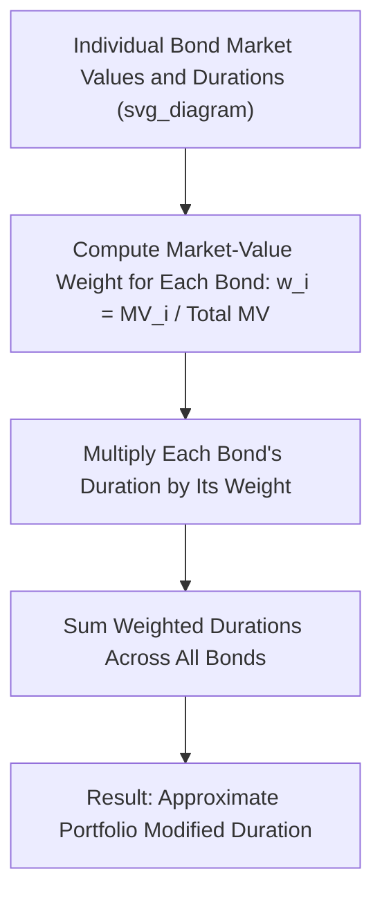
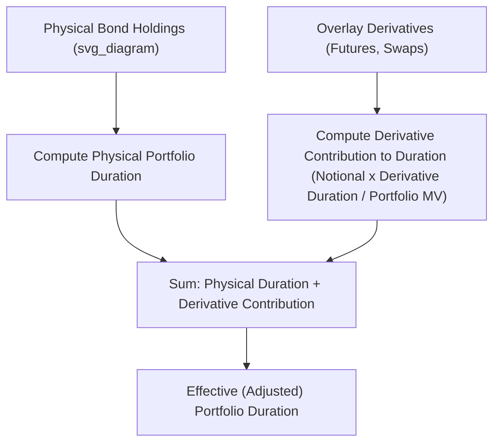

## Duration of a Bond Portfolio

### Overview

**Key Points**

- Portfolio duration extends the single-bond duration concept to a collection of fixed income holdings, providing a single summary measure of the portfolio's aggregate sensitivity to interest rate changes.
- Two distinct calculation approaches exist: the **weighted-average approximation** (simple, widely used, but technically approximate) and the **cash-flow aggregation method** (more rigorous, treats the portfolio as a single bundle of cash flows).
- Portfolio duration is central to liability-driven investing, immunization strategies, and interest rate risk budgeting at the fund or institutional level.

### Method 1: Market-Value-Weighted Average Duration

The most commonly used approach in practice approximates portfolio duration as the market-value-weighted average of the individual bonds' modified (or Macaulay) durations:

$$D_{portfolio} \approx \sum_{i=1}^{n} w_i \times D_i$$

where $w_i = \frac{MV_i}{MV_{total}}$ is the market-value weight of bond $i$, and $D_i$ is that bond's own duration.

### Worked Example

A portfolio holds three bonds:

| Bond | Market Value | Weight | Modified Duration | Weight × Duration |
| --- | --- | --- | --- | --- |
| A | $3,000,000 | 0.300 | 2.5 | 0.750 |
| B | $5,000,000 | 0.500 | 6.0 | 3.000 |
| C | $2,000,000 | 0.200 | 12.0 | 2.400 |
| **Total** | **$10,000,000** | **1.000** |  | **6.150** |

**Output**: Portfolio Modified Duration ≈ **6.15**. This means a 100 basis point (1%) parallel increase in yields is expected to reduce total portfolio value by approximately 6.15%, or about $615,000 on the $10,000,000 portfolio.

### Diagram: Weighted-Average Portfolio Duration Construction (svg_diagram)

### Why This Method Is an Approximation

**Key Points**

- The weighted-average approach is mathematically exact only under specific conditions: a **flat yield curve** and **parallel shifts** in yield across all maturities held in the portfolio.
- In reality, different bonds in a portfolio may have different yields to maturity (reflecting different maturities, credit quality, or curve positioning), and a "1% change in yield" applied uniformly to all of them for the weighted-average calculation is itself a simplification, since each bond's own yield may not move by exactly the same amount in practice (non-parallel shifts).
- Despite being an approximation, this method is used pervasively in practice because of its computational simplicity and because it provides a reasonably accurate estimate for typical, moderately diversified bond portfolios under typical (small, roughly parallel) yield curve movements. [Inference: the size of the approximation error depends on the dispersion of individual bond yields and durations within the portfolio and on the degree of non-parallel curve movement actually experienced, so its practical accuracy varies by portfolio composition and market conditions.]

### Method 2: Cash-Flow Aggregation (More Rigorous Approach)

**Key Points**

- Treats the entire portfolio as a single bundle of cash flows (summing all coupon and principal payments across all bonds occurring at each future date), then computes portfolio Macaulay duration directly from this aggregated cash flow schedule using the standard weighted-average-time formula.
- This approach avoids the flat-curve/parallel-shift assumption embedded in the weighted-average method, since it works directly from actual dated cash flows and can, in principle, incorporate different discount rates (from the actual term structure) for cash flows occurring at different future dates.
- More computationally intensive and less commonly used for quick, everyday portfolio risk reporting, but preferred for precise immunization and liability-matching applications where the approximation error of the simpler method could be economically material.

$$MacDur_{portfolio} = \sum_{t} t \times \frac{\left(\sum_i CF_{i,t}\right)/(1+z_t)^t}{\sum_i MV_i}$$

where $CF_{i,t}$ is bond $i$'s cash flow at time $t$, and $z_t$ is the appropriate spot rate for that maturity.

### Comparison of the Two Methods

| Aspect | Weighted-Average Method | Cash-Flow Aggregation Method |
| --- | --- | --- |
| Computational complexity | Low; simple weighted sum | Higher; requires full cash flow schedule and spot curve |
| Accuracy | Approximate; exact only under flat curve/parallel shifts | More precise; accounts for actual cash flow timing and term structure |
| Typical use case | Everyday portfolio risk reporting, quick estimates | Precise liability immunization, actuarial/pension applications |
| Data requirements | Individual bond durations and market values | Full cash flow schedules for every holding plus a spot/discount curve |

### Portfolio Duration and Rebalancing

**Key Points**

- Portfolio duration is **not static**: it mechanically declines over time as bonds age toward maturity (all else equal), and it changes whenever yields move (since individual bond durations themselves change with yield, per the price-yield relationship) or whenever portfolio composition changes (buying, selling, or reinvesting proceeds into different bonds).
- Active duration management requires periodic rebalancing — buying or selling bonds, or using derivative overlays (futures, swaps) — to maintain a target duration exposure over time, particularly important for immunization strategies where duration drift away from a matched liability horizon reintroduces interest rate risk.
- The frequency and threshold for rebalancing (e.g., rebalancing whenever portfolio duration drifts more than a specified amount from target) is a practical portfolio management decision that trades off tracking precision against transaction costs. [Inference: the optimal rebalancing frequency depends on the specific portfolio's transaction cost structure, the volatility of yields, and the tolerance for duration mismatch, and does not have a single universally correct answer.]

### Using Derivatives to Adjust Portfolio Duration

**Key Points**

- Interest rate futures, swaps, and other derivatives can adjust a portfolio's effective duration without requiring the sale or purchase of underlying bond holdings, offering a capital-efficient and often lower-transaction-cost way to shift duration exposure.
- **Adding duration**: entering a receive-fixed interest rate swap, or going long bond futures, increases portfolio duration (increases sensitivity to falling rates).
- **Reducing duration**: entering a pay-fixed interest rate swap, or going short bond futures, decreases portfolio duration (reduces sensitivity to rate changes, or can even create negative net duration exposure if sized aggressively).

$$D_{portfolio,\ adjusted} = D_{portfolio,\ physical} + \frac{\text{Notional}_{derivative} \times D_{derivative}}{MV_{portfolio}}$$

**Example**

A $50,000,000 portfolio has a physical (bond-only) modified duration of 5.0. The manager wants to increase overall duration to 7.0 using an interest rate swap with an effective duration of 8.0 (on its notional).

$$7.0 = 5.0 + \frac{\text{Notional} \times 8.0}{50{,}000{,}000}$$

$$2.0 \times 50{,}000{,}000 = \text{Notional} \times 8.0$$

$$\text{Notional} = \frac{100{,}000{,}000}{8.0} = \$12{,}500{,}000$$

**Output**: Entering a receive-fixed swap with approximately **$12,500,000 notional** would raise the portfolio's effective duration from 5.0 to the target of 7.0.

### Diagram: Physical vs. Derivative-Adjusted Portfolio Duration (svg_diagram)

### Applications

- **Liability-driven investing (LDI)**: pension funds and insurers match portfolio duration to the duration of projected liability cash flows, reducing the risk of a funding shortfall driven by interest rate movements.
- **Benchmark-relative risk management**: active bond fund managers monitor portfolio duration relative to a benchmark index's duration, taking deliberate over/underweight duration positions to express interest rate views while managing tracking error.
- **Barbell vs. bullet portfolio construction**: portfolio duration calculations underlie the analysis of barbell strategies (combining very short and very long maturities) versus bullet strategies (concentrated at a single intermediate maturity) that target the same overall portfolio duration but differ in convexity and yield curve exposure.
- **Regulatory capital and asset-liability management (ALM)**: banks and insurers use portfolio duration (often alongside more granular key rate duration) as a core input to regulatory interest rate risk assessments and internal ALM frameworks. [Inference: specific regulatory frameworks and required methodologies vary by jurisdiction and institution type, and should be confirmed against current applicable rules if precision is required for compliance purposes.]

**Related Topics**

- Modified Duration and Price Sensitivity
- Macaulay Duration Derivation and Interpretation
- Dollar Duration and DV01
- Classical (Redington) Immunization Theory and Rebalancing
- Key Rate Duration and Non-Parallel Yield Curve Risk
- Barbell, Bullet, and Ladder Portfolio Structuring Strategies
- Interest Rate Swap and Futures Overlay Strategies for Duration Management