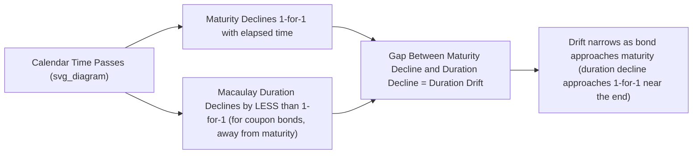

## Duration Drift Over Time

### Definition

**Key Points**

- **Duration drift** refers to the change in a bond's (or portfolio's) duration that occurs purely as a function of the **passage of time**, holding yield constant — distinct from duration changes caused by yield movements (the price-yield relationship's curvature effect).
- As a bond ages, its Macaulay duration generally declines, but **not at the same rate as calendar time passes** — this non-parallel decay is the central technical feature of duration drift and has direct implications for immunization strategy rebalancing.
- Understanding duration drift is essential for maintaining an effective immunization or duration-matching strategy, since even in a world of unchanged interest rates, a portfolio's duration will not remain constant, and will diverge from a target liability duration purely due to time passing.

### Why Duration Does Not Decline One-for-One with Time

**Key Points**

- For a **zero-coupon bond**, Macaulay duration equals maturity exactly, so duration declines exactly one year for every year that passes (duration and calendar time move in lockstep) — this is the special, simplest case.
- For a **coupon-paying bond**, duration is a present-value-weighted average of cash flow timing, and as time passes: (1) the remaining maturity shortens, but (2) the *relative weight* of the (now-closer) coupon payments and the (now-closer) principal repayment relative to total price also shifts, and these two effects do not exactly offset in a simple one-year-per-year pattern.
- The result is that a coupon bond's duration typically declines by **less than one full year** for each year that passes, meaning the bond's duration "ages" more slowly than its calendar maturity — a phenomenon sometimes described as the bond's duration exhibiting positive "time decay" but at a sub-1.0 rate relative to maturity.

### Worked Example: Duration Drift Over a 4-Year Holding Period

Consider a bond originally issued as a 4-year, 8% annual-pay bond, $F=1000$, held at a constant yield of 8% (so it remains priced at par throughout, isolating the pure time-decay effect from any yield-change effect).

| Time Elapsed | Remaining Maturity | Macaulay Duration | Duration Decline vs. Prior Year |
| --- | --- | --- | --- |
| $t=0$ | 4 years | 3.577 years | — |
| $t=1$ | 3 years | 2.783 years | -0.794 |
| $t=2$ | 2 years | 1.929 years | -0.854 |
| $t=3$ | 1 year | 1.000 years | -0.929 |
| $t=4$ | 0 years | 0.000 years | -1.000 |

**Output**: Over the first year, duration falls by only **0.794 years** (from 3.577 to 2.783), not the full 1.0 year that calendar time advanced. This gap (1.0 − 0.794 = 0.206 years in the first year) is the duration drift — the bond's duration "lags behind" the shortening of calendar maturity, especially in the earlier years of its life. Notice the decline accelerates and approaches 1-for-1 only as the bond nears maturity, converging to exactly 1.000 in the final year (consistent with a single remaining cash flow behaving like a zero-coupon bond).

### Diagram: Duration Drift vs. Calendar Time Decay (svg_diagram)

### Implications for Immunization Strategies

**Key Points**

- Classical (Macaulay/Redington) immunization requires portfolio duration to match a target liability horizon **at all times**, not just at initiation — because both the liability's remaining time-to-payment and the portfolio's duration decline over time, but generally at **different rates**, the match achieved at $t=0$ erodes as time passes even with no change in interest rates.
- This means immunized portfolios require **periodic rebalancing** purely due to the passage of time (in addition to any rebalancing needed due to actual yield changes), since duration drift alone will cause the portfolio duration to diverge from the (also-declining, but at a different rate) liability duration.
- The rebalancing frequency needed to maintain a reasonably tight duration match is a practical portfolio management decision, trading off tracking precision against transaction costs incurred with each rebalancing. [Inference: optimal rebalancing frequency depends on the specific bonds and liabilities involved and the manager's tolerance for tracking error, and is not governed by a single universal rule.]

### Duration Drift and Coupon Rate

**Key Points**

- **Higher-coupon bonds** generally exhibit **greater** duration drift (a larger gap between calendar time decay and duration decay) in their earlier years, because a larger proportion of present value is tied up in near-term coupon payments, making the weighted-average time more resistant to shortening purely from the passage of time until the bond gets close to maturity.
- **Lower-coupon bonds** (approaching the zero-coupon limiting case) exhibit **less** duration drift, since their cash flow weight is more concentrated near maturity throughout the bond's life, causing duration to track calendar time more closely.
- **Zero-coupon bonds** exhibit **no duration drift at all** — duration and calendar time-to-maturity remain identical throughout the bond's life, making zero-coupon bonds the theoretically "cleanest" instrument for immunization strategies that seek to avoid the need for time-driven rebalancing (though they remain subject to rebalancing needs from actual yield changes and, in practice, are also exposed to reinvestment considerations if used within a broader portfolio context).

### Duration Drift and Yield Level Interaction

**Key Points**

- Duration drift as described above isolates the pure time-passage effect by holding yield constant; in practice, yields also change over time, and these two effects (time decay and yield-change-driven duration change) act **simultaneously** and must both be tracked for accurate portfolio duration management.
- A rise in yield tends to independently reduce a bond's duration (per the price-yield relationship's determinants), while a fall in yield tends to increase it — these yield-driven duration changes are superimposed on top of, and separate from, the time-decay-driven duration drift described in this topic.
- Practically, portfolio and risk management systems recompute duration on an ongoing (often daily) basis using current market yields and updated time-to-maturity, capturing both effects together rather than attempting to decompose them separately for routine monitoring purposes.

### Portfolio-Level Duration Drift

**Key Points**

- For a portfolio of multiple bonds with different coupons and maturities, aggregate portfolio duration drift is the market-value-weighted combination of each individual bond's own drift pattern, meaning the portfolio's overall drift behavior depends on its specific composition (mix of coupons and maturities) at any point in time.
- A portfolio heavily weighted toward high-coupon, intermediate-maturity bonds will generally exhibit more pronounced duration drift (requiring more frequent time-driven rebalancing) than a portfolio weighted toward zero-coupon or very-low-coupon instruments, all else equal.
- As bonds within a portfolio approach and reach maturity, they are typically replaced with new holdings (reinvestment), which resets that portion of the portfolio's contribution to duration drift, making the drift pattern of an actively managed, continuously reinvested portfolio different from a static, buy-and-hold single bond's drift pattern over its full life.

### Distinguishing Duration Drift from Convexity-Driven Duration Change

| Source of Duration Change | Cause | Direction |
| --- | --- | --- |
| Duration Drift (time decay) | Passage of calendar time, yield held constant | Generally declining, but at less than 1-for-1 rate with time for coupon bonds |
| Yield-Driven Duration Change | Change in market yield level | Duration falls as yield rises; duration rises as yield falls (per price-yield relationship) |

**Key Points**

- Both effects change a bond's duration over the life of a holding, but they arise from fundamentally different sources (time vs. yield level) and must be tracked and rebalanced for separately (or jointly, via frequent recalculation) in a rigorous duration-matching or immunization program.

### Applications

- **Immunization rebalancing schedules**: actuaries and portfolio managers build explicit rebalancing calendars (e.g., quarterly, semiannually) that account for expected duration drift, ensuring a liability-matched portfolio does not silently drift out of alignment purely due to time passing between active reviews.
- **Bond selection for stable-duration strategies**: managers seeking to minimize rebalancing frequency and transaction costs may deliberately favor lower-coupon or zero-coupon instruments (which exhibit less duration drift) when constructing portfolios intended to track a specific duration target over an extended period without frequent trading.
- **Pension and insurance liability matching**: since liabilities themselves also exhibit duration drift as their payment dates approach, actuaries must model both asset-side and liability-side drift patterns jointly to maintain an effective long-term hedge.
- **Performance attribution**: distinguishing returns attributable to duration drift/time decay versus those attributable to active yield-change exposure is a component of more granular fixed income performance attribution frameworks.

**Related Topics**

- Macaulay Duration Derivation and Interpretation
- Duration of a Bond Portfolio
- Classical (Redington) Immunization Theory and Rebalancing
- Modified Duration and Price Sensitivity
- Convexity and the Convexity Adjustment to Price Change Estimates
- Portfolio Duration Matching for Liability-Driven Investing
- Reinvestment Strategies for Actively Managed Bond Portfolios