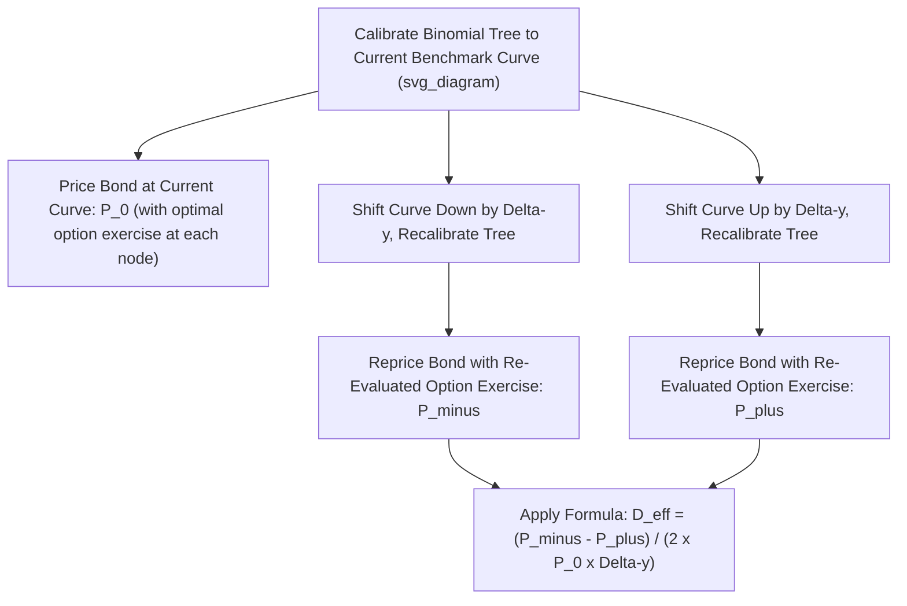

## Effective Duration for Option-Embedded Bonds

### Definition

**Key Points**

- **Effective Duration** measures a bond's percentage price sensitivity to a parallel shift in the benchmark yield curve, computed numerically by repricing the bond under an assumed pricing model that allows **cash flows to change** in response to yield changes — as opposed to modified duration, which holds cash flows fixed.
- Effective duration is the appropriate duration measure for any bond whose cash flows are contingent on future interest rate paths, most notably **callable bonds**, **putable bonds**, and **mortgage-backed/asset-backed securities** subject to prepayment risk.
- Unlike modified duration (which has a closed-form analytical formula), effective duration is computed **numerically**, requiring a valuation model (typically a binomial interest rate tree or Monte Carlo simulation) capable of repricing the bond under different yield scenarios while accounting for the embedded option's effect on cash flows.

### Why Modified Duration Fails for Option-Embedded Bonds

**Key Points**

- Modified duration is derived assuming a bond's cash flow schedule is **fixed and certain**; its formula differentiates price with respect to yield holding cash flows constant.
- For a callable bond, this assumption breaks down: as yields fall, the probability of the issuer calling the bond rises, meaning the bond's *expected* cash flows themselves change — the bond effectively "shortens" as call probability increases, an effect modified duration cannot capture since it never varies the cash flow schedule.
- Applying standard modified duration to a callable bond (calculated using its stated maturity's cash flows) can produce a materially **overstated** duration figure in low-yield environments, since it ignores the price-compressing effect of the approaching, more-likely call.

### Effective Duration Formula

$$D_{eff} = \frac{P_{-} - P_{+}}{2 \times P_0 \times \Delta y}$$

where:

- $P_{-}$ = the bond's model-based price after a small **downward** parallel shift in the benchmark yield curve
- $P_{+}$ = the bond's model-based price after a small **upward** parallel shift in the benchmark yield curve
- $P_0$ = the bond's current model-based price (at the unshifted curve)
- $\Delta y$ = the size of the yield shift used (expressed in decimal form, e.g., 0.0025 for 25 basis points)

**Key Points**

- Both $P_-$ and $P_+$ must be computed using a valuation model that **re-evaluates the embedded option's exercise decision** at each shifted yield level — this is what allows effective duration to reflect the true, option-adjusted price sensitivity.
- The shift size $\Delta y$ is chosen to be small enough to approximate a local derivative reasonably well, but large enough to produce a meaningful, numerically stable price difference; common practice uses shifts in the range of 10-50 basis points, though the specific optimal choice can be model- and instrument-dependent. [Unverified: no single universally agreed "correct" shift size exists; different practitioners and systems may use different conventions.]

### Step-by-Step Calculation Procedure

**Step 1**: Build (or obtain) a valuation model — typically a binomial interest rate tree — calibrated to the current benchmark yield curve (so that it correctly reprices benchmark option-free bonds).

**Step 2**: Compute $P_0$, the bond's price under the current, unshifted tree, incorporating the embedded option's optimal exercise decision at each node (backward induction).

**Step 3**: Shift the entire benchmark curve down by $\Delta y$, rebuild/recalibrate the tree, and reprice the bond (with re-evaluated optimal call/put decisions at each node) to obtain $P_{-}$.

**Step 4**: Shift the entire benchmark curve up by $\Delta y$, rebuild/recalibrate the tree, and reprice the bond similarly to obtain $P_{+}$.

**Step 5**: Apply the effective duration formula using $P_-$, $P_+$, $P_0$, and $\Delta y$.

### Diagram: Effective Duration Calculation Workflow (svg_diagram)

### Worked Example

A callable bond is currently priced at $P_0 = 101.25$ under the current benchmark curve. Shifting the curve down by 25 basis points ($\Delta y = 0.0025$) and repricing (with the model re-evaluating call likelihood at each node) gives $P_{-} = 102.10$. Shifting the curve up by 25 basis points gives $P_{+} = 99.85$.

$$D_{eff} = \frac{102.10 - 99.85}{2 \times 101.25 \times 0.0025} = \frac{2.25}{0.50625} = 4.444$$

**Output**: Effective duration ≈ **4.444**. Notice the asymmetry in the price responses: the bond's price rose by only 0.85 (from 101.25 to 102.10) on the downward shift, but fell by 1.40 (from 101.25 to 99.85) on the equal-sized upward shift — this asymmetric, compressed upside response (smaller price gain than an equivalent option-free bond would show) is the signature of the call option's price-dampening effect at this yield level, and is precisely why effective duration (which captures this asymmetry through its inputs) differs from what a naive modified duration calculation on the bond's stated cash flows would produce.

### Effective Duration vs. Modified Duration: Comparative Behavior

| Yield Environment | Callable Bond Behavior | Effective Duration vs. "Naive" Modified Duration (to maturity) |
| --- | --- | --- |
| High yield (call unlikely) | Behaves similarly to an option-free bond | Effective duration ≈ modified duration to maturity |
| Low yield (call likely) | Price appreciation capped near call price; call risk dominates | Effective duration substantially **less** than modified duration to maturity (bond behaves more like a short-maturity instrument) |
| Transitional/at-the-money region | Option value highly sensitive to further yield moves | Effective duration can change rapidly with small yield moves — negative convexity region |

### Negative Convexity and Effective Duration's Yield Sensitivity

**Key Points**

- Effective duration itself is **not constant** across yield levels for callable bonds — it changes meaningfully (and can decline sharply) as yields fall into the region where the call option becomes economically attractive to the issuer, a pattern known as **negative convexity**.
- This means, unlike modified duration for an option-free bond (which changes only gradually and predictably with yield), effective duration for a callable bond must be **recalculated frequently** as yields move, since a single point-in-time effective duration figure can become stale relatively quickly in a shifting rate environment.
- **Effective Convexity**, computed analogously to effective duration but using the second-difference (curvature) of the three price points ($P_-$, $P_0$, $P_+$), captures this changing sensitivity and can take negative values for callable bonds in the low-yield region — a result impossible under standard (always-positive) convexity for option-free bonds.

$$C_{eff} = \frac{P_{-} + P_{+} - 2P_0}{P_0 \times (\Delta y)^2}$$

### Effective Duration for Putable Bonds

**Key Points**

- For putable bonds, the same effective duration methodology applies, but the option-adjusted price behavior runs in the opposite direction: as yields **rise**, the put option becomes more valuable/likely to be exercised, which **limits price depreciation** relative to an equivalent option-free bond — the put "floors" the price decline.
- This means putable bonds generally exhibit **lower effective duration than an equivalent option-free bond in high-yield environments** (where the put is more likely to be exercised), while behaving more like an option-free bond to maturity when yields are low and the put is unlikely to be exercised.
- Putable bonds generally retain **positive convexity** throughout the yield range (unlike callable bonds' negative convexity region), since the put option enhances (rather than caps) the bond's favorable convexity profile.

### Effective Duration for Mortgage-Backed Securities (MBS)

**Key Points**

- MBS are subject to **prepayment risk**, which is economically analogous to a large-scale, distributed call option held by the pool of underlying mortgage borrowers (who can refinance/prepay when rates fall).
- Effective duration for MBS is computed similarly (reprice under shifted rate scenarios), but requires an underlying **prepayment model** (rather than a simple optimal-exercise assumption) to project how prepayment speeds change under different rate environments, since individual mortgage borrowers do not always refinance in a purely economically optimal manner (prepayment behavior includes housing turnover, refinancing frictions, and borrower-specific factors beyond pure rate arbitrage).
- MBS can exhibit pronounced negative convexity, particularly for pools trading near or above par, due to this prepayment optionality — analogous to, but generally more complex to model than, a single callable corporate bond, given the pooled and behaviorally-influenced nature of the prepayment option. [Inference: the specific magnitude and shape of negative convexity for any given MBS pool depends on the underlying prepayment model's assumptions and the pool's specific collateral characteristics, which vary significantly across different MBS structures.]

### Model Dependency and Limitations

**Key Points**

- Effective duration is inherently **model-dependent**: different valuation models (different interest rate volatility assumptions, different tree/lattice construction methods, different prepayment model specifications for MBS) can produce different effective duration estimates for the identical bond, unlike modified duration, which is a closed-form, model-independent calculation given a stated yield.
- This model dependency means effective duration figures from different data vendors or systems for the same option-embedded bond may not be perfectly comparable unless the underlying models and assumptions are known to be consistent. [Unverified: the magnitude of typical cross-vendor discrepancies is not a fixed, universally quantified figure and depends on the specific models and calibration approaches being compared.]
- Effective duration also assumes a **parallel** shift in the benchmark curve for its calculation; like modified duration, it does not by itself capture sensitivity to non-parallel curve movements, for which **key rate duration** (adapted to an option-adjusted framework) provides a more granular decomposition.

### Applications

- **Risk management for callable corporate and agency bonds**: portfolio managers holding callable debt rely on effective duration (not modified duration) as the appropriate measure of true interest rate sensitivity, particularly important in environments with elevated call risk.
- **Mortgage-backed securities portfolio management**: effective duration and effective convexity are foundational risk metrics for MBS trading desks and portfolio managers, given the pervasive and economically significant prepayment optionality in this asset class.
- **Option-adjusted spread (OAS) analysis**: effective duration is typically computed alongside OAS as part of the same option-pricing-model-based valuation framework, providing a complete risk/relative-value picture for option-embedded securities.
- **Hedging embedded option exposure**: understanding where a callable bond or MBS sits on its negative convexity profile informs decisions about supplementary hedging (e.g., using interest rate options) to manage the convexity risk that duration-only hedging does not fully address.

**Related Topics**

- The Price-Yield Relationship
- Modified Duration and Price Sensitivity
- Convexity and the Convexity Adjustment to Price Change Estimates
- Option-Adjusted Spread (OAS) for Callable and Putable Bonds
- Negative Convexity in Callable Bonds and Mortgage-Backed Securities
- Binomial Interest Rate Tree Calibration
- Key Rate Duration and Non-Parallel Yield Curve Risk
- Mortgage Prepayment Modeling and MBS Cash Flow Projection