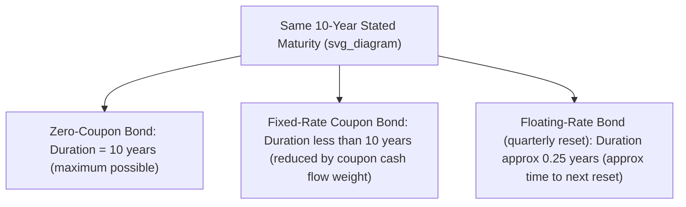

## Duration of Zero-Coupon and Floating-Rate Bonds

### Overview

**Key Points**

- Zero-coupon bonds and floating-rate bonds sit at opposite ends of the duration spectrum for a given stated maturity: zero-coupon bonds exhibit the **maximum possible duration** for their maturity, while floating-rate bonds exhibit **near-zero duration** regardless of their stated (final) maturity.
- Both instrument types serve as useful conceptual benchmarks and boundary cases for understanding how coupon structure and rate-reset mechanics drive interest rate sensitivity, independent of maturity alone.
- Both are also frequently used in practice specifically **because of** their duration characteristics — zero-coupon bonds for precise immunization/duration-matching, and floating-rate bonds for minimizing interest rate risk exposure while retaining credit exposure.

### Duration of Zero-Coupon Bonds

**Key Points**

- A zero-coupon bond has exactly one cash flow — the face value repayment at maturity — so its Macaulay duration equals its maturity **exactly**:

$$MacDur_{zero} = N$$

- This follows directly from the weighted-average-time definition: since there is only one cash flow, its present-value weight is 100% ($w_N = 1$), making the weighted-average time trivially equal to that single cash flow's timing.
- **Modified duration** for a zero-coupon bond follows the standard conversion from Macaulay duration:

$$D_{mod,\ zero} = \frac{N}{1+y/k}$$

**Example**

A 10-year zero-coupon bond, annual compounding, $y = 5\%$:

$$MacDur = 10 \text{ years (exactly)}$$

$$D_{mod} = \frac{10}{1.05} = 9.524$$

**Output**: This zero-coupon bond has the **maximum possible duration** achievable by any bond with a 10-year maturity — any coupon-paying bond with the same 10-year maturity and same yield will have a **strictly lower** duration, since coupon payments pull cash flow weight (and thus the weighted-average time) earlier than the final maturity date.

### Why Zero-Coupon Bonds Have Maximum Duration for Their Maturity

**Key Points**

- For any coupon-paying bond, some portion of total present value is received before maturity via coupons, which necessarily lowers the weighted-average time below the stated maturity.
- A zero-coupon bond represents the **limiting case** as coupon rate approaches zero: as coupon rate falls toward zero (holding maturity and yield constant), Macaulay duration rises and converges toward — but for any positive coupon, remains strictly below — the bond's stated maturity.
- This makes zero-coupon bonds the instrument of choice when an investor or liability-matching strategy requires the **highest possible duration exposure** per unit of maturity, or when the most **precise** duration/maturity match is required (since duration and maturity are identical, eliminating any ambiguity between the two concepts).

### Zero-Coupon Bonds and Convexity

**Key Points**

- Zero-coupon bonds also exhibit **higher convexity** than coupon-paying bonds of the same duration (not the same maturity), a related but distinct property from their maximum-duration-per-maturity characteristic.
- This combination of high duration (relative to maturity) and comparatively high convexity (relative to duration) makes zero-coupon bonds particularly attractive building blocks for constructing barbell portfolio strategies seeking to maximize convexity for a given target duration.
- Zero-coupon bonds have **no reinvestment risk** if held to maturity, since there are no interim cash flows to reinvest — a further distinguishing property relevant to the accuracy of duration-based return projections for these instruments (see Yield to Maturity and Total Return topics for more on this reinvestment-risk connection).

### Duration of Floating-Rate Bonds (Floaters)

**Key Points**

- A **floating-rate bond (floater)** pays a coupon that periodically resets to a reference rate (e.g., SOFR, a Treasury rate, or another benchmark) plus a fixed spread, rather than paying a fixed coupon throughout its life.
- Because the coupon rate itself adjusts to reflect current market rates at each reset date, the bond's price remains close to par immediately after each reset (assuming the credit spread has not changed), regardless of the bond's stated final maturity — this is the source of floaters' characteristically low duration.
- The **duration of a floating-rate bond is approximately equal to the time remaining until its next coupon reset date** — not its full maturity — because between reset dates, the bond behaves like a short-maturity fixed-rate instrument (its cash flows are fixed until the next reset), but at each reset, its coupon "resets" to the new market rate, effectively resetting its price-sensitivity clock as well.

$$D_{mod,\ floater} \approx \text{Time to Next Reset Date (in years)} \times \left(\text{small adjustment factor}\right)$$

**Example**

A floating-rate note has a 15-year final maturity but resets its coupon quarterly (every 3 months) to 3-month SOFR plus a fixed spread. The bond was just reset yesterday.

**Output**: Despite its 15-year stated maturity, this floater's duration is approximately **0.25 years** (3 months) — essentially equal to the time remaining until the next reset, because between now and the next reset, the bond's next coupon payment is already fixed and known, behaving like a very short-maturity instrument; at the reset date, the coupon readjusts to reflect prevailing rates, and price returns close to par (assuming stable credit quality), effectively "restarting" the clock.

### Diagram: Duration Comparison — Zero-Coupon vs. Fixed-Rate vs. Floating-Rate (svg_diagram)

### Why Floating-Rate Bonds Have Low Duration Despite Long Maturity

**Key Points**

- The core mechanism is that a floater's **coupon rate itself moves with market rates**, so when market yields rise, the floater's future coupons rise correspondingly (at the next reset), largely offsetting the discounting effect that would otherwise reduce a fixed-rate bond's price.
- This built-in coupon adjustment means the floater's price is largely insulated from parallel shifts in the general level of interest rates (the reference rate component), leaving the bond's price primarily sensitive only to changes in its **credit spread** over the reference rate, not to the overall level of rates.
- **Spread duration** is the relevant sensitivity measure for floaters — measuring price sensitivity to a change in the credit spread component specifically, holding the reference rate constant — since standard (rate-level) duration is, by design, very low for these instruments.

### Floating-Rate Bond Duration in Practice: Caps, Floors, and Resets

**Key Points**

- **Capped floaters** (with a maximum coupon rate ceiling) begin to behave more like fixed-rate bonds (with correspondingly higher duration) once market rates rise close to or above the cap, since the coupon can no longer adjust upward to offset rising rates — introducing negative-convexity-like behavior similar to a callable bond in that regime.
- **Floored floaters** (with a minimum coupon rate floor) exhibit analogous behavior in falling-rate environments once rates approach the floor.
- **Reset frequency** directly determines the base-case duration level: a floater resetting monthly will have lower average duration between resets than one resetting semiannually or annually, all else equal, since the "clock" restarts more frequently.

### Comparison Table: Duration Characteristics by Bond Type

| Bond Type | Approximate Duration | Primary Driver |
| --- | --- | --- |
| Zero-coupon bond | Equal to full maturity | No interim cash flows; entire value concentrated at maturity |
| Fixed-rate coupon bond | Less than maturity, decreasing with higher coupon | Present-value-weighted average of coupon and principal cash flows |
| Plain floating-rate bond (no caps/floors, near reset) | Approximately equal to time to next reset | Coupon rate itself resets to market level, offsetting discounting effect |
| Capped/floored floater near the cap/floor | Rises toward fixed-rate-bond-like duration levels | Coupon can no longer adjust freely, reintroducing rate-level sensitivity |

### Applications

- **Immunization and precise duration matching**: zero-coupon bonds (or zero-coupon "strips" of coupon bonds) are frequently used by actuaries and liability-driven investors specifically because their duration equals maturity exactly, eliminating estimation uncertainty in matching a portfolio to a known future liability date.
- **Managing interest rate risk while retaining credit exposure**: investors seeking exposure to an issuer's credit risk (spread) without significant exposure to the general level of interest rates commonly use floating-rate notes, given their inherently low rate-level duration.
- **Portfolio duration adjustment**: adding floating-rate bonds to a portfolio is a straightforward way to reduce aggregate portfolio duration without altering credit exposure or requiring derivative overlays, useful for managers seeking to de-risk interest rate exposure tactically.
- **Barbell and structured portfolio construction**: combining zero-coupon bonds (high duration, high convexity) with floating-rate bonds (near-zero duration) allows precise, granular control over a portfolio's aggregate duration and convexity profile.

**Related Topics**

- Macaulay Duration Derivation and Interpretation
- Modified Duration and Price Sensitivity
- Duration of a Bond Portfolio
- Spread Duration and Credit Spread Risk Measures
- Effective Duration for Option-Embedded Bonds
- Barbell, Bullet, and Ladder Portfolio Structuring Strategies
- Classical (Redington) Immunization Theory and Rebalancing