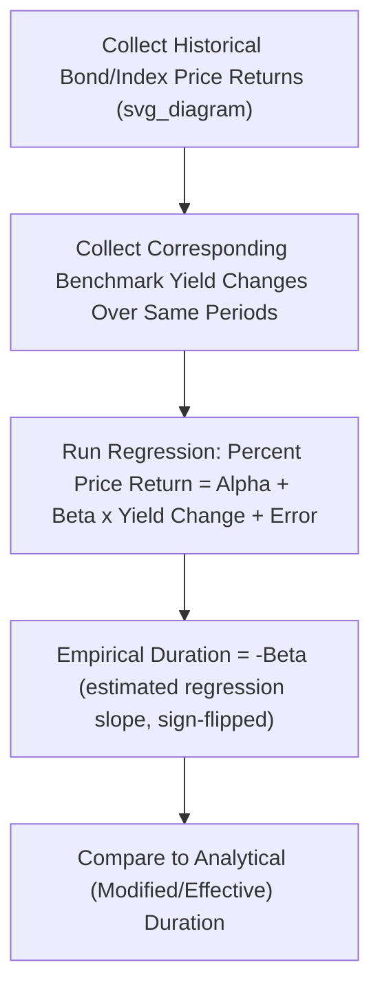

## Empirical Duration versus Analytical Duration

### Definitions

**Key Points**

- **Analytical Duration** (encompassing modified duration and effective duration) is derived from a **pricing model**: it computes theoretical price sensitivity by either differentiating a bond pricing formula (modified duration) or by repricing under a model with shifted yield curves (effective duration).
- **Empirical Duration** is estimated **statistically**, by regressing a bond's (or bond sector's) actual historical price returns against actual historical changes in a relevant benchmark yield or yield curve, capturing the *realized* empirical relationship between price and yield changes rather than a model-implied theoretical one.
- The distinction matters because, for many real-world instruments — corporate bonds, high-yield debt, MBS — the **empirically observed** sensitivity of price to yield changes can differ meaningfully from what an analytical model predicts, due to factors the model does not explicitly capture (liquidity effects, credit spread co-movement with rates, behavioral or technical market factors).

### Analytical Duration: Recap

**Key Points**

- Modified duration is computed directly from a bond's cash flow schedule and yield via a closed-form formula, assuming fixed cash flows and a purely mathematical relationship between price and yield.
- Effective duration is computed by repricing a bond under a valuation model (e.g., a binomial tree) under shifted yield scenarios, allowing cash flows to vary with the option-exercise assumptions embedded in that model.
- Both are fundamentally **theoretical/model-based** constructs: they answer "what does the pricing model say should happen to price if yield changes by this amount?" — and their accuracy depends entirely on how well the underlying model and its assumptions reflect real-world bond behavior.

### Empirical Duration: Estimation Method

**Empirical duration is estimated via linear regression:**

$$\%\Delta P_t = \alpha + \beta \times \Delta y_t + \epsilon_t$$

where $\%\Delta P_t$ is the bond's (or index's) percentage price return over period $t$, $\Delta y_t$ is the corresponding change in a reference benchmark yield over the same period, and the estimated coefficient $\beta$ (with a sign flip, since duration is conventionally expressed as a positive number for a negative price-yield relationship) is the **empirical duration**:

$$D_{empirical} = -\hat{\beta}$$

**Step-by-Step Procedure**

**Step 1**: Collect a time series of historical price (or total return) observations for the bond or bond index of interest.

**Step 2**: Collect a corresponding time series of changes in an appropriate benchmark yield (e.g., the 10-year Treasury yield, or a duration-matched Treasury benchmark).

**Step 3**: Run an ordinary least squares (or similar) regression of percentage price changes on yield changes.

**Step 4**: The (negated) slope coefficient from this regression is the empirical duration estimate.

### Worked Illustrative Example

Suppose a corporate bond index's monthly returns and corresponding 10-year Treasury yield changes over 24 months produce a regression with an estimated slope coefficient $\hat{\beta} = -4.20$.

$$D_{empirical} = -(-4.20) = 4.20$$

**Output**: The index's empirical duration is **4.20**, meaning historically, a 100 basis point rise in the 10-year Treasury yield has been associated with an approximate 4.20% decline in this index's price, on average, over the sample period. If the index's stated analytical (model-based) duration is, say, 6.50, this reveals a substantial **gap** between the theoretical sensitivity implied by the bonds' own cash flow structures and the actual observed market behavior — often attributable to the credit spread on these bonds moving in the *opposite* direction of Treasury yields over the sample period (e.g., spreads tightening as Treasury yields rose, partially offsetting the pure rate-driven price decline the analytical duration alone would predict).

### Diagram: Empirical Duration Estimation via Regression (svg_diagram)

### Why Empirical and Analytical Duration Can Diverge

**Key Points**

- **Spread-rate correlation**: for corporate and credit-sensitive bonds, credit spreads often move inversely (or with a lagged/imperfect relationship) to benchmark yield levels — e.g., in a "risk-off" environment, Treasury yields may fall while credit spreads widen, causing corporate bond prices to move less (or even oppositely) than pure Treasury-rate-based analytical duration would predict.
- **Callable/prepayable instrument behavior**: for MBS and callable bonds, actual observed prepayment or call behavior can differ from the model's assumed optimal-exercise behavior (borrowers do not always refinance in a purely economically rational, cost-minimizing way), causing effective duration (itself already a modeled estimate) to diverge from empirically observed price sensitivity.
- **Liquidity and technical market factors**: periods of market stress, illiquidity, or heavy issuance/demand imbalances can cause bond prices to move for reasons unrelated to the pure yield-based relationship a model assumes, introducing noise or systematic bias into the empirical relationship relative to the analytical prediction.
- **Sample period dependency**: because empirical duration is estimated from a specific historical sample, its value is inherently backward-looking and sample-period-dependent — a regression run over a different historical window (e.g., a rising-rate period versus a falling-rate period, or a period including versus excluding a credit crisis) can produce a materially different empirical duration estimate for the *same* bond or index. [Inference: the degree of this instability varies by asset class and market regime, and is generally more pronounced for credit-sensitive and option-embedded instruments than for high-grade, option-free government bonds.]

### Comparison Table

| Aspect | Analytical Duration | Empirical Duration |
| --- | --- | --- |
| Basis | Pricing model / cash flow mathematics | Historical statistical regression |
| Forward-looking or backward-looking | Forward-looking (theoretical, point-in-time) | Backward-looking (based on historical realized data) |
| Captures spread/credit co-movement effects | No (isolates pure rate sensitivity, holds spread constant) | Yes (captures whatever actually happened historically, including spread effects) |
| Data requirements | Current bond terms and yield/curve | Historical time series of prices and yields |
| Stability | Stable, given fixed bond terms and model | Can vary substantially across different sample periods |
| Best suited for | Bonds where cash flows are well-defined/modeled (Treasuries, most option-free bonds) | Credit-sensitive bonds, high-yield debt, MBS, and other instruments where spread-rate co-movement or behavioral factors are significant |

### When Each Measure Is More Appropriate

**Key Points**

- For **high-quality government bonds and option-free investment-grade bonds**, analytical duration (modified duration) is generally considered a reliable and sufficient measure, since cash flows are certain and spread/credit effects are minimal or absent.
- For **high-yield corporate bonds**, where credit spreads often exhibit meaningful independent co-movement with (or against) benchmark rate levels, empirical duration can provide a more realistic gauge of how the bond or sector has actually behaved in response to rate changes, complementing (not necessarily replacing) analytical duration.
- For **mortgage-backed securities**, both effective duration (model-based, incorporating a prepayment model) and empirical duration (based on actual observed MBS index price sensitivity to rate changes) are commonly used together, since prepayment models are themselves imperfect predictors of actual borrower behavior, and comparing the two provides a useful cross-check.
- Risk managers and portfolio managers often examine **both** measures side by side specifically to identify and understand instruments or sectors where the two diverge significantly, since such divergence itself is informative about spread dynamics, liquidity conditions, or model risk in the analytical estimate.

### Practical and Statistical Considerations

**Key Points**

- **Regression choice of benchmark yield**: the choice of which benchmark yield (e.g., 2-year vs. 10-year Treasury, or a duration-matched point on the curve) to use in the empirical regression can materially affect the resulting empirical duration estimate, particularly for bonds sensitive to specific points on the curve rather than a single uniform rate.
- **Statistical significance and sample size**: empirical duration estimates carry the usual statistical caveats of any regression-based estimate — small sample sizes, non-stationarity of the underlying relationship over time, and potential omitted-variable bias (e.g., not controlling for broader equity market or liquidity conditions that might also drive bond returns) all affect the reliability of the estimated coefficient. [Unverified: specific standard errors or confidence intervals for any given empirical duration estimate depend entirely on the specific dataset and regression specification used, and cannot be generalized.]
- **Rolling-window re-estimation**: because the empirical relationship can shift over time (non-stationarity), practitioners often re-estimate empirical duration using a rolling historical window (e.g., trailing 24 or 36 months) rather than relying on a single fixed-period estimate, to keep the measure more reflective of current market dynamics.

### Applications

- **Credit and high-yield bond risk management**: portfolio managers of credit-sensitive fixed income use empirical duration to better capture the realistic interest rate sensitivity of instruments whose price behavior is heavily influenced by credit spread dynamics not reflected in simple analytical duration.
- **MBS and structured product risk validation**: empirical duration serves as an independent cross-check against model-based effective duration for prepayment-sensitive securities, helping identify potential model risk or miscalibration in the prepayment assumptions.
- **Cross-asset hedge ratio calibration**: when hedging a credit-sensitive bond portfolio with Treasury futures or swaps, using empirical (rather than purely analytical) duration for the hedge ratio calculation can produce a more effective hedge if the credit assets' actual historical rate sensitivity differs from their theoretical analytical duration.
- **Manager and strategy performance attribution**: understanding whether a portfolio's realized interest rate sensitivity matched its stated analytical duration, or diverged due to spread effects, is a component of more sophisticated fixed income performance attribution analysis.

**Related Topics**

- Modified Duration and Price Sensitivity
- Effective Duration for Option-Embedded Bonds
- Spread Duration and Credit Spread Risk Measures
- Duration of Zero-Coupon and Floating-Rate Bonds
- Key Rate Duration and Non-Parallel Yield Curve Risk
- Mortgage Prepayment Modeling and MBS Cash Flow Projection
- Fixed Income Performance Attribution Frameworks