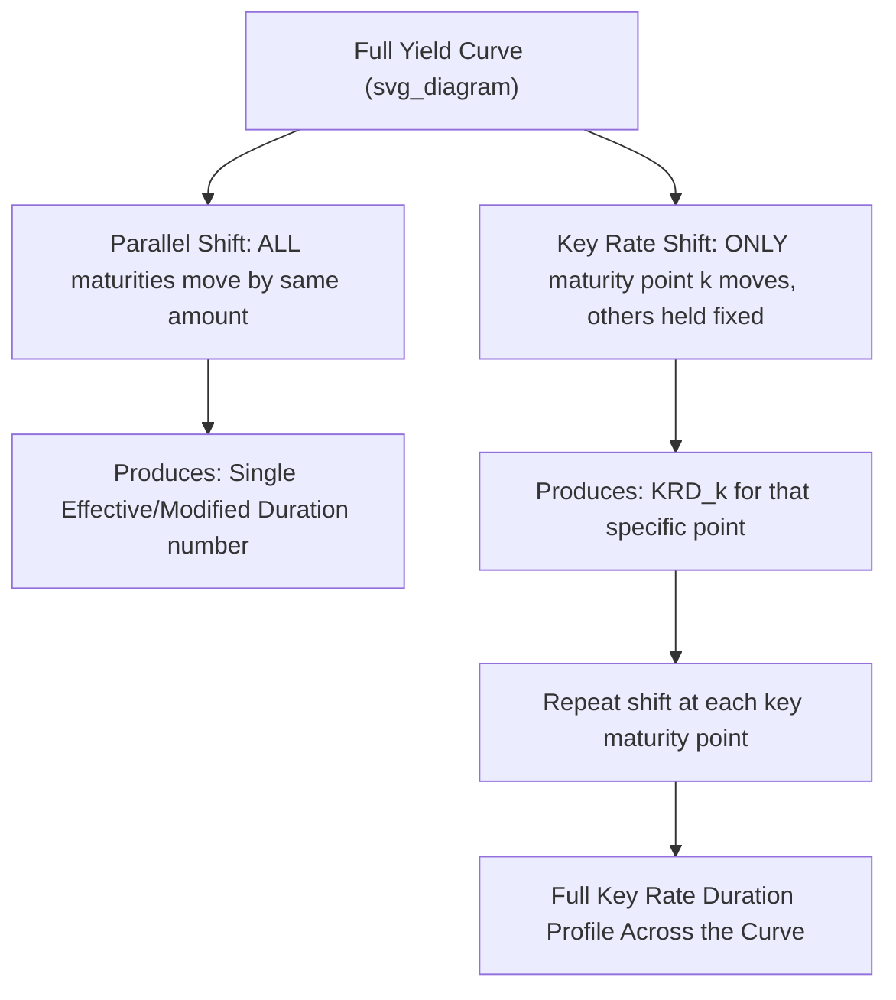

## Key Rate Duration and Partial Durations

### Definition

**Key Points**

- **Key Rate Duration** (also called **partial duration**) measures a bond's or portfolio's price sensitivity to a change in the yield at **one specific maturity point** on the yield curve, holding yields at all other maturity points constant.
- This directly addresses the core limitation of standard modified/effective duration, which assumes a single **parallel** shift across the entire yield curve — an assumption that fails to capture risk from **non-parallel** movements such as curve steepening, flattening, or twists concentrated at specific maturities.
- The set of key rate durations across all relevant maturity points, taken together, provides a complete decomposition of a bond or portfolio's total interest rate risk profile across the curve, rather than a single aggregate number.

### Conceptual Framework

**Key Points**

- Standard (parallel) duration answers: "how does price change if **all** yields move by the same amount?" Key rate duration answers: "how does price change if **only** the yield at maturity point $k$ moves, with all other maturities held fixed?"
- The sum of a bond's key rate durations across all key maturity points approximately equals its total effective (or modified) duration, since a full parallel shift can be conceptually decomposed into the sum of simultaneous shifts at each individual key rate point.

$$D_{eff,\ total} \approx \sum_{k} KRD_k$$

- Key rate durations are typically calculated at a standard set of benchmark maturities (e.g., 3 months, 1, 2, 3, 5, 7, 10, 20, 30 years), with each point representing that maturity's "share" of the bond's or portfolio's total rate sensitivity.

### Calculation Methodology

Key rate duration is computed numerically, analogous to effective duration but shifting only one point on the curve at a time (holding a smooth interpolated curve fixed elsewhere via the curve-fitting method used):

$$KRD_k = \frac{P_{-,k} - P_{+,k}}{2 \times P_0 \times \Delta y}$$

where $P_{-,k}$ and $P_{+,k}$ are the bond's price after shifting **only** the yield at key rate point $k$ down and up respectively (with the curve between key rate points typically re-interpolated to maintain smoothness around the shifted point), and all other key rate points held at their original levels.

### Diagram: Key Rate Duration vs. Parallel Shift Duration (svg_diagram)

### Worked Example: Key Rate Duration Profile for a 10-Year Bond

A 10-year, 5% annual-pay bond currently priced at par has the following (illustrative) key rate duration profile at standard key rate points:

| Key Rate Point | Key Rate Duration | Share of Total |
| --- | --- | --- |
| 2-year | 0.15 | 1.9% |
| 5-year | 0.65 | 8.4% |
| 10-year | 6.95 | 89.7% |
| **Total** | **7.75** | **100%** |

**Output**: The bond's total effective duration of **7.75** is overwhelmingly concentrated at the **10-year key rate point** (89.7% of total sensitivity), which makes intuitive sense since the bond's final principal repayment — by far its largest single cash flow — occurs at year 10. The bond has only modest sensitivity to shorter-tenor rate movements (2-year and 5-year points combined contribute just over 10% of total duration), reflecting the relatively small coupon cash flows occurring at those earlier dates.

### Comparison: Bullet Bond vs. Barbell Portfolio with Identical Total Duration

| Position | 2-Year KRD | 5-Year KRD | 10-Year KRD | Total Duration |
| --- | --- | --- | --- | --- |
| 10-Year Bullet Bond | 0.15 | 0.65 | 6.95 | 7.75 |
| Barbell (50% 2-yr / 50% 20-yr zero) | 0.95 | 0.00 | 0.00 (concentrated at 20-yr instead) | 7.75 (with most mass at 20-yr key rate point) |

**Key Points**

- This comparison illustrates the central practical value of key rate duration: two positions can have **identical total (parallel) duration** yet an **entirely different risk profile** across the curve, exposing them to very different outcomes under non-parallel yield curve movements (e.g., a steepening or flattening of the curve would affect these two positions very differently, despite their matched total duration).
- Standard modified or effective duration alone would show these two positions as having identical interest rate risk; only the key rate duration decomposition reveals the material difference in their actual curve exposure.

### Applications in Portfolio Risk Management

**Key Points**

- **Non-parallel risk hedging**: portfolio managers use key rate duration profiles to hedge specific segments of curve risk independently — for example, hedging only the long end of a portfolio's exposure using long-maturity futures or swaps, while leaving short-end exposure unhedged (or hedged separately with different instruments).
- **Curve trade construction and analysis**: steepener and flattener trades (positioning for changes in the slope of the curve rather than its overall level) are explicitly designed and analyzed using key rate duration exposures at the specific maturity points involved in the trade.
- **Liability-driven investing with complex liability cash flow profiles**: pension funds and insurers with liabilities spread across many future dates use key rate duration matching (rather than simple total duration matching) to more precisely immunize against the specific shape of likely future yield curve movements affecting their particular liability schedule.
- **Regulatory and internal risk reporting**: many institutional risk management and regulatory frameworks require or encourage reporting of interest rate risk exposure broken down by maturity bucket (a practical implementation of the key rate duration concept), rather than relying solely on a single aggregate duration figure. [Inference: specific regulatory requirements for granularity and reporting format vary by jurisdiction and institution type, and should be confirmed against current applicable rules if precision is required for compliance purposes.]

### Related Concept: Rate Duration and the Term Structure of Duration

**Key Points**

- Some practitioners use the related term "**rate duration**" somewhat interchangeably with key rate duration, though the term is also sometimes used more specifically to refer to sensitivity relative to a particular type of reference rate (e.g., swap rate duration vs. Treasury rate duration) rather than a specific maturity point — terminology usage can vary across sources, so context should be checked.
- The full key rate duration profile across all key maturity points is sometimes visualized or described as the bond's or portfolio's "**term structure of duration**," analogous to how the yield curve itself describes the term structure of yields.

### Key Rate Duration for Option-Embedded Bonds

**Key Points**

- Key rate duration can be extended to option-embedded bonds (callable, putable, MBS) by combining the key-rate-shift methodology with the same option-pricing-model-based repricing approach used for effective duration — shifting only one key rate point at a time while re-evaluating the embedded option's optimal exercise decision at each node of the valuation model.
- This becomes particularly important for MBS, since prepayment behavior is itself often sensitive to the **shape** of the yield curve (not just its overall level), meaning key rate duration profiles for MBS can be more complex and behaviorally-driven than for simpler option-free or single-option corporate bonds. [Inference: the specific degree of curve-shape sensitivity in prepayment behavior varies by the underlying prepayment model and the specific mortgage collateral characteristics, and is not a fixed, universal figure.]

### Limitations and Practical Considerations

**Key Points**

- **Interpolation dependency**: because shifting a single key rate point in isolation requires re-interpolating the curve around that point to maintain a smooth, arbitrage-free curve shape, the resulting key rate duration values can be somewhat sensitive to the specific interpolation methodology used, introducing a degree of model dependency similar to that noted for effective duration generally.
- **Choice of key rate points**: the specific set of maturities chosen as "key rate points" is a practical/conventional choice; a different, denser or sparser grid of key rate points can produce a different-looking (though conceptually consistent) decomposition of total risk.
- **Computational intensity**: computing a full key rate duration profile requires many more repricing calculations than a single effective duration calculation (one pair of reprices per key rate point, versus a single pair for parallel effective duration), making it more computationally demanding, particularly for large portfolios or complex option-pricing models.

**Related Topics**

- Modified Duration and Price Sensitivity
- Effective Duration for Option-Embedded Bonds
- Duration of a Bond Portfolio
- Par Curve, Spot Curve, and Forward Curve Relationships
- Curve Fitting: Nelson-Siegel and Spline Methods
- Barbell, Bullet, and Ladder Portfolio Structuring Strategies
- Interest Rate Swap and Futures Overlay Strategies for Duration Management
- Mortgage Prepayment Modeling and MBS Cash Flow Projection