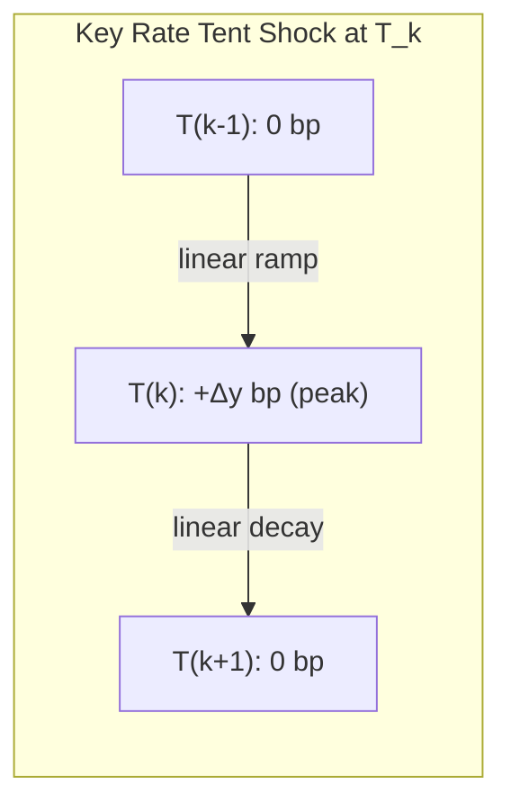

## Duration Decomposition Across the Curve

### Overview

Duration Decomposition Across the Curve refers to the practice of disaggregating a bond or portfolio's aggregate interest rate sensitivity into a set of sensitivities to specific points (key rates, buckets, or vertices) along the yield curve, rather than expressing risk as a single scalar duration figure. Standard effective duration assumes a parallel shift in the entire yield curve — a single number describing price sensitivity to a uniform change across all maturities. In practice, curves twist, steepen, flatten, and shift non-parallel, so a single duration number is insufficient to describe how a position will actually behave. Decomposition techniques break total duration into a vector of exposures, each corresponding to a specific segment or "bucket" of the curve.

This is foundational to modern fixed income risk management, particularly for portfolios containing instruments with different maturities, embedded options, or cash flow structures that respond unevenly to curve reshaping.

### Why Parallel-Shift Duration Is Insufficient

Effective duration and modified duration are derived under the assumption that all points on the yield curve move by the same amount ($\Delta y$) simultaneously:

$$D_{eff} = \frac{P_- - P_+}{2 \times P_0 \times \Delta y}$$

This assumption breaks down in several common scenarios:

- **Curve steepening/flattening**: Short rates and long rates move by different magnitudes or even in opposite directions.
- **Barbell vs. bullet portfolios**: Two portfolios can have identical aggregate duration but radically different sensitivity profiles across maturities — a barbell (concentrated in short and long maturities) versus a bullet (concentrated at a single intermediate maturity) will react very differently to a curve twist even though their parallel-shift duration is equal.
- **Hedging precision**: A hedge constructed to match only aggregate duration can be badly mismatched if the underlying curve movement is non-parallel, leaving residual "twist risk" unhedged.

Duration decomposition solves this by producing a risk profile — a vector rather than a scalar — that captures how sensitivity is distributed along the term structure.

### Key Decomposition Methodologies

#### 1. Key Rate Duration (KRD) / Partial Duration

Key Rate Duration measures price sensitivity to a shift in a single, specific point (vertex) on the yield curve, holding all other vertices fixed. The curve is typically defined by a set of key maturities (e.g., 3M, 1Y, 2Y, 5Y, 10Y, 20Y, 30Y), and the shock at each vertex is a localized "tent" or "triangular" perturbation that decays linearly to zero at adjacent vertices.

$$KRD_i = -\frac{1}{P_0} \times \frac{\partial P}{\partial y_i}$$

where $y_i$ is the yield at key rate vertex $i$, and all other vertices are held constant.

**Key property**: The sum of all key rate durations approximately equals the effective duration under a parallel shift assumption:

$$D_{eff} \approx \sum_{i=1}^{n} KRD_i$$

This reconciliation check is a standard validation step: if the KRDs do not sum (approximately) to the effective duration, the KRD calculation methodology or the shock construction is likely flawed.

#### 2. Bucket Duration (Partial PV01 / DV01 Bucketing)

Bucket duration (also called partial PV01 or bucketed DV01) is closely related to KRD but expressed in dollar (or currency) terms rather than as a percentage sensitivity. Instead of a duration figure, it reports the dollar change in value for a 1 basis point shift confined to a specific maturity bucket.

$$DV01_i = -\frac{\Delta P_i}{\Delta y_i \times 10000}$$

Bucket duration is the dominant convention on trading desks (particularly rates desks) because it aggregates linearly across a portfolio and directly translates into hedge notionals: if a bucket has a DV01 exposure of $50,000 per bp, the trader knows precisely how many futures or swaps of that tenor are needed to neutralize it.

#### 3. Principal Component Duration (PCA-Based Decomposition)

Empirically, yield curve movements are not independent at each vertex — they are highly correlated. Principal Component Analysis (PCA) applied to historical yield curve changes typically reveals that three factors explain the vast majority of curve variance:

- **PC1 (Level)**: A roughly parallel shift across all maturities — usually explains 80–90% of variance.
- **PC2 (Slope)**: A steepening/flattening motion, where short and long rates move in opposite directions.
- **PC3 (Curvature)**: A "butterfly" motion, where the belly of the curve moves opposite to the wings (short and long ends).

A portfolio's duration can be decomposed into sensitivities to these three factors rather than to individual maturity vertices:

$$\Delta P \approx -P_0 \left( D_{level} \Delta L + D_{slope} \Delta S + D_{curvature} \Delta C \right)$$

PCA decomposition is more statistically efficient (fewer risk factors to hedge) but is regime-dependent — the loadings are estimated from historical data and can shift during periods of unusual market stress. [Inference] The stability of PCA factor loadings tends to degrade in high-volatility or dislocated markets, since the historical covariance structure used to estimate them may not hold.

#### 4. Partial Duration via Forward Rate Bucketing

An alternative to shocking spot/zero rates at key maturities is to shock **forward rates** over discrete intervals (e.g., the 1Y1Y forward, 2Y1Y forward, etc.). This is common in swaps and derivatives desks because forward rates map more naturally onto the instruments used to hedge (e.g., a 5Y5Y forward-starting swap directly hedges the 5Y1Y forward bucket). This method avoids some of the interpolation artifacts introduced by "tent" shocks in spot-rate KRD.

### Constructing Key Rate Shocks: The Tent Function

For a curve with key vertices at maturities $T_1, T_2, \ldots, T_n$, a shock to vertex $T_k$ is applied as a piecewise linear "tent":

- Full shock magnitude $\Delta y$ at $T_k$
- Linearly decaying to zero at $T_{k-1}$ and $T_{k+1}$
- Zero shock at all other vertices

Each bond in the portfolio is repriced under this shocked curve (holding all other vertices fixed), and the resulting price change yields $KRD_k$. This process is repeated for each vertex, producing the full KRD vector.

**[Unverified]** The exact number and placement of key rate vertices (e.g., 6 points vs. 11 points) varies by vendor and institution, and no single standard is universally adopted across the industry — Bloomberg, Barra, and proprietary risk systems may use different vertex conventions, which can make cross-platform KRD comparisons non-trivial.

### Visual: Duration Profile Across the Curve (svg_diagram)

<svg xmlns="http://www.w3.org/2000/svg" viewBox="0 0 720 420">
<text x="360" y="25" text-anchor="middle" font-size="16" font-weight="bold" fill="#1a1a2e">Key Rate Duration Profile (svg_diagram)</text>

<line x1="70" y1="360" x2="680" y2="360" stroke="#333" stroke-width="1.5" />
<line x1="70" y1="360" x2="70" y2="50" stroke="#333" stroke-width="1.5" />

<text x="25" y="205" text-anchor="middle" font-size="12" fill="#333" transform="rotate(-90 25 205)">KRD (years)</text>

<text x="375" y="400" text-anchor="middle" font-size="12" fill="#333">Maturity Vertex</text>

<line x1="70" y1="300" x2="680" y2="300" stroke="#e0e0e0" stroke-width="1" />
<line x1="70" y1="240" x2="680" y2="240" stroke="#e0e0e0" stroke-width="1" />
<line x1="70" y1="180" x2="680" y2="180" stroke="#e0e0e0" stroke-width="1" />
<line x1="70" y1="120" x2="680" y2="120" stroke="#e0e0e0" stroke-width="1" />

<rect x="100" y="330" width="35" height="30" fill="#4472C4" />
<rect x="180" y="300" width="35" height="60" fill="#4472C4" />
<rect x="260" y="150" width="35" height="210" fill="#4472C4" />
<rect x="340" y="290" width="35" height="70" fill="#4472C4" />
<rect x="420" y="330" width="35" height="30" fill="#4472C4" />
<rect x="500" y="345" width="35" height="15" fill="#4472C4" />

<rect x="140" y="180" width="35" height="180" fill="#ED7D31" />
<rect x="220" y="220" width="35" height="140" fill="#ED7D31" />
<rect x="300" y="340" width="35" height="20" fill="#ED7D31" />
<rect x="380" y="335" width="35" height="25" fill="#ED7D31" />
<rect x="460" y="210" width="35" height="150" fill="#ED7D31" />
<rect x="540" y="170" width="35" height="190" fill="#ED7D31" />

<text x="135" y="375" text-anchor="middle" font-size="11">2Y</text>

<text x="215" y="375" text-anchor="middle" font-size="11">5Y</text>

<text x="295" y="375" text-anchor="middle" font-size="11">10Y</text>

<text x="375" y="375" text-anchor="middle" font-size="11">15Y</text>

<text x="455" y="375" text-anchor="middle" font-size="11">20Y</text>

<text x="535" y="375" text-anchor="middle" font-size="11">30Y</text>

<rect x="500" y="60" width="15" height="15" fill="#4472C4" />
<text x="520" y="72" font-size="12">Bullet (10Y bond)</text>
<rect x="500" y="82" width="15" height="15" fill="#ED7D31" />
<text x="520" y="94" font-size="12">Barbell (2Y+30Y)</text>

<text x="375" y="45" text-anchor="middle" font-size="11" fill="#555">Equal aggregate duration, opposite curve exposure shape</text>

</svg>

The diagram illustrates why aggregate duration is insufficient: both portfolios can be constructed to have identical total duration (the sum of the bars is equal), yet the bullet concentrates all sensitivity at the 10Y point while the barbell splits it between the short and long ends. A steepening or flattening of the curve affects these two portfolios in opposite ways despite matching parallel-shift duration.

### Numerical Example: KRD Reconciliation

Consider a bond portfolio with the following key rate durations at six standard vertices:

| Vertex | KRD (years) |
| --- | --- |
| 2Y | 0.35 |
| 5Y | 0.80 |
| 10Y | 2.10 |
| 15Y | 0.95 |
| 20Y | 0.55 |
| 30Y | 0.25 |
| **Sum** | **5.00** |

If the portfolio's effective duration (computed via a parallel shock) is independently calculated as 5.05 years, the small discrepancy (0.05, or about 1%) is attributable to the discretization of the tent-shock approximation and any convexity effects not fully captured by the linear interpolation between vertices. A large discrepancy (e.g., >5%) generally signals an error in the shock construction, vertex spacing, or the KRD calculation itself.

**Interpreting the profile**: This portfolio carries substantial curve risk concentrated at the 10Y point. A 1bp steepening between the 5Y and 10Y segments (5Y down, 10Y up) would have a disproportionately negative effect relative to a portfolio with the same aggregate duration spread more evenly across vertices.

### Application: Hedging with Decomposed Duration

Duration decomposition is operationally essential for constructing curve-neutral hedges. Given a portfolio with a KRD vector, a hedger selects a basket of hedging instruments (e.g., on-the-run Treasuries or interest rate swaps at each key vertex) and solves for notional amounts such that the KRD vector of the hedge offsets the KRD vector of the portfolio at every vertex simultaneously — not merely in aggregate.

This is typically formulated as a linear system:

$$\mathbf{H} \mathbf{n} = -\mathbf{KRD}_{portfolio}$$

where $\mathbf{H}$ is a matrix of KRDs of the candidate hedging instruments (rows = instruments, columns = vertices) and $\mathbf{n}$ is the vector of notionals to solve for. If the number of hedging instruments equals the number of vertices, this can be solved exactly (matrix inversion); if there are more vertices than instruments, a least-squares or optimization approach is used to minimize residual curve exposure.

### Duration Decomposition in Portfolios with Embedded Options

For callable bonds, mortgage-backed securities, or other instruments with embedded optionality, key rate durations must be computed using an option-adjusted framework (analogous to Option-Adjusted Duration/Effective Duration), since the cash flows themselves change as the curve is shocked at different points. A shock to the short end of the curve, for example, may accelerate or decelerate prepayment speeds in an MBS pool differently than a shock to the long end, producing a KRD profile that reflects both the discounting effect and the embedded option's sensitivity to that specific curve segment. This is sometimes termed **Option-Adjusted Key Rate Duration**.

### Common Pitfalls

- **Non-additivity under large shocks**: KRDs are a linear (first-order) approximation; for large curve moves, the sum of individually-computed KRDs can diverge more noticeably from the true parallel-shift effective duration due to convexity and cross-vertex interaction effects.
- **Interpolation methodology sensitivity**: The choice of interpolation method (linear, cubic spline, monotone convex) used to construct the discount curve between key vertices materially affects the resulting KRD values, particularly for cash flows falling between vertices.
- **Vertex granularity mismatch**: Comparing KRD profiles computed on different vertex grids (e.g., a 6-point grid vs. an 11-point grid) is not directly valid without re-bucketing or interpolation.
- **Ignoring cross-currency or cross-curve bases**: For portfolios spanning multiple curves (e.g., government vs. swap vs. corporate spread curves), duration decomposition must be performed per-curve, since a shock to the swap curve does not equate to a shock to the credit spread curve.

**Related Topics:**

- Key Rate Duration vs. Effective Duration: Reconciliation and Edge Cases
- Principal Component Analysis of Yield Curve Movements
- Constructing Curve-Neutral Hedge Portfolios (Multi-Instrument Optimization)
- Option-Adjusted Spread (OAS) and Its Interaction with Key Rate Duration
- DV01 and PV01 Bucketing Conventions on Trading Desks
- Butterfly and Barbell Trade Construction Using Partial Durations
- Forward Rate Bucket Sensitivities vs. Spot Rate Key Rate Durations
- Curve Risk in Mortgage-Backed Securities (Prepayment-Adjusted KRD)