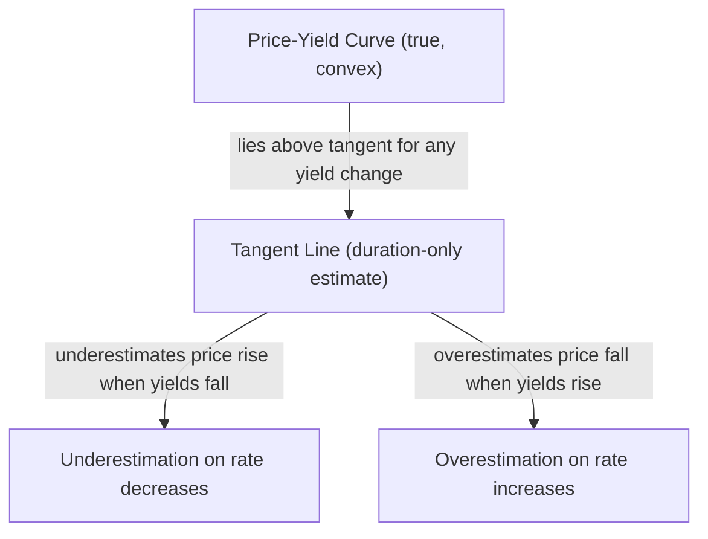
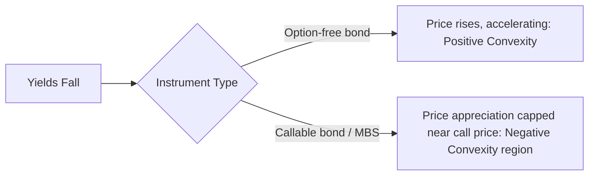

## Convexity Concept and Geometric Intuition

### Overview

Convexity describes the curvature of the price-yield relationship for a fixed income instrument. Where duration provides a linear (first-order) approximation of how price changes with yield, convexity captures the second-order (quadratic) correction to that approximation. Geometrically, if duration is the *slope* of the tangent line to the price-yield curve at a given point, convexity measures how much the actual curve bends away from that tangent line — that is, how the slope itself changes as yield changes.

Because the true price-yield relationship for a standard (option-free) bond is not a straight line but a curve that is bowed toward the origin (convex from below), any linear approximation using duration alone will systematically misstate price changes for larger yield moves. Convexity is the correction term that captures the resulting error.

### The Price-Yield Relationship

For an option-free bond, price as a function of yield is:

$$P(y) = \sum_{t=1}^{n} \frac{CF_t}{(1+y)^t}$$

This function is convex in $y$: it curves upward on both sides of the current price point, resembling a curve that is bowed downward-left and flattening as yield rises, and steepening as yield falls. This shape is not arbitrary — it falls directly out of the mathematics of discounting, since $\frac{1}{(1+y)^t}$ is itself a convex function of $y$ for $y > -1$, and a positively-weighted sum of convex functions is convex.

### Geometric Intuition: Tangent Line vs. True Curve

At any point on the price-yield curve, the tangent line represents the duration-based linear approximation. Because the true curve bends upward (is convex), it lies *above* the tangent line everywhere except at the point of tangency.

This has a critical practical consequence: **duration-only estimates always underestimate the true price for any yield change**, in both directions. When yields fall, the actual price increase is larger than duration predicts. When yields rise, the actual price decrease is smaller (less severe) than duration predicts. Convexity is therefore generally regarded as beneficial to a bondholder for option-free instruments — it improves returns in both up and down rate scenarios relative to what a pure duration estimate would suggest.

### Visual: Convexity Geometry (svg_diagram)

<svg xmlns="http://www.w3.org/2000/svg" viewBox="0 0 720 460">
<text x="360" y="25" text-anchor="middle" font-size="16" font-weight="bold" fill="#1a1a2e">Price-Yield Curve vs. Tangent Line (svg_diagram)</text>

<line x1="80" y1="400" x2="680" y2="400" stroke="#333" stroke-width="1.5" />
<line x1="80" y1="400" x2="80" y2="60" stroke="#333" stroke-width="1.5" />
<text x="380" y="435" text-anchor="middle" font-size="13" fill="#333">Yield (y)</text>
<text x="35" y="230" text-anchor="middle" font-size="13" fill="#333" transform="rotate(-90 35 230)">Price (P)</text>

<path d="M 120 380 Q 300 150 640 100" stroke="#4472C4" stroke-width="3" fill="none" />

<line x1="150" y1="330" x2="600" y2="140" stroke="#ED7D31" stroke-width="2.5" stroke-dasharray="6,4" />

<circle cx="380" cy="228" r="6" fill="#1a1a2e" />
<text x="390" y="215" font-size="12" fill="#1a1a2e">Current (y0, P0)</text>

<path d="M 200 300 Q 260 240 320 220 L 320 250 Q 260 265 205 320 Z" fill="#4472C4" opacity="0.25" />
<text x="175" y="360" font-size="11" fill="#2a4a8a">Convexity gain</text>
<text x="175" y="374" font-size="11" fill="#2a4a8a">(y falls)</text>

<path d="M 440 235 Q 500 195 560 165 L 555 190 Q 500 218 445 258 Z" fill="#4472C4" opacity="0.25" />
<text x="480" y="270" font-size="11" fill="#2a4a8a">Convexity cushion</text>
<text x="480" y="284" font-size="11" fill="#2a4a8a">(y rises)</text>

<line x1="480" y1="330" x2="510" y2="330" stroke="#4472C4" stroke-width="3" />
<text x="518" y="335" font-size="12">True price-yield curve</text>
<line x1="480" y1="352" x2="510" y2="352" stroke="#ED7D31" stroke-width="2.5" stroke-dasharray="6,4" />
<text x="518" y="357" font-size="12">Duration tangent line</text>
</svg>

The shaded regions represent the gap between the true curve and the duration-only tangent line — this gap *is* convexity, expressed geometrically. Note the gap widens as you move further from the point of tangency in either direction, which is why convexity's contribution grows with the square of the yield change, becoming negligible for small moves and material for large moves.

### Second-Order Taylor Approximation

The full price change formula, incorporating both duration and convexity, comes from a second-order Taylor series expansion of $P(y)$ around $y_0$:

$$\Delta P \approx \left(\frac{dP}{dy}\right) \Delta y + \frac{1}{2}\left(\frac{d^2P}{dy^2}\right) (\Delta y)^2$$

Dividing through by $P_0$ and substituting the standard definitions:

$$\frac{\Delta P}{P_0} \approx -D_{mod} \times \Delta y + \frac{1}{2} \times C \times (\Delta y)^2$$

where:

- $D_{mod}$ = modified duration (the first-derivative, linear term)
- $C$ = convexity (the second-derivative term), formally defined as:

$$C = \frac{1}{P_0} \times \frac{d^2P}{dy^2} = \frac{1}{P_0} \sum_{t=1}^{n} \frac{CF_t \times t \times (t+1)}{(1+y)^{t+2}}$$

**Key structural observation**: the convexity term is always added (not subtracted) in the price change equation regardless of the direction of $\Delta y$, because $(\Delta y)^2$ is always non-negative for a positive convexity value. This is the algebraic expression of the "always beneficial" geometric property described above for option-free bonds.

### Numerical Example

Consider a 10-year option-free bond with:

- Modified duration: 7.5 years
- Convexity: 65
- Current price: 100

For a 100 bp (0.01) increase in yield:

Duration-only estimate:

$$\Delta P = -7.5 \times 0.01 \times 100 = -7.50$$

Duration + convexity estimate:

$$\Delta P = \left(-7.5 \times 0.01 \times 100\right) + \left(\frac{1}{2} \times 65 \times (0.01)^2 \times 100\right) = -7.50 + 0.325 = -7.175$$

The convexity adjustment reduces the estimated loss from 7.50 to 7.175 — a cushioning effect of 0.325 points, illustrating how the true price decline is less severe than the linear duration estimate alone would suggest.

For a 100 bp *decrease* in yield, the same convexity term adds to the gain:

$$\Delta P = \left(-7.5 \times (-0.01) \times 100\right) + \left(\frac{1}{2} \times 65 \times (-0.01)^2 \times 100\right) = 7.50 + 0.325 = 7.825$$

This confirms the geometric intuition: convexity adds value in *both* directions for an option-free bond.

### Why Convexity Matters More for Larger Yield Changes

Because the convexity term scales with $(\Delta y)^2$, its contribution is small for modest yield changes (e.g., 10–25 bp) and grows disproportionately for larger moves (100+ bp). This is why:

- Duration alone is often considered an adequate approximation for small, routine yield fluctuations.
- Convexity becomes materially important for stress-testing, scenario analysis, and risk management involving large rate shocks (e.g., 200 bp+ moves), where the quadratic term is no longer negligible.

### Positive vs. Negative Convexity

Not all fixed income instruments exhibit the "always beneficial" positive convexity shape described above:

- **Positive convexity**: Standard option-free bonds. The price-yield curve bows in the favorable direction described above — gains accelerate as yields fall, losses decelerate as yields rise.
- **Negative convexity**: Instruments with embedded call options or prepayment risk (e.g., callable bonds, mortgage-backed securities) can exhibit a price-yield curve that flattens or even curves *downward* as yields fall below a certain threshold, because the embedded option (the issuer's call, or a mortgage holder's prepayment right) caps the price appreciation. Geometrically, the curve's shape "gives up" the upside convexity that a comparable option-free bond would show.

### Common Pitfalls and Clarifications

- **Convexity is not always "good"**: The framing that convexity is universally beneficial applies specifically to positive convexity in option-free instruments. Negatively convex instruments can work against the holder precisely when favorable rate moves occur.
- **Confusing sign conventions**: Some texts and systems define convexity with different scaling conventions (e.g., dividing by 2 within the definition of $C$ itself versus applying the $\frac{1}{2}$ factor only in the Taylor expansion). Practitioners should confirm which convention a given system or dataset uses before combining duration and convexity figures from different sources.
- **Treating convexity as a purely academic refinement**: For portfolios engaging in significant rate scenario analysis, or for negatively convex instruments like MBS, ignoring convexity can produce materially misleading risk estimates, not merely marginally imprecise ones.
- **Assuming convexity is constant**: Like duration, convexity itself changes as yields change (it is not a fixed property of the bond) — this is sometimes referred to informally as the rate of change of convexity, though it is rarely modeled explicitly beyond the second-order term in standard practice.

**Related Topics:**

- Mathematical Derivation of the Convexity Formula from Bond Cash Flows
- Effective Convexity vs. Modified Convexity (Option-Adjusted Frameworks)
- Negative Convexity in Callable Bonds and Mortgage-Backed Securities
- Convexity Adjustment in Portfolio Immunization Strategies
- Using Convexity in Scenario Analysis and Stress Testing
- Barbell vs. Bullet Portfolio Convexity Trade-offs
- The Relationship Between Convexity and Dispersion of Cash Flows