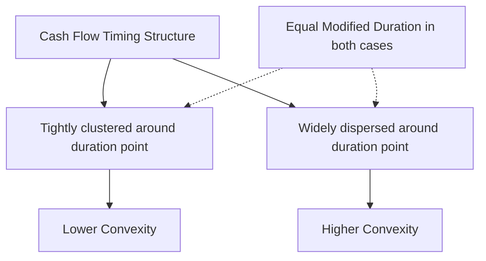

## Calculating Bond Convexity

### Overview

Calculating bond convexity requires deriving the second derivative of the price-yield function with respect to yield, then normalizing by price. Several distinct calculation approaches exist depending on the instrument type and available inputs: the closed-form analytical formula (for option-free bonds with known cash flows), the finite-difference/effective convexity approximation (for any instrument, including those with embedded options), and shortcut formulas for specific bond types (e.g., zero-coupon bonds, perpetuities). This entry works through each method with full derivations and worked numerical examples.

### Method 1: Analytical (Closed-Form) Convexity

For an option-free bond with fixed, known cash flows, convexity can be derived directly from the price function.

**Starting point** — the price function:

$$P(y) = \sum_{t=1}^{n} \frac{CF_t}{(1+y)^t}$$

**First derivative** (used for modified duration):

$$\frac{dP}{dy} = -\sum_{t=1}^{n} \frac{t \times CF_t}{(1+y)^{t+1}}$$

**Second derivative** (used for convexity):

$$\frac{d^2P}{dy^2} = \sum_{t=1}^{n} \frac{t(t+1) \times CF_t}{(1+y)^{t+2}}$$

**Convexity** is this second derivative normalized by price:

$$C = \frac{1}{P_0} \times \frac{d^2P}{dy^2} = \frac{1}{P_0} \sum_{t=1}^{n} \frac{t(t+1) \times CF_t}{(1+y)^{t+2}}$$

**Annualization adjustment**: If cash flows occur $m$ times per year (semiannual coupons, $m=2$, being the most common case for many bond markets), the formula must account for the periodic compounding convention:

$$C_{annual} = \frac{1}{P_0 \times m^2} \sum_{t=1}^{n} \frac{t(t+1) \times CF_t}{(1+y/m)^{t+2}}$$

where $t$ indexes the period number (not years) and $y/m$ is the periodic yield.

### Worked Example: Analytical Convexity for a Coupon Bond

Consider a 3-year annual-pay bond, face value 1,000, coupon rate 6% (annual coupon = 60), yield to maturity = 6% (priced at par, $P_0 = 1000$).

Cash flows: $CF_1 = 60$, $CF_2 = 60$, $CF_3 = 1060$

| $t$ | $CF_t$ | $t(t+1)$ | $(1+y)^{t+2}$ | $\frac{t(t+1) \times CF_t}{(1+y)^{t+2}}$ |
| --- | --- | --- | --- | --- |
| 1 | 60 | 2 | $1.06^3 = 1.191016$ | $\frac{120}{1.191016} = 100.755$ |
| 2 | 60 | 6 | $1.06^4 = 1.262477$ | $\frac{360}{1.262477} = 285.163$ |
| 3 | 1060 | 12 | $1.06^5 = 1.338226$ | $\frac{12720}{1.338226} = 9505.297$ |
| **Sum** |  |  |  | **9891.215** |

$$C = \frac{9891.215}{1000} = 9.891$$

This is the convexity measure in units of (periods)². For an annual-pay bond, this figure is already in annual terms since $m=1$.

**Sanity check on units**: convexity for coupon bonds is typically reported in the range of roughly 20–150 for standard bonds with maturities from a few years to several decades; a very short bond like this 3-year example will legitimately produce a relatively low value.

### Method 2: Effective (Finite-Difference) Convexity

For bonds with embedded options, floating cash flows, or any structure where a closed-form cash flow schedule cannot be assumed fixed under yield shifts, convexity must be computed numerically using a finite-difference approximation. This method reprices the bond (via a full valuation model, e.g., an option-adjusted spread/binomial tree model for callable bonds) at yields shifted up and down by a small increment.

$$C_{eff} = \frac{P_+ + P_- - 2P_0}{P_0 \times (\Delta y)^2}$$

where:

- $P_0$ = price at the current yield/curve
- $P_+$ = price after shifting the yield curve up by $\Delta y$
- $P_-$ = price after shifting the yield curve down by $\Delta y$
- $\Delta y$ = the yield shock size (typically 25–100 bp, expressed in decimal)

This is the general-purpose method and the only valid approach for instruments with embedded optionality, since it captures how the cash flows themselves (via option exercise, prepayment, etc.) respond to different rate environments — the closed-form formula in Method 1 assumes cash flows are fixed and cannot capture this.

### Worked Example: Effective Convexity

Suppose a callable bond is currently priced at $P_0 = 98.75$. Using an option pricing model, the bond is repriced under a 50 bp parallel shift up and down:

- $P_+$ (yield up 50 bp) = 96.40
- $P_-$ (yield down 50 bp) = 100.55
- $\Delta y = 0.0050$

$$C_{eff} = \frac{96.40 + 100.55 - 2(98.75)}{98.75 \times (0.0050)^2} = \frac{196.95 - 197.50}{98.75 \times 0.000025} = \frac{-0.55}{0.00246875} = -222.78$$

The negative result confirms **negative convexity** — consistent with the call feature capping upside price appreciation as yields fall, a hallmark signature of callable bonds trading near or below their call price.

### Method 3: Approximation via Duration Values (Alternative Finite-Difference Form)

An alternative, commonly taught approximation expresses convexity using the same $P_+$, $P_-$, $P_0$ inputs already computed for effective duration, avoiding a separate calculation pipeline:

$$C_{approx} = \frac{P_+ + P_- - 2P_0}{2 \times P_0 \times (\Delta y)^2}$$

**[Unverified]** Note that some texts and vendor systems include the factor of 2 in the denominator here (as shown) while others fold it into the later application step (multiplying the resulting $C$ by $\frac{1}{2}$ when computing $\Delta P$); the two conventions are mathematically equivalent overall but produce different-looking intermediate convexity numbers, so care must be taken when comparing convexity figures across systems or textbooks without confirming which convention is in use.

### Shortcut Formulas for Special Cases

**Zero-coupon bond**: Since a zero-coupon bond has a single cash flow at maturity $T$, the convexity formula simplifies substantially:

$$C_{zero} = \frac{T(T+1)}{(1+y)^2}$$

This is a standard, closed-form result following directly from setting $n=1$ and $t=T$ in the general formula and canceling $CF_T$ (since $P_0 = \frac{CF_T}{(1+y)^T}$, the cash flow terms cancel algebraically).

**Perpetuity (consol bond)**: For a bond paying a constant coupon $C$ forever, priced at $P_0 = \frac{C}{y}$, the convexity has the closed form:

$$C_{perpetuity} = \frac{2}{y^2}$$

This is a useful benchmark figure: a perpetuity has substantially higher convexity than a comparably-priced finite-maturity bond, illustrating how convexity grows with the dispersion and duration of cash flows.

### Relationship Between Duration, Cash Flow Dispersion, and Convexity

Convexity is closely tied to the **dispersion** of a bond's cash flows around its duration (a concept sometimes formalized as the variance of cash flow timing, weighted by present value). Bonds whose cash flows are more spread out in time (e.g., a bullet portfolio's single large final payment at a distant maturity, or a barbell combining very short and very long cash flows) exhibit higher convexity than bonds with cash flows clustered tightly around a single point in time, even when both have identical duration.

This is the mathematical basis for the well-known barbell-vs-bullet convexity trade: a barbell portfolio (combining short and long maturities) will exhibit higher convexity than a bullet portfolio (concentrated at an intermediate maturity) constructed to match the same duration, because dispersion of cash flow timing directly increases the second-derivative term in the formula.

### Visual: Convexity Calculation Inputs (svg_diagram)

<svg xmlns="http://www.w3.org/2000/svg" viewBox="0 0 700 380">
<text x="350" y="25" text-anchor="middle" font-size="16" font-weight="bold" fill="#1a1a2e">Effective Convexity: Three-Point Repricing (svg_diagram)</text>

<line x1="80" y1="330" x2="620" y2="330" stroke="#333" stroke-width="1.5" />
<line x1="80" y1="330" x2="80" y2="60" stroke="#333" stroke-width="1.5" />
<text x="350" y="360" text-anchor="middle" font-size="12" fill="#333">Yield</text>
<text x="35" y="195" text-anchor="middle" font-size="12" fill="#333" transform="rotate(-90 35 195)">Price</text>

<path d="M 140 300 Q 350 100 560 130" stroke="#4472C4" stroke-width="3" fill="none" />

<circle cx="200" cy="255" r="6" fill="#ED7D31" />
<text x="150" y="245" font-size="12" fill="#ED7D31">P- (y down Δy)</text>
<circle cx="350" cy="150" r="6" fill="#1a1a2e" />
<text x="360" y="140" font-size="12" fill="#1a1a2e">P0 (current y)</text>
<circle cx="500" cy="165" r="6" fill="#ED7D31" />
<text x="440" y="195" font-size="12" fill="#ED7D31">P+ (y up Δy)</text>

<line x1="200" y1="255" x2="500" y2="165" stroke="#999" stroke-width="1.5" stroke-dasharray="4,3" />
<circle cx="350" cy="210" r="4" fill="#999" />
<text x="355" y="225" font-size="11" fill="#666">Midpoint of P+, P-</text>

<line x1="350" y1="150" x2="350" y2="210" stroke="#4472C4" stroke-width="2" />
<text x="360" y="180" font-size="11" fill="#2a4a8a">Gap = convexity signal</text>
</svg>

The gap between the actual $P_0$ and the midpoint of $P_+$ and $P_-$ is the geometric quantity the finite-difference formula extracts: a positive gap (curve bows above the chord) indicates positive convexity, while a negative gap (curve sags below the chord — as would occur near a call price cap) indicates negative convexity.

### Practical Considerations and Pitfalls

- **Choice of $\Delta y$ in effective convexity**: Too small a shock size can introduce numerical noise (particularly if the pricing model has any discreteness, such as a binomial tree with a limited number of steps), while too large a shock size can introduce third-order and higher error terms that distort the second-order estimate. A shock of 25–50 bp is a common practical compromise, though [Inference] the optimal choice depends on the specific valuation model's numerical stability characteristics.
- **Day-count and compounding convention mismatches**: When calculating analytical convexity, the periodicity of cash flows ($m$) and the compounding convention of the quoted yield must be consistent; mixing an annual-pay cash flow schedule with a semiannually-compounded yield convention (or vice versa) without proper conversion will produce an incorrect convexity figure.
- **Confusing modified convexity with effective convexity terminology**: Some practitioners use "modified convexity" to refer to the analytical, fixed-cash-flow calculation (Method 1) by analogy with modified duration, reserving "effective convexity" strictly for the option-adjusted finite-difference calculation (Method 2). This terminology is not perfectly standardized across all textbooks and vendor platforms.
- **Sign errors in the finite-difference formula**: Because the formula involves $P_+ + P_- - 2P_0$, a simple arithmetic slip (e.g., reversing which price corresponds to the upward vs. downward shock) will not change the result for the *symmetric* effective convexity formula, unlike the corresponding duration formula, which is asymmetric and sign-sensitive. This makes convexity calculations comparatively more robust to that particular class of input-ordering error, though not to other errors.

**Related Topics:**

- Convexity Concept and Geometric Intuition (foundational prerequisite)
- Effective Convexity for Callable Bonds and Mortgage-Backed Securities
- Deriving Duration and Convexity Simultaneously from a Single Repricing Exercise
- Cash Flow Dispersion (M-Squared) and Its Relationship to Convexity
- Barbell vs. Bullet Portfolio Construction Using Convexity Targets
- Numerical Stability in Binomial and Trinomial Tree OAS Models
- Third-Order Risk Measures Beyond Convexity (Skew/Third Derivative Terms)