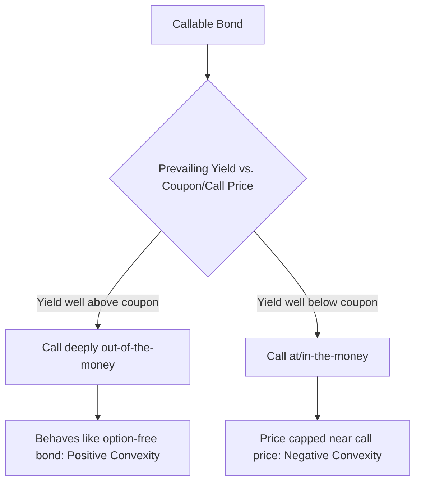

## Positive versus Negative Convexity

### Overview

Positive and negative convexity describe the two fundamentally different shapes the price-yield curve can take, driven primarily by the presence or absence of embedded optionality in a fixed income instrument. Positive convexity — the curve bowing favorably in both directions — characterizes standard option-free bonds. Negative convexity — where the curve's shape works against the holder as yields fall — characterizes instruments where an embedded option (a call, or a prepayment right) caps price appreciation. Understanding this distinction is central to fixed income risk management, particularly for portfolios containing callable bonds, mortgage-backed securities (MBS), or other structures with optionality.

### Positive Convexity

A bond exhibits positive convexity when its price-yield curve is convex (bowed toward the origin) across the relevant range of yields, meaning the curve lies above its tangent line at every point.

**Defining characteristics**:

- Price appreciation *accelerates* as yields fall.
- Price depreciation *decelerates* as yields rise (losses are cushioned relative to a linear estimate).
- The second derivative of price with respect to yield, $\frac{d^2P}{dy^2}$, is positive at all yield levels.
- This is the standard, default shape for **option-free bonds**: Treasury notes/bonds, plain vanilla corporate bonds, non-callable agency bonds.

The intuitive mechanism: as yields fall, the present value of *all* future cash flows increases, and there is no mechanism that removes or caps any of those cash flows. As yields fall further, the *rate* of price increase itself grows, because the discounting effect compounds nonlinearly. Symmetrically, as yields rise, the fixed cash flows lose value, but the rate of loss diminishes at higher yield levels since the underlying discount factors themselves shrink.

### Negative Convexity

A bond or portfolio exhibits negative convexity when its price-yield curve flattens, plateaus, or curves *downward* (concave) over some range of yields — typically at lower yield levels — because an embedded option effectively caps or reduces the cash flows the holder ultimately receives as rates decline.

**Defining characteristics**:

- Price appreciation is *capped* or significantly *dampened* as yields fall below a certain threshold (often near the instrument's call price or refinancing incentive point).
- The second derivative $\frac{d^2P}{dy^2}$ becomes negative over the relevant yield range.
- This shape is characteristic of instruments containing **embedded options that benefit the issuer or borrower** at the holder/investor's expense: callable bonds, mortgage-backed securities (via prepayment risk), and certain structured products.

**Mechanism for callable bonds**: When yields fall significantly below the bond's coupon rate, the issuer has a strong economic incentive to call the bond and refinance at the new, lower rate. The bondholder faces a rising probability of having the bond called away at (or near) the call price, which acts as a ceiling on the bond's market price — regardless of how far yields continue to fall, the price will not rise meaningfully above the call price (adjusted for the time value of the remaining call protection period).

**Mechanism for mortgage-backed securities**: As yields fall, homeowners are increasingly incentivized to refinance their mortgages. This causes prepayment speeds to accelerate, returning principal to MBS investors earlier than originally scheduled — precisely when the investor least wants their principal returned (since it can now only be reinvested at the new, lower prevailing rate). This dynamic, often called **prepayment risk**, produces the same qualitative price-capping effect as a callable bond's call feature.

### Visual: Positive vs. Negative Convexity Compared (svg_diagram)

<svg xmlns="http://www.w3.org/2000/svg" viewBox="0 0 740 460">
<text x="370" y="25" text-anchor="middle" font-size="16" font-weight="bold" fill="#1a1a2e">Positive vs. Negative Convexity (svg_diagram)</text>

<line x1="90" y1="400" x2="690" y2="400" stroke="#333" stroke-width="1.5" />
<line x1="90" y1="400" x2="90" y2="60" stroke="#333" stroke-width="1.5" />
<text x="390" y="430" text-anchor="middle" font-size="13" fill="#333">Yield (falling →)</text>
<text x="45" y="230" text-anchor="middle" font-size="13" fill="#333" transform="rotate(-90 45 230)">Price</text>

<path d="M 130 370 Q 300 200 660 90" stroke="#4472C4" stroke-width="3" fill="none" />
<text x="500" y="115" font-size="12" fill="#2a4a8a" font-weight="bold">Option-free bond</text>
<text x="500" y="130" font-size="12" fill="#2a4a8a">(positive convexity)</text>

<path d="M 130 370 Q 280 220 420 175 Q 520 155 660 148" stroke="#C00000" stroke-width="3" fill="none" stroke-dasharray="0" />
<text x="500" y="185" font-size="12" fill="#C00000" font-weight="bold">Callable bond / MBS</text>
<text x="500" y="200" font-size="12" fill="#C00000">(negative convexity region)</text>

<line x1="90" y1="148" x2="690" y2="148" stroke="#999" stroke-width="1.5" stroke-dasharray="5,4" />
<text x="100" y="140" font-size="11" fill="#666">Call price ceiling</text>

<circle cx="420" cy="175" r="5" fill="#C00000" />
<line x1="420" y1="175" x2="420" y2="205" stroke="#C00000" stroke-width="1" />
<text x="425" y="220" font-size="11" fill="#C00000">Divergence point:</text>
<text x="425" y="234" font-size="11" fill="#C00000">call becomes likely</text>

<text x="180" y="390" text-anchor="middle" font-size="11" fill="#555">Behaves similarly</text>

<text x="180" y="403" text-anchor="middle" font-size="11" fill="#555">(both positively convex here)</text>

</svg>

The diagram illustrates the key qualitative point: a callable bond behaves almost identically to an equivalent option-free bond when yields are high (the call is far out-of-the-money and irrelevant), but as yields fall and the call option moves toward being economically attractive to the issuer, the callable bond's price trajectory bends away from the option-free curve and flattens near the call price — this is the region of negative convexity.

### Comparative Summary Table

| Characteristic | Positive Convexity | Negative Convexity |
| --- | --- | --- |
| Typical instruments | Option-free bonds, Treasuries | Callable bonds, MBS (prepayment), some structured notes |
| $\frac{d^2P}{dy^2}$ sign | Positive | Negative (in the relevant yield region) |
| Effect of falling yields | Price gains accelerate | Price gains capped/decelerate |
| Effect of rising yields | Price losses decelerate (cushioned) | Behaves similarly to option-free bond (option is out-of-the-money) |
| Source of curvature | Pure discounting mathematics | Embedded option exercised against the holder |
| Value of convexity to holder | Beneficial in both directions | Detrimental specifically in falling-rate scenarios |
| Compensation to holder | None required beyond standard yield | Typically priced in via higher yield/spread ("negative convexity cost") |

### The Convexity Cost / Compensation Mechanism

Because negative convexity structurally disadvantages the holder in favorable (falling-rate) scenarios, the market compensates investors for bearing this risk. Negatively convex instruments typically trade at a **higher yield** (equivalently, a **spread**, often called the option cost or negative convexity cost) relative to an otherwise-comparable option-free instrument. This spread compensates the investor, in expectation, for the asymmetric risk profile: giving up upside in exchange for additional yield.

$$OAS = Z\text{-spread} - \text{Option Cost}$$

The Option-Adjusted Spread (OAS) framework exists largely to strip out this convexity/optionality effect, allowing an apples-to-apples comparison of the pure credit and liquidity spread between negatively convex and option-free instruments. [Inference] Practitioners generally regard OAS as a more meaningful risk-adjusted valuation metric than a raw yield spread precisely because it isolates compensation for optionality from other spread components, though the accuracy of this decomposition depends heavily on the interest rate volatility assumptions embedded in the option pricing model used to compute it.

### Convexity Can Change Sign Along the Same Curve

A critical, often underappreciated point: negative convexity is not a fixed, permanent property of an instrument — it is regime-dependent within a single instrument's price-yield curve. A callable bond exhibits:

- **Positive convexity** at high yield levels, where the call option is deeply out-of-the-money and essentially irrelevant to pricing (the bond behaves almost exactly like an equivalent option-free bond).
- **Negative convexity** at low yield levels, where the call option is at-the-money or in-the-money and materially affects expected cash flows.

This means the *same bond* can transition from positive to negative convexity purely as a function of where prevailing yields sit relative to its coupon and call price — there is no single scalar "convexity" that fully describes the instrument across all yield environments, which is precisely why **effective convexity** (computed via the finite-difference/option-adjusted method) must be recalculated whenever the yield environment shifts materially, rather than treated as a static input.

### Portfolio-Level Implications

- **Barbell strategies and negative convexity offsetting**: Investors holding negatively convex instruments (e.g., MBS) sometimes combine them with highly positively convex instruments (e.g., long-dated zero-coupon bonds or Treasury options) to construct a portfolio with a more balanced or targeted net convexity profile.
- **Convexity as a distinct risk factor to hedge**: Portfolio managers holding MBS or callable bond exposure often manage convexity risk explicitly and separately from duration risk, since a duration-neutral hedge alone does not neutralize the asymmetric behavior negative convexity introduces under large rate moves.
- **Volatility sensitivity**: Negatively convex instruments are also sensitive to interest rate *volatility* itself (not just the level of rates), since the value of the embedded option the issuer/borrower holds is itself a function of volatility. Higher expected rate volatility generally increases the value of that embedded option, which (holding other factors constant) tends to depress the price of the negatively convex instrument relative to an option-free comparable. This introduces **Vega-like sensitivity** into fixed income portfolios that would otherwise be described purely in terms of duration and convexity.

### Common Pitfalls

- **Assuming convexity sign is fixed**: As shown above, negative convexity is often confined to a specific yield range; assuming a callable bond is *always* negatively convex regardless of the prevailing rate environment is a common conceptual error.
- **Applying analytical (Method 1 closed-form) convexity to negatively convex instruments**: The closed-form convexity formula assumes fixed, known cash flows and will produce a positive (and misleading) convexity figure for a callable bond or MBS, since it cannot capture the cash flow changes triggered by option exercise. Effective/option-adjusted convexity must be used instead.
- **Ignoring negative convexity in hedge construction**: A hedge that matches only effective duration at current yield levels may become significantly mismatched if rates move enough to shift the instrument from a positively convex to a negatively convex regime (or vice versa), since the underlying sensitivity profile itself changes.
- **Overlooking the volatility dependency**: Treating negatively convex instruments as sensitive only to the level of rates (via duration and convexity) while ignoring their sensitivity to rate volatility can produce an incomplete risk picture, particularly during periods of shifting market volatility expectations.

**Related Topics:**

- Convexity Concept and Geometric Intuition
- Calculating Bond Convexity (Analytical vs. Effective Methods)
- Option-Adjusted Spread (OAS) and the Option Cost Decomposition
- Prepayment Risk and Modeling in Mortgage-Backed Securities
- Callable Bond Pricing via Binomial/Trinomial Interest Rate Trees
- Volatility (Vega) Risk in Fixed Income Instruments with Embedded Options
- Hedging Negative Convexity: Static and Dynamic Approaches
- Barbell Portfolio Construction to Offset MBS Negative Convexity