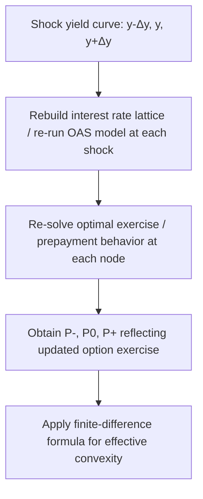
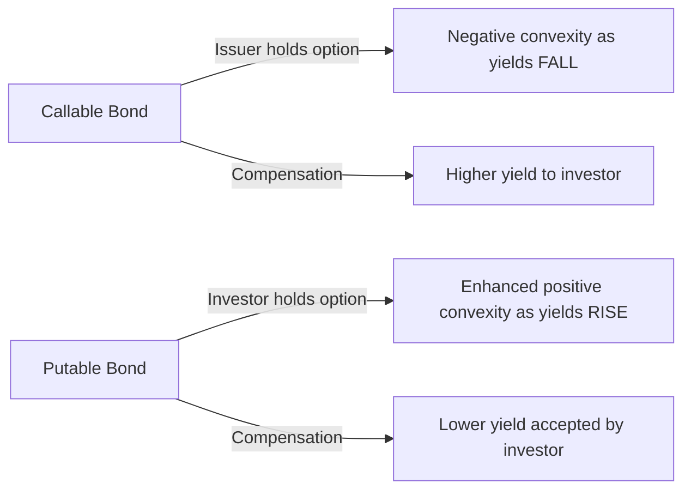

## Convexity of Bonds with Embedded Options

### Overview

Bonds with embedded options — callable bonds, putable bonds, mortgage-backed securities, and convertible bonds — require a fundamentally different convexity calculation framework than option-free bonds. The presence of an option means the instrument's future cash flows are contingent on the future path of interest rates, so the closed-form analytical convexity formula (which assumes fixed, known cash flows) cannot capture the instrument's true price sensitivity. This entry covers the option-adjusted framework for computing convexity in these instruments, the distinct behavior of calls versus puts, and how volatility interacts with embedded-option convexity.

### Why Standard Convexity Formulas Fail for Option-Embedded Bonds

The analytical convexity formula derived from a fixed cash flow schedule:

$$C = \frac{1}{P_0} \sum_{t=1}^{n} \frac{t(t+1) \times CF_t}{(1+y)^{t+2}}$$

implicitly assumes that $CF_t$ does not change as $y$ changes. For a callable bond, this assumption is violated: as yields fall, the probability of the bond being called increases, which effectively truncates the cash flow stream (the bond will not pay coupons beyond the call date if exercised). Applying the fixed-cash-flow formula to a callable bond produces a convexity figure that reflects only the bond's behavior *as if* it could never be called — which is precisely the wrong answer in the yield region where the call is economically relevant.

The correct approach requires an **option-adjusted / effective convexity** framework that explicitly reprices the instrument, incorporating the option's changing exercise likelihood, at each yield shock.

### The Options-Embedded Bond as a Combination of Components

An embedded-option bond can be decomposed conceptually into a straight (option-free) bond plus or minus the value of the embedded option:

$$P_{callable} = P_{straight} - V_{call}$$

$$P_{putable} = P_{straight} + V_{put}$$

The issuer holds the call option (an option to redeem the bond early, benefiting the issuer at the bondholder's expense), so its value is *subtracted* from the straight bond price. The bondholder holds the put option (a right to sell the bond back to the issuer at a set price, benefiting the holder), so its value is *added*.

**Convexity implication**: since a call option's value is itself a convex function of the underlying (here, the bond price or equivalently the yield level), and since that option value is subtracted, the overall structure introduces a term that can offset or reverse the natural positive convexity of the underlying straight bond — this is the source of negative convexity in callable bonds. Conversely, a put option's value *added* to the straight bond price generally reinforces or further enhances positive convexity, since both the straight bond and the added put option value are individually convex, and both are added with a positive sign.

### Effective Convexity for Option-Embedded Bonds

The standard calculation method is the finite-difference approach applied to a full option-pricing valuation model (typically a binomial or trinomial short-rate lattice, or Monte Carlo simulation for path-dependent instruments like MBS):

$$C_{eff} = \frac{P_+ + P_- - 2P_0}{P_0 \times (\Delta y)^2}$$

The critical distinction from the option-free case is that $P_+$, $P_-$, and $P_0$ are each computed via a full option-adjusted valuation — meaning the model re-evaluates the optimal exercise decision (or, for MBS, the expected prepayment speed) at each shocked yield level, not merely discounting a fixed set of cash flows at a new rate.

### Callable Bonds: Convexity Across the Yield Spectrum

Callable bond convexity is regime-dependent, transitioning between three broad zones as yields move relative to the bond's coupon:

1. **High-yield zone** (yield well above coupon): The call option is deeply out-of-the-money — the issuer has no incentive to call, since refinancing at prevailing (higher) rates offers no benefit. The bond behaves almost identically to an equivalent option-free bond, exhibiting **positive convexity**.
2. **Transition zone** (yield near coupon): The call option's value becomes sensitive to small yield changes. Convexity in this region can shift rapidly, sometimes crossing from positive to negative within a narrow yield band, as the market's assessment of call probability changes.
3. **Low-yield zone** (yield well below coupon): The call is deep in-the-money from the issuer's perspective — the bond price compresses toward the call price (adjusted for remaining call protection), and further yield declines produce little additional price appreciation. This is the region of clearest **negative convexity**.

| Yield Region | Call Option Status | Convexity Behavior |
| --- | --- | --- |
| Yield >> Coupon | Deep out-of-the-money | Positive (behaves like straight bond) |
| Yield ≈ Coupon | Near-the-money | Transitional, can shift sign rapidly |
| Yield << Coupon | Deep in-the-money | Negative (price capped near call price) |

### Visual: Callable Bond Convexity Regimes (svg_diagram)

<svg xmlns="http://www.w3.org/2000/svg" viewBox="0 0 740 420">
<text x="370" y="25" text-anchor="middle" font-size="16" font-weight="bold" fill="#1a1a2e">Callable Bond: Convexity Regime Transition (svg_diagram)</text>

<line x1="90" y1="370" x2="690" y2="370" stroke="#333" stroke-width="1.5" />
<line x1="90" y1="370" x2="90" y2="60" stroke="#333" stroke-width="1.5" />
<text x="390" y="400" text-anchor="middle" font-size="13" fill="#333">Yield (falling →)</text>
<text x="45" y="220" text-anchor="middle" font-size="13" fill="#333" transform="rotate(-90 45 220)">Price</text>

<path d="M 140 340 Q 340 150 650 75" stroke="#999" stroke-width="2" stroke-dasharray="6,4" fill="none" />
<text x="500" y="100" font-size="11" fill="#777">Straight bond (reference)</text>

<path d="M 140 340 Q 300 190 400 165" stroke="#4472C4" stroke-width="3" fill="none" />
<path d="M 400 165 Q 500 145 650 138" stroke="#C00000" stroke-width="3" fill="none" />

<line x1="250" y1="60" x2="250" y2="370" stroke="#ccc" stroke-width="1" stroke-dasharray="2,3" />
<line x1="400" y1="60" x2="400" y2="370" stroke="#ccc" stroke-width="1" stroke-dasharray="2,3" />
<line x1="520" y1="60" x2="520" y2="370" stroke="#ccc" stroke-width="1" stroke-dasharray="2,3" />

<text x="165" y="385" text-anchor="middle" font-size="11" fill="`#2a4a8a`">High-yield zone</text>

<text x="325" y="385" text-anchor="middle" font-size="11" fill="`#7a6a1a`">Transition zone</text>

<text x="580" y="385" text-anchor="middle" font-size="11" fill="`#8a1a1a`">Low-yield zone</text>

<text x="165" y="360" text-anchor="middle" font-size="10" fill="`#2a4a8a`">(+) Convexity</text>

<text x="580" y="360" text-anchor="middle" font-size="10" fill="`#8a1a1a`">(−) Convexity</text>

<line x1="90" y1="138" x2="690" y2="138" stroke="#999" stroke-width="1" stroke-dasharray="4,3" />
<text x="100" y="130" font-size="10" fill="#666">Call price</text>
</svg>

### Mortgage-Backed Securities: Convexity Driven by Prepayment Modeling

For MBS, the "option" is diffuse across a large pool of individual mortgage holders rather than a single discrete issuer decision, requiring a **prepayment model** rather than a simple optimal-exercise assumption. Prepayment speeds are typically modeled as a function of:

- The incentive to refinance (spread between the loan's note rate and prevailing mortgage rates)
- Seasoning (loans exhibit low prepayment shortly after origination, ramping up over the first 24–30 months — the industry-standard PSA/CPR seasoning ramp)
- Burnout (pools that have already been exposed to a refinancing incentive and did not prepay tend to have a higher proportion of borrowers unable or unwilling to refinance, dampening subsequent prepayment response)
- Seasonal and demographic factors (housing turnover patterns)

Effective convexity for MBS is computed using the same finite-difference formula, but $P_+$, $P_-$, and $P_0$ each require running the prepayment model under the corresponding shocked rate environment to generate a full projected cash flow schedule, which is then discounted. Because prepayment response is itself a smoothed, empirically-modeled function rather than a sharp binary exercise decision (unlike a corporate bond call), MBS convexity tends to turn negative more gradually and over a wider yield range than a typical callable corporate bond, though [Inference] the specific shape depends heavily on the collateral characteristics (loan age, borrower credit profile, loan size) underlying the specific pool or the model's calibration to that collateral.

### Putable Bonds: A Contrasting Case

Putable bonds — where the *investor* holds the right to sell the bond back to the issuer at a specified price — exhibit the opposite dynamic from callable bonds:

- As yields **rise**, the put option becomes more valuable to the investor (since the alternative, holding the bond, would otherwise mean holding an asset that has lost value), providing a **price floor**.
- This floor limits downside price depreciation as yields rise, meaning putable bonds exhibit enhanced positive convexity on the *rising*-yield side, in contrast to callable bonds' negative convexity on the *falling*-yield side.
- Putable bonds generally trade at a **lower yield** than an equivalent option-free bond (investors pay for the valuable protection via price, i.e., accept a lower yield), the mirror image of callable bonds trading at a higher yield to compensate for negative convexity.

### The Role of Interest Rate Volatility

Because the value of any embedded option depends on interest rate volatility (higher volatility increases the value of an option, all else equal), the price — and by extension the effective duration and effective convexity — of an option-embedded bond is sensitive to the *volatility assumption* used in the underlying pricing model, not merely to the level of rates.

- **Higher assumed volatility** → embedded call option is more valuable to the issuer → callable bond price is lower, and the negative convexity region tends to be more pronounced.
- **Higher assumed volatility** → embedded put option is more valuable to the investor → putable bond price is higher, and the positive convexity enhancement is more pronounced.

This volatility dependency means that reported effective convexity figures for option-embedded bonds are model-dependent outputs, not purely market-observable quantities — two risk systems using different volatility term structure assumptions (or different short-rate models, e.g., Black-Derman-Toy vs. Hull-White) can produce meaningfully different effective convexity figures for the identical bond. [Unverified] The magnitude of this cross-model divergence varies by instrument and market conditions and is not something that can be stated as a fixed percentage difference in general.

### Numerical Example: Convexity Sign Flip Across Yield Levels

Consider a hypothetical 8% coupon callable bond, callable at 102, evaluated at three different prevailing yield levels using an option-adjusted model:

| Yield Level | $P_0$ | $P_-$ (down 50bp) | $P_+$ (up 50bp) | $C_{eff}$ (formula applied) |
| --- | --- | --- | --- | --- |
| 10% (high) | 88.20 | 90.85 | 85.70 | $\frac{90.85+85.70-2(88.20)}{88.20 \times 0.0025} = +18.1$ |
| 8% (at coupon) | 99.50 | 101.10 | 96.80 | $\frac{101.10+96.80-2(99.50)}{99.50\times0.0025} = -48.2$ |
| 6% (low) | 101.85 | 102.15 | 98.95 | $\frac{102.15+98.95-2(101.85)}{101.85\times0.0025} = -178.4$ (steep negative) |

This progression numerically confirms the regime transition: convexity is meaningfully positive at 10% (call irrelevant), turns negative near the coupon rate as the call becomes economically live, and becomes strongly negative at 6% as the price compresses hard against the call price ceiling.

### Common Pitfalls

- **Using nominal/analytical duration and convexity for option-embedded bonds**: This is the single most common and consequential error — nominal (fixed-cash-flow) duration and convexity ignore the option entirely and can produce dangerously misleading risk figures, particularly understating downside risk sensitivity to prepayment or call risk.
- **Applying a single static convexity figure across a wide scenario range**: Given that convexity can flip sign within the same instrument, using a convexity value computed at the current yield to estimate price changes for a large parallel shift that crosses a regime boundary can produce materially inaccurate estimates; full repricing is preferred for large shocks on option-embedded instruments.
- **Ignoring volatility assumption sensitivity when comparing convexity across vendors/models**: Reported effective convexity for the same callable bond or MBS pool can differ across risk systems purely due to differing volatility surface inputs, not necessarily due to any error.
- **Treating all embedded options as behaving like the corporate callable bond case**: MBS prepayment behavior is a smoothed, statistically-modeled phenomenon quite different in character from a discrete, economically rational corporate call decision, and the two should not be assumed to share identical convexity dynamics or magnitudes.

**Related Topics:**

- Positive versus Negative Convexity
- Calculating Bond Convexity (Analytical vs. Effective Methods)
- Option-Adjusted Spread (OAS) Framework and Interpretation
- Binomial and Trinomial Interest Rate Tree Models for Callable Bond Valuation
- Prepayment Modeling (PSA, CPR) for Mortgage-Backed Securities
- Volatility (Vega) Risk and Its Interaction with Embedded Option Value
- Putable Bond Structures and Investor Protection Mechanisms
- Convertible Bond Convexity (Equity-Linked Optionality)