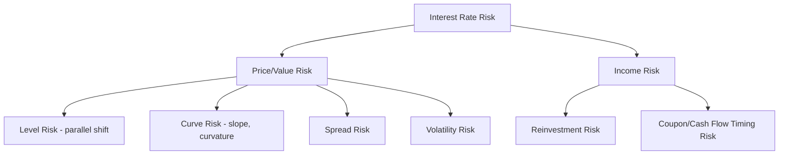

## Sources and Types of Interest Rate Risk

### Overview

Interest rate risk encompasses the various ways changes in interest rates affect the value, income, and economic position of fixed income instruments and portfolios. While often treated as a single risk factor, interest rate risk is more accurately understood as a family of distinct, sometimes interacting, risk types — each arising from a different mechanism and requiring different measurement and hedging approaches. This entry surveys the primary sources of interest rate risk and the taxonomy commonly used to classify them.

### Primary Sources of Interest Rate Risk

#### 1. Level Risk (Parallel Shift Risk)

The most fundamental source of interest rate risk is a change in the general level of interest rates — a roughly uniform shift affecting yields across all maturities simultaneously. This is the risk captured by standard duration measures and represents, empirically, the dominant component of yield curve variance (typically 80–90% in principal component analyses of most developed government bond markets).

#### 2. Curve Risk (Non-Parallel / Shape Risk)

Beyond the overall level, the *shape* of the yield curve changes independently — it can steepen (long rates rise relative to short rates), flatten (the reverse), or twist in more complex ways. Curve risk is not captured by a single duration figure and requires decomposition techniques (key rate duration, bucket duration, or principal component-based measures) to quantify. Portfolios with identical parallel-shift duration can have dramatically different exposure to curve risk depending on how their cash flows are distributed across maturities (see barbell vs. bullet dynamics).

#### 3. Curvature Risk (Butterfly Risk)

A distinct component of curve risk in which the belly (intermediate maturities) of the curve moves differently from the wings (short and long maturities) — often characterized as a "butterfly" movement. This is typically the third-largest principal component of yield curve movement after level and slope, and while smaller in typical magnitude, it can matter significantly for barbell-versus-bullet trade structures.

#### 4. Basis Risk

Basis risk arises when a hedge or offsetting position is based on a different (though related) interest rate index or curve than the underlying exposure. For example, hedging a corporate bond portfolio (priced off a credit-spread curve) using Treasury futures (priced off the government curve) leaves residual basis risk if the spread between the two curves changes independently of the level of either curve. Basis risk is a common and often underappreciated residual risk in imperfect hedging strategies.

#### 5. Volatility Risk (Vega Risk)

For instruments with embedded optionality (callable bonds, mortgage-backed securities, swaptions), value depends not only on the level and shape of the yield curve but on the market's expectation of future interest rate *volatility*. A change in implied or expected volatility, holding the yield curve level constant, can materially change the value of the embedded option and thus the instrument's price — a risk not captured by duration or convexity measures alone.

#### 6. Reinvestment Risk

Reinvestment risk refers to the uncertainty surrounding the rate at which coupon payments (and, for amortizing or callable instruments, principal repayments) can be reinvested over the life of the investment. This risk is most acute for instruments with significant interim cash flows relative to their final maturity, and it works in the *opposite* direction from price risk: falling rates hurt reinvestment income but help bond prices, while rising rates help reinvestment income but hurt bond prices. This offsetting relationship is the conceptual basis for portfolio immunization strategies.

#### 7. Prepayment Risk

Specific to mortgage-backed securities and other amortizing, prepayable structures, prepayment risk is the uncertainty around the *timing* of principal return, driven by voluntary prepayment (typically refinancing-driven) and involuntary prepayment (defaults, home sales). This risk source directly produces the negative convexity behavior characteristic of MBS, as discussed under convexity of bonds with embedded options.

#### 8. Spread Risk (Credit Spread Risk)

Though sometimes classified separately from "pure" interest rate risk, spread risk — the risk that a bond's yield spread over a benchmark (Treasury or swap) curve changes independently of the benchmark rate itself — is frequently analyzed alongside interest rate risk because it is measured using an analogous framework (spread duration, analogous to interest rate duration but applied to spread changes rather than benchmark yield changes).

### Visual: Taxonomy of Interest Rate Risk Sources (svg_diagram)

<svg xmlns="http://www.w3.org/2000/svg" viewBox="0 0 740 480">
<text x="370" y="25" text-anchor="middle" font-size="16" font-weight="bold" fill="#1a1a2e">Taxonomy of Interest Rate Risk (svg_diagram)</text>

<rect x="290" y="50" width="160" height="45" rx="8" fill="#1a1a2e" />
<text x="370" y="78" text-anchor="middle" font-size="13" fill="#fff" font-weight="bold">Interest Rate Risk</text>

<line x1="370" y1="95" x2="130" y2="150" stroke="#666" stroke-width="1.5" />
<line x1="370" y1="95" x2="290" y2="150" stroke="#666" stroke-width="1.5" />
<line x1="370" y1="95" x2="450" y2="150" stroke="#666" stroke-width="1.5" />
<line x1="370" y1="95" x2="610" y2="150" stroke="#666" stroke-width="1.5" />

<rect x="55" y="150" width="150" height="40" rx="6" fill="#4472C4" />
<text x="130" y="175" text-anchor="middle" font-size="12" fill="#fff">Level Risk</text>
<rect x="215" y="150" width="150" height="40" rx="6" fill="#4472C4" />
<text x="290" y="175" text-anchor="middle" font-size="12" fill="#fff">Curve/Curvature Risk</text>
<rect x="375" y="150" width="150" height="40" rx="6" fill="#4472C4" />
<text x="450" y="175" text-anchor="middle" font-size="12" fill="#fff">Basis Risk</text>
<rect x="535" y="150" width="150" height="40" rx="6" fill="#4472C4" />
<text x="610" y="175" text-anchor="middle" font-size="12" fill="#fff">Volatility Risk</text>

<line x1="370" y1="95" x2="130" y2="270" stroke="#666" stroke-width="1.5" />
<line x1="370" y1="95" x2="290" y2="270" stroke="#666" stroke-width="1.5" />
<line x1="370" y1="95" x2="450" y2="270" stroke="#666" stroke-width="1.5" />
<line x1="370" y1="95" x2="610" y2="270" stroke="#666" stroke-width="1.5" />
<rect x="55" y="270" width="150" height="40" rx="6" fill="#ED7D31" />
<text x="130" y="295" text-anchor="middle" font-size="12" fill="#fff">Reinvestment Risk</text>
<rect x="215" y="270" width="150" height="40" rx="6" fill="#ED7D31" />
<text x="290" y="295" text-anchor="middle" font-size="12" fill="#fff">Prepayment Risk</text>
<rect x="375" y="270" width="150" height="40" rx="6" fill="#ED7D31" />
<text x="450" y="295" text-anchor="middle" font-size="12" fill="#fff">Spread Risk</text>
<rect x="535" y="270" width="150" height="40" rx="6" fill="#666" />
<text x="610" y="288" text-anchor="middle" font-size="11" fill="#fff">Idiosyncratic /</text>
<text x="610" y="302" text-anchor="middle" font-size="11" fill="#fff">Other Sources</text>

<text x="370" y="420" text-anchor="middle" font-size="12" fill="#555">Blue: measured via duration/curve decomposition | Orange: cash-flow timing/optionality driven</text>

</svg>

### Two Overarching Frameworks for Classification

**Price risk vs. income risk**: A useful high-level split is between risks affecting the *market value* of a position (price/duration risk, curve risk, spread risk, volatility risk) and risks affecting the *income stream* generated by a position (reinvestment risk, and for floating-rate or resetting instruments, income variability directly tied to rate resets).

**Parallel vs. non-parallel curve risk**: A second useful split, more specific to term structure risk, distinguishes risk arising from the overall level of rates (parallel shift, captured by duration) from risk arising from changes in the curve's *shape* (non-parallel: slope and curvature, requiring key rate duration or PCA-based decomposition to capture).

### Measurement Approaches Mapped to Risk Source

| Risk Source | Primary Measurement Tool |
| --- | --- |
| Level (parallel shift) | Effective/modified duration |
| Curve shape (slope, curvature) | Key rate duration, bucket duration, PCA factor loadings |
| Basis risk | Cross-curve spread analysis, historical basis tracking |
| Volatility | Vega (option sensitivity to implied volatility) |
| Reinvestment risk | Duration-based immunization analysis, cash flow matching |
| Prepayment risk | Effective duration/convexity via prepayment-model-based OAS |
| Spread/credit risk | Spread duration |

### Why This Taxonomy Matters in Practice

Distinguishing these risk sources is not merely academic — it determines how a risk manager or portfolio manager selects appropriate hedging instruments and interprets risk reports:

- A duration-only risk report will completely miss curve risk, meaning a portfolio can appear "hedged" on an aggregate basis while carrying substantial unhedged twist/steepening exposure.
- Hedging level risk with an instrument exposed to different basis risk (e.g., hedging a corporate bond book with Treasury futures) leaves the position exposed to spread widening even if rate-level risk is fully offset.
- A portfolio holding MBS or callable bonds carries both level/curve risk *and* volatility risk simultaneously; hedging only the duration component (e.g., with Treasury futures) leaves volatility risk (and much of the associated negative convexity cost) unaddressed.
- Reinvestment risk and price risk move in offsetting directions relative to rate changes, which is the foundation of duration-matching immunization strategies — a risk manager unaware of this relationship might mistakenly try to minimize both risks simultaneously in a way that is not actually achievable or necessary.

### Common Pitfalls

- **Treating "interest rate risk" as synonymous with duration**: Duration captures only level risk under a parallel-shift assumption; it does not describe curve risk, volatility risk, or basis risk, all of which can be materially large even when duration-based measures suggest a well-hedged position.
- **Ignoring basis risk in cross-instrument hedges**: Assuming a Treasury-based or swap-based hedge perfectly offsets a corporate bond or securitized product's rate exposure, without separately monitoring spread risk between the two curves.
- **Conflating prepayment risk with generic curve risk**: Prepayment risk is driven by borrower behavior and optionality, not purely by the shape of the yield curve, and requires a distinct modeling approach (prepayment models) rather than standard key rate duration analysis alone.
- **Overlooking volatility risk for option-embedded portfolios**: Portfolios containing callable bonds, MBS, or swaptions carry a volatility exposure that is entirely separate from — and not hedged by — standard duration or curve-risk hedges.

**Related Topics:**

- Duration Decomposition Across the Curve
- Convexity of Bonds with Embedded Options
- Spread Duration and Credit Spread Risk Measurement
- Portfolio Immunization and the Reinvestment Risk/Price Risk Trade-off
- Volatility (Vega) Risk in Fixed Income Instruments
- Basis Risk in Cross-Curve Hedging Strategies
- Prepayment Modeling for Mortgage-Backed Securities