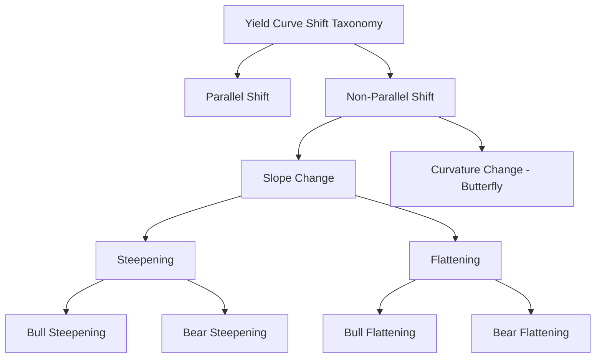
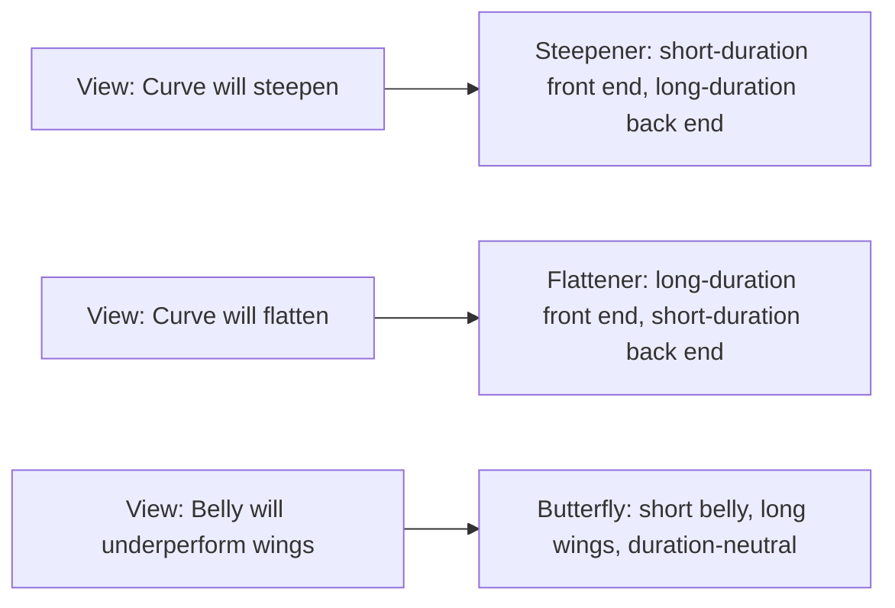

## Parallel and Non Parallel Yield Curve Shifts

### Overview

Yield curve shifts describe the different ways the term structure of interest rates can move over time. A parallel shift — where every point on the curve moves by an identical amount — is the simplifying assumption underlying standard duration measures. In reality, curves rarely move perfectly in parallel; they steepen, flatten, and twist through various non-parallel movements. Understanding and classifying these shift types is essential for interpreting curve risk and selecting the appropriate risk measurement tools (key rate duration, PCA-based factors, or scenario-based stress tests).

### Parallel Shifts

A parallel shift occurs when the yield at every maturity along the curve changes by the same number of basis points.

$$\Delta y(T) = k \quad \text{for all maturities } T$$

where $k$ is a constant (e.g., +50 bp across the entire curve).

**Characteristics**:

- The curve's shape (its slope and curvature) is preserved; only its overall level changes.
- This is the movement type implicitly assumed by standard effective/modified duration and by the closed-form convexity formula.
- Empirically, parallel (or near-parallel) movement is the dominant historical pattern of yield curve change — principal component analysis of most developed government bond markets typically attributes 80–90% of total curve variance to this "level" factor.
- Despite its statistical dominance, a *purely* parallel shift is a theoretical idealization rarely observed with perfect precision in practice; real "level" moves are usually accompanied by some degree of slope or curvature change.

### Non-Parallel Shifts

Non-parallel shifts describe any curve movement where different maturities move by different amounts (including, in the extreme, opposite directions). The two principal sub-categories are slope changes (steepening/flattening) and curvature changes (butterfly/twist).

#### Slope Changes: Steepening and Flattening

**Steepening**: The spread between long-term and short-term yields *widens*. This can occur via several distinct mechanisms:

- **Bull steepening**: Short rates fall faster than long rates (both fall, but short end falls more) — often associated with central bank easing expectations concentrated at the front end.
- **Bear steepening**: Long rates rise faster than short rates (both rise, but long end rises more) — often associated with rising growth or inflation expectations affecting longer horizons more than near-term policy rates.

**Flattening**: The spread between long-term and short-term yields *narrows*. Correspondingly:

- **Bull flattening**: Long rates fall faster than short rates.
- **Bear flattening**: Short rates rise faster than long rates — often associated with central bank tightening cycles, where policy rate hikes push up the front end while longer-term rates rise more modestly (reflecting expectations that tightening will eventually slow growth/inflation).

| Movement Type | Short Rates | Long Rates | Spread (Long − Short) |
| --- | --- | --- | --- |
| Bull steepening | Falls (more) | Falls (less) | Widens |
| Bear steepening | Rises (less) | Rises (more) | Widens |
| Bull flattening | Falls (less) | Falls (more) | Narrows |
| Bear flattening | Rises (more) | Rises (less) | Narrows |

The "bull/bear" prefix in this convention refers to the *direction of the overall rate move* (bull = rates generally falling, bond-price-positive; bear = rates generally rising, bond-price-negative), while "steepening/flattening" refers to the *change in the slope* of the curve independent of its overall direction.

#### Curvature Changes: Butterfly / Twist

A butterfly (curvature) shift describes movement where the belly of the curve (intermediate maturities) moves differently from the two wings (short and long maturities) — for example, intermediate yields falling while both short and long yields stay flat or rise (a "positive butterfly" in some conventions), or the reverse.

### Visual: Comparing Shift Types Graphically (svg_diagram)

<svg xmlns="http://www.w3.org/2000/svg" viewBox="0 0 760 480">
<text x="380" y="25" text-anchor="middle" font-size="16" font-weight="bold" fill="#1a1a2e">Parallel vs. Non-Parallel Yield Curve Shifts (svg_diagram)</text>

<text x="150" y="55" text-anchor="middle" font-size="13" font-weight="bold" fill="#333">Parallel Shift</text>

<line x1="60" y1="200" x2="260" y2="200" stroke="#ccc" stroke-width="1" />

<line x1="60" y1="200" x2="60" y2="80" stroke="#333" stroke-width="1.5" />

<line x1="60" y1="200" x2="260" y2="200" stroke="#333" stroke-width="1.5" />

<path d="M 70 180 Q 150 130 250 110" stroke="`#4472C4`" stroke-width="2.5" fill="none" />

<path d="M 70 155 Q 150 105 250 85" stroke="`#ED7D31`" stroke-width="2.5" stroke-dasharray="5,3" fill="none" />

<text x="150" y="215" text-anchor="middle" font-size="10" fill="#666">Maturity →</text>

<text x="380" y="55" text-anchor="middle" font-size="13" font-weight="bold" fill="#333">Steepening</text>

<line x1="290" y1="200" x2="490" y2="200" stroke="#ccc" stroke-width="1" />

<line x1="290" y1="200" x2="290" y2="80" stroke="#333" stroke-width="1.5" />

<line x1="290" y1="200" x2="490" y2="200" stroke="#333" stroke-width="1.5" />

<path d="M 300 170 Q 380 140 480 120" stroke="`#4472C4`" stroke-width="2.5" fill="none" />

<path d="M 300 175 Q 380 135 480 90" stroke="`#ED7D31`" stroke-width="2.5" stroke-dasharray="5,3" fill="none" />

<text x="380" y="215" text-anchor="middle" font-size="10" fill="#666">Maturity →</text>

<text x="610" y="55" text-anchor="middle" font-size="13" font-weight="bold" fill="#333">Flattening</text>

<line x1="520" y1="200" x2="720" y2="200" stroke="#ccc" stroke-width="1" />

<line x1="520" y1="200" x2="520" y2="80" stroke="#333" stroke-width="1.5" />

<line x1="520" y1="200" x2="720" y2="200" stroke="#333" stroke-width="1.5" />

<path d="M 530 170 Q 610 140 710 120" stroke="`#4472C4`" stroke-width="2.5" fill="none" />

<path d="M 530 150 Q 610 130 710 125" stroke="`#ED7D31`" stroke-width="2.5" stroke-dasharray="5,3" fill="none" />

<text x="610" y="215" text-anchor="middle" font-size="10" fill="#666">Maturity →</text>

<text x="380" y="280" text-anchor="middle" font-size="13" font-weight="bold" fill="#333">Butterfly (Curvature)</text>

<line x1="230" y1="430" x2="530" y2="430" stroke="#ccc" stroke-width="1" />

<line x1="230" y1="430" x2="230" y2="310" stroke="#333" stroke-width="1.5" />

<line x1="230" y1="430" x2="530" y2="430" stroke="#333" stroke-width="1.5" />

<path d="M 240 400 Q 380 370 520 350" stroke="`#4472C4`" stroke-width="2.5" fill="none" />

<path d="M 240 400 Q 380 340 520 350" stroke="`#ED7D31`" stroke-width="2.5" stroke-dasharray="5,3" fill="none" />

<text x="380" y="445" text-anchor="middle" font-size="10" fill="#666">Maturity → (short, belly, long)</text>

<line x1="80" y1="250" x2="110" y2="250" stroke="#4472C4" stroke-width="2.5" />
<text x="118" y="255" font-size="11">Original curve</text>
<line x1="230" y1="250" x2="260" y2="250" stroke="#ED7D31" stroke-width="2.5" stroke-dasharray="5,3" />
<text x="268" y="255" font-size="11">Shifted curve</text>
</svg>

### Quantifying Non-Parallel Shifts: Beyond a Single Duration Number

Because a single duration figure captures only parallel-shift sensitivity, quantifying exposure to non-parallel movements requires:

1. **Key rate duration / bucket duration**: Explicit sensitivity to specific curve vertices, allowing a portfolio manager to see, for instance, that a position has high 2Y sensitivity but low 10Y sensitivity — directly revealing steepening/flattening exposure.
2. **Slope and curvature factor sensitivities (PCA-based)**: Rather than reporting exposure to each individual vertex, exposure can be summarized as sensitivity to the second (slope) and third (curvature) principal components of historical curve movements — a more compact representation, though dependent on the stability of the historical factor structure.
3. **Scenario-based stress testing**: Directly specifying a hypothetical non-parallel scenario (e.g., "2Y up 25bp, 10Y down 25bp") and repricing the portfolio under that explicit scenario, bypassing any linear approximation entirely.

### Practical Trade Structures Exploiting Non-Parallel Views

- **Steepener trades**: Positioned to profit from curve steepening — typically expressed by being short duration at the long end and long duration at the short end (or via swap curve steepener structures).
- **Flattener trades**: The reverse — positioned to profit from curve flattening.
- **Butterfly trades**: Positioned to profit from (or hedge against) curvature changes — typically a long-belly/short-wings or short-belly/long-wings structure, calibrated to be duration-neutral (and often also level-neutral to the first principal component) so that the position's P&L is driven specifically by the curvature/butterfly component of curve movement rather than by the overall level.

### Historical Context and Typical Drivers

- **Steepening** is commonly associated with early-cycle economic recovery, central bank easing at the short end combined with rising growth/inflation expectations pushing up long rates, or increased term premium demands from investors.
- **Flattening** (and its extreme, curve inversion, where short rates exceed long rates) is commonly associated with late-cycle monetary tightening, where central banks raise short-term policy rates while long-term rates rise more modestly or even fall on expectations of future growth slowdown.
- [Inference] Curve inversions have historically preceded economic slowdowns in several major markets, though the reliability, timing, and causal mechanism of this relationship remain subjects of ongoing analysis and are not a matter of settled consensus, and past patterns are not a guarantee of future relationships between curve shape and economic outcomes.

### Common Pitfalls

- **Assuming duration alone captures curve risk**: A duration-matched hedge provides no protection against steepening, flattening, or butterfly risk — these require separate, explicit measurement and hedging.
- **Conflating "bull/bear" with "steepening/flattening"**: These are independent dimensions — a curve can steepen in either a bull or bear environment, and conflating the two labels leads to miscommunication about the nature of an observed or anticipated move.
- **Ignoring curvature risk because it is typically smaller in magnitude**: While curvature (butterfly) movements are generally the smallest of the three principal components of curve variance, they can still matter significantly for barbell-heavy portfolios or explicit butterfly trades, where they are the dominant source of P&L variation by construction.
- **Treating historical PCA factor loadings as static**: The relative importance and shape of level, slope, and curvature factors can shift across different monetary policy regimes or periods of market stress, so historically-estimated factor sensitivities should be periodically reassessed rather than treated as permanently fixed.

**Related Topics:**

- Duration Decomposition Across the Curve
- Sources and Types of Interest Rate Risk
- Key Rate Duration and Principal Component-Based Curve Risk Measures
- Constructing Steepener, Flattener, and Butterfly Trades
- Yield Curve Inversion and Its Historical Relationship to Economic Cycles
- Term Premium and Its Role in Long-End Yield Determination