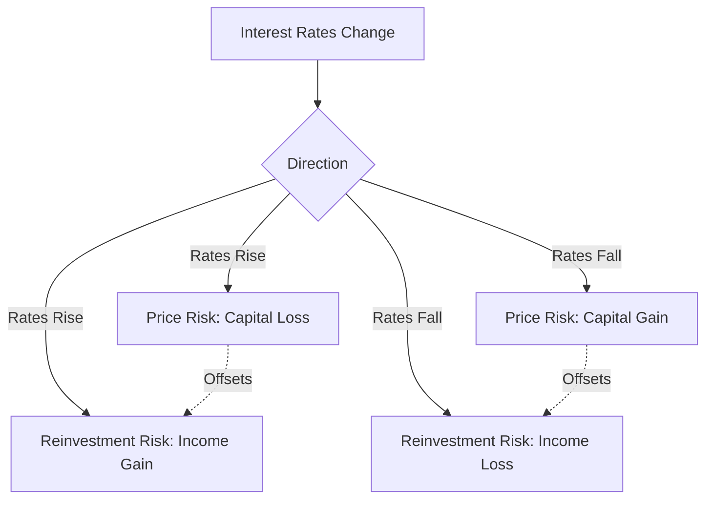

## Reinvestment Risk versus Price Risk

### Overview

Reinvestment risk and price risk are the two fundamental, offsetting components of interest rate risk faced by a fixed income investor. Price risk is the risk that a bond's market value falls when yields rise. Reinvestment risk is the risk that coupon payments (and principal, for amortizing instruments) must be reinvested at a lower rate when yields fall. Critically, these two risks respond to interest rate changes in *opposite* directions, which means they can partially or, under specific conditions, fully offset one another — this offsetting relationship is the conceptual foundation of portfolio immunization.

### Price Risk

Price risk (also called market risk or interest rate risk in its narrowest sense) refers to the inverse relationship between bond prices and yields: when market yields rise, the present value of a bond's fixed future cash flows falls, and vice versa.

$$P = \sum_{t=1}^{n} \frac{CF_t}{(1+y)^t}$$

As $y$ increases, $P$ decreases (all else equal), and this sensitivity is what duration and convexity are designed to measure. Price risk is most acute for an investor who needs to **sell the bond before maturity**, since a rise in yields between purchase and sale directly translates into a realized capital loss.

**Key driver of magnitude**: Price risk increases with duration — longer-maturity bonds, and bonds with lower coupons (since more of the value is concentrated in the distant final payment), exhibit greater price sensitivity to yield changes.

### Reinvestment Risk

Reinvestment risk refers to the uncertainty surrounding the rate at which an investor can reinvest interim cash flows (coupon payments, and for amortizing securities, principal repayments) received before the bond's final maturity.

If yields fall after a bond is purchased, coupons received during the holding period can only be reinvested at the new, lower prevailing rate — reducing the investor's total realized return relative to what would have been earned had rates stayed at their original level (or, in the classic Macaulay framework, relative to the yield-to-maturity assumption of reinvestment at a constant rate).

**Key driver of magnitude**: Reinvestment risk increases with the size and frequency of interim cash flows relative to the bond's total value, and with the length of the investment horizon. A zero-coupon bond has **zero** reinvestment risk (there are no interim cash flows to reinvest), while a high-coupon bond with a long maturity has substantial reinvestment risk, since a large proportion of total return depends on the rate at which coupons are reinvested over many years.

### The Offsetting Relationship

The core insight is that price risk and reinvestment risk respond to interest rate changes in **opposite directions**:

| Rate Movement | Effect on Price | Effect on Reinvestment Income |
| --- | --- | --- |
| Rates rise | Price falls (loss if sold) | Reinvestment income rises (coupons reinvested at higher rate) |
| Rates fall | Price rises (gain if sold) | Reinvestment income falls (coupons reinvested at lower rate) |

This offsetting relationship means that for an investor holding a bond to a specific future date (a target horizon), the *net* effect of a rate change on total accumulated wealth at that horizon depends on the balance between these two opposing forces — and there exists a specific horizon length, related closely to the bond's Macaulay duration, at which the two effects almost exactly cancel.

### The Immunization Insight: Macaulay Duration as the Balancing Horizon

The classical result in fixed income theory is that if an investor's holding period (investment horizon) equals the bond's **Macaulay duration**, then a single, one-time, instantaneous change in yield (occurring immediately after purchase) will have approximately offsetting effects on price risk and reinvestment risk, leaving the investor's accumulated value at the horizon date approximately unaffected by the rate change — to a first-order approximation.

$$\text{Macaulay Duration} = \sum_{t=1}^{n} t \times \frac{PV(CF_t)}{P_0}$$

Macaulay duration represents the weighted-average time to receipt of a bond's cash flows, and it turns out to be precisely the horizon length at which the present-value-weighted "average" timing of price sensitivity and reinvestment sensitivity balance out.

**Intuition**:

- If the investment horizon is **shorter** than Macaulay duration, price risk dominates (the investor is more exposed to having to sell at an unfavorable price before enough time has passed for reinvestment effects to compensate).
- If the investment horizon is **longer** than Macaulay duration, reinvestment risk dominates (the investor holds the bond long enough that the cumulative effect of reinvesting cash flows at a different rate outweighs the now-more-distant, and less impactful, price effect at the point of eventual sale or maturity).
- **At exactly the Macaulay duration horizon**, the two effects offset to a first-order approximation, and the investor's accumulated value is (approximately) protected against a single, immediate parallel shift in rates.

### Visual: Horizon Length vs. Dominant Risk (svg_diagram)

<svg xmlns="http://www.w3.org/2000/svg" viewBox="0 0 720 420">
<text x="360" y="25" text-anchor="middle" font-size="16" font-weight="bold" fill="#1a1a2e">Price Risk vs. Reinvestment Risk by Horizon (svg_diagram)</text>

<line x1="80" y1="350" x2="650" y2="350" stroke="#333" stroke-width="1.5" />
<line x1="80" y1="350" x2="80" y2="60" stroke="#333" stroke-width="1.5" />
<text x="365" y="385" text-anchor="middle" font-size="13" fill="#333">Investment Horizon</text>
<text x="35" y="205" text-anchor="middle" font-size="13" fill="#333" transform="rotate(-90 35 205)">Risk Exposure</text>

<path d="M 100 90 Q 300 200 620 330" stroke="#C00000" stroke-width="3" fill="none" />
<text x="150" y="100" font-size="12" fill="#8a1a1a" font-weight="bold">Price Risk (dominant, short horizon)</text>

<path d="M 100 330 Q 300 200 620 90" stroke="#4472C4" stroke-width="3" fill="none" />
<text x="420" y="105" font-size="12" fill="#2a4a8a" font-weight="bold">Reinvestment Risk (dominant, long horizon)</text>

<line x1="300" y1="60" x2="300" y2="350" stroke="#548235" stroke-width="2" stroke-dasharray="6,4" />
<circle cx="300" cy="200" r="6" fill="#548235" />
<text x="310" y="195" font-size="12" fill="#375623" font-weight="bold">Horizon = Macaulay Duration</text>
<text x="310" y="212" font-size="12" fill="#375623">Risks approximately offset</text>

<text x="150" y="365" text-anchor="middle" font-size="11" fill="#666">Short horizon</text>

<text x="590" y="365" text-anchor="middle" font-size="11" fill="#666">Long horizon</text>

</svg>

### Worked Numerical Illustration

Consider a 10-year, 6% annual-coupon bond purchased at par (yield = 6%), with a Macaulay duration of approximately 7.8 years.

**Scenario: Yields rise to 7% immediately after purchase.**

- **If the investor sells immediately**: realizes a capital loss (price falls due to the yield increase) — pure price risk, fully realized, no offsetting time for reinvestment effects to accrue.
- **If the investor holds to the 7.8-year Macaulay duration horizon**: the initial capital loss (relative to what the price would have been at 6%) is approximately offset by the benefit of reinvesting the annual coupons at the new, higher 7% rate over the intervening 7.8 years — the higher reinvestment income approximately compensates for the lower ending price relative to the original yield scenario.
- **If the investor holds to the full 10-year maturity**: reinvestment risk (in this case, reinvestment *benefit*, since rates rose) dominates — coupons are reinvested at 7% for the entire 10 years, and since the bond is held to maturity there is no price risk realized at all (it redeems at par regardless of prevailing yields), so the investor's overall realized return is *higher* than the original 6% yield-to-maturity assumed at purchase.

This example illustrates the asymmetric conclusion that is often counterintuitive to newer fixed income investors: a bond holder is not indifferent to rate changes even when planning to hold "long term" — the direction of benefit or harm from a rate change depends critically on the relationship between the holding horizon and the bond's Macaulay duration, not simply on whether the bond is held to maturity.

### Application: Classical (Duration-Matched) Immunization

This offsetting relationship is the theoretical basis for **classical immunization** strategies, in which a portfolio manager constructs a bond portfolio whose Macaulay duration is set equal to a specific future liability's due date, in order to protect the portfolio's ability to meet that liability against a single, immediate, parallel shift in interest rates.

**Conditions required for classical immunization to hold** (each represents a simplifying assumption with real-world limitations):

- The yield curve shift is parallel (non-parallel shifts, e.g., twists, are not protected against).
- Only a single, one-time rate change occurs immediately after portfolio construction (multiple rate changes over time require dynamic rebalancing, since Macaulay duration itself changes as time passes and as rates change).
- The portfolio must be periodically rebalanced to maintain the duration match, since duration decays at a different rate than calendar time as the portfolio ages (a phenomenon requiring active management, not a "buy and forget" static strategy).

### Common Pitfalls

- **Assuming holding to maturity eliminates all interest rate risk**: While holding to maturity eliminates *price* risk at the final redemption date (assuming no default), it does not eliminate reinvestment risk on the interim coupon payments, which can still cause the realized total return to differ from the original yield-to-maturity.
- **Assuming a zero-coupon bond has "zero" interest rate risk**: A zero-coupon bond eliminates reinvestment risk entirely (no interim cash flows), but it still carries full price risk if sold before maturity; it is uniquely well-suited to horizon-matching precisely *because* its Macaulay duration equals its maturity, not because it is risk-free.
- **Treating the duration-matched immunization horizon as a permanent, static solution**: As time passes and yields change, the portfolio's duration drifts away from the target horizon and must be actively rebalanced — a static duration match at inception does not remain valid indefinitely.
- **Ignoring the limits of the "approximately offsetting" result**: The offsetting relationship at the Macaulay duration horizon is a first-order (roughly linear) approximation; convexity effects, non-parallel curve shifts, and multiple/ongoing rate changes over time can all cause meaningful deviations from perfect immunization in practice.

**Related Topics:**

- Sources and Types of Interest Rate Risk
- Duration Decomposition Across the Curve
- Classical Immunization and Duration-Matching Strategies
- Macaulay Duration: Derivation and Interpretation
- Cash Flow Matching and Dedication Strategies as Alternatives to Duration Immunization
- Rebalancing Requirements in Dynamic Immunization Programs
- Combining Duration and Convexity for Price Estimation