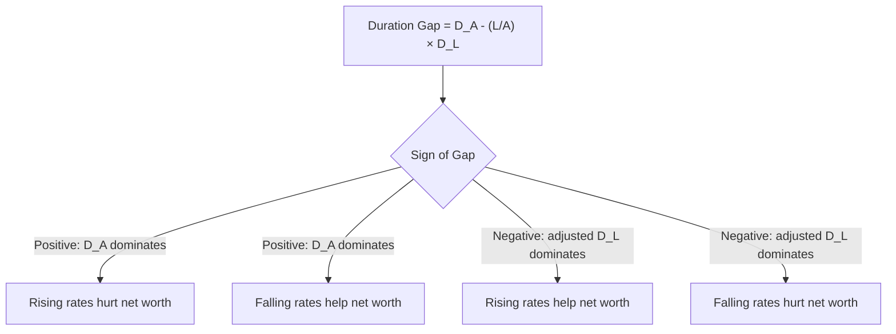

## Duration Gap Analysis for Institutions

### Overview

Duration gap analysis is a balance-sheet-level risk management technique used by financial institutions — banks, insurance companies, and pension funds — to measure and manage the net interest rate sensitivity arising from a mismatch between the duration of their assets and the duration of their liabilities. Unlike single-instrument duration analysis, duration gap analysis operates at the aggregate institutional level, treating the entire balance sheet (or a defined book of business) as a portfolio whose net economic value or net interest income is exposed to interest rate movements.

### The Core Concept: Duration Mismatch

Financial institutions typically hold assets and liabilities with different duration profiles. A classic example is a commercial bank: it often funds relatively long-duration assets (mortgages, long-term loans) with relatively short-duration liabilities (demand deposits, short-term borrowings) — a mismatch sometimes referred to as "borrowing short and lending long." This mismatch creates interest rate risk at the institutional level, distinct from the risk of any single instrument, because assets and liabilities do not reprice or change in value at the same rate when interest rates move.

### The Duration Gap Formula

The standard duration gap measure is expressed as:

$$DGAP = D_A - \left(\frac{L}{A}\right) \times D_L$$

where:

- $D_A$ = weighted-average duration of assets
- $D_L$ = weighted-average duration of liabilities
- $L$ = total market value of liabilities
- $A$ = total market value of assets
- $\frac{L}{A}$ = the leverage-adjustment ratio (liabilities as a proportion of assets)

The leverage adjustment ($L/A$) is essential because assets and liabilities are typically not of equal total value (equity is the residual, $A - L$), so a direct, unweighted subtraction of $D_L$ from $D_A$ would not correctly reflect the net exposure of the institution's economic net worth.

### Interpreting the Sign of the Duration Gap

| Duration Gap Sign | Balance Sheet Characteristic | Effect of Rising Rates | Effect of Falling Rates |
| --- | --- | --- | --- |
| $DGAP > 0$ | Asset duration exceeds liability duration (adjusted for leverage) | Net worth **decreases** (assets lose more value than liabilities) | Net worth **increases** (assets gain more value than liabilities) |
| $DGAP < 0$ | Liability duration exceeds asset duration (adjusted for leverage) | Net worth **increases** (liabilities lose more value than assets) | Net worth **decreases** (liabilities gain more value than assets) |
| $DGAP = 0$ | Assets and liabilities are duration-matched (on a leverage-adjusted basis) | Net worth approximately unaffected (first-order) | Net worth approximately unaffected (first-order) |

**Why $DGAP > 0$ hurts on rising rates**: If assets have longer duration than the leverage-adjusted liabilities, a given rate increase causes a larger percentage decline in asset value than in liability value. Since assets are being reduced by more (in absolute terms, given the leverage weighting) than liabilities, the institution's net worth (equity, $A - L$) falls.

### Estimating the Change in Economic Net Worth

The estimated dollar change in an institution's net worth (equity value) for a given change in interest rates can be approximated as:

$$\Delta E \approx -DGAP \times A \times \frac{\Delta y}{1+y}$$

where $\Delta E$ is the change in equity (net worth), $A$ is total asset value, and $\frac{\Delta y}{1+y}$ represents the (approximately) instantaneous relative yield change — this form directly mirrors the standard modified-duration price-change formula, but applied to the net balance sheet position rather than a single bond.

### Worked Numerical Example

Consider a bank with the following balance sheet:

| Item | Market Value | Duration |
| --- | --- | --- |
| Assets | $500 million | 6.5 years |
| Liabilities | $450 million | 2.0 years |
| Equity (residual) | $50 million | — |

**Step 1 — Compute the leverage-adjusted duration gap**:

$$DGAP = 6.5 - \left(\frac{450}{500}\right) \times 2.0 = 6.5 - (0.90 \times 2.0) = 6.5 - 1.80 = 4.70 \text{ years}$$

**Step 2 — Interpret**: The bank has a substantial positive duration gap of 4.70 years, indicating significant exposure to rising rates.

**Step 3 — Estimate the impact of a 100 bp rate increase**:

$$\Delta E \approx -4.70 \times 500{,}000{,}000 \times \frac{0.01}{1.00} \approx -\$23{,}500{,}000$$

A 100 bp parallel increase in rates would be estimated to reduce this bank's economic net worth by approximately $23.5 million — roughly 47% of its starting $50 million equity base, illustrating how a seemingly modest duration mismatch can translate into a very large proportional impact on a highly leveraged institution's equity, since equity is typically a small residual relative to total assets.

### Visual: Institutional Balance Sheet Duration Mismatch (svg_diagram)

<svg xmlns="http://www.w3.org/2000/svg" viewBox="0 0 700 420">
<text x="350" y="25" text-anchor="middle" font-size="16" font-weight="bold" fill="#1a1a2e">Balance Sheet Duration Mismatch (svg_diagram)</text>

<text x="180" y="65" text-anchor="middle" font-size="13" font-weight="bold">Assets</text>

<rect x="100" y="75" width="160" height="280" fill="`#4472C4`" />

<text x="180" y="220" text-anchor="middle" font-size="13" fill="#fff">Duration = 6.5 yrs</text>

<text x="180" y="240" text-anchor="middle" font-size="12" fill="#fff">$500M</text>

<text x="480" y="65" text-anchor="middle" font-size="13" font-weight="bold">Liabilities + Equity</text>

<rect x="400" y="75" width="160" height="250" fill="`#ED7D31`" />

<text x="480" y="195" text-anchor="middle" font-size="13" fill="#fff">Duration = 2.0 yrs</text>

<text x="480" y="215" text-anchor="middle" font-size="12" fill="#fff">$450M (Liabilities)</text>

<rect x="400" y="325" width="160" height="30" fill="#548235" />
<text x="480" y="345" text-anchor="middle" font-size="12" fill="#fff">Equity $50M</text>

<line x1="270" y1="200" x2="390" y2="200" stroke="#C00000" stroke-width="2" stroke-dasharray="4,3" />
<text x="330" y="190" text-anchor="middle" font-size="11" fill="#8a1a1a">Duration Gap</text>
<text x="330" y="382" text-anchor="middle" font-size="12" fill="#333">Rising rates: assets lose more value than liabilities → equity erodes</text>
</svg>

### Two Alternative Framings: Market Value Perspective vs. Earnings Perspective

Institutional interest rate risk management typically employs two complementary (and sometimes competing) perspectives:

1. **Economic Value of Equity (EVE) perspective**: The duration gap approach described above, focused on the market value sensitivity of the institution's net worth to rate changes — a longer-term, balance-sheet-value-oriented view.
2. **Net Interest Income (NII) / Earnings-at-Risk perspective**: A shorter-term, income-statement-oriented view, focused on how a rate change affects the institution's near-term net interest margin (interest income earned on assets minus interest expense paid on liabilities), typically analyzed via **repricing gap** (or "static gap") analysis — measuring the mismatch between the dollar amount of assets and liabilities repricing within specific near-term time buckets (e.g., 0–3 months, 3–12 months), rather than duration per se.

**[Inference]** These two perspectives can, in some circumstances, point toward different or even conflicting risk conclusions or hedging recommendations for the same balance sheet, since duration gap captures long-run economic value sensitivity while repricing gap captures near-term income sensitivity — a comprehensive institutional interest rate risk framework typically monitors both rather than relying on either measure in isolation, though the specific relative weight given to each varies by institution type, regulatory regime, and management philosophy.

### Practical Considerations for Institutional Application

- **Non-maturity deposits (NMDs)**: A major practical challenge in bank duration gap analysis is assigning an appropriate duration to non-maturity liabilities like checking and savings deposits, which have no contractual maturity date but empirically tend to exhibit "sticky," longer-effective-duration behavior than their legal on-demand redemption terms would suggest. Modeling this behavioral duration accurately is a significant and often debated aspect of institutional asset-liability management (ALM).
- **Embedded options in both assets and liabilities**: Mortgage assets (prepayment risk) and certain deposit or borrowing products (early withdrawal or call features) introduce negative convexity considerations into the institutional duration gap calculation, requiring effective (option-adjusted) duration measures rather than simple analytical duration for accurate gap estimation.
- **Off-balance-sheet positions**: Institutions frequently use interest rate swaps, futures, and other derivatives specifically to adjust their effective duration gap without altering the underlying balance sheet composition; a complete duration gap analysis must incorporate the duration contribution of these hedging instruments alongside on-balance-sheet assets and liabilities.
- **Regulatory frameworks**: Banking regulators in many jurisdictions require periodic interest rate risk in the banking book (IRRBB) assessments that incorporate duration gap-style analysis (alongside repricing gap and stress scenario testing) as part of broader supervisory oversight of institutional interest rate risk management. [Unverified] Specific regulatory methodologies, required scenarios, and disclosure requirements vary by jurisdiction and are subject to periodic revision, so institution-specific compliance requirements should be confirmed against current applicable regulatory guidance rather than assumed from general principles alone.

### Common Pitfalls

- **Confusing duration gap with repricing (maturity) gap**: These are distinct analytical frameworks measuring different things (economic value sensitivity vs. near-term income sensitivity) and can, in principle, suggest different risk conclusions for the same balance sheet.
- **Treating the duration gap formula's linear approximation as precise for large rate shocks**: Like single-instrument duration, the duration gap formula is a first-order approximation; for large rate moves, convexity effects (particularly material for balance sheets with substantial mortgage or callable-liability content) can cause meaningful deviation from the linear estimate.
- **Ignoring behavioral assumptions embedded in NMD and prepayment modeling**: The duration figures used for assets and liabilities without contractual maturities (deposits, revolving credit lines, prepayable loans) depend heavily on behavioral models and assumptions; different assumption sets can produce materially different duration gap conclusions for the identical underlying balance sheet.
- **Static, point-in-time analysis without ongoing rebalancing**: Like single-instrument duration, an institution's duration gap changes continuously as the balance sheet's composition, market rates, and embedded option values evolve, requiring ongoing (not one-time) measurement and management.

**Related Topics:**

- Sources and Types of Interest Rate Risk
- Reinvestment Risk versus Price Risk
- Repricing (Maturity) Gap Analysis and Net Interest Income Sensitivity
- Effective Duration for Assets and Liabilities with Embedded Options
- Behavioral Modeling of Non-Maturity Deposits in Asset-Liability Management
- Interest Rate Risk in the Banking Book (IRRBB) Regulatory Frameworks
- Using Interest Rate Swaps to Manage Institutional Duration Gap