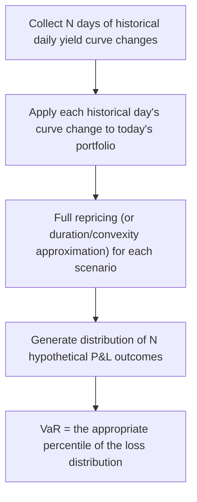
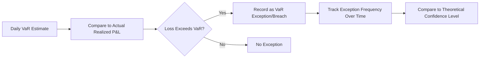

## Value at Risk for Fixed Income Portfolios

### Overview

Value at Risk (VaR) is a statistical risk measure that estimates the maximum expected loss on a portfolio over a specified time horizon at a given confidence level. Applied to fixed income portfolios, VaR translates duration, convexity, and yield curve risk measures into a single, probabilistic loss figure expressed in currency terms, enabling comparison across asset classes and aggregation at the firm-wide level. This entry covers the primary VaR methodologies as applied specifically to fixed income instruments and portfolios, along with their respective strengths, limitations, and fixed-income-specific implementation considerations.

### Defining Value at Risk

VaR answers the question: "What is the maximum loss I would expect not to exceed, over a given time horizon, with a given level of confidence?" Formally, a 1-day 99% VaR of $1 million means there is a 1% probability that the portfolio will lose more than $1 million over the next trading day (equivalently, a 99% probability that losses will not exceed $1 million).

$$P(\Delta P < -VaR) = 1 - c$$

where $c$ is the confidence level (e.g., 0.99) and $\Delta P$ is the change in portfolio value.

### The Three Primary VaR Methodologies

#### 1. Parametric (Variance-Covariance / Delta-Normal) VaR

The parametric approach assumes that portfolio returns (or, for fixed income specifically, yield changes) follow a normal distribution, and estimates VaR analytically using the portfolio's duration (as the "delta" risk sensitivity) combined with the estimated volatility of yield changes.

$$VaR = z_c \times D_{mod} \times P_0 \times \sigma_{\Delta y} \times \sqrt{t}$$

where:

- $z_c$ = the z-score corresponding to the desired confidence level (e.g., 2.33 for 99%, 1.65 for 95%)
- $D_{mod}$ = portfolio modified duration
- $\sigma_{\Delta y}$ = the estimated standard deviation (volatility) of yield changes over the base time period
- $\sqrt{t}$ = the time-scaling factor (square-root-of-time rule) to extend a base-period volatility estimate to a longer horizon

**Fixed-income-specific extension**: For multi-instrument or multi-curve portfolios, the parametric approach is generalized to incorporate the full covariance matrix of yield changes across multiple key rate vertices or risk factors, using the portfolio's key rate duration vector:

$$VaR = z_c \times \sqrt{\mathbf{KRD}^T \, \Sigma \, \mathbf{KRD}} \times \sqrt{t}$$

where $\mathbf{KRD}$ is the vector of dollar (or percentage) key rate durations across curve vertices, and $\Sigma$ is the covariance matrix of yield changes at those vertices.

**Advantages**: Computationally fast, requires relatively few inputs (duration/KRD sensitivities plus a covariance matrix), and provides an analytically tractable, easily-decomposable risk figure.

**Limitations**: The normality assumption often understates tail risk (fixed income yield changes, particularly during stress periods, can exhibit fatter tails than a normal distribution implies), and the approach relies on a linear (duration-only) approximation of price sensitivity, which becomes progressively less accurate for large yield moves or portfolios with significant negative convexity (callable bonds, MBS).

#### 2. Historical Simulation VaR

Historical simulation VaR directly applies a historical sequence of observed yield curve changes to the current portfolio, generating a distribution of hypothetical portfolio value changes without assuming any particular parametric distribution.

**Advantages**: Does not assume normality and inherently captures the actual historical joint behavior of the yield curve (correlations between different maturities, fat tails, and any embedded skewness in historical rate movements are preserved without requiring explicit modeling).

**Limitations**: Entirely dependent on the historical window chosen — if the lookback period does not include a sufficiently severe stress event, the VaR estimate can understate genuine tail risk (this is a general critique of historical methods, not unique to fixed income, but particularly relevant given how episodic and regime-dependent bond market volatility can be). Additionally, purely historical scenarios cannot reflect genuinely novel future stress conditions that have no historical precedent.

#### 3. Monte Carlo Simulation VaR

Monte Carlo VaR generates a large number of hypothetical future yield curve paths using an assumed stochastic process (e.g., a term structure model calibrated to current market volatility and correlation estimates), reprices the portfolio under each simulated path, and constructs the resulting loss distribution.

**Advantages**: The most flexible approach — capable of incorporating non-normal distributions, complex correlation structures, path dependency (important for prepayment-sensitive MBS), and full, non-linear repricing (capturing convexity and option-adjusted behavior precisely rather than through an approximation).

**Limitations**: Computationally the most intensive of the three methods, and the results are highly dependent on the accuracy of the underlying stochastic model's calibration — a poorly specified term structure model (incorrect volatility assumptions, unrealistic mean-reversion parameters, mis-estimated correlations between curve points) can produce a VaR estimate that is precise-looking but based on a flawed underlying model.

### Comparative Summary

| Method | Distributional Assumption | Handles Convexity/Optionality | Computational Cost | Tail Risk Capture |
| --- | --- | --- | --- | --- |
| Parametric | Normal | Poorly (linear approximation) | Low | Generally understated |
| Historical Simulation | None (empirical) | Well (if full repricing used) | Moderate | Limited to historical window |
| Monte Carlo | Model-specified | Well (full repricing) | High | Good, if model well-calibrated |

### Fixed-Income-Specific Considerations for VaR Calculation

#### Yield Curve Risk Factor Selection

Unlike an equity portfolio, where a single risk factor (equity return) may suffice for a simple parametric approach, a fixed income portfolio's risk is inherently multi-dimensional across the yield curve. VaR calculations for fixed income portfolios must therefore decide on an appropriate set of risk factors — typically key rate vertices, or a smaller set of principal components (level, slope, curvature) — with this choice directly affecting both the accuracy and computational tractability of the resulting VaR estimate.

#### Incorporating Convexity and Optionality

Because standard parametric (delta-normal) VaR relies on a linear duration approximation, portfolios containing significant negative convexity (callable bonds, MBS) are particularly poorly served by this method — the approach can materially understate risk precisely in the falling-rate scenarios where negative convexity most disadvantages the holder. A **delta-gamma** extension incorporates a convexity (second-order) correction term into the parametric formula, improving accuracy without the full computational burden of Monte Carlo simulation, though this refinement still relies on a local (Taylor-series) approximation rather than full repricing.

#### Spread Risk and Credit VaR Overlay

For portfolios containing corporate, sovereign, or securitized credit exposure (rather than pure government/risk-free instruments), a complete VaR framework must incorporate spread risk (via spread duration and spread volatility/correlation) in addition to pure interest rate risk, since credit spreads can move independently of the underlying benchmark curve — this is sometimes handled via a combined "rates plus spread" risk factor framework, or via a separate spread VaR calculation aggregated with interest rate VaR.

### Visual: VaR Distribution and Confidence Level (svg_diagram)

<svg viewBox="0 0 700 400" xmlns="http://www.w3.org/2000/svg">
<text x="350" y="25" text-anchor="middle" font-size="16" font-weight="bold" fill="#1a1a2e">VaR: Loss Distribution and Confidence Level (svg_diagram)</text>
<!-- Axes -->
<line x1="60" y1="330" x2="650" y2="330" stroke="#333" stroke-width="1.5"/>
<text x="355" y="360" text-anchor="middle" font-size="12" fill="#333">Portfolio P&L (loss ← → gain)</text>
<!-- Normal-like distribution curve -->
<path d="M 80 320 Q 200 320 260 150 Q 320 60 380 60 Q 440 60 500 150 Q 560 320 630 320" stroke="#4472C4" stroke-width="2.5" fill="none"/>
<!-- Shaded tail (loss region beyond VaR) -->
<path d="M 80 320 Q 200 320 250 165 L 250 320 Z" fill="#C00000" opacity="0.35"/>
<!-- VaR threshold line -->
<line x1="250" y1="60" x2="250" y2="330" stroke="#C00000" stroke-width="2" stroke-dasharray="6,4"/>
<text x="180" y="80" font-size="12" fill="#8a1a1a" font-weight="bold">VaR threshold</text>
<text x="150" y="230" font-size="11" fill="#8a1a1a">1% probability</text>
<text x="150" y="245" font-size="11" fill="#8a1a1a">(tail beyond VaR)</text>

<text x="450" y="230" font-size="11" fill="`#2a4a8a`">99% of outcomes</text>

<text x="450" y="245" font-size="11" fill="`#2a4a8a`">fall to the right of VaR</text>

<line x1="380" y1="330" x2="380" y2="345" stroke="#333" stroke-width="1"/>
<text x="380" y="358" text-anchor="middle" font-size="10" fill="#333">0</text>
</svg>

### Backtesting VaR Models

Regardless of methodology, VaR model performance should be validated through **backtesting** — comparing the historical frequency of actual losses exceeding the predicted VaR threshold against the theoretical expected frequency implied by the confidence level. For a 99% VaR model, losses should exceed the VaR threshold approximately 1% of the time; a materially higher observed breach frequency ("VaR exceptions") suggests the model is understating risk, while a materially lower frequency may suggest excessive conservatism.

### Limitations Common Across All VaR Methodologies

- **VaR does not describe the magnitude of losses beyond the threshold**: A 99% VaR figure says nothing about how severe a loss might be in the 1% tail scenario — this limitation motivates the complementary use of **Conditional VaR (Expected Shortfall)**, which estimates the *average* loss conditional on exceeding the VaR threshold.
- **VaR estimates are inherently backward- or model-looking**: Whether based on historical data (historical simulation) or a calibrated stochastic model (Monte Carlo, parametric), all VaR approaches implicitly assume that historical patterns or model assumptions remain informative about future risk — a assumption that can break down significantly during unprecedented market conditions or genuine regime shifts.
- **Correlation and volatility instability**: All three methods rely, in some form, on estimated volatilities and/or correlations of yield curve movements; these parameters are not static and can shift materially — sometimes rapidly — during periods of market stress, precisely when accurate risk measurement matters most. [Inference] This is a widely recognized limitation across VaR methodologies in general, though the degree to which it affects a specific implementation depends on the estimation window, model recalibration frequency, and the particular stress scenario in question.

### Common Pitfalls

- **Relying solely on parametric VaR for portfolios with significant optionality**: The linear approximation underlying delta-normal VaR is a poor fit for negatively convex instruments (MBS, callable bonds); a delta-gamma extension or, better, historical/Monte Carlo simulation with full repricing is more appropriate.
- **Using an insufficiently long or non-representative historical window for historical simulation**: A lookback period that excludes major historical stress episodes will understate tail risk for that methodology.
- **Treating VaR as a complete risk picture**: Because VaR does not describe tail severity beyond the threshold, relying on VaR alone (without stress testing or Expected Shortfall) can leave an institution unprepared for the magnitude of losses in genuinely extreme scenarios.
- **Ignoring the square-root-of-time scaling assumption's limitations**: The $\sqrt{t}$ scaling rule used to extend a short-horizon (e.g., 1-day) volatility estimate to a longer horizon (e.g., 10-day) assumes returns are independently and identically distributed over time; this assumption can be materially violated during periods of volatility clustering or serial correlation in yield changes.

**Related Topics:**

- Duration Decomposition Across the Curve
- Convexity of Bonds with Embedded Options
- Delta-Gamma VaR and Second-Order Risk Corrections
- Expected Shortfall (Conditional VaR) as a Complement to VaR
- Stress Testing and Scenario Analysis for Fixed Income Portfolios
- Spread Duration and Credit VaR Overlay Frameworks
- Backtesting Methodologies for Market Risk Models