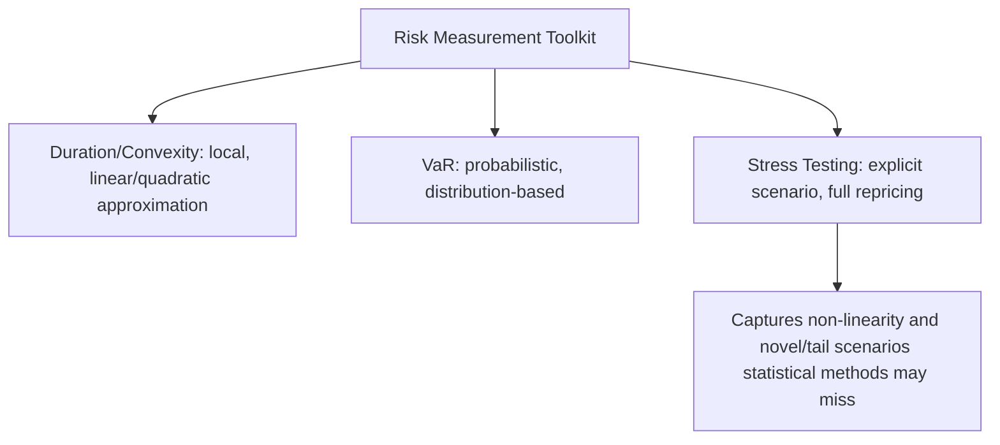
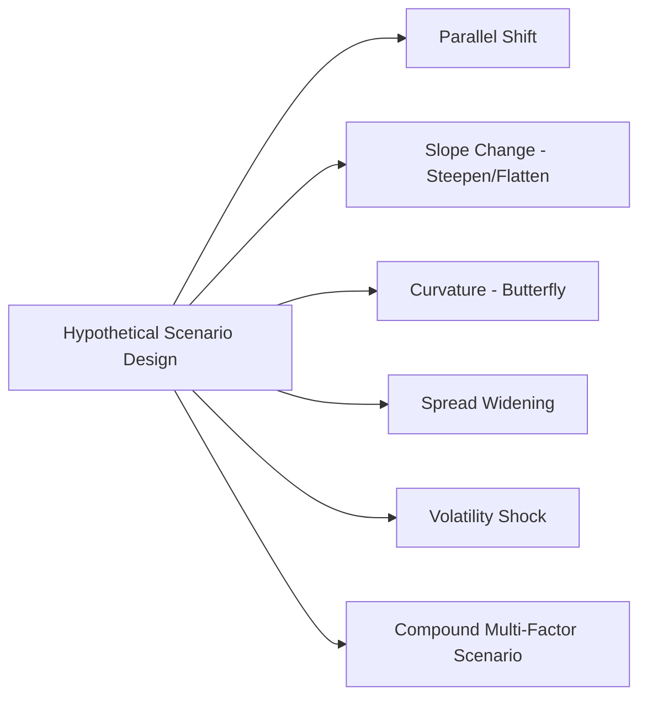

## Scenario and Stress Testing Techniques

### Overview

Scenario and stress testing techniques complement statistical risk measures like duration, convexity, and Value at Risk by directly evaluating portfolio performance under specific, deliberately constructed adverse (or otherwise informative) market conditions. Where VaR estimates a probabilistic loss threshold, stress testing asks a different question: "What would happen to this portfolio under this specific, explicitly defined scenario?" This approach is particularly valuable for capturing risks that statistical models based on historical data may understate or miss entirely — including non-linear effects, tail events, and genuinely novel conditions without historical precedent.

### Why Stress Testing Complements Statistical Risk Measures

Duration and convexity-based estimates, and even historical or Monte Carlo VaR, share a common limitation: they characterize risk based on either a first/second-order approximation (duration/convexity) or a modeled/historical distribution of outcomes (VaR). Stress testing addresses gaps in these approaches by:

- Directly repricing the portfolio under explicit scenarios, bypassing any linearization or distributional assumption entirely.
- Allowing risk managers to specify scenarios that have no historical precedent (a "what if" exercise rather than "what has happened before").
- Explicitly testing scenarios calibrated to expose specific known vulnerabilities (e.g., a portfolio manager who knows their book has concentrated curve risk at the 10-year point can construct a scenario targeting exactly that vertex).

### Categories of Stress Testing

#### 1. Historical Scenario Analysis

Historical scenario analysis applies the actual yield curve (and, where relevant, spread and volatility) movements observed during a specific past crisis or stress episode to the current portfolio, answering the question: "How would today's portfolio have performed if that historical event recurred exactly?"

**Common historical scenarios used in fixed income stress testing** include major historical episodes of significant rate volatility, sharp curve movements, or credit spread widening — the specific episodes chosen depend on institutional risk management practice and the particular vulnerabilities being examined, and should be periodically reviewed and updated to remain relevant to current portfolio composition and market structure.

**Advantages**: Grounded in an actual, internally-consistent set of market movements (correlations between different curve points and asset classes that actually occurred together are preserved).

**Limitations**: Restricted to scenarios that have actually happened; cannot anticipate structurally new types of stress events, and the specific magnitude/character of a repeated historical event might differ substantially if it recurred under today's different starting market conditions and portfolio composition.

#### 2. Hypothetical (Custom) Scenario Analysis

Hypothetical scenario analysis involves constructing scenarios that have not necessarily occurred historically, calibrated instead to test specific, forward-looking risk concerns or vulnerabilities the risk manager wishes to examine.

**Common hypothetical scenario types for fixed income portfolios**:

- **Parallel shifts**: Uniform curve moves of specified magnitudes (e.g., +100 bp, +200 bp, -100 bp) across the entire curve.
- **Steepening/flattening scenarios**: Explicit non-parallel moves (e.g., "2Y up 25bp, 10Y down 25bp" to simulate flattening).
- **Curvature/butterfly scenarios**: Targeted moves at intermediate maturities relative to the wings.
- **Spread-widening scenarios**: Credit spread shocks applied independently of the benchmark curve, testing credit-specific vulnerability.
- **Volatility shock scenarios**: Changes in implied/expected interest rate volatility, particularly relevant for portfolios with embedded optionality (MBS, callable bonds).
- **Combined/compound scenarios**: Simultaneous application of multiple shock types (e.g., a parallel shift combined with a spread-widening event and a volatility spike), designed to simulate a realistic, multi-dimensional crisis.

#### 3. Sensitivity Analysis (Single-Factor Stress)

A simpler form of scenario testing, sensitivity analysis isolates a single risk factor (e.g., only the 10-year point on the curve, or only implied volatility) and shocks it in isolation, holding all other factors constant, to understand the portfolio's isolated exposure to that specific factor. This is closely related to key rate duration analysis but can extend beyond simple linear duration measures by incorporating full repricing rather than a linear approximation.

#### 4. Reverse Stress Testing

Reverse stress testing inverts the typical scenario-testing logic: rather than specifying a scenario and calculating the resulting loss, the analyst specifies a target loss level (e.g., "a loss sufficient to breach regulatory capital requirements" or "a loss equal to the institution's total risk capital") and works backward to identify what combination of market movements would be required to produce that loss. This technique is particularly useful for identifying non-obvious or underappreciated combinations of risk factors that could produce a severe outcome, since it does not rely on the analyst's prior intuition about which scenarios are most concerning.

### Visual: Stress Testing Workflow (svg_diagram)

<svg xmlns="http://www.w3.org/2000/svg" viewBox="0 0 740 420">
<text x="370" y="25" text-anchor="middle" font-size="16" font-weight="bold" fill="#1a1a2e">Stress Testing Workflow (svg_diagram)</text>
<rect x="290" y="55" width="160" height="45" rx="8" fill="#1a1a2e" />
<text x="370" y="83" text-anchor="middle" font-size="12" fill="#fff">Define Scenario Universe</text>
<line x1="370" y1="100" x2="150" y2="150" stroke="#666" stroke-width="1.5" />
<line x1="370" y1="100" x2="370" y2="150" stroke="#666" stroke-width="1.5" />
<line x1="370" y1="100" x2="590" y2="150" stroke="#666" stroke-width="1.5" />
<rect x="60" y="150" width="180" height="40" rx="6" fill="#4472C4" />
<text x="150" y="175" text-anchor="middle" font-size="11" fill="#fff">Historical Scenarios</text>
<rect x="280" y="150" width="180" height="40" rx="6" fill="#4472C4" />
<text x="370" y="175" text-anchor="middle" font-size="11" fill="#fff">Hypothetical Scenarios</text>
<rect x="500" y="150" width="180" height="40" rx="6" fill="#4472C4" />
<text x="590" y="175" text-anchor="middle" font-size="11" fill="#fff">Reverse Stress Test</text>
<line x1="150" y1="190" x2="370" y2="240" stroke="#666" stroke-width="1.5" />
<line x1="370" y1="190" x2="370" y2="240" stroke="#666" stroke-width="1.5" />
<line x1="590" y1="190" x2="370" y2="240" stroke="#666" stroke-width="1.5" />
<rect x="270" y="240" width="200" height="40" rx="6" fill="#ED7D31" />
<text x="370" y="265" text-anchor="middle" font-size="11" fill="#fff">Full Repricing Under Scenario</text>
<line x1="370" y1="280" x2="370" y2="320" stroke="#666" stroke-width="1.5" />
<rect x="270" y="320" width="200" height="40" rx="6" fill="#548235" />
<text x="370" y="345" text-anchor="middle" font-size="11" fill="#fff">Assess Loss vs. Risk Tolerance</text>
</svg>

### Full Repricing vs. Analytical Approximation in Stress Testing

A key methodological decision in stress test design is whether to reprice the portfolio fully (running each instrument through its complete valuation model — e.g., an option-adjusted binomial tree for callable bonds, or a prepayment-model-based cash flow projection for MBS) under each scenario, or to rely on a duration-and-convexity-based approximation applied to each scenario's yield change.

- **Full repricing** is more accurate, particularly for large shocks and for portfolios containing significant optionality or negative convexity, but is computationally more expensive and operationally more complex (requiring valuation models for every instrument type in the portfolio to be callable under each stress scenario).
- **Duration/convexity approximation** is faster and simpler to implement broadly, but becomes progressively less reliable for large shocks and for negatively convex instruments, where even the addition of a convexity correction term may not fully capture the discontinuous or regime-dependent behavior near an option's exercise boundary.

[Inference] Institutions with significant holdings of complex, option-embedded instruments (MBS, callable bonds, structured products) generally derive more decision-useful stress test results from full repricing approaches, particularly for scenarios involving large rate moves, though the specific trade-off between computational cost and accuracy that any given institution accepts depends on its portfolio composition, available modeling infrastructure, and risk management priorities.

### Scenario Calibration Considerations

Constructing meaningful stress scenarios requires balancing several considerations:

- **Severity vs. plausibility**: Scenarios that are too mild fail to reveal genuine tail risk; scenarios that are implausibly extreme may be dismissed by stakeholders as unrealistic and fail to drive meaningful risk management action.
- **Internal consistency**: A well-constructed scenario should reflect economically coherent relationships between risk factors (e.g., a scenario combining sharply rising rates with sharply widening credit spreads and falling equity markets reflects a plausible "risk-off" macro narrative, whereas an arbitrary, internally inconsistent combination of shocks may be less informative and harder for stakeholders to interpret).
- **Regular review and updating**: Both historical and hypothetical scenario sets should be periodically reassessed to ensure they remain relevant to current portfolio composition, prevailing market structure, and evolving risk concerns, rather than being fixed permanently at the time of initial design.

### Application: Combining Stress Testing with Duration Decomposition

Stress testing and duration decomposition (key rate duration) are complementary tools that are often used together: key rate durations can be used to rapidly estimate the approximate P&L impact of a proposed non-parallel scenario (by multiplying each vertex's KRD by that vertex's specified shock), providing a quick, first-pass estimate, which can then be validated or refined via full repricing for scenarios that appear to warrant closer, more precise examination.

$$\Delta P_{approx} \approx -P_0 \sum_{i=1}^{n} KRD_i \times \Delta y_i$$

This formula extends the standard single-duration price-change approximation to a full curve scenario, using the portfolio's key rate duration vector applied against the vector of scenario-specified shocks at each vertex.

### Regulatory Context

Stress testing has become a formal, mandated component of regulatory risk management frameworks for many financial institutions, often requiring specific prescribed scenarios (in addition to institution-designed scenarios) and periodic reporting of results to supervisory authorities. [Unverified] The specific prescribed scenarios, frequency, and reporting requirements vary significantly by jurisdiction, institution type, and regulatory regime, and are subject to periodic revision, so current, applicable regulatory requirements should be confirmed directly against the relevant supervisory framework rather than assumed from general principles.

### Common Pitfalls

- **Relying exclusively on historical scenarios**: Since historical scenarios are limited to events that have actually occurred, exclusive reliance on them can leave an institution unprepared for structurally novel stress events without historical precedent.
- **Constructing internally inconsistent hypothetical scenarios**: Combining shock assumptions that would be economically implausible if they occurred together (e.g., simultaneous sharp rate declines and sharp credit spread widening, absent a coherent narrative connecting the two) can produce results that are difficult to interpret meaningfully or act upon.
- **Using duration/convexity approximation for large shocks on option-embedded portfolios**: As with VaR, the approximation error from using a local Taylor-series-based estimate rather than full repricing grows substantially for large scenario shocks applied to negatively convex instruments.
- **Treating stress test results as a complete substitute for probabilistic risk measures**: Stress testing does not, by itself, convey the *likelihood* of the tested scenario occurring; a comprehensive risk framework generally uses stress testing to complement, not replace, probabilistic measures like VaR, since the two answer different but complementary questions (severity given a chosen scenario, versus the probability-weighted distribution of outcomes).
- **Failing to update scenarios over time**: A static scenario set that is never revisited can become progressively less relevant as portfolio composition, market structure, and the broader risk environment evolve.

**Related Topics:**

- Value at Risk for Fixed Income Portfolios
- Duration Decomposition Across the Curve
- Parallel and Non Parallel Yield Curve Shifts
- Convexity of Bonds with Embedded Options
- Reverse Stress Testing Methodologies
- Regulatory Stress Testing Frameworks for Financial Institutions
- Full Repricing vs. Analytical Approximation Trade-offs in Risk Systems